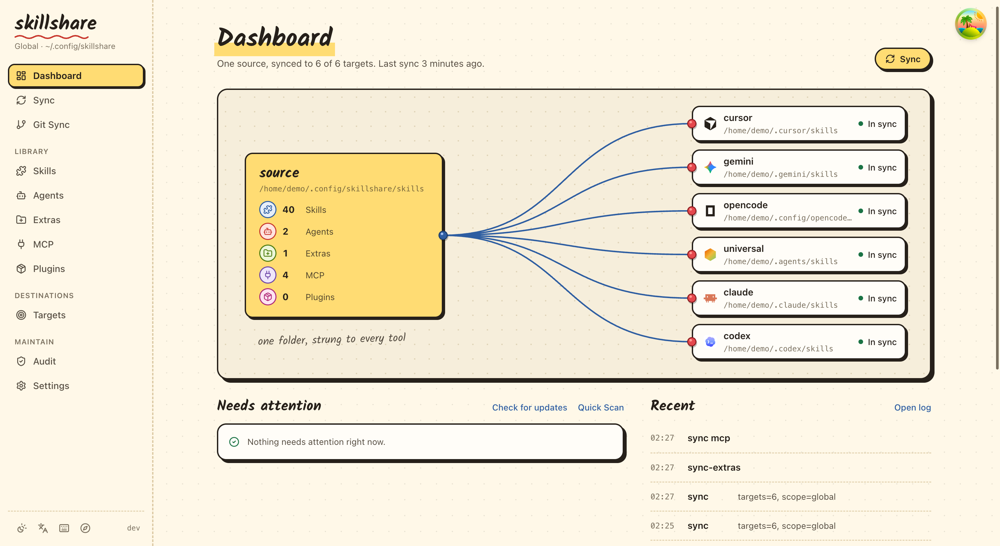
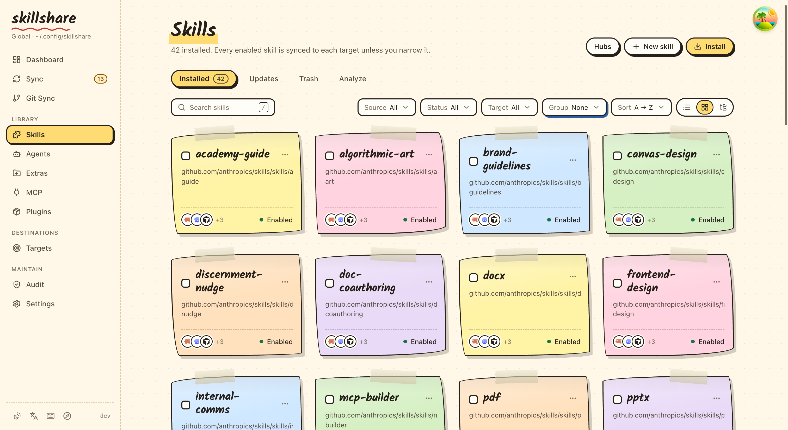

<p align="center" style="margin-bottom: 0;">
  
</p>

<h1 align="center" style="margin-top: 0.5rem; margin-bottom: 0.5rem;">skillshare</h1>

<p align="center">
  <a href="README.md">English</a> · <a href="README-ja.md">日本語</a> · <a href="README-ko.md">한국어</a> · <a href="README-zh-CN.md">简体中文</a> · <a href="README-zh-TW.md">繁體中文</a>
</p>

<p align="center">
  <a href="https://skillshare.runkids.cc"></a>
  <a href="LICENSE"></a>
  <a href="https://github.com/runkids/skillshare/releases"></a>
  
  <a href="https://goreportcard.com/report/github.com/runkids/skillshare"></a>
  <a href="https://deepwiki.com/runkids/skillshare"></a>
</p>

<p align="center">
  <a href="https://github.com/runkids/skillshare/stargazers"></a>
</p>

<p align="center">
  <a href="https://trendshift.io/repositories/21835" target="_blank"></a>
</p>

<p align="center">
  <strong>AI CLI의 skills, agents, rules, commands 등을 하나의 소스로 관리하세요. 명령 하나로 모든 도구에 동기화되며, 개인부터 조직 전체까지 쓸 수 있습니다.</strong><br>
  Codex, Claude Code, OpenClaw, OpenCode 등 60개 이상의 도구를 지원합니다.
</p>

<p align="center">
  
</p>

<p align="center">
  <a href="https://skillshare.runkids.cc">공식 사이트</a> •
  <a href="#설치">설치</a> •
  <a href="#빠른-시작">빠른 시작</a> •
  <a href="#주요-기능">주요 기능</a> •
  <a href="#cli와-ui-미리보기">스크린샷</a> •
  <a href="https://skillshare.runkids.cc/docs">문서</a>
</p>

> [!NOTE]
> **최신 버전**: v0.21.* — 각 릴리스의 새 기능과 수정 사항은 [Releases](https://github.com/runkids/skillshare/releases)와 [변경 내역](https://skillshare.runkids.cc/changelog)에 정리되어 있습니다. 최근의 주요 추가 사항은 `projects:`로 하나의 global 설정에서 **여러 프로젝트 폴더**를 관리하고, **프로젝트 lockfile**로 모든 팀원이 같은 커밋을 설치하도록 맞추고, **MCP 연결**을 한 번만 정의해 각 Agent 고유의 설정 형식에 동기화하고, **완전한 plugin**을 Claude, Codex, Cursor 등에 설치·동기화하는 것입니다.

## skillshare를 쓰는 이유

AI CLI는 저마다 자체 skills 디렉터리를 가지고 있습니다.
하나를 수정하고 다른 곳에 복사하는 것을 잊어버려, 결국 어느 것이 최신인지 알 수 없게 됩니다.

skillshare가 이 문제를 해결합니다.

- **하나의 소스, 모든 agent** — `skillshare sync`로 Claude, Cursor, Codex 등 60개 이상의 도구에 동기화
- **Agent 관리** — 커스텀 agent를 skills와 함께 agent를 지원하는 target에 동기화
- **skills 그 이상** — [extras](https://skillshare.runkids.cc/docs/reference/targets/configuration#extras)로 rules, commands, prompts 등 파일 기반 리소스를 관리
- **MCP 연결** — 서버는 한 번만 정의하고, [`sync mcp`](https://skillshare.runkids.cc/docs/how-to/daily-tasks/sharing-mcp)로 각 Agent 고유의 설정 형식에 기록
- **완전한 plugin** — plugin의 skills, hooks, MCP 설정을 한 묶음으로 유지하고, [`plugin`](https://skillshare.runkids.cc/docs/how-to/daily-tasks/sharing-plugins)으로 설치할 도구를 선택
- **어디서든 설치** — GitHub, GitLab, Bitbucket, Azure DevOps, Gitea, CNB 또는 자체 호스팅 Git
- **내장 보안 기능** — 사용하기 전에 skills에 prompt injection이나 데이터 유출 위험이 있는지 감사
- **팀에 적합** — 프로젝트 skills는 `.skillshare/`에, 조직 공용 skills는 tracked repo로 배포
- **로컬, 경량** — 단일 바이너리. registry도 텔레메트리도 없으며 완전히 오프라인으로 동작
- **세밀한 필터링** — [`.skillignore`](https://skillshare.runkids.cc/docs/how-to/daily-tasks/filtering-skills), SKILL.md의 `targets`, target별 include/exclude로 어떤 skills가 어떤 target에 전달될지 제어

> 다른 도구에서 옮겨 오시나요? [마이그레이션 가이드](https://skillshare.runkids.cc/docs/how-to/advanced/migration) · [비교](https://skillshare.runkids.cc/docs/understand/philosophy/comparison)

## 동작 방식

- macOS / Linux: `~/.config/skillshare/`
- Windows: `%AppData%\skillshare\`

```
┌─────────────────────────────────────────────────────────────┐
│                    Source Directory                         │
│   ~/.config/skillshare/skills/    ← skills (SKILL.md)       │
│   ~/.config/skillshare/agents/    ← agents                  │
│   ~/.config/skillshare/extras/    ← rules, commands, etc.   │
└─────────────────────────────────────────────────────────────┘
                              │ sync
              ┌───────────────┼───────────────┐
              ▼               ▼               ▼
       ┌───────────┐   ┌───────────┐   ┌───────────┐
       │  Claude   │   │  OpenCode │   │ OpenClaw  │   ...
       └───────────┘   └───────────┘   └───────────┘
```

| 플랫폼 | Skills 소스 | Agents 소스 | Extras 소스 | 링크 방식 |
|----------|---------------|---------------|---------------|-----------|
| macOS/Linux | `~/.config/skillshare/skills/` | `~/.config/skillshare/agents/` | `~/.config/skillshare/extras/` | Symlinks |
| Windows | `%AppData%\skillshare\skills\` | `%AppData%\skillshare\agents\` | `%AppData%\skillshare\extras\` | NTFS Junction (관리자 권한 불필요) |

| | 명령형 (명령마다 설치) | 선언형 (skillshare) |
|---|---|---|
| **단일 소스** | skills를 각각 따로 복사 | 하나의 소스에서 symlink(또는 복사)로 배포 |
| **새 컴퓨터 설정** | 모든 설치를 수동으로 다시 실행 | 설정을 `git clone`한 뒤 `sync` |
| **보안 감사** | 없음 | `audit` 내장, install과 update 시 자동 스캔 |
| **웹 대시보드** | 없음 | `skillshare ui` |
| **런타임 의존성** | Node.js + npm | 없음 (단일 Go 바이너리) |

> [전체 비교 →](https://skillshare.runkids.cc/docs/understand/philosophy/comparison)

## CLI와 UI 미리보기

| Skill 상세 정보 | 보안 감사 |
|---|---|
|  |  |

| 웹 대시보드 | 웹 Skills 페이지 |
|---|---|
|  |  |

## 설치

### macOS / Linux

```bash
curl -fsSL https://raw.githubusercontent.com/runkids/skillshare/main/install.sh | sh
```

### Windows PowerShell

```powershell
irm https://raw.githubusercontent.com/runkids/skillshare/main/install.ps1 | iex
```

### Homebrew

```bash
brew install skillshare
```

> **팁:** `skillshare upgrade`를 실행하면 최신 버전으로 업데이트됩니다. 설치 방식을 자동으로 감지해 나머지를 처리합니다.

### GitHub Actions

```yaml
- uses: runkids/setup-skillshare@v1
  with:
    source: ./skills
- run: skillshare sync
```

모든 옵션(audit, project 모드, 버전 고정)은 [`setup-skillshare`](https://github.com/marketplace/actions/setup-skillshare)를 참고하세요.

### 단축 명령 (선택 사항)

셸 설정 파일(`~/.zshrc` 또는 `~/.bashrc`)에 alias를 추가하세요.

```bash
alias ss='skillshare'
```

## 빠른 시작

```bash
skillshare init            # 설정, 소스, 감지된 target 생성
skillshare sync            # skills를 모든 target에 동기화
```

## 주요 기능

**skills 설치와 업데이트** — GitHub, GitLab 또는 모든 Git 호스트에서

```bash
skillshare install github.com/reponame/skills
skillshare update --all
skillshare target claude --mode copy  # symlink를 쓸 수 없는 경우
```

**symlink에 문제가 있나요?** — target별로 copy 모드로 전환

```bash
skillshare target <name> --mode copy
skillshare sync
```

**보안 감사** — skills가 agent에 전달되기 전에 스캔

```bash
skillshare audit
```

**프로젝트 skills** — 저장소별로 관리하고 코드와 함께 commit

```bash
skillshare init -p && skillshare sync
```

**Agents** — 커스텀 agent를 agent를 지원하는 target에 동기화

```bash
skillshare sync agents            # agents만 동기화
skillshare sync --all             # skills, agents, extras, MCP를 함께 동기화
```

**Extras** — rules, commands, prompts 등을 관리

```bash
skillshare extras init rules          # "rules"라는 extra 생성
skillshare sync --all                 # skills, agents, extras, MCP를 함께 동기화
skillshare extras collect rules       # 로컬 파일을 소스로 다시 수집
```

**MCP 연결** — 한 번 설정하면 Claude Code, Codex, Cursor, VS Code, OpenCode 등에 적용

```bash
skillshare mcp add                    # 안내형 설정. URL을 입력하거나 JSON을 붙여넣기
skillshare sync mcp --dry-run         # 각 도구의 설정 파일에 생길 변경 사항 미리보기
skillshare sync mcp                   # 연결 설정 적용
```

정의는 `config.yaml`에 두거나 별도의 `mcp.yaml`을 참조할 수 있습니다.
예시, 환경 변수 참조, 기존 연결 가져오기는 [MCP 설정](https://skillshare.runkids.cc/docs/how-to/daily-tasks/sharing-mcp)을 참고하세요.

**Plugins** — 완전한 plugin을 설치하고, 설치할 도구를 선택

```bash
skillshare plugin add                 # 안내형: 소스, plugin, target, 확인
skillshare plugin add owner/repo --target claude --target codex --no-tui
skillshare sync plugins --dry-run     # plugin 동기화는 sync --all과 별도
```

도구에 이미 설치된 plugin은 `plugin import`로 관리 대상에 포함할 수 있습니다.
[여러 도구에서 plugin 관리하기](https://skillshare.runkids.cc/docs/how-to/daily-tasks/sharing-plugins)를 참고하세요.

**셸 자동 완성** — 명령, 플래그, 하위 명령을 Tab으로 완성

```bash
skillshare completion bash --install   # zsh, fish, powershell, nushell도 지원
```

**로컬 체크포인트** — 소스 변경 사항을 push 없이 commit

```bash
skillshare commit -m "Update review skill"
skillshare commit --dry-run
```

**웹 대시보드** — 시각적인 제어판

```bash
skillshare ui
```

[모든 명령과 가이드 →](https://skillshare.runkids.cc/docs/reference/commands)

## 기여하기

기여를 환영합니다! 먼저 issue를 열고, 테스트가 포함된 draft PR을 보내 주세요.
환경 설정은 [CONTRIBUTING.md](CONTRIBUTING.md)를 참고하세요.

```bash
git clone https://github.com/runkids/skillshare.git && cd skillshare
make check  # format + lint + test
```

> [!TIP]
> 어디서 시작할지 모르겠다면 [open issues](https://github.com/runkids/skillshare/issues)를 살펴보거나, 설정 없이 바로 쓰는 개발 환경 [Playground](https://skillshare.runkids.cc/docs/learn/with-playground)를 사용해 보세요.

## 기여자

skillshare를 함께 만들어 주신 모든 분께 감사드립니다. 전체 명단은 [영문 README](README.md#contributors)에 있습니다.

---

skillshare가 유용했다면 ⭐를 눌러 주세요

## Star History

[](https://star-history.dera.page/#runkids/skillshare&type=date&legend=top-left)

---

## 라이선스

MIT
