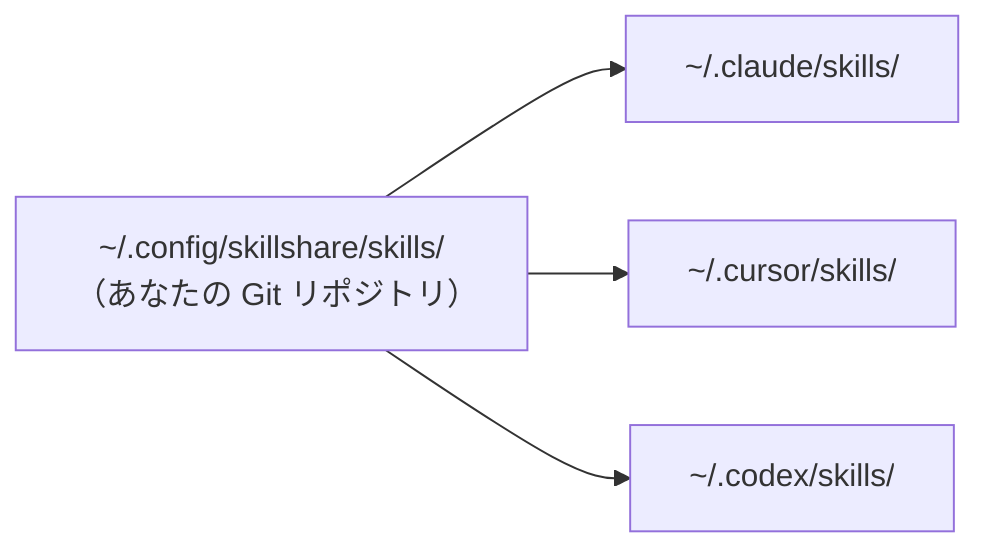

# はじめかた

skillshare は、1 つの Source ディレクトリをマシン上のすべての AI CLI の Skill ディレクトリと同期し続けます。Skill を一度書くかインストールすれば、symlink（シンボリックリンク）によって Claude、Cursor、Codex、その他設定済みのすべての Target にそれが現れます。



Source はあなた自身が所有する通常の Git リポジトリです。あるマシンから push し、別のマシンで pull し、チームメイトと共有する——その下層にある symlink のレイヤーは skillshare が面倒を見ます。

## Source に置かれるもの

Source ディレクトリには 3 種類の Skill が共存します。違いは Git でどう管理されるか、そしてどう更新するかだけです。

**自分で書いた Skill。** `skillshare new <name>` で作成するか、フォルダをそのまま置くだけです。リポジトリにコミットされ、編集して更新します。

**Vendored な Skill。** `skillshare install <url>` でインストールします。クローンはリポジトリ内に直接置かれ、自分の成果物と一緒にコミットされます。`.metadata.json` が upstream の URL を記録するため、後から `skillshare update` で新しいバージョンを取得できます。カスタマイズしたい場合、バージョンを固定したい場合、オフラインでも再現性を保ちたい場合に使います。

**Tracked な Skill。** `skillshare install <url> --track` でインストールします。クローンは `_` 始まりのディレクトリに配置され、自動的に `.gitignore` に追加されるため、リポジトリに入ることはありません。`skillshare update` が upstream から再取得します。変更するつもりのない社内リポジトリやコミュニティのリポジトリに使います。

数か月使ったあとの典型的な Source は次のようになります:

```
~/.config/skillshare/skills/
├── my-review/                 # authored
├── my-deploy-checklist/       # authored
├── agent-browser/             # vendored
├── skill-creator/             # vendored
├── _company-skills/           # tracked  (gitignored)
└── _team-rules/               # tracked  (gitignored)
```

## 出発点を選ぶ

| あなたの状況 | ここから始める |
|---|---|
| skillshare を初めてセットアップする | [First Sync](./first-sync.md) |
| すでに Claude / Cursor / Codex に Skill がある | [From Existing Skills](./from-existing-skills.md) |
| コマンドの書式をすぐ知りたい | [Quick Reference](./quick-reference.md) |
| インストールせずに試してみたい | [Docker Playground](/docs/how-to/advanced/docker-sandbox#playground) |

## 次のステップ

- [Core Concepts](/docs/understand) — Source、Target、Sync モードを詳しく
- [Daily Workflow](/docs/how-to/daily-tasks/daily-workflow) — 日々の使い方
- [Commands Reference](/docs/reference/commands) — コマンドの完全なリファレンス
