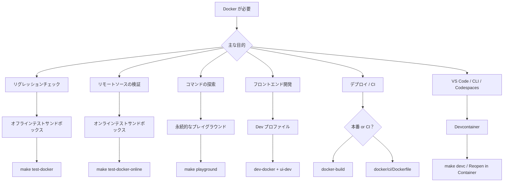

# Docker: テスト、開発、デプロイ

再現性のあるテスト、Go 不要のフロントエンド開発、本番デプロイ、CI での自動 Skill 検証に Docker を使用します。

## モード選択図



コマンド対応表:

| コマンド | `mise` | `make` |
|---|---|---|
| テスト（オフライン） | `mise run test:docker` | `make test-docker` |
| テスト（オンライン） | `mise run test:docker:online` | `make test-docker-online` |
| **Playground**（起動 + シェル） | **`mise run playground`** | **`make playground`** |
| Playground（停止） | `mise run playground:down` | `make playground-down` |
| Sandbox（上級） | — | `./scripts/sandbox.sh <up\|down\|shell\|reset\|status\|logs\|bare>` |
| **Devcontainer**（起動 + シェル） | **`mise run devc`** | **`make devc`** |
| Devcontainer（起動のみ） | `mise run devc:up` | `make devc-up` |
| Devcontainer（停止） | `mise run devc:down` | `make devc-down` |
| Devcontainer（再起動） | `mise run devc:restart` | `make devc-restart` |
| Devcontainer（完全リセット） | `mise run devc:reset` | `make devc-reset` |
| Devcontainer（ステータス） | `mise run devc:status` | `make devc-status` |
| Dev API サーバー | `mise run dev:docker` | `make dev-docker` |
| Dev 停止 | `mise run dev:docker:down` | `make dev-docker-down` |
| Docker ビルド | `mise run docker:build` | `make docker-build` |
| Docker マルチアーキ | `mise run docker:build:multiarch` | `make docker-build-multiarch` |

## 用途

| モード | 最適な用途 | ネットワーク | ライフサイクル |
|------|----------|---------|-----------|
| オフラインテストサンドボックス | 安定したリグレッションチェック（`build + unit + integration`） | 無効 | ワンショット |
| オンラインテストサンドボックス | 任意のリモートインストール/更新チェック | 有効 | ワンショット |
| インタラクティブプレイグラウンド | 手動でのコマンド探索やデモ | 有効 | 永続 |
| Dev プロファイル | Docker 上の Go API サーバー + ホスト上の Vite HMR | 有効 | 永続 |
| Devcontainer | VS Code / Codespaces ワンクリック開発環境 | 有効 | 永続 |
| 本番イメージ | 軽量デプロイ（`docker/production/`） | 有効 | 永続 |
| CI イメージ | パイプラインでの Skill 検証（`docker/ci/`） | 有効 | ワンショット |

---

## よくあるシナリオ

### 1. ローカルのインストール/更新ロジックを確定的に検証する

`install` / `update` の挙動を変更していて、CI と同等のローカルゲートが欲しいときに使います。

```bash
mise run test:docker
make test-docker
```

これはローカルパスと `file://` のワークフローを分離した状態で検証します。

### 2. 任意のリモートソースチェックを実行する

ネットワークアクセスに依存する GitHub / リモートソースの検証に使います。

```bash
make test-docker-online
```

### 3. 専用プレイグラウンドを開いてすべてのコマンドを探索する {#playground}

プレイグラウンドを起動して入るコマンドは1つだけです。

```bash
make playground
mise run playground
```

プレイグラウンド内では `skillshare` と `ss` がすぐに使えます。Global mode と Project mode の両方が事前に初期化済みです。

```bash
skillshare --help
ss status
skillshare list
```

### プレイグラウンドでの Project Mode

プレイグラウンドはサンプル Skill と `claude` Target を含むデモプロジェクトを `~/demo-project` に自動でセットアップします。すぐに Project mode の探索を始められます。

```bash
cd ~/demo-project
skillshare status        # Project mode を自動検出
skillshare list
skillshare sync --dry-run
```

Web ダッシュボードを起動するには、組み込みのエイリアスを使います。

```bash
skillshare-ui            # Global mode ダッシュボード → http://localhost:19420
skillshare-ui-p          # Project mode ダッシュボード (~/demo-project) → http://localhost:19420
```

その後、ホストマシンで `http://localhost:19420` を開いてください（ポートは Docker Compose 経由でマッピングされています）。

### GitHub トークン（検索用）

プレイグラウンドは `skillshare search` 用の GitHub トークンをホストから自動的に取得します。`$GITHUB_TOKEN` → `$GH_TOKEN` → `gh auth token` の順にチェックします。ホストで既に認証済みであれば追加設定は不要です。

```bash
# 検出されない場合は、プレイグラウンド起動前に設定してください:
export GITHUB_TOKEN=ghp_your_token_here
make playground
```

終了時:

```bash
make playground-down
```

---

## 役割別のユースケース

### 個人開発者

| シナリオ | 使うもの | 何の代わりになるか |
|----------|-------------|-----------------|
| Go/Node をインストールせずに skillshare を試す | `docker run ghcr.io/runkids/skillshare` | Go + Node + pnpm をインストールしてソースからビルド |
| PR を出す前にフルテストスイートを実行する | `make test-docker` | ローカルツールチェーンに依存する（Go バージョンの不一致でテスト結果が不安定になる） |
| Go 未インストールでのフロントエンド作業 | `make dev-docker` + `cd ui && pnpm run dev` | API サーバーを動かすためにローカルに Go 1.25+ をインストールする必要がある |
| 同僚に skillshare をデモする | `make playground` → `:19420` の Web UI | フルローカルインストールの手順を一通り説明する |
| Apple Silicon 上で Linux の挙動を検証する | `make docker-build` | CI にプッシュして待つ |

### チームとオープンソースの貢献者

| シナリオ | 使うもの | 何を解決するか |
|----------|-------------|---------------|
| 新規コントリビューターのオンボーディング | `make playground` — コマンド1つで準備完了 | 「Go をインストール、PATH を設定、clone、build」というセットアップガイドが不要に |
| CI での自動 Skill 品質ゲート | `docker run ghcr.io/.../skillshare-ci audit /skills` | 以前はワークフローごとに Go のインストール + ソースビルドが必要だった |
| コントリビューター間の「自分の環境では動く」問題 | Docker が Go 1.25.5 + すべての依存関係を固定 | ローカルの Go バージョンの違いによるテストの不安定化 |
| PR レビュアーによる問題の再現 | `./scripts/test_docker.sh --cmd "go test -run TestXxx ..."` | 再現するには clone + フルローカルセットアップが必要だった |

### エンタープライズおよびセルフホストデプロイ

| シナリオ | 使うもの | 価値 |
|----------|-------------|-------|
| 社内 Skill 管理ダッシュボード | 本番イメージ + Skill 用のボリュームマウント | サーバーに Go/Node 不要、コンテナ1つで完結 |
| Kubernetes デプロイ | 本番イメージ（ヘルスチェック + グレースフルシャットダウン + non-root） | readiness/liveness プローブに対応、PodSecurityPolicy を通過 |
| 自動 Skill PR レビュー | CI イメージ + GitHub Actions での `skillshare audit` | 安全でない Skill のマージをブロック — ワークフローに1行追加するだけ |
| コンテナセキュリティコンプライアンス | `read_only` + `cap_drop: ALL` + `no-new-privileges` | CIS Docker Benchmark、Trivy、Aqua スキャンを通過 |
| コスト削減のための ARM サーバー（AWS Graviton） | `make docker-build-multiarch` | エミュレーションのオーバーヘッドなしのネイティブ arm64 イメージ |

### クイック例

**永続的な Skill を持つセルフホストダッシュボード:**

```bash
docker run -d \
  -p 19420:19420 \
  -v skillshare-data:/home/skillshare/.config/skillshare \
  ghcr.io/runkids/skillshare
```

**GitHub Actions での CI Skill 監査:**

```yaml
- name: Audit skills
  run: |
    docker run --rm \
      -v ${{ github.workspace }}/skills:/skills \
      ghcr.io/runkids/skillshare-ci audit /skills
```

**Kubernetes デプロイ（最小構成）:**

```yaml
apiVersion: apps/v1
kind: Deployment
metadata:
  name: skillshare
spec:
  replicas: 1
  template:
    spec:
      containers:
        - name: skillshare
          image: ghcr.io/runkids/skillshare:latest
          ports:
            - containerPort: 19420
          livenessProbe:
            httpGet:
              path: /api/health
              port: 19420
          readinessProbe:
            httpGet:
              path: /api/health
              port: 19420
          securityContext:
            runAsNonRoot: true
            readOnlyRootFilesystem: true
```

---

## Dev プロファイル {#dev-profile}

Vite HMR でフロントエンドを開発する方法は2通りあります。

**ローカルに Go がインストールされている場合**（コマンド1つ）:

```bash
make ui-dev              # Go API サーバー + Vite dev サーバーを同時に起動
# http://localhost:5173 を開く
```

**Go がない場合**（Go API は Docker 内で実行、Go の変更で自動リビルド）:

```bash
# ターミナル 1
make dev-docker          # Docker 内の Go API + Compose Watch (localhost:19420)

# ターミナル 2
cd ui && pnpm run dev    # Vite dev サーバー (localhost:5173, /api を :19420 にプロキシ)

# 終了時
make dev-docker-down
```

どちらの方法でも `ui/` の変更に対して即座に HMR が効きます。Docker バリアントは Go ツールチェーンを固定するため、コントリビューター間でバックエンドの挙動が一貫します。Go ファイルを編集すると、Compose Watch が変更を検知してコンテナをリビルドし、API サーバーを自動的に再起動します。Docker Compose v2.22 以上が必要です。

**注意:** `make ui-dev` を使う場合、Go コードの変更にはサーバーの再起動が必要です（`Ctrl+C` して再実行）。`make dev-docker` は Compose Watch により自動的にこれを処理します。

---

## Devcontainer（VS Code / Codespaces / CLI）

すぐにコーディングできるコンテナでプロジェクトを開けます — ローカルに Go、Node、pnpm は不要です。VS Code の**有無どちらでも**動作します。

:::info Devcontainer と Playground の違い
どちらも同じベースイメージとデモコンテンツを使用します。**Playground**（`make playground`）はコマンド探索のためのターミナルのみの環境です。**Devcontainer** は skillshare のコードベース自体を開発するための開発ツール（Go、Node、pnpm、air）を追加したもので、VS Code、Codespaces、または普通のターミナルから使用できます。
:::

### 前提条件

- [Docker Desktop](https://www.docker.com/products/docker-desktop/) が起動していること
- **オプション A（ターミナル）:** 追加ツール不要 — `make devc` がすべて処理します
- **オプション B（VS Code）:** [Dev Containers](https://marketplace.visualstudio.com/items?itemName=ms-vscode-remote.remote-containers) 拡張機能がインストールされた VS Code

:::tip GitHub Codespaces
GitHub 上で **Code → Codespaces → New codespace** をクリックします。Devcontainer の設定は自動的に読み込まれます — ローカルの Docker や拡張機能は不要です。
:::

### はじめ方

**ターミナルから**（VS Code 不要）:

```bash
make devc            # イメージのビルド → コンテナ起動 → セットアップ → シェルに入る
```

初回実行はイメージのビルドや依存関係のインストールで数分かかります。以降の実行では既存のセットアップを検出し、すぐにシェルに移ります。

その他のライフサイクルコマンド:

```bash
make devc-up         # 起動のみ（シェルには入らない）
make devc-down       # コンテナを停止
make devc-restart    # 再起動 + start-dev.sh を再実行
make devc-reset      # 完全リセット（ボリュームを削除）、その後 make devc で再初期化
make devc-status     # コンテナのステータスを表示
```

**VS Code から:**

1. VS Code でプロジェクトフォルダを開く
2. `Ctrl+Shift+P`（macOS では `Cmd+Shift+P`）を押して **Dev Containers: Reopen in Container** を選択
3. コンテナのビルドを待つ（初回は数分、以降は高速）
4. 準備ができたら、セットアップスクリプトが自動的にバイナリをビルドし、デモ Skill を作成する

### 含まれるもの

Devcontainer はサンドボックスと同じ `docker/sandbox/Dockerfile` を再利用しているため、以下が含まれます。

- Go 1.25 ツールチェーン
- Node.js 24 + pnpm（Docker イメージに同梱）— コンテナ内で `make ui-dev` と `cd website && pnpm start` が使える
- VS Code 拡張機能: Go、Tailwind CSS、ESLint、Prettier
- 転送されるポート: `45173`（Vite HMR）、`49420`（Go API）、`48888`（Docusaurus）— 意図的に一般的でない番号にしており、ホスト上の他のプロジェクトと衝突しません
- `/workspace` にマウントされたソースコード
- **事前設定済みのデモ環境** — インタラクティブプレイグラウンドと同じ:
  - PATH に登録されたショートカットコマンド（`ss`、`ui`、`docs`）
  - 事前インストール済みのフロントエンド依存関係（`ui/` と `website/`）
  - グローバルデモ Skill（監査サンプル、デプロイチェックリスト）
  - カスタム監査ルール（Global + Project）
  - Project mode の Skill を含むデモプロジェクト `~/demo-project`

### コンテナ起動後のクイックスタート

```bash
ss status                 # Global mode — 初期化済み
ss list                   # デモ Skill を確認（フラット + ネスト）
ss audit                  # カスタムルールで監査を実行

cd ~/demo-project
ss status                 # Project mode を自動検出
ss audit                  # プロジェクトレベルの監査
ui -p                     # API を Project mode に切り替え → http://localhost:45173
```

### フロントエンド開発

| ポート | サービス | コマンド |
|------|---------|---------|
| `45173` | Vite（React UI + HMR） | `ui` または `ui -p` |
| `49420` | Go API バックエンド | `ui` / `ui -p` から起動 |
| `48888` | Docusaurus | `docs` |

```bash
ui                        # Global mode: API + Vite → http://localhost:45173
ui -p                     # Project mode: API + Vite → http://localhost:45173
ui stop                   # API + Vite を停止
docs                      # ドキュメントサイト → http://localhost:48888
docs stop                 # Docusaurus を停止
```

`ui` は Go API バックエンド（ポート 49420、バックグラウンド）と Vite dev サーバー（ポート 45173、HMR）の両方を起動します。`ui` と `ui -p` を切り替えると、新しいモードで API が自動的に再起動されます。VS Code はポートをホストのブラウザに自動転送します。

### トークン設定

プライベートリポジトリアクセス用のトークン（`GITHUB_TOKEN`、`GITLAB_TOKEN` など）は複数のソースから取得できます。以下の順序でチェックされます。

| 優先度 | ソース | セットアップ |
|----------|--------|-------|
| 1 | `.devcontainer/.env` | `.env.example` を `.env` にコピーし、値を入力（gitignore 対象） |
| 2 | ホストの環境変数 | `~/.zshrc` に設定 — `devcontainer.json` の `remoteEnv` 経由で転送 |
| 3 | `gh auth login` | コンテナ起動時に `GITHUB_TOKEN` を自動検出（GitHub のみ） |

すべてのソースは任意です。コンテナ内でいつでも手動で `export` することもできます。

現在の状態を確認:

```bash
credential-helper status
```

### プライベートリポジトリのテスト

VS Code の Dev Containers はホストの git 認証情報を自動的にコンテナに転送します。つまり、明示的なトークン環境変数がなくてもプライベートリポジトリの `git clone` が成功する場合があります — 転送された credential helper が暗黙的に認証を処理します。

テストのために**すべての**認証（credential helper + トークン環境変数）を無効化するには:

```bash
eval "$(credential-helper --eval off)"    # すべて無効化
eval "$(credential-helper --eval on)"     # すべて復元
credential-helper status                  # 現在の状態を確認
```

`--eval` を指定しない場合、git credential helper のみが切り替わります（トークン環境変数は有効のまま）。

### テストの実行

```bash
make test          # unit + integration
make test-unit     # unit のみ
make lint          # go vet
```

---

## 本番イメージと CI イメージ

### イメージの比較

3つの Dockerfile がそれぞれ異なる目的を持ちます。

| | 本番 | CI | Sandbox |
|---|---|---|---|
| **イメージ** | `ghcr.io/runkids/skillshare` | `ghcr.io/runkids/skillshare-ci` | ローカルビルドのみ |
| **Dockerfile** | `docker/production/Dockerfile` | `docker/ci/Dockerfile` | `docker/sandbox/Dockerfile` |
| **ベース** | `debian:bookworm-slim` | `debian:bookworm-slim` | `golang:1.25.5-bookworm` |
| **含まれるもの** | git、curl、tini | git のみ | Go ツールチェーン、gh、jq、air、delve、ビルド済み UI |
| **Non-root** | あり (UID 10001) | なし | なし |
| **PID 1** | tini | default | default |
| **ヘルスチェック** | あり (`/api/health`) | なし | なし |
| **エントリーポイント** | `skillshare ui`（Web ダッシュボード） | `skillshare`（直接 CLI） | `entrypoint.sh`（テストランナー） |
| **用途** | セルフホストダッシュボード、Kubernetes | CI/CD での Skill 検証 | 開発、テスト、プレイグラウンド |
| **GHCR への公開** | あり | あり | なし |
| **マルチアーキ** | amd64 + arm64 | amd64 + arm64 | ホストのアーキテクチャのみ |

**どれを使うべきか:**

- **本番** — サーバーや Kubernetes クラスタに Web UI ダッシュボードをデプロイする
- **CI** — GitHub Actions / GitLab CI で `audit`、`install --dry-run`、その他の検証コマンドを実行する
- **Sandbox** — ローカル開発（`make test-docker`、`make playground`、`make dev-docker`）

### 本番イメージ

組み込みの Web UI を含む軽量な本番イメージをビルドします。

```bash
make docker-build                          # 現在のプラットフォームのみ（高速、ローカルテスト向け）
make docker-build-multiarch                # linux/amd64 + linux/arm64（低速、レジストリへのプッシュ向け）
```

`docker-build` は自分のマシンのアーキテクチャ向けのイメージのみを生成します — Apple Silicon で作った arm64 イメージは x86 サーバーでは動きません。レジストリにプッシュする場合は `docker-build-multiarch` を使い、どのプラットフォームでも適切なイメージが自動的に選ばれるようにします。

本番イメージは PID 1 として `tini` を使用し、non-root ユーザー（UID 10001）で実行され、ヘルスチェックを含み、初回起動時に設定を自動初期化します。デフォルトコマンド: `skillshare ui -g --host 0.0.0.0 --no-open`。

公開されたイメージは GHCR で利用可能です（タグプッシュ時に自動的にプッシュされます）。

```bash
# pull して実行（amd64 または arm64 を自動選択）
docker run -d -p 19420:19420 ghcr.io/runkids/skillshare

# 永続的な Skill データ付き
docker run -d -p 19420:19420 \
  -v skillshare-data:/home/skillshare/.config/skillshare \
  ghcr.io/runkids/skillshare
```

### CI イメージ

CI パイプラインで Skill を検証するための最小イメージです。

```bash
docker build -f docker/ci/Dockerfile -t skillshare-ci .
docker run --rm -v ./my-skills:/skills skillshare-ci audit /skills
```

CI イメージのエントリーポイントは `skillshare` 自体なので、サブコマンドを直接渡します。

```bash
# しきい値付きの監査
docker run --rm -v ./skills:/skills ghcr.io/runkids/skillshare-ci audit /skills --threshold HIGH

# リポジトリ検証のためのドライラン install
docker run --rm ghcr.io/runkids/skillshare-ci install org/repo --dry-run
```

### Sandbox イメージ

Sandbox イメージはローカル開発・テスト専用です（GHCR には公開されません）。フルの Go ツールチェーン、開発ツール（air、delve）、GitHub CLI、ビルド済みフロントエンドアセットを含みます。

使用元: `make test-docker`、`make test-docker-online`、`make playground`、`make dev-docker`。

使用方法は上記の [Playground](#playground) と [Dev プロファイル](#dev-profile) セクションを参照してください。

### イメージタグとバージョニング

タグプッシュ時（`v*`）、`docker-publish` GitHub Actions ワークフローが本番イメージと CI イメージの両方をビルドし、マルチアーキ対応で GHCR にプッシュします。

各イメージには3つのパターンでタグが付けられます。

| タグパターン | 例 | 説明 |
|---|---|---|
| `v<major>.<minor>.<patch>` | `v0.16.1` | 正確なバージョン（不変） |
| `<major>.<minor>` | `0.16` | このマイナーバージョンの最新パッチ（ローリング） |
| `sha-<short>` | `sha-153464a` | Git コミット SHA（不変） |

:::tip
再現性のために本番環境では正確なバージョンタグ（`v0.16.1`）を使用してください。パッチ更新を自動的に取得するにはマイナータグ（`0.16`）を使用します。特定のコミットに固定するには `sha-` タグを使用します。
:::

公開されたバージョンは [GitHub Packages](https://github.com/runkids/skillshare/pkgs/container/skillshare) で確認できます。

---

## 制限事項と期待される挙動

- **Playground と Dev プロファイルはポート 19420 を共有します** — 同時に1つだけ実行してください。もう一方を先に停止します（`make playground-down` または `make dev-docker-down`）。
- オフラインサンドボックスはネットワークに依存する機能（例: GitHub からのリモート `install`）を検証できません。
- Playground はコンテナローカルの `HOME` を使用するため、実際のホストのホーム設定を直接変更することはありません。
- Go コードの変更は自動的に反映されます（マウントされたソースからコンテナ内で `go build` が実行されます）。**フロントエンド（`ui/`）の変更**は、Devcontainer 内で `make ui-dev`（Vite HMR）を実行しているときに即座に反映されます。Devcontainer と Playground の両方に Node.js と pnpm が含まれています。
- カスタムの実験が必要な場合は、コマンドを直接渡してください。

```bash
./scripts/test_docker.sh --cmd "go test -v ./tests/integration/..."
./scripts/sandbox_playground_shell.sh "skillshare list"
```

---

## 関連項目

- [はじめに](/docs/getting-started) — 標準的なセットアップ
- [コマンドリファレンス](/docs/reference/commands) — すべてのコマンド
- [トラブルシューティング](/docs/troubleshooting) — よくある問題
