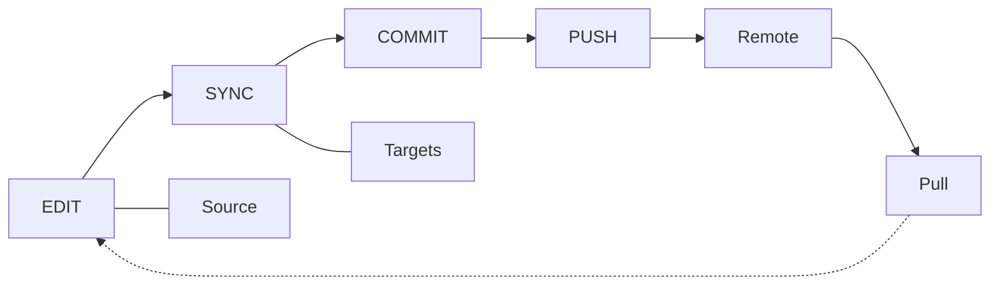

# 日々のワークフロー

日常的な Skill 管理のための編集 → sync → commit/push/pull サイクルです。

## 概要



---

## Skill の編集

### オプション 1: Source を編集する（推奨）

```bash
$EDITOR ~/.config/skillshare/skills/my-skill/SKILL.md
```

変更は（シンボリックリンク経由で）すべての Target に即座に反映されます。

### オプション 2: Target を編集する

```bash
$EDITOR ~/.claude/skills/my-skill/SKILL.md
```

Target はシンボリックリンクされているため、これは Source ファイルを直接編集することになります。

---

## Sync する

編集後、シンボリックリンクのおかげで**通常 Sync は不要**です。ただし、以下の場合は Sync を実行してください。

- Skill をインストールまたは削除した
- Sync モードを変更した
- Target を追加または削除した
- ステータスに「out of sync」と表示された

```bash
skillshare sync
```

:::tip なぜ Sync は独立したステップなのか？
Sync は意図的に install/update/uninstall から切り離されています。これにより、複数の変更をまとめて行い（例: Skill を3つインストールしてから1回 Sync する）、`--dry-run` で反映前にプレビューし、Target がいつ更新されるかを完全にコントロールできます。詳細は [Source と Targets: なぜ Sync は独立したステップなのか](/docs/understand/source-and-targets#why-sync-is-a-separate-step) を参照してください。
:::

### まずプレビューする

```bash
skillshare sync --dry-run
```

### Agent のみを Sync する

Agent のみを変更した（または Agent 対応の Target にのみ Agent を配布したい）場合は、Sync のスコープを絞ります。

```bash
skillshare sync agents
```

`skillshare sync` は Skill と Agent の両方を一度に実行します。Agent ファイルのフォーマットと対応する Target については [Agents](/docs/understand/agents) を参照してください。

---

## Git チェックポイントとクロスマシン Sync

### ローカルでコミットする

remote にプッシュせずローカルの復元ポイントが欲しい場合は `commit` を使います。

```bash
skillshare commit -m "Update draft skill"
```

これは以下を実行します。
1. `git add .`
2. `git commit -m "Update draft skill"`

`commit` は Source リポジトリに remote が設定されていなくても動作します。

### 変更をプッシュする（このマシンから）

git remote を使っている場合、`push` は1つのコマンドでコミットと共有を行います。

```bash
skillshare push -m "Add new skill"
```

これは以下を実行します。
1. `git add .`
2. `git commit -m "Add new skill"`
3. `git push`

### 変更を取得する（このマシンへ）

```bash
skillshare pull
```

これは以下を実行します。
1. `git pull`
2. `skillshare sync`

---

## よくある日常タスク

### 新しい Skill を作成する

```bash
skillshare new code-review
$EDITOR ~/.config/skillshare/skills/code-review/SKILL.md
skillshare sync
```

### Agent を編集または追加する

Agent は `~/.config/skillshare/agents/` にある単一の `.md` ファイルです。エディタで直接作成または編集します。

```bash
$EDITOR ~/.config/skillshare/agents/reviewer.md
skillshare sync agents
```

`disable` / `enable` は、削除せずに `.agentignore` 経由で個々の Agent を切り替えます。

```bash
skillshare disable reviewer --kind agent     # Sync から除外
skillshare enable reviewer --kind agent      # 再度有効化
```

### Tracked repo を更新する

```bash
skillshare update _team-skills
skillshare sync
```

### すべての Tracked repos を更新する

```bash
skillshare update --all
skillshare sync
```

### ステータスを確認する

```bash
skillshare status
```

表示内容:
- Source ディレクトリのステータス
- Git のステータス（コミットの ahead/behind）
- Target の Sync ステータス

---

## ヒント

### 自動化する

シェルの起動ファイルに追加します。
```bash
# ~/.bashrc or ~/.zshrc
alias ss="skillshare"
alias sss="skillshare sync"
alias ssc="skillshare commit"
alias ssp="skillshare push"
alias ssl="skillshare pull"
```

### 重要な作業の前に確認する

```bash
# 一日の始めに
skillshare pull
skillshare status

# コミット前に
skillshare diff
```

### きれいに保つ

```bash
# 週次メンテナンス
skillshare audit             # セキュリティ脅威をスキャン
skillshare backup --cleanup  # 古いバックアップを削除
skillshare doctor            # 問題をチェック
```

---

## 関連項目

- [sync](/docs/reference/commands/sync) — コアとなる Sync コマンド
- [status](/docs/reference/commands/status) — Sync 状態を確認する
- [commit](/docs/reference/commands/commit) — プッシュしないローカル git チェックポイント
- [push](/docs/reference/commands/push) / [pull](/docs/reference/commands/pull) — クロスマシン Sync
- [Skill の発見](/docs/how-to/daily-tasks/skill-discovery) — 新しい Skill を見つける
