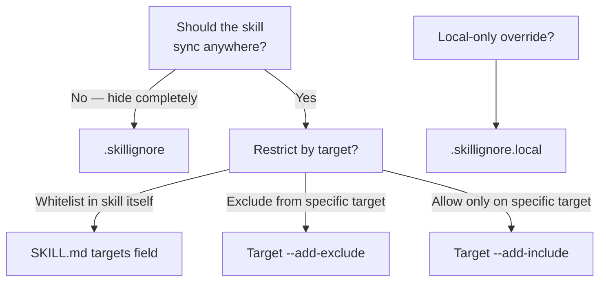

# Skill のフィルタリング

skillshare は、どの Skill がどの Target に届くかを制御する3つのフィルタリングレイヤーを提供します。
自分の目的に合ったシナリオを選んでください。

## Skill を特定の Target にのみ Sync する

Skill の SKILL.md のフロントマターに `metadata.targets`（推奨）を追加します。
その Skill は列挙された Target にのみ Sync されます。

```yaml
---
name: my-cursor-only-skill
metadata:
  targets: [cursor]
---
```

Target のエイリアスに対応しています — `claude` は `claude` と `claude-code` の両方に一致します。

📖 [SKILL.md targets フィールド](/docs/understand/skill-format#targets) ・ [フィルタリングリファレンス](/docs/reference/filtering#skillmd-targets-field)

## 1つの Target から特定の Skill を除外する

Target に対して `--add-exclude` を使い、glob パターンに一致する Skill をブロックします。

```bash
skillshare target cursor --add-exclude "legacy-*"
skillshare sync
```

📖 [Target フィルターフラグ](/docs/reference/commands/target#target-filters-includeexclude) ・ [フィルタリングリファレンス](/docs/reference/filtering#target-includeexclude-filters)

## 1つの Target で特定の Skill のみを許可する

`--add-include` を使ってホワイトリストを作成します — 一致する Skill のみが Sync されます。

```bash
skillshare target claude --add-include "team-*"
skillshare sync
```

📖 [Target フィルターフラグ](/docs/reference/commands/target#target-filters-includeexclude) ・ [フィルタリングリファレンス](/docs/reference/filtering#target-includeexclude-filters)

## すべての Target から Skill を隠す

Source ディレクトリに `.skillignore` ファイルを置きます。これらのパターンに一致する Skill は、発見時に**すべての** Target から除外されます。

```text title="~/.config/skillshare/skills/.skillignore"
drafts/
experimental-*
```

パターンを追加・削除する最も簡単な方法は `enable` / `disable` コマンドです。

```bash
skillshare disable experimental-*   # .skillignore に追加
skillshare enable experimental-*    # .skillignore から削除
```

`skillshare list` の TUI で **E** キーを押して Skill の有効/無効を切り替えることもできます。

📖 [enable / disable](/docs/reference/commands/enable) ・ [.skillignore の構文](/docs/reference/appendix/file-structure#skillignore-optional) ・ [フィルタリングリファレンス](/docs/reference/filtering#skillignore)

## Tracked repo 内の Skill を除外する

Tracked repo のディレクトリ内に `.skillignore` を置きます。これはそのリポジトリ内の Skill にのみ影響します。

```text title="_team-repo/.skillignore"
internal-only/*
validation-scripts
```

📖 [リポジトリレベルの .skillignore](/docs/reference/appendix/file-structure#skillignore-optional)

## ローカル専用のオーバーライド

`.skillignore.local` は `.skillignore` の後に追加されます — 最後に一致したルールが優先されます。共有ファイルを編集せずにローカルで Skill を無視解除するには、否定パターンを使います。

```text title="_team-repo/.skillignore.local"
# The repo ignores private-*, but I need mine
!private-mine
```

このファイルはコミットしないでください — `.gitignore` に追加します。

📖 [.skillignore.local](/docs/reference/appendix/file-structure#skillignorelocal-optional)

## どのレイヤーを使うべきか？



## 何がフィルタされているかを確認する方法

| コマンド | 表示内容 |
|---------|--------------|
| `skillshare sync` | 末尾に無視された Skill の数と名前 |
| `skillshare status --json` | `.skillignore` の完全な統計（パターン、無視された Skill、有効なファイル） |
| `skillshare doctor` | ヘルスチェックに `.skillignore` のパターン数と無視数を含む |
| `skillshare ui` → Sync ページ | バッジ付きの折りたたみ可能な「Ignored by .skillignore」カード |

## 関連項目

- [フィルタリングリファレンス](/docs/reference/filtering) — 3つのレイヤーすべての完全な仕様
- [Sync コマンド](/docs/reference/commands/sync#per-target-includeexclude-filters) — フィルター動作の例
- [Target コマンド](/docs/reference/commands/target#target-filters-includeexclude) — include/exclude 用の CLI フラグ
