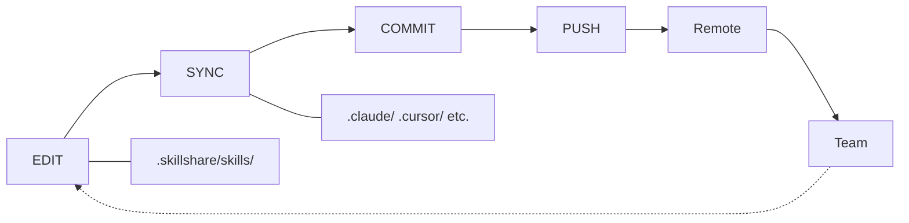

# プロジェクトワークフロー

プロジェクトレベルの Skill 管理のための編集 → sync → commit サイクルです。

## 概要



---

## チーム協業のシナリオ

プロジェクトの Skill がどのように同期され続けるかを示す典型的なチームワークフローです。

```
Alice (Skill を追加する)                 Bob (更新を取得する)
──────────────────────                  ──────────────────────
skillshare new api-guide -p
$EDITOR .skillshare/skills/api-guide/
skillshare sync
git add . && git commit && git push
                                        git pull
                                        skillshare install -p
                                        skillshare sync
                                        → api-guide now in .claude/skills/
```

Bob はどの Skill が追加されたかを知る必要はありません — `skillshare install -p` が設定を読み込み、記載されているものをすべてインストールします。

---

## よくある操作

### 新しい Skill を追加する

```bash
# Skill を作成する
skillshare new my-skill -p
$EDITOR .skillshare/skills/my-skill/SKILL.md

# Target に Sync する
skillshare sync

# コミットする
git add .skillshare/
git commit -m "Add my-skill"
```

### 新しい Agent を追加する

Agent は単一の `.md` ファイルです。`.skillshare/agents/` 直下に直接作成します。

```bash
# Agent ファイルを作成する
$EDITOR .skillshare/agents/my-agent.md

# Agent 対応の Target に Sync する (claude, cursor, augment, opencode)
skillshare sync agents

# コミットする
git add .skillshare/agents/
git commit -m "Add my-agent"
```

`skillshare sync`（`agents` なし）は Skill と Agent の両方を一度に Sync します。ファイルを削除せずに `.skillshare/agents/.agentignore` にエントリを追加するには `skillshare disable my-agent --kind agent -p` を使います。

### リモートの Skill をインストールする

```bash
# GitHub からインストール
skillshare install anthropics/skills/skills/pdf -p

# Target に Sync する
skillshare sync

# 設定の変更をコミットする
git add .skillshare/
git commit -m "Add pdf skill from anthropic"
```

### リモートの Skill を更新する

```bash
# 特定の Skill を更新する
skillshare update pdf -p

# またはすべてのリモート Skill を更新する
skillshare update --all -p

# 更新した Skill を Sync する
skillshare sync

# 設定が変更されていればコミットする
git add .skillshare/
git commit -m "Update remote skills"
```

### Skill を削除する

```bash
# アンインストールする
skillshare uninstall my-skill -p

# シンボリックリンクをクリーンアップするために Sync する
skillshare sync

# コミットする
git add .skillshare/
git commit -m "Remove my-skill"
```

### 誰かがプロジェクトに参加する

新しいチームメンバーでも、オープンソースのコントリビューターでも、コミュニティのテンプレートを試す人でも — セットアップは同じです。

```bash
# プロジェクトを clone する
git clone github.com/team/project
cd project

# 設定に記載されたリモート Skill をインストールする
skillshare install -p

# Target に Sync する
skillshare sync
```

`config.yaml` は持ち運び可能な Skill マニフェストとして機能します — 手動で Skill を探し回る必要はありません。

---

## Target の管理

### Target を追加する

```bash
# 既知の Target を追加する
skillshare target add windsurf -p

# パス付きのカスタム Target を追加する
skillshare target add custom-tool ./tools/ai/skills -p

# 新しい Target に Sync する
skillshare sync
```

### Target を削除する

```bash
skillshare target remove windsurf -p
```

### Target を一覧表示する

```bash
skillshare target list -p
```

```
Project Targets
  claude    .claude/skills (merge)
  cursor         .cursor/skills (merge)
```

---

## ステータスを確認する

```bash
skillshare status
```

```
Project Skills (.skillshare/)

Source
  ✓ .skillshare/skills (3 skills)

Targets
  ✓ claude       [merge] .claude/skills (3 synced)
  ✓ cursor       [merge] .cursor/skills (3 synced)

Remote Skills
  ✓ pdf          anthropic/skills/pdf
  ✓ review       github.com/team/tools
```

---

## Skill を一覧表示する

```bash
skillshare list
```

```
Installed skills (project)
─────────────────────────────────────────
  → my-skill            local
  → pdf                 anthropic/skills/pdf
  → review              github.com/team/tools

→ 3 skill(s): 2 remote, 1 local
```

---

## Web ダッシュボード

プロジェクトの Skill を視覚的に管理するには Web UI を使います。

```bash
skillshare ui -p
```

または、`.skillshare/config.yaml` が存在すれば（自動検出されるので）単に `skillshare ui` で構いません。ダッシュボードは Git Sync を非表示にし（自分のプロジェクトの git を使ってください）、`.skillshare/config.yaml` を直接編集します。

---

## ヒント

### 自動検出

`.skillshare/config.yaml` が存在すれば、ほとんどのコマンドが Project mode を自動検出します。

```bash
cd my-project/
skillshare sync          # 自動的に Project mode
skillshare status        # 自動的に Project mode
skillshare list          # 自動的に Project mode
```

:::tip ゼロコンフィグ
プロジェクトディレクトリに `cd` するだけです — skillshare が `.skillshare/config.yaml` を検出し、自動的に Project mode に切り替わります。フラグは不要です。
:::

### 編集して即座に変更を確認する

Skill はシンボリックリンクされているため、`.skillshare/skills/` での編集は Target に即座に反映されます。

```bash
$EDITOR .skillshare/skills/my-skill/SKILL.md
# 変更はすでに .claude/skills/my-skill/ に反映されている（シンボリックリンク）
```

`sync` は Skill や Target の追加/削除のときにのみ実行してください。

### Sync 前にプレビューする

```bash
skillshare sync --dry-run
```

---

## 関連項目

- [プロジェクトの Skill](/docs/understand/project-skills) — コンセプトの説明
- [プロジェクトセットアップ](/docs/how-to/sharing/project-setup) — 初期セットアップガイド
- [日々のワークフロー](./daily-workflow.md) — Global mode の日常的な使用
