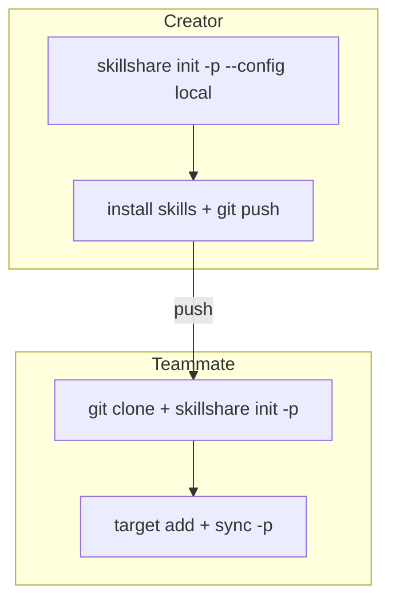

# 集中管理された Skill リポジトリ

> 1つのプロジェクトを共有 Skill リポジトリとして使い、他のプロジェクトをクリーンに保つ。

## シナリオ

チームには複数のプロジェクト（B、C、D）がありますが、AI Skill は専用の単一リポジトリ（A）で管理したいと
考えています。各開発者はリポジトリ A を clone し、Target を自分のローカルプロジェクトに向けます。

## 解決策

### 作成者: 共有リポジトリをセットアップする

```bash
cd ~/DEV/skills-repo        # プロジェクト A
skillshare init -p --config local --targets claude
```

これにより `config.yaml` が gitignore された `.skillshare/` が作成されるため、各開発者は自分の
Target を独立して管理できます。

```bash
# 共有 Skill を追加する
skillshare install <skill-repo> -p

# コミットする（config.yaml は .gitignore により除外される）
git add .skillshare/
git commit -m "add shared skills"
git push
```

### チームメンバー: clone して設定する

```bash
git clone <A-repo> && cd skills-repo
skillshare init -p
```

skillshare は共有リポジトリを自動検出し（`.gitignore` に `config.yaml` が含まれる）、空の config を
作成します。`--config local` フラグは不要です。

```bash
# 自分のローカルプロジェクトを指す Target を追加する
skillshare target add project-b ~/DEV/project-b/.cursor/skills -p
skillshare target add project-c ~/DEV/project-c/.claude/skills -p

# 共有 Skill をすべての Target に Sync する
skillshare sync -p
```

## 仕組み



`--config local` フラグは `config.yaml` を `.skillshare/.gitignore` に追加します。これはつまり:

- **Skill**（`.skillshare/skills/`）は git 経由で共有される
- **Config**（`.skillshare/config.yaml`）は各開発者のローカルにある
- 各開発者は他の人に影響を与えることなく自分の Target を選べる

## 確認

作成者が `init -p --config local` を実行した後:

```bash
cat .skillshare/.gitignore
# 次を含むはず: config.yaml
```

チームメンバーが clone して `init -p` を実行した後:

```bash
skillshare list -p     # 共有 Skill を表示
skillshare status -p   # 自分の個人的な Target を表示
```

## FAQ

**Q: 各チームメンバーは `--config local` が必要ですか？**
A: いいえ。`--config local` を使うのは作成者のみです。チームメンバーは単に `skillshare init -p` を
実行すれば、skillshare が共有リポジトリのパターンを自動検出します。

**Q: チームメンバーは追加の Skill をインストールできますか？**
A: はい。`skillshare install <repo> -p` は通常通り動作します。インストールされた Skill は git で
追跡される `.skillshare/skills/` に配置されるため、他の人が使えるようにプッシュできます。

**Q: チームメンバーが違う Skill を使いたい場合は？**
A: `.skillshare/skills/` 内の Skill は共有されます。本当に個人的な Skill には
[Global mode](/docs/understand/project-skills)（`-p` なしの `skillshare install <repo>`）を使って
ください。
