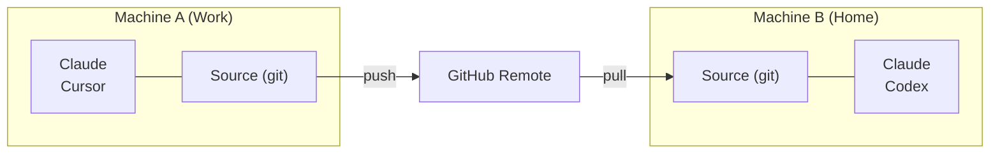

# クロスマシン Sync

git を使って複数のコンピューター間で Skill を Sync します。

## 概要



---

## 最初のマシンのセットアップ

### インタラクティブ（ガイド付きプロンプト）

```bash
skillshare init --remote git@github.com:you/my-skills.git
```

### 非インタラクティブ（プロンプトなし）

```bash
# remote にすでに Skill がある場合（または新規に Source を始める場合）
skillshare init --remote git@github.com:you/my-skills.git --no-copy --all-targets --no-skill

# 既存の Claude の Skill がある最初のマシン: init 時にインポートする
skillshare init --remote git@github.com:you/my-skills.git --copy-from claude --all-targets --no-skill
```

これは:
1. Source ディレクトリを作成する
2. 初回コミットで git を初期化する
3. remote を追加する
4. Target を自動検出して設定する

任意（セットアップ後に追加の AI CLI をインストールした場合のみ）:

```bash
skillshare init --discover
```

その後、Skill をプッシュします。
```bash
skillshare push
```

:::tip すでに初期化済みですか？
既存のセットアップに remote を追加します。
```bash
skillshare init --remote git@github.com:you/my-skills.git
```
これは初期セットアップ後でも動作します — remote を追加するだけです。
:::

---

## 2台目のマシンのセットアップ

新しいマシンでも**同じコマンド**が使えます。

```bash
skillshare init --remote git@github.com:you/my-skills.git
```

Init は remote にすでに Skill があることを自動検出し、それらを pull します。手動での `git clone`
は不要です。

:::info 裏側で何が起きているか
1. Source ディレクトリを作成し git を初期化する
2. remote を追加して `git fetch` を実行する
3. remote に Skill があることを検出 → ローカルを remote に合わせてリセットする
4. トラッキングブランチをセットアップする
5. ローカルの Target を自動検出して設定する
:::

手動で制御したい場合:

```bash
# 直接 clone してから、既存の Source で init する
git clone git@github.com:you/my-skills.git ~/.config/skillshare/skills
skillshare init --source ~/.config/skillshare/skills
skillshare sync
```

---

## 日々のワークフロー

### マシン A: 変更してプッシュする

```bash
# Skill を編集する（シンボリックリンク経由で変更はすぐに反映される）
$EDITOR ~/.config/skillshare/skills/my-skill/SKILL.md

# 任意: プッシュせずにローカルのチェックポイントを作成する
skillshare commit -m "Update my-skill"

# 共有の準備ができたら remote にプッシュする
skillshare push -m "Update my-skill"
```

### マシン B: pull して sync する

```bash
skillshare pull
```

これだけです。`pull` は pull の後で自動的に `sync` を実行します。

---

## コマンド

### Commit

プッシュせずにローカルのチェックポイントを作成します。

```bash
skillshare commit                  # デフォルトのメッセージ
skillshare commit -m "Add pdf"     # カスタムメッセージ
skillshare commit --dry-run        # プレビュー
```

**何が起きるか:**
```
git add -A
git commit -m "Add pdf"
```

`commit` は remote を必要とせず、プッシュすることも決してありません。

### Push

ローカルの変更をコミットしてプッシュします。

```bash
skillshare push                  # 自動生成されたメッセージ
skillshare push -m "Add pdf"     # カスタムメッセージ
```

**何が起きるか:**
```
git add -A
git commit -m "Add pdf"
git push          # 初回のプッシュでは自動的に upstream を設定する
```

### Pull

remote の変更を pull して sync します。

```bash
skillshare pull
```

**何が起きるか:**
```
git pull           # または初回 pull では fetch + reset
skillshare sync
```

---

## 競合の処理

### Pull が失敗する（ローカルに未コミットの変更がある）

ローカルの変更を保持したいがまだプッシュする準備ができていない場合は、先にローカルでコミットします。

```bash
skillshare commit -m "Save local changes"
skillshare pull
```

### Push が失敗する（remote が先に進んでいる）

```
$ skillshare push
Push failed
  Remote may have newer changes
  Run: skillshare pull
  Then: skillshare push
```

**解決策:**
```bash
skillshare pull
skillshare push
```

### ローカルに未コミットの変更があるために Pull が失敗し続ける

```
$ skillshare pull
Local changes detected
  Run: skillshare push
  Or:  cd ~/.config/skillshare/skills && git stash
```

**解決策:**
```bash
# オプション 1: 先にローカルでコミットする
skillshare commit -m "Local changes"
skillshare pull

# オプション 2: 先に自分の変更をプッシュする
skillshare push -m "Local changes"
skillshare pull

# オプション 3: 変更を一時的に stash する
cd ~/.config/skillshare/skills
git stash
skillshare pull
git stash pop
```

### マージの競合

```bash
cd ~/.config/skillshare/skills
git status                    # 競合しているファイルを確認する
# ファイルを編集して解決する
git add .
git commit -m "Resolve conflicts"
skillshare sync
```

---

## ステータスを確認する

```bash
skillshare status
```

表示内容:
- Git のステータス（clean、ahead、behind）
- remote の設定
- Sync のステータス

---

## プライベートリポジトリ

プライベートリポジトリには SSH URL を使います。

```bash
skillshare init --remote git@github.com:you/private-skills.git
```

---

## ヒント

### SSH キーを使う

パスワードプロンプトを避けるために SSH キーをセットアップします。
```bash
ssh-keygen -t ed25519 -C "your@email.com"
# 公開鍵を GitHub に追加する
```

### dotfiles 用のポータブルなパス

`config.yaml` を dotfiles 経由で共有する場合、`preserve_tilde_on_save` を有効にして、パスを
`/home/alice/...` ではなく `~/...` のまま保持します。

```yaml
preserve_tilde_on_save: true
```

これにより、異なるユーザー名や OS 固有のホームプレフィックスを持つマシン間で同じ config を使ったときの
ノイズの多い diff を防げます。[Configuration — preserve_tilde_on_save](/docs/reference/targets/configuration#preserve_tilde_on_save)
を参照してください。

### 複数の remote

バックアップ用の remote を追加します。
```bash
cd ~/.config/skillshare/skills
git remote add backup git@gitlab.com:you/skills-backup.git
git push backup main
```

### シェル起動時に Sync する

`~/.bashrc` または `~/.zshrc` に追加します。
```bash
# ターミナルを開いたときに skillshare を Sync する（remote が設定されている場合）
skillshare pull 2>/dev/null
```

---

## 代替案: Config からインストールする {#alternative-install-from-config}

git remote をセットアップしたくない場合、`config.yaml` は持ち運び可能な Skill マニフェストとしても
機能します。`install` / `uninstall` のたびに `skills:` セクションが自動更新され、
`skillshare install`（引数なし）はリストされているすべてを再インストールします。

```bash
# マシン A — config.yaml にインストールしたものが記録される
skillshare install anthropics/skills -s pdf
# config.yaml には次が含まれる: skills: [{name: pdf, source: "..."}]

# マシン B — config.yaml をコピーしてから:
skillshare install      # リストされたすべての Skill をインストールする
skillshare sync
```

### どちらを使うべきか

| | `push` / `pull` | `install`（引数なし） |
|---|---|---|
| Sync されるもの | 実際の Skill ファイル（完全な内容） | Source の URL のみ — インストール時に再ダウンロード |
| ローカル/手書きの Skill | 含まれる | 含まれない（Source URL がない） |
| 必要なセットアップ | Source ディレクトリの Git remote | `config.yaml` のみ |
| Project mode | Global のみ | `-p`（`.skillshare/config.yaml`）で動作する |
| メンテナンス | 変更後に手動で `push` | install/uninstall 時に自動調整される |

**推奨**: 個人のクロスマシン Sync には `push`/`pull` を使ってください。チームのオンボーディングや
プロジェクトセットアップには config からの `install` を使ってください。

---

## 関連項目

- [push](/docs/reference/commands/push) — remote へのプッシュ
- [pull](/docs/reference/commands/pull) — remote からの Pull
- [install](/docs/reference/commands/install#install-from-config-no-arguments) — config からのインストール
- [組織全体の Skill](./organization-sharing.md) — チーム共有
- [init](/docs/reference/commands/init) — `--remote` での Init
