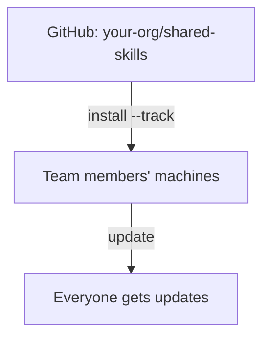

# 組織全体の Skill

Tracked repositories を使ってすべてのプロジェクト間で Skill を共有します。

## 概要



---

## 利用シナリオ

| シナリオ | 例 |
|----------|---------|
| **会社のコーディング標準** | すべてのリポジトリで一貫した命名、エラーハンドリング、アーキテクチャを強制する |
| **セキュリティ監査 Skill** | すべてのプロジェクトに適用される組織全体のセキュリティレビューチェックリスト |
| **デプロイの知識** | 標準的な CI/CD パターン、インフラの規約、リリースプロセス |
| **コードレビューガイドライン** | すべてのチーム・プロジェクトで一貫したレビュー基準 |
| **プロジェクト横断的なパターン** | 共有 API 設計パターン、ロギング標準、テストフレームワーク |

---

## なぜ組織全体で共有するのか？

| 組織の Skill がない場合 | 組織の Skill がある場合 |
|-----------------------------|--------------------------|
| 「ねえ、Slack から最新のデプロイ Skill を取って」 | `skillshare update --all` |
| マシン間で Skill をコピー&ペースト | 1つのコマンドですべてインストール |
| 「あなたはどのバージョンの Skill を持ってる？」 | 全員が同じ Source から Sync する |
| Skill がドキュメント/リポジトリに散在 | 組織用に1つの厳選されたリポジトリ |

---

## チームリードの場合

### ステップ 1: Skill リポジトリを作成する

組織の Skill 用の GitHub/GitLab/Bitbucket リポジトリを作成します。

```bash
mkdir org-skills && cd org-skills
git init

# Skill の構造を作成する
mkdir -p frontend/ui backend/api devops/deploy

# Skill を追加する
echo "---
name: acme-ui
description: Frontend UI patterns
---
# UI Skill
..." > frontend/ui/SKILL.md

git add .
git commit -m "Initial skills"
git push -u origin main
```

### ステップ 2: .skillignore を追加する（任意）

リポジトリに Skill として発見されるべきでない社内ツールや CI スクリプトがある場合、リポジトリのルートに
`.skillignore` を作成します。

```text title=".skillignore"
# CI/CD helpers — not installable skills
ci-scripts
_internal-*
```

`.skillignore` にブロックされている Skill が必要な個々のチームメンバーは、同じディレクトリに
（git にコミットしない）`.skillignore.local` を作成してローカルでオーバーライドできます。

```text title=".skillignore.local"
!_internal-my-tool
```

### ステップ 3: インストールコマンドを共有する

これをチームに送ります。

```bash
skillshare install github.com/your-org/org-skills --track && skillshare sync
```

一部のみ必要なチームメンバーは `--exclude` を使えます。

```bash
skillshare install github.com/your-org/org-skills --all --exclude devops-deploy
```

---

## チームメンバーの場合

### 初期セットアップ

```bash
# 組織の Skill リポジトリをインストールする
skillshare install github.com/org/skills --track

# 自分の AI CLI に Sync する
skillshare sync
```

### 日常的な利用

```bash
# 更新を確認する
skillshare update --all
skillshare sync
```

---

## ネストされた Skill と自動フラット化

Skill をフォルダで整理してください — skillshare は AI CLI との互換性のために自動的にフラット化します。

```
SOURCE                              TARGET
(your organization)                 (what AI CLI sees)
────────────────────────────────────────────────────────────
_org-skills/
├── frontend/
│   ├── react/          ───►   _org-skills__frontend__react/
│   └── vue/            ───►   _org-skills__frontend__vue/
├── backend/
│   └── api/            ───►   _org-skills__backend__api/
└── devops/
    └── deploy/         ───►   _org-skills__devops__deploy/

• _ prefix = tracked repository
• __ (double underscore) = path separator
```

**利点:**
- リポジトリ内で論理的なフォルダ整理を保てる
- AI CLI は期待通りのフラットな構造を見る
- フラット化された名前が由来のパスを保持し、追跡可能にする

詳細は [Tracked Repositories](/docs/understand/tracked-repositories#nested-skills--auto-flattening)
を参照してください。

---

## 衝突検出

複数の Skill が同じ `name` フィールドを共有する場合、Sync は `include`/`exclude` フィルターの適用後、
それらが実際に同じ Target に配置されるかどうかをチェックします。

**フィルターが衝突を分離する** — 情報提供のみ:

```
ℹ Duplicate skill names exist but are isolated by target filters:
  'ui' (2 definitions)
```

**衝突が同じ Target に到達する** — 対応が必要な警告:

```
⚠ Target 'claude': skill name 'ui' is defined in multiple places:
  - _team-a/frontend/ui
  - _team-b/components/ui
Rename one in SKILL.md or adjust include/exclude filters
```

**解決策:** 名前空間化された名前を使うか、フィルターでルーティングします。

```yaml
# オプション 1: SKILL.md で名前空間化する
name: team-a-ui

# オプション 2: フィルターでルーティングする（global config）
targets:
  codex:
    path: ~/.codex/skills
    include: [_team-a__*]
  claude:
    path: ~/.claude/skills
    include: [_team-b__*]
```

```yaml
# オプション 2: フィルターでルーティングする（project config）
targets:
  - name: claude
    exclude: [codex-*]
  - name: codex
    include: [codex-*]
```

完全な構文と例については [Target フィルター](/docs/reference/targets/configuration#include--exclude-target-filters)
を参照してください。

---

## 複数の組織リポジトリ

異なるチームや関心事のために複数のリポジトリをインストールします。

```bash
# フロントエンドチーム
skillshare install github.com/org/frontend-skills --track --name frontend

# バックエンドチーム
skillshare install github.com/org/backend-skills --track --name backend

# DevOps チーム
skillshare install github.com/org/devops-skills --track --name devops

skillshare sync
```

すべて更新する:
```bash
skillshare update --all
skillshare sync
```

---

## プライベートリポジトリ

**SSH**（開発者マシンに推奨）:

```bash
skillshare install git@github.com:org/private-skills.git --track
```

**トークン付き HTTPS**（CI/CD に推奨）:

```bash
export GITHUB_TOKEN=ghp_your_token
skillshare install https://github.com/org/private-skills.git --track
```

公式のトークンドキュメント:
- GitHub: [Managing your personal access tokens](https://docs.github.com/en/authentication/keeping-your-account-and-data-secure/managing-your-personal-access-tokens)
- GitLab: [Token overview](https://docs.gitlab.com/security/tokens/)
- Bitbucket: [Access tokens](https://support.atlassian.com/bitbucket-cloud/docs/access-tokens/)

### CI/CD セットアップ

**GitHub Actions:**

```yaml
- name: Install org skills
  env:
    GITHUB_TOKEN: ${{ secrets.GITHUB_TOKEN }}
  run: |
    skillshare install https://github.com/org/skills.git --track
    skillshare sync
```

**GitLab CI:**

```yaml
install-skills:
  script:
    - skillshare install https://gitlab.com/org/skills.git --track
    - skillshare sync
  variables:
    GITLAB_TOKEN: $CI_JOB_TOKEN
```

**Bitbucket Pipelines:**

```yaml
- step:
    name: Install org skills
    script:
      - skillshare install https://bitbucket.org/team/skills.git --track
      - skillshare sync
    env:
      BITBUCKET_USERNAME: $BITBUCKET_USERNAME   # for app passwords
      BITBUCKET_TOKEN: $BITBUCKET_TOKEN
```

対応するすべてのトークンについては [環境変数](/docs/reference/appendix/environment-variables#git-authentication)
を参照してください。

---

## コマンドリファレンス

| コマンド | 説明 |
|---------|-------------|
| `install <url> --track` | リポジトリを Tracked repository として clone する |
| `update <name>` | 特定の Tracked repo を git pull する |
| `update --all` | すべての Tracked repos を更新する |
| `uninstall <name>...` | Tracked repo を削除する |
| `list` | すべての Skill と Tracked repos を一覧表示する |
| `status` | Sync のステータスを表示する |

---

## 組織の Agent

Tracked された組織のリポジトリは、Skill と共に**Agent**を出荷できます。`skills/` の隣にある
トップレベルの `agents/` ディレクトリに配置してください。

```
your-org/org-shared/
├── skills/                  # Discovered as skills
│   ├── api-design/
│   │   └── SKILL.md
│   └── security/
│       └── SKILL.md
└── agents/                  # Discovered as agents
    ├── reviewer.md
    └── auditor.md
```

チームメンバーが `skillshare install github.com/your-org/org-shared --track` を実行すると、両方の
ディレクトリが自動的に取り込まれます。`skillshare update --all` は両方を同期させ続け、
`skillshare sync`（または `skillshare sync agents`）は Agent 対応の Target（Claude、Cursor、
Augment、OpenCode）に Agent を反映します。

組織のリポジトリ内の `.agentignore` ファイルはディスク上で尊重されますが、通常は利用側の Source
ルート（または `.agentignore.local`）に置くべきです。そうすれば、個々のマシンが上流のリポジトリを
編集せずにオプトアウトできます。完全な発見ルールについては [Agents](/docs/understand/agents) を
参照してください。

---

## 組織の Skill vs プロジェクトの Skill

| | 組織の Skill | プロジェクトの Skill |
|---|---|---|
| **スコープ** | マシン上のすべてのプロジェクト | 単一のリポジトリ |
| **Source** | `~/.config/skillshare/skills/_repo/` | `.skillshare/skills/` |
| **インストール** | `skillshare install <url> --track` | `skillshare install <url> -p` |
| **共有方法** | 各メンバーが Tracked repo をインストールする | プロジェクトの git リポジトリにコミットされる |
| **最適な用途** | コーディング標準、セキュリティ、組織パターン | API 規約、ドメインコンテキスト、プロジェクトツール |
| **共存** | プロジェクトの Skill と併存可能 | 組織の Skill と併存可能 |

:::tip 両方を使う
組織の Skill は会社全体の標準を提供します。プロジェクトの Skill はリポジトリ固有のコンテキストを
提供します。互いを補完し合うので、最良の開発者体験のために両方を使ってください。
:::

---

## ベストプラクティス

### チームリード向け

1. **明確な構造を使う**: 機能別に整理する（frontend、backend、devops）
2. **Skill を名前空間化する**: 衝突を避けるため `org-skill-name`
3. **要件を文書化する**: セットアップ手順のある README
4. **バージョン管理**: 安定版リリースにはタグを使う

### チームメンバー向け

1. **定期的に更新する**: 毎日 `skillshare update --all`
2. **問題を報告する**: Skill が動作しない場合はメンテナーに伝える
3. **改善を提案する**: Skill リポジトリに PR を出す

---

## 関連項目

- [Tracked Repositories](/docs/understand/tracked-repositories) — コンセプトの詳細
- [install](/docs/reference/commands/install) — `--track` でのインストール
- [update](/docs/reference/commands/update) — Tracked repos の更新
- [プロジェクトセットアップ](./project-setup.md) — プロジェクトレベルの共有
- [クロスマシン Sync](./cross-machine-sync.md) — 個人の Sync
