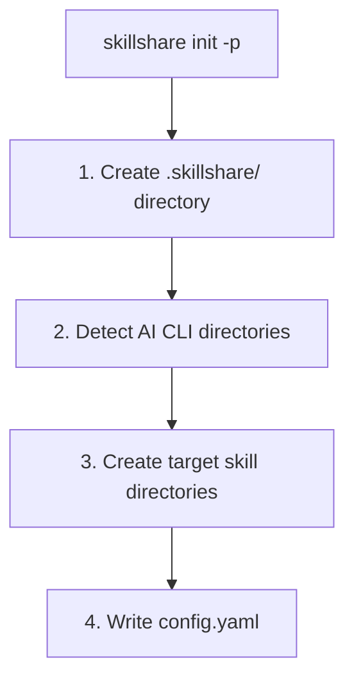

# プロジェクトセットアップ

プロジェクトレベルの Skill をゼロからセットアップします — 単一のリポジトリにスコープされ、git 経由で
チームと共有される Skill です。

## Project Mode をいつ使うか

| シナリオ | 例 | 用途 |
|----------|---------|-----|
| モノレポのオンボーディング | 新入社員がリポジトリを clone すると即座にすべてのプロジェクトコンテキストを得る | **Project mode** |
| API 規約 | 「すべてのエンドポイントは camelCase を使い、標準のエラー形式を返す必要がある」 | **Project mode** |
| ドメイン固有のコンテキスト | 金融の規制ルール、医療のコンプライアンスガイドライン | **Project mode** |
| デプロイの知識 | 「`make deploy-staging` で staging にデプロイする、VPN が必要」 | **Project mode** |
| プロジェクトのツール | カスタムテストパターン、移行スクリプト、ビルド設定 | **Project mode** |
| すべてのプロジェクトで共有される Skill | 会社全体のコーディング標準、セキュリティ監査 | Organization mode |
| 複数マシンにまたがる個人の Skill | 個人の書式設定の好み、ワークフローのショートカット | Global mode |

---

## ステップバイステップのセットアップ

### ステップ 1: 初期化する

プロジェクトのルートで `skillshare init -p` を実行します。

```bash
cd my-project
skillshare init -p
```



:::tip 自動検出
初期化後、このディレクトリに `cd` するたびに skillshare は Project mode を自動検出します。以降の
コマンドに `-p` フラグは不要です。
:::

Target を直接指定することもできます。

```bash
skillshare init -p --targets claude,cursor
```

### ステップ 2: ローカルの Skill を作成する

手動で、または `skillshare new` で Skill を作成します。

```bash
# skillshare new を使う
skillshare new my-skill -p

# または手動で
mkdir -p .skillshare/skills/my-skill
cat > .skillshare/skills/my-skill/SKILL.md << 'EOF'
---
name: my-skill
description: Project-specific coding guidelines
---
# My Skill

Your skill content here...
EOF
```

### ステップ 3: リモートの Skill をインストールする

GitHub から Skill をプロジェクトにインストールします。

```bash
skillshare install anthropics/skills/skills/pdf -p
skillshare install github.com/team/shared-skills/review -p

# --into でサブディレクトリに整理する
skillshare install anthropics/skills -s pdf --into tools -p
# → .skillshare/skills/tools/pdf/
```

リモートの Skill は次のようになります。
- `.skillshare/skills/<name>/`（または `--into` を使った場合は `.skillshare/skills/<into>/<name>/`）にインストールされる
- `.skillshare/config.yaml` の `skills:` の下に記録される
- `.skillshare/.gitignore` に追加される（clone されたコンテンツはコミットされない。`logs/`、`trash/`、`backups/` はデフォルトで無視される）

### ステップ 4: Target に Sync する

```bash
skillshare sync
```

`.skillshare/skills/` から各 Target ディレクトリへのシンボリックリンクを作成します。Project mode を
自動検出します。

### ステップ 5: バージョン管理にコミットする

```bash
git add .skillshare/
git commit -m "Add project-level skills"
```

**コミットされるもの:**
- `.skillshare/config.yaml` — Target とリモート Skill のリスト
- `.skillshare/skills.lock.json` — 各リモート Skill を固定する commit。全員が同じバージョンをインストールできます
- `.skillshare/.gitignore` — プロジェクトのログ、trash、バックアップ、clone された Skill の無視パターン
- `.skillshare/skills/<local-skills>/` — ローカルの Skill の内容

**無視されるもの:**
- `.skillshare/logs/`（操作ログと監査ログ）
- `.skillshare/trash/`（ソフトデリートされた Skill、7日後に自動クリーンアップ）
- `.skillshare/backups/`（sync と backup コマンドによる Agent のバックアップ）
- リモートの Skill ディレクトリ（config から再インストールされる）

### 任意: ログファイルをコミットする

プロジェクトのログをバージョン管理に含めたい場合は、`.skillshare/.gitignore` にオーバーライドルールを
追加します。

```gitignore
# User override: track logs
!logs/
!logs/*.log
```

ルートの `.gitignore` が `.skillshare/` を無視している場合は、そちらにも対応する unignore ルールを
追加してください。

---

## 新しいチームメンバーのオンボーディング

### skillshare を使わない場合

1. リポジトリを clone する
2. README を読んでどの Skill をインストールすべきか調べる
3. 各 Skill を手動でコピーまたはインストールする
4. 各 AI CLI ツールを個別に設定する
5. 何も見落としていないことを願う

### skillshare を使う場合

```bash
git clone github.com/team/my-project
cd my-project
skillshare install -p && skillshare sync
```

これで完了です。すべてのプロジェクトの Skill がインストールされ Sync されます。`skillshare install -p`
（URL なし）は `.skillshare/config.yaml` を読み込み、リストされたすべてのリモート Skill を自動的に
インストールします。同じパターンは Global mode でも動作します — `skillshare install`（引数なし）は
`~/.config/skillshare/config.yaml` を読み込みます。

---

## カスタム Target パス

Target は既知の名前とカスタムパスの両方に対応しています。

```yaml
# .skillshare/config.yaml
targets:
  - claude                    # 既知の名前 → .claude/skills/
  - cursor                         # 既知の名前 → .cursor/skills/
  - name: custom-tool              # カスタムパス
    path: ./tools/ai/skills        # プロジェクトルートからの相対パス
  - name: another-tool
    path: ~/global/path/skills     # ~ 展開付きの絶対パス
```

---

## Config の完全な例

```yaml
targets:
  - claude
  - cursor
  - name: windsurf
    path: .windsurf/skills

skills:
  - name: pdf
    source: anthropic/skills/pdf
  - name: code-review
    source: github.com/team/skills/code-review
```

---

## Web ダッシュボード

Web ダッシュボードは Project mode に対応しており、Skill、Target、Sync、config を視覚的に管理できます。

```bash
cd my-project
skillshare ui -p
```

または、`.skillshare/config.yaml` が存在すれば（自動検出されるので）単に `skillshare ui` で構いません。

Project mode では、ダッシュボードは:
- サイドバーに**「Project」バッジ**を表示する
- **Git Sync** を非表示にする（自分のプロジェクトの git を使ってください）
- Config ページで **`.skillshare/config.yaml`** を編集する
- リモートの Skill をインストールした後、自動的に `skills:` のエントリを**調整する**

---

## Global mode との共存

プロジェクトと Global（組織）の Skill は独立して動作します。

```
Organization level                  Project level
~/.config/skillshare/skills/        .skillshare/skills/
├── personal-skill/                 ├── project-skill/
└── _company-std/                   └── remote-skill/
         │                                   │
         ▼                                   ▼
   ~/.claude/skills/                .claude/skills/
   (system-wide targets)            (project-local targets)
```

- プロジェクトの Target は**プロジェクトローカル**です（例: プロジェクト内の `.claude/skills/`）
- 組織の Target は**システム全体**です（例: `~/.claude/skills/`）
- ディレクトリもスコープも異なるため、これらは衝突しません

### 実例: Alice の2つのプロジェクト

Alice は金融アプリとマーケティングダッシュボードに取り組んでいます。彼女には:

- **組織の Skill**: 会社のコーディング標準、セキュリティ監査（どこでも利用可能）
- **金融プロジェクトの Skill**: 規制コンプライアンス、金融 API 規約
- **マーケティングプロジェクトの Skill**: 分析パターン、A/B テストガイドライン

```bash
cd ~/finance-app
skillshare status     # システム全体の Target にある金融プロジェクトの Skill + 組織の Skill を表示

cd ~/marketing-dash
skillshare status     # マーケティングプロジェクトの Skill + 同じ組織の Skill を表示
```

各プロジェクトが独自のコンテキストを持ちながら、組織の標準はグローバルに適用されます。

---

## 関連項目

- [プロジェクトの Skill](/docs/understand/project-skills) — コンセプトの説明
- [プロジェクトワークフロー](/docs/how-to/daily-tasks/project-workflow) — 日々の使用方法
- [組織全体の Skill](./organization-sharing.md) — チーム共有
- [init](/docs/reference/commands/init) — `--project` での Init
