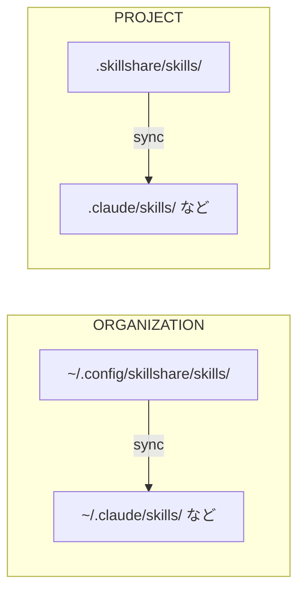

# はじめに

**skillshare** は、単一の Source から AI CLI の Skill をすべての AI コーディングアシスタントへ同期する CLI ツールです。

## なぜ skillshare なのか

インストール系のツールは Skill をエージェントに届けます。**skillshare はそれを同期し続けます。**

| | インストール型ツール | skillshare |
|---|-------------------|------------|
| インストール後 | 更新コマンドを手動で実行 | **Merge sync** — Skill ごとの symlink、ローカルの Skill は保持 |
| Skill の更新 | 更新コマンドを実行 / 再インストール | **Source を編集**すれば即座に反映 |
| 編集の吸い上げ | — | **双方向** — どのエージェントからでも collect 可能 |
| 複数マシン | マシンごとに再インストール | **git push/pull** — コマンド 1 つで同期 |
| ローカル + インストール済み | 別々に管理 | 単一の Source ディレクトリに**統合** |
| 組織での共有 | skills.json をコミット、または再インストール | **Tracked repo** — git pull で更新 |
| プロジェクトの Skill | リポジトリごとにコピーし、時間とともに乖離 | **Project mode** — 自動検出、git で共有 |
| セキュリティ監査 | なし | **標準搭載** — インストール時に自動スキャン、`audit` コマンド |
| AI 連携 | 手動の CLI のみ | **Built-in skill** — AI が直接操作 |

## クイックスタート

```bash
# Install
curl -fsSL https://raw.githubusercontent.com/runkids/skillshare/main/install.sh | sh

# 初期化（CLI を自動検出し、git をセットアップ）
skillshare init

# Skill をインストール
skillshare install anthropics/skills/skills/pdf

# すべての Target に同期
skillshare sync
```

これで完了です。Skill がすべての AI CLI ツール間で同期されました。

:::tip[インストールせずに試す]
まず触ってみたいですか？ [Docker Playground](/docs/how-to/advanced/docker-sandbox#playground) ならコマンド 1 つ、ローカルへのインストールは不要です:

```bash
git clone https://github.com/runkids/skillshare.git && cd skillshare
make playground
```
:::

## 仕組み



Source を編集すればすべての Target が更新されます。Target を編集すれば（symlink 経由で）変更は Source に反映されます。

## 主な機能

- **自動検出** — `.skillshare/` があるプロジェクトに `cd` すると、skillshare は自動的に Project mode へ切り替わります
- **2 階層アーキテクチャ** — 全社標準のための組織 Skill と、リポジトリ固有の文脈のためのプロジェクト Skill
- **即時反映** — symlink ベースの Sync により、編集はすべての AI ツールへ即座に反映されます
- **チーム対応** — 組織 Skill は Tracked repo 経由、プロジェクト Skill は git commit 経由で共有
- **あらゆる Git ホスト** — GitHub、GitLab、Bitbucket、Azure DevOps、AtomGit、Gitee、セルフホストの Git からインストール・更新・チェックが可能
- **セキュリティ監査** — prompt injection、データ流出、その他の脅威を Skill からスキャン。インストール時に自動スキャン

## 対応プラットフォーム

| プラットフォーム | Source のパス | リンク種別 |
|----------|-------------|-----------|
| macOS/Linux | `~/.config/skillshare/skills/` | Symlink |
| Windows | `%AppData%\skillshare\skills\` | NTFS Junction |

## 次のステップ

### 個人開発者

1. [First Sync](/docs/getting-started/first-sync) — 5 分で同期を完了する
2. [Creating Skills](/docs/how-to/daily-tasks/creating-skills) — 最初の Skill を書く
3. [Cross-Machine Sync](/docs/how-to/sharing/cross-machine-sync) — 複数マシン間で Skill を同期し続ける

### チームリード / 組織

1. [Organization-Wide Skills](/docs/how-to/sharing/organization-sharing) — チーム全体で標準を共有する
2. [Project Setup](/docs/how-to/sharing/project-setup) — プロジェクト単位の Skill を設定する
3. [Security Audit](/docs/reference/commands/audit) — 導入前にサードパーティ製 Skill をスキャンする

### すでに Skill をお持ちですか？

- [From Existing Skills](/docs/getting-started/from-existing-skills) — 移行と統合

### さらに詳しく

- [Core Concepts](/docs/understand) — Source、Target、Sync モード
- [Commands Reference](/docs/reference/commands) — 利用可能なすべてのコマンド
- [Docker Sandbox](/docs/how-to/advanced/docker-sandbox) — 隔離環境で skillshare を試す
- [FAQ](/docs/troubleshooting/faq) — よくある質問
