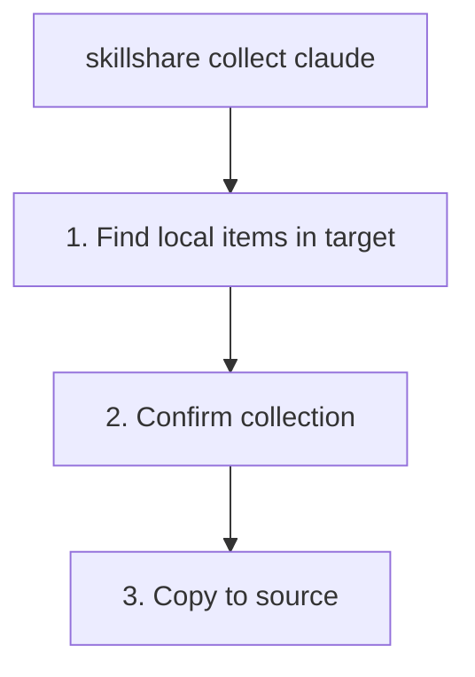

# collect

ターゲットからソースへ、ローカルの Skill や agent を収集します。

```bash
skillshare collect claude           # 特定のターゲットから
skillshare collect --all            # すべてのターゲットから
skillshare collect claude --dry-run # プレビュー
skillshare collect agents claude    # Skill の代わりに agent を収集
```

## こんなときに使う

ターゲットディレクトリ内で直接リソースを作成・編集し、それをソース（信頼できる情報源）に取り込みたいときに `collect` を使います。

1. 共有のためにソースへ追加する
2. 他の AI CLI へ sync する
3. git でバックアップする

例:

- Skill: `~/.claude/skills/my-skill/`
- Agent: `~/.claude/agents/tutor.md`

## 何が起きるか



:::tip
`.git/` ディレクトリは収集時に自動的に除外されます。Skill リポジトリをターゲットディレクトリに直接 git clone していた場合、Skill のコンテンツのみがコピーされ、リポジトリのメタデータは残されません。
:::

:::note
web ダッシュボードの **Collect** ページは現在 Skill のみに対応しています。`collect agents` には CLI を使用してください。
:::

## オプション

| フラグ | 説明 |
|------|-------------|
| `--all, -a` | すべてのターゲットから収集 |
| `--force, -f` | ソース内の既存アイテムを上書きし、確認をスキップ |
| `--dry-run, -n` | 変更を加えずにプレビュー |
| `--json` | JSON を出力して確認をスキップ。ソース内の既存アイテムを上書きするには引き続き `--force` が必要 |

## JSON 出力

```bash
skillshare collect claude --json
```

```json
{
  "pulled": ["new-skill", "another-skill"],
  "skipped": [],
  "failed": {},
  "dry_run": false,
  "duration": "0.123s"
}
```

`--dry-run` と組み合わせて、変更せずにプレビューできます。

```bash
skillshare collect claude --json --dry-run
skillshare collect -p --json
skillshare collect -p agents --json
```

## 出力例

```bash
$ skillshare collect claude

Local skills found
  ℹ new-skill       [claude] ~/.claude/skills/new-skill
  ℹ another-skill   [claude] ~/.claude/skills/another-skill

Collect these skills to source? [y/N]: y

Collecting skills
  ✓ new-skill: copied to source
  ✓ another-skill: copied to source

Run 'skillshare sync' to distribute to all targets
```

## 競合の処理

アイテムがすでにソースに存在する場合、収集はデフォルトでスキップされます。

```bash
$ skillshare collect claude

Collecting skills
  ⚠ my-skill: skipped (already exists in source, use --force to overwrite)

# To overwrite:
$ skillshare collect claude --force

$ skillshare collect agents claude

Collecting agents
  ⚠ tutor.md: skipped (already exists in source, use --force to overwrite)
```

## ワークフロー

ターゲット内で Skill を作成した後の典型的なワークフロー:

```bash
# 1. Create skill in Claude
# (edit ~/.claude/skills/my-new-skill/SKILL.md)

# 2. Collect to source
skillshare collect claude

# 3. Sync to all other targets
skillshare sync

# 4. Commit to git (optional)
skillshare push -m "Add my-new-skill"
```

agent の場合は、agent 専用の collect/sync ペアを使用します。

```bash
skillshare collect agents claude
skillshare sync agents
```

## 関連項目

- [sync](/docs/reference/commands/sync) — ソースからターゲットへ sync
- [diff](/docs/reference/commands/diff) — ローカルのみの Skill を確認
- [push](/docs/reference/commands/push) — git remote へ push
