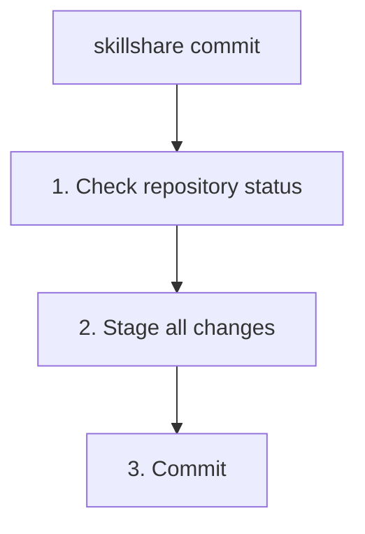

# commit

source skills をプッシュせずにローカルの git commit を作成します。

```bash
skillshare commit                         # デフォルトメッセージでコミット
skillshare commit -m "Update skill"       # カスタムメッセージ
skillshare commit --dry-run               # プレビュー
```

## 使うタイミング

- Skill の編集を試す前にローカルのチェックポイントを保存する
- リモートが設定されていないマシンや source リポジトリで変更をコミットする
- マシン間で変更を共有せず、ローカルの履歴を分けて管理する

**コミット**と**プッシュ**の両方を git remote に対して行いたい場合は [`push`](./push.md) を使ってください。

## 実行内容



`commit` は skills source ディレクトリ内のすべての変更を stage し、git commit を作成します。remote は不要で、`git push` は一切実行されません。

## オプション

| フラグ | 説明 |
|------|-------------|
| `-m, --message <msg>` | コミットメッセージ（デフォルト: "Update skills"） |
| `--dry-run, -n` | 変更を加えずにプレビュー |

## Git Root スコープ {#git-root-scope}

`commit` は `git_root` の設定フィールド（デフォルト: `skills` source）で選択されたディレクトリに対して動作します。バージョン管理対象のディレクトリを変更するには `skillshare init --git-root <scope>` を使用します。有効なスコープ:

| スコープ | ディレクトリ |
|-------|-----------|
| `skills`（デフォルト） | Skills source（`~/.config/skillshare/skills/`） |
| `agents` | Agents source（`~/.config/skillshare/agents/`） |
| `extras` | Extras source（`~/.config/skillshare/extras/`） |
| `root` | 設定ルート（`~/.config/skillshare/`）— skills + agents + extras を 1 つのリポジトリでバージョン管理 |

`git_root` を変更したのに git リポジトリが別のスコープのディレクトリに残っている場合、`commit` は "Git root mismatch" エラーを表示し、修正に必要な正確な `git init` / `mv` コマンドを提示します。詳細は [Changing the scope after init](/docs/reference/targets/configuration#git-root) を参照してください。

## 前提条件

skills source ディレクトリが git リポジトリである必要があります。

```bash
skillshare init
```

source が git リポジトリでない場合、`commit` はセットアップのヒントを表示し、ファイルを変更せずに終了します。

## 例

```bash
# デフォルトメッセージでコミット
skillshare commit

# カスタムメッセージでコミット
skillshare commit -m "Update review skill"

# コミットせずにステージされたファイルとメッセージをプレビュー
skillshare commit --dry-run
```

## 関連項目

- [push](./push.md) — コミットして git remote にプッシュ
- [pull](./pull.md) — remote からプルして targets に sync
- [status](./status.md) — git と sync の状態を確認
