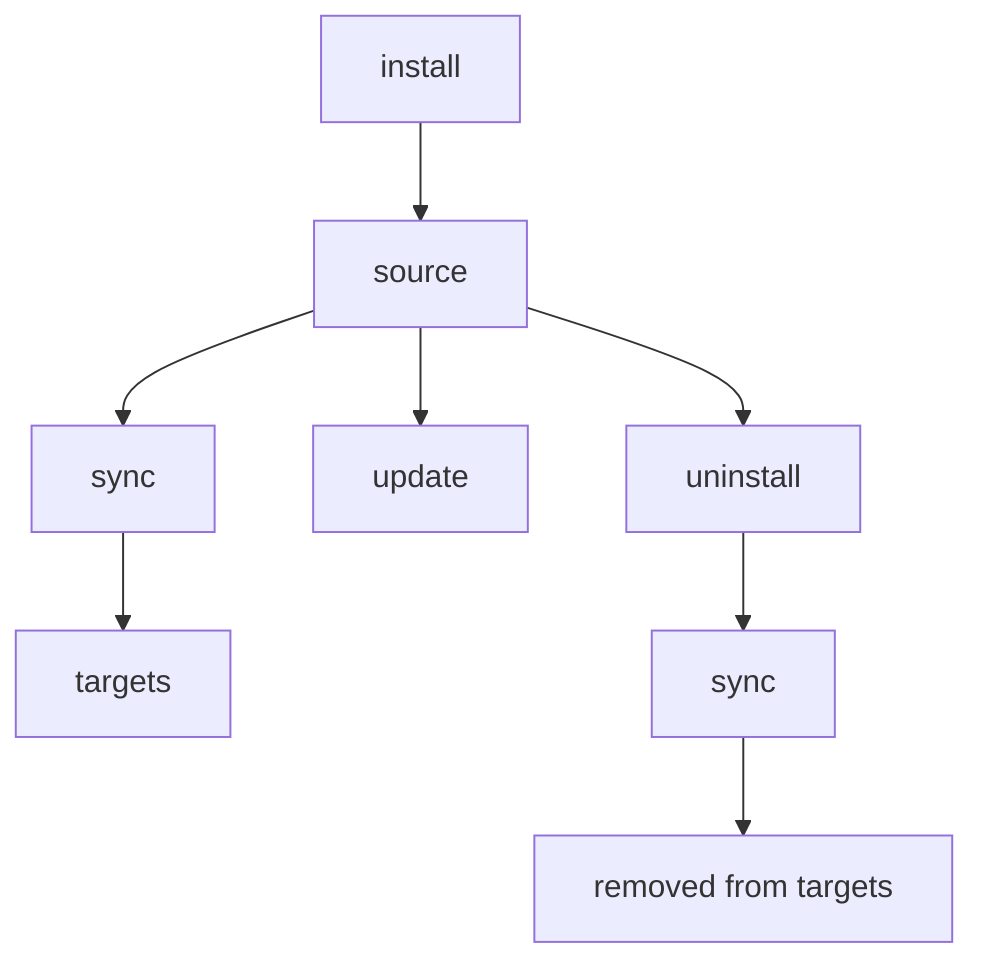

# install

GitHub リポジトリ、git URL、またはローカルパスから Skill を追加します。

## 概要



## こんなときに使う

- GitHub、GitLab、Bitbucket、Azure DevOps、またはローカルパスから新しい Skill を追加する
- 組織で共有している Skill リポジトリをインストールする（`--track` を使用）
- 既存の Skill を再インストールまたは更新する（`--update` または `--force` を使用）

---

## クイックサンプル

```bash
# GitHub から（省略形）
skillshare install anthropics/skills/skills/pdf

# リポジトリ内の利用可能な Skill を閲覧
skillshare install anthropics/skills

# ローカルパスから
skillshare install ~/Downloads/my-skill

# トラック対象のリポジトリとして（チーム共有用）
skillshare install github.com/team/skills --track

# サブディレクトリへインストール（カテゴリ別に整理）
skillshare install ~/my-skill --into frontend

# config に記載された全 Skill をインストール（引数なし）
skillshare install
```

## ソースの形式

### GitHub 省略形

`owner/repo` 形式を使うと、自動的に `github.com/owner/repo` に展開されます。

```bash
skillshare install anthropics/skills                    # ブラウズモード
skillshare install anthropics/skills/skills/pdf         # 直接インストール
skillshare install ComposioHQ/awesome-claude-skills     # 別のリポジトリ
```

### GitLab / Bitbucket / その他のホスト

GitHub 以外のホストでは `domain/owner/repo` 形式を使用します。

```bash
skillshare install gitlab.com/user/repo                 # GitLab
skillshare install bitbucket.org/team/skills            # Bitbucket
skillshare install git.company.com/team/skills          # セルフホスト
```

フル URL や SSH も使用できます。

```bash
skillshare install https://gitlab.com/user/repo.git
skillshare install git@gitlab.com:user/repo.git
```

:::tip カスタムドメイン上のセルフマネージド GitLab
ホスト名に `gitlab` または `jihulab` を含む場合、ネストしたサブグループのサポートを含めて自動検出されます。その他のカスタムドメイン上のセルフマネージド GitLab インスタンス（例: `git.company.com`）の場合は、config の [`gitlab_hosts`](/docs/reference/targets/configuration#gitlab_hosts) にホスト名を追加すると、skillshare が URL パス全体をリポジトリとして扱うようになります。config を設定しない場合は、回避策として `.git` を末尾に付けることもできます: `git.company.com/team/frontend/ui.git`。
:::

### Azure DevOps

`ado:` の省略形、またはフルの Azure DevOps URL を使用します。

```bash
# 省略形（ado:org/project/repo）
skillshare install ado:myorg/myproject/myrepo
skillshare install ado:myorg/myproject/myrepo/skills/react    # サブディレクトリ付き

# フル HTTPS URL
skillshare install https://dev.azure.com/myorg/myproject/_git/myrepo

# レガシー形式（自動正規化）
skillshare install https://myorg.visualstudio.com/myproject/_git/myrepo

# SSH
skillshare install git@ssh.dev.azure.com:v3/myorg/myproject/myrepo
```

## ブラウズモード（Skill の閲覧）

パスを指定しない場合、skillshare はリポジトリをクローンし、Skill をスキャンして、インタラクティブなピッカーを表示します。

```bash
skillshare install anthropics/skills
```

<p>
  
</p>

ディスカバリーは `.git` のみをスキップし、すべてのディレクトリを `SKILL.md` ファイルについてスキャンします。つまり、`.curated/` や `.system/` のような隠しディレクトリ内の Skill も自動的に検出されます。複数の Skill が見つかった場合、選択プロンプトはディレクトリごとにグルーピングされ、閲覧しやすくなります。

リポジトリのルートに `.skillignore` ファイルがある場合、一致する Skill はディスカバリーから自動的に除外されます。詳細は下記の [.skillignore](#skillignore) を参照してください。

Skill の `SKILL.md` に `license:` フロントマターフィールドが含まれている場合、そのライセンスは選択プロンプト（例: `my-skill (MIT)`）と、単一 Skill インストール時の確認画面に表示されます。

**Tip**: インストールせずにプレビューするには `--dry-run` を使用します。
```bash
skillshare install anthropics/skills --dry-run
```

## 選択インストール（非インタラクティブ）

プロンプトなしで、複数 Skill を含むリポジトリから特定の Skill を選びます。`--skill` フラグは **fuzzy matching** と **glob パターン** をサポートしています。完全一致する名前が見つからない場合、glob マッチング（`*`、`?`、`[...]`）を試し、それでも見つからなければ最も近い部分文字列マッチにフォールバックします。

```bash
# 名前で特定の Skill をインストール（完全一致または fuzzy）
skillshare install anthropics/skills -s pdf,commit

# glob パターンに一致する Skill をインストール
skillshare install anthropics/skills -s "core-*"

# 検出されたすべての Skill をインストール
skillshare install anthropics/skills --all

# 自動承認（複数 Skill のリポジトリでは --all と同じ）
skillshare install anthropics/skills -y

# 他のフラグと組み合わせる
skillshare install anthropics/skills -s pdf --dry-run
skillshare install anthropics/skills --all -p
```

glob マッチングは大文字小文字を区別しません: `"Core-*"` は `core-auth`、`CORE-DB` などにマッチします。

:::tip シェルの glob 展開への対策
シェルがカレントディレクトリのファイル名に `*` を展開してしまわないよう、glob パターンは常にクォート（`"core-*"`）してください。
:::

CI/CD パイプラインやスクリプト化されたワークフローに便利です。

## 直接インストール（特定のパス）

フルパスを指定して即座にインストールします。

```bash
# サブディレクトリ付き GitHub
skillshare install anthropics/skills/skills/pdf
skillshare install google-gemini/gemini-cli/packages/core/src/skills/builtin/skill-creator

# ファジーなサブディレクトリ — 完全一致するパスが存在しない場合、Skill 名でマッチ
skillshare install runkids/my-skills/vue-best-practices

# フル URL
skillshare install github.com/user/repo/path/to/skill

# SSH URL
skillshare install git@github.com:user/repo.git

# サブディレクトリ付き SSH URL（// セパレータを使用）
skillshare install git@github.com:user/repo.git//path/to/skill

# ローカルパス
skillshare install ~/Downloads/my-skill
skillshare install /absolute/path/to/skill
```

:::tip ファジーなサブディレクトリ解決
`owner/repo/skill-name` のようなサブディレクトリパスを指定した際、そのパスがリポジトリ内に完全一致で存在しない場合、skillshare はすべての `SKILL.md` ファイルをスキャンし、ディレクトリのベース名でマッチさせます。同名の Skill が複数存在する場合は、フルパス付きの曖昧性エラーが表示されるので、正確なパスを指定できます。
:::

## Config からのインストール（引数なし） {#install-from-config-no-arguments}

ソースの引数を指定せずに実行すると、`skillshare install` は記録済みのリモート Skill メタデータ（グローバルモード）またはプロジェクトの `skills:` マニフェスト（プロジェクトモード）を読み込み、まだローカルに存在しないすべてのリモート Skill をインストールします。

```bash
# グローバル — ~/.config/skillshare/config.yaml を読む
skillshare install

# プロジェクト — .skillshare/config.yaml を読む
skillshare install -p
```

これにより、記録済みのメタデータ／マニフェストは **持ち運び可能な Skill セットアップ** になります。どのマシンでも同じ Skill 構成を再現するために共有できます。

```bash
# 新しいマシンのセットアップ
skillshare install       # メタデータからリモート Skill とトラック対象リポジトリを復元
skillshare sync          # ターゲットへ sync

# 新しいチームメンバーのオンボーディング
git clone github.com/team/project && cd project
skillshare install -p    # プロジェクト config からすべてのリモート Skill をインストール
skillshare sync
```

`tracked: true` の Skill は（`--track` と同様に）完全な git 履歴付きでクローンされるため、`skillshare update` が正しく動作します。すでにディスクに存在する Skill はスキップされます。これは、トラック対象リポジトリのディレクトリが gitignore されていてローカルに存在しない状態で、クローン直後に実行する復旧コマンドです。

:::tip push/pull と install from config の違い
`push`/`pull` は実際の Skill **ファイル** を git 経由で sync します。`install`（config から）は **ソース URL** から再ダウンロードします。両者は補完関係にあります — どちらを使うべきかは [Cross-Machine Sync](/docs/how-to/sharing/cross-machine-sync#alternative-install-from-config) を参照してください。
:::

引数なしの install では、`--name`、`--into`、`--track`、`--skill`、`--exclude`、`--all`、`--yes`、`--update` はサポートされません（これらはソース引数が必要です）。`--dry-run`、`--force`、`--skip-audit`、および閾値の上書き（`--audit-threshold` / `--threshold` / `-T`）は通常どおり動作します。

## プロジェクトモード

プロジェクトの `.skillshare/skills/` ディレクトリに Skill をインストールします。

```bash
# プロジェクトに Skill をインストール
skillshare install anthropics/skills/skills/pdf -p

# プロジェクト内のサブディレクトリへインストール
skillshare install anthropics/skills -s pdf --into tools -p
# → .skillshare/skills/tools/pdf/

# config からすべてのリモート Skill をインストール（新しいチームメンバー向け）
skillshare install -p
```

:::caution プロジェクトルートをそれ自体にインストールしない
プロジェクトモードでは、プロジェクトルートに解決されるローカルパス（例: `skillshare install ./ -p`）のインストールは拒否されます。ルートをその配下の `.skillshare/skills/` サブツリーにコピーすると、コピー先へ再帰してしまうためです。特定の Skill サブディレクトリを指定してください。

```bash
skillshare install ./my-skill -p
```

このガードは CLI と Web UI（[`skillshare ui`](./ui.md)）の両方に適用されます。
:::

### 何が違うか

| | Global | Project (`-p`) |
|---|---|---|
| 保存先 | `~/.config/skillshare/skills/` | `.skillshare/skills/` |
| `--track` | サポート | サポート |
| Config の更新 | `config.yaml` の `skills:` を自動調整 | `.skillshare/config.yaml` の `skills:` を自動調整 |
| 引数なし install | config に記載された全 Skill をインストール | config に記載された全 Skill をインストール |

**プロジェクトモードでのトラック対象リポジトリ** はグローバルと同様に動作します — リポジトリは `.git` を保持したままクローンされ、`.skillshare/.gitignore`（デフォルトで `.skillshare/logs/` と `.skillshare/trash/` も無視）に追加されます。`tracked: true` フラグは `.skillshare/config.yaml` に自動的に記録されます。

```bash
skillshare install github.com/team/skills --track -p
skillshare sync
```

完全なガイドは [Project Setup](/docs/how-to/sharing/project-setup) を参照してください。

## オプション

| フラグ | 短縮形 | 説明 |
|------|-------|-------------|
| `--name <name>` | | インストールされる Skill がちょうど 1 つの場合、インストール名を上書き |
| `--into <dir>` | | サブディレクトリへインストール（例: `--into frontend` または `--into frontend/react`） |
| `--force` | `-f` | 既存の Skill を上書き。監査によるブロックとクロスパス重複チェックを無視 |
| `--update` | `-u` | 存在する場合は更新（git pull または再インストール） |
| `--branch <ref>` | `-b` | インストール元の git ブランチ、タグ、または commit SHA（デフォルト: リモートのデフォルトブランチ） |
| `--track` | `-t` | トラック対象リポジトリとして `.git` を保持 |
| `--kind <skill\|agent>` | | インストールを 1 種類のリソースに限定 |
| `--agent <names>` | `-a` | リポジトリから特定の agent を選択（カンマ区切り） |
| `--skill` | `-s` | 複数 Skill リポジトリから特定の Skill を選択（カンマ区切り。`core-*` のような glob パターンをサポート） |
| `--exclude` | | インストール時に特定の Skill をスキップ（カンマ区切り。`test-*` のような glob パターンをサポート） |
| `--all` | | プロンプトなしで検出されたすべての Skill をインストール |
| `--yes` | `-y` | すべてのプロンプトを自動承認（CI/CD 向け） |
| `--skip-audit` | | このインストールでセキュリティ監査をスキップ |
| `--audit-threshold <t>`, `--threshold <t>` | `-T` | このコマンドの監査ブロック閾値を上書き（`critical|high|medium|low|info`。省略形: `c|h|m|l|i`、加えて `crit`、`med`） |
| `--audit-verbose` | | Skill ごとの完全な監査結果を表示（デフォルト: コンパクトな要約） |
| `--project` | `-p` | プロジェクトの `.skillshare/skills/` へインストール |
| `--global` | `-g` | グローバルの `~/.config/skillshare/skills/` へインストール |
| `--dry-run` | `-n` | プレビューのみ |
| `--json` | | JSON として出力（`--force` を暗黙的に有効化。`--skill`/`--agent` フィルタが指定されない場合、非インタラクティブ選択も暗黙的に有効化） |

## JSON 出力

```bash
skillshare install anthropics/skills --json
```

```json
{
  "source": "anthropics/skills",
  "tracked": false,
  "dry_run": false,
  "skills": ["pdf", "commit", "review"],
  "failed": [],
  "duration": "2.345s"
}
```

`--into` を使用した場合、`into` フィールドが含まれます。

```bash
skillshare install anthropics/skills --json --into frontend
```

```json
{
  "source": "anthropics/skills",
  "tracked": false,
  "dry_run": false,
  "into": "frontend",
  "skills": ["pdf", "commit"],
  "failed": [],
  "duration": "1.890s"
}
```

agent のみのインストールでも、JSON 出力はインストールされた名前の報告に `skills` 配列を使用します。

```bash
skillshare install github.com/user/agents --kind agent --json
```

```json
{
  "source": "github.com/user/agents",
  "tracked": false,
  "dry_run": false,
  "skills": ["reviewer", "tutor"],
  "failed": [],
  "duration": "1.234s"
}
```

## 重複検出

skillshare は、すでに存在するものをインストールしようとしていることを自動的に検出します。

### 同一リポジトリの再インストール

Skill がすでに存在し、**同一リポジトリ** からインストールされていた場合、skillshare は失敗させる代わりに警告付きでスキップします。

```bash
skillshare install anthropics/skills/skills/pdf
# ✓ Installed pdf

skillshare install anthropics/skills/skills/pdf
# ⊘ pdf — already installed from same repo
```

更新するには `--update`、上書きするには `--force` を使用します。

### クロスパスの重複

リポジトリがすでに 1 箇所にインストールされていて、**別の** 場所にインストールしようとすると、skillshare は操作をブロックします。

```bash
# 最初のインストール（サブディレクトリへ）
skillshare install runkids/feature-radar --into feature-radar

# 後で、最初のインストールを忘れて…
skillshare install runkids/feature-radar
# ✗ this repo is already installed at skills/feature-radar/scan (and 2 more)
#   Use 'skillshare update' to refresh, or reinstall with --force to allow duplicates
```

これにより、異なるパスへの意図しない重複を防ぎます。意図的に許可する場合は `--force` を使用します。

### 別リポジトリとの競合

インストール先のディレクトリが存在するものの、**別の** リポジトリからインストールされていた場合、エラーメッセージには元のソースが含まれます。

```bash
skillshare install owner/repo-b --name my-skill
# ✗ my-skill already exists (installed from https://github.com/owner/repo-a.git).
#   To overwrite: skillshare install owner/repo-b --name my-skill --force
```

`--force` のヒントには、（該当する場合）`--into` を含む正しいフラグが常に表示されます。

## よくある使用例

**カスタム名でインストール:**
```bash
skillshare install google-gemini/gemini-cli/.../skill-creator --name my-creator
# Installed as: ~/.config/skillshare/skills/my-creator/
```

`--name` は、インストールが単一の Skill に解決される場合にのみ機能します。
`--track` モードでは、カスタム名はトラック対象リポジトリのディレクトリ名として保存され（自動的に `_` がプレフィックスされます）、パスセパレータや `..` を含んではいけません。

```bash
# ✅ 単一 Skill（動作する）
skillshare install comeonzhj/Auto-Redbook-Skills --name haha

# ❌ 複数の Skill が検出される（エラーになる）
skillshare install anthropics/skills --name my-skill
```

**既存のものを強制上書き:**
```bash
skillshare install ~/my-skill --force
```

**既存 Skill の更新:**
```bash
# Skill 名で（保存済みのソースを使用）
skillshare install pdf --update

# ソース URL で
skillshare install anthropics/skills/skills/pdf --update
```

**サブディレクトリへインストール:**
```bash
# カテゴリ別に整理
skillshare install ~/my-skill --into frontend
# → ~/.config/skillshare/skills/frontend/my-skill/

# 複数階層のネスト
skillshare install anthropics/skills -s pdf --into frontend/react
# → ~/.config/skillshare/skills/frontend/react/pdf/

# sync 後、ターゲットにはフラット名で表示される: frontend__my-skill, frontend__react__pdf
```

フォルダ運用の戦略については [Organizing Skills](/docs/how-to/daily-tasks/organizing-skills) を参照してください。

**特定のブランチからインストール:**
```bash
# ブランチから通常インストール
skillshare install github.com/team/skills --branch develop --all

# 特定のブランチをトラック
skillshare install github.com/team/skills --track --branch frontend

# 同一リポジトリ、異なるブランチ（衝突を避けるため --name を使用）
skillshare install github.com/team/skills --track --branch frontend --name team-frontend
skillshare install github.com/team/skills --track --branch backend --name team-backend
```

**タグまたは commit SHA に固定（再現可能なインストール）:**
```bash
# リリースタグに固定
skillshare install github.com/team/skills --branch v1.2.0 --all

# 特定のコミットに固定（完全または短縮 SHA）
skillshare install github.com/team/skills --branch 8f14e45fceea167a5a36dedd4bea2543ce848564 --all
```

プロジェクトでは通常これは不要です。`.skillshare/skills.lock.json` がすでにすべてのリモート skill をインストール時のコミットに固定しており、`skillshare update` がその固定を移動させるためです。[ロックファイル](/docs/understand/project-skills#lockfile)を参照してください。

固定した ref は Skill のメタデータに保存されるため、`skillshare update` は同じリビジョンを再インストールし、`skillshare check` は SHA 固定をリモートに接続せずに最新として報告します。`--track` にはブランチが必要です。タグや commit SHA ではクローンが detached 状態になり、`skillshare update` が pull するものがないため、インストールは拒否されます。

**チームリポジトリのインストール（トラック対象）:**
```bash
skillshare install anthropics/skills --track
```

<p>
  
</p>

## プライベートリポジトリ {#private-repositories}

### SSH（推奨）

SSH は最もシンプルな方法です — SSH キーが設定済みであれば、そのまま動作します。

```bash
skillshare install git@github.com:org/private-skills.git --track
skillshare install git@gitlab.com:org/skills.git --track
skillshare install git@bitbucket.org:team/skills.git --track
skillshare install git@ssh.dev.azure.com:v3/org/project/skills --track

# サブディレクトリ付き
skillshare install git@github.com:org/skills.git//frontend-react
```

### トークン付き HTTPS

適切な環境変数を設定し、通常の HTTPS URL を使用します。skillshare はトークンを自動検出し、クローン時に注入します。

```bash
export GITHUB_TOKEN=ghp_your_token
skillshare install https://github.com/org/private-skills.git --track
```

| プラットフォーム | 環境変数 | トークンの種類 |
|----------|---------|------------|
| GitHub | `GITHUB_TOKEN` | Personal access token（`repo` スコープ） |
| GitLab | `GITLAB_TOKEN` | Personal access token または CI job token |
| Bitbucket | `BITBUCKET_TOKEN` | Repository token、または app password（`BITBUCKET_USERNAME` と併用） |
| Azure DevOps | `AZURE_DEVOPS_TOKEN` | Personal Access Token（Code: Read スコープ） |
| 任意のホスト | `SKILLSHARE_GIT_TOKEN` | 汎用フォールバック |

プラットフォーム固有の環境変数は `SKILLSHARE_GIT_TOKEN` より優先されます。

公式のトークンドキュメント:
- GitHub: [Managing your personal access tokens](https://docs.github.com/en/authentication/keeping-your-account-and-data-secure/managing-your-personal-access-tokens)
- GitLab: [Token overview](https://docs.gitlab.com/security/tokens/)
- Bitbucket: [Access tokens](https://support.atlassian.com/bitbucket-cloud/docs/access-tokens/)
- Azure DevOps: [Use Personal Access Tokens](https://learn.microsoft.com/en-us/azure/devops/organizations/accounts/use-personal-access-tokens-to-authenticate?view=azure-devops)

Bitbucket の app password を使う場合は、ユーザー名も設定してください。

```bash
export BITBUCKET_USERNAME=your_bitbucket_username
export BITBUCKET_TOKEN=your_app_password
skillshare install https://bitbucket.org/team/skills.git --track
```

### CI/CD の例

**GitHub Actions:**

```yaml
- name: Install shared skills
  env:
    GITHUB_TOKEN: ${{ secrets.GITHUB_TOKEN }}
  run: skillshare install https://github.com/org/skills.git --track
```

**GitLab CI:**

```yaml
install-skills:
  script:
    - skillshare install https://gitlab.com/org/skills.git --track
  variables:
    GITLAB_TOKEN: $CI_JOB_TOKEN
```

**Bitbucket Pipelines:**

```yaml
- step:
    name: Install shared skills
    script:
      - skillshare install https://bitbucket.org/team/skills.git --track
    env:
      BITBUCKET_USERNAME: $BITBUCKET_USERNAME   # for app passwords
      BITBUCKET_TOKEN: $BITBUCKET_TOKEN
```

**Azure Pipelines:**

```yaml
- script: skillshare install https://dev.azure.com/org/project/_git/skills --track
  env:
    AZURE_DEVOPS_TOKEN: $(System.AccessToken)
```

## セキュリティスキャン

すべての Skill は、インストール時に自動的にセキュリティ脅威をスキャンされます。

- `audit.block_threshold` 以上の検出結果は **インストールをブロック** します（デフォルト: `CRITICAL`）
- それより低い検出結果は警告として表示され、リスクスコアのコンテキストも含まれます
- `audit.block_threshold` はブロックのレベルのみを制御し、スキャン自体を無効化するものでは **ありません**
- 常時 audit をスキップする config スイッチはありません。必要な場合はコマンドごとに `--skip-audit` を使用してください
- `--audit-threshold`、`--threshold`、`-T` でコマンドごとに閾値を上書きできます

閾値の config 例:

```yaml
audit:
  block_threshold: HIGH
```

```bash
# ブロックされる — 重大な脅威を検出
skillshare install evil-skill
# → Installation blocked at active threshold. Use --force to override.

# 警告を無視して強制インストール
skillshare install suspicious-skill --force

# スキャンを完全にスキップ（注意して使用）
skillshare install suspicious-skill --skip-audit

# コマンドごとの閾値上書き（同じ意味）
skillshare install suspicious-skill --audit-threshold high
skillshare install suspicious-skill --threshold high
skillshare install suspicious-skill -T h
```

ブロック判定を上書きするには `--force`、スキャンを完全にバイパスするには `--skip-audit` を使用します。スキャンの詳細は [audit](/docs/reference/commands/audit) を参照してください。

インストールの判定は **検出結果の重大度 vs 閾値** で行われます。リスクスコア／ラベルは参考情報として報告されるだけで、それ単体でインストールをブロックすることはありません。デフォルトでは、監査結果は（重大度とメッセージでグルーピングされた）コンパクトな要約として表示されます。完全なリストを見るには `--audit-verbose` を使用してください。

### トラック対象リポジトリの監査ゲート（`--track`）

トラック対象リポジトリは同じ閾値モデルを使用しますが、スキャン範囲と失敗時の処理はより厳格です。

- 新規の `--track` インストールでは、（1 つの Skill フォルダだけでなく）**クローンされたリポジトリ全体** がスキャンされます
- 閾値以上の検出結果があると、`--force` を使わない限りインストールをブロックします
- 新規インストールがブロックされた場合、skillshare はクローンしたリポジトリをソースから自動的に削除します
- 自動クリーンアップが失敗した場合、install は明示的なエラーを返し、パスを手動で削除するよう案内します

install 経由でのトラック対象リポジトリ更新（`skillshare install <repo> --track --update`）は、`git pull` の後に監査されます。

- skillshare はまず pull 前のコミットハッシュを取得します
- ハッシュの取得に失敗した場合、更新は即座に中止されます（フェイルクローズ）
- 閾値以上の検出結果があった場合、更新は pull 前のコミットにロールバックされます
- ロールバックが失敗した場合、悪意あるコンテンツが残っている可能性がある旨の警告とともにコマンドは終了します

### `--force` と `--skip-audit` の違い

どちらもインストールのブロックを解除できますが、動作は異なります。

| フラグ | 監査の実行 | 何が起きるか |
|------|------------------|-------------|
| `--force` | 監査は実行される | 検出結果は生成／記録され続ける。閾値に達してもインストールは継続 |
| `--skip-audit` | 監査はスキップされる | このインストールではスキャンが実行されない |

推奨される使い分け:

- 検出結果を確認したい場合は `--force` を優先してください
- スキャンを意図的にバイパスしたい場合のみ `--skip-audit` を使用してください
- 両方が指定された場合、実際には `--skip-audit` が優先されます（スキャンはスキップされます）

## Skill の除外 {#excluding-skills}

### `--exclude` フラグ

複数 Skill を含むリポジトリからインストールする際、特定の Skill をスキップします。完全一致の名前と **glob パターン** の両方をサポートしています。

```bash
# 特定の Skill 以外をすべてインストール
skillshare install anthropics/skills --all --exclude cli-sentry,delayed-command

# glob パターンで除外
skillshare install anthropics/skills --all --exclude "test-*"

# -y でも動作する
skillshare install org/skills -y --exclude internal-tool

# --skill と組み合わせてきめ細かく制御
skillshare install org/skills -s pdf,commit,docs --exclude docs
```

Skill が除外されると、何がスキップされたかを示すメッセージが表示されます: `Excluded 2 skill(s): cli-sentry, delayed-command`。

:::note 複数 Skill のディスカバリーが必要
`--exclude` は、複数の Skill を含む **git リポジトリ** からインストールする場合にのみ機能します。`--all`、`--yes`、`--skill`、およびインタラクティブ選択モードで動作します。直接インストール（ローカルパスや単一 Skill の git URL）には `--exclude` は適用されません — 指定した場合は警告が表示されます。
:::

### .skillignore {#skillignore}

リポジトリの管理者は、リポジトリルートに `.skillignore` ファイルを作成することで、ディスカバリーから Skill を隠せます。リポジトリからインストールするユーザーには、これらの Skill が選択プロンプトに表示されることはありません。

```text title=".skillignore"
# Internal tooling — not for public use
validation-scripts
scaffold-template

# Exclude all test/eval skills
prompt-eval-*

# Exclude an entire group directory
internal-tools
```

**実例** — [`runkids/my-skills`](https://github.com/runkids/my-skills) は `.skillignore` を使って、Skill ではないディレクトリや内部ツールを除外しています。

```text title=".skillignore"
skillshare
feature-radar
```

`--exclude` と組み合わせることで、ユーザーはさらに選択を絞り込めます。

```bash
skillshare install runkids/my-skills --exclude seo
```

**形式** — [gitignore の構文](https://git-scm.com/docs/gitignore) を使用します。

| パターン | 例 | 動作 |
|---------|---------|----------|
| 完全一致の名前 | `validation-scripts` | そのパスの Skill にマッチ |
| グループ一致 | `feature-radar` | `feature-radar/` 配下の **すべての** Skill にマッチ |
| 正確なパス | `feature-radar/feature-radar` | その特定の Skill のみ |
| `*` ワイルドカード | `prompt-eval-*` | 1 セグメントにマッチ（`/` は越えない） |
| `**` | `**/temp` | 任意のディレクトリ深さでマッチ |
| `?` | `?.md` | 1 文字にマッチ |
| `[abc]` | `[Tt]est` | 文字クラス |
| `!pattern` | `!important` | 否定 — 一度マッチした Skill を再度含める |
| `/pattern` | `/root-only` | `.skillignore` の位置にアンカー |
| `pattern/` | `build/` | ディレクトリのみのマッチ |
| `\#`, `\!` | `\#file` | エスケープされたリテラル文字 |

`#` で始まる行はコメントです。空行は無視されます。

**推奨される使用シーン:**
- 複数 Skill を含むリポジトリを公開する際に、内部ツールや作業中の Skill を隠す
- グループ化された Skill ディレクトリを持つモノレポで、グループ全体を除外する（例: `internal-tools`）
- インストールする全員が特定の Skill を決して発見できないよう、管理者レベルの可視性ルールを強制する

**適さないケース:**
- 直接のローカルパスインストール（ディスカバリーをスキップするため）
- 単一 Skill の直接インストール（`--exclude` と同様に、直接インストールパスでは無視されます）

`.skillignore` は git リポジトリのディスカバリー時に適用されるため、ディスカバリーベースのすべてのインストールパス（`--all`、`--skill`、`--yes`、インタラクティブ選択）に影響します。直接のローカルパスインストール（ディスカバリーを完全にスキップする）には **適用されません**。

:::tip .skillignore の適用範囲
**リポジトリレベル** の `.skillignore`（リポジトリルート内）は、あなたのリポジトリからインストールするユーザーに対して、どの Skill を発見可能にするかを制御します。インストール後、トラック対象リポジトリは `.skillignore` を保持し続け、`doctor`、`status`、`list`、`sync`、`audit`、`diff`、`check` からも尊重されます。

**ソースルート** の `.skillignore`（`~/.config/skillshare/skills/.skillignore`）は、トラック対象・非トラック対象を問わず、すべての Skill にグローバルに適用されます。アンインストールせずに Skill を一時的にミュートしたり、パターン（例: `draft-*`）を除外したりする際に使用します。
:::

### `.skillignore` と `--exclude` の違い

| | `.skillignore` | `--exclude` |
|---|---|---|
| **誰が制御するか** | リポジトリの管理者 | インストールするユーザー |
| **どこに置くか** | リポジトリルートの `.skillignore` | CLI フラグ |
| **いつ適用されるか** | ディスカバリー時（選択の前） | ディスカバリー後（プロンプトの前） |
| **適用範囲** | このリポジトリからインストールするすべてのユーザー | このインストールのみ |
| **要件** | 複数 Skill を含む git リポジトリ | 複数 Skill を含む git リポジトリ |

## Agent サポート

リポジトリをインストールする際、skillshare は Skill と並んで agent（単体の `.md` ファイル）を自動検出します。

- リポジトリに `agents/` ディレクトリがある場合、その中の `.md` ファイルは agent 候補として検出されます
- リポジトリに `skills/` と `agents/` の両方がある場合、両方がインストールされます
- リポジトリにルート直下の `.md` ファイルのみがあり（`SKILL.md` はない）場合、それらは agent として扱われます

### 明示的な agent フラグ

```bash
# リポジトリから agent のみをインストール
skillshare install github.com/user/repo --kind agent

# 名前で特定の agent をインストール（-a は短縮形）
skillshare install github.com/user/repo -a tutor,reviewer

# プロジェクトモードと組み合わせる
skillshare install github.com/user/repo --kind agent -p
```

`-a <name>` フラグは、Skill の `-s <name>` に相当する agent 用のフラグです。Agent は `~/.config/skillshare/agents/`（グローバル）または `.skillshare/agents/`（プロジェクト）にインストールされます。概念の全体像は [Agents](/docs/understand/agents) を参照してください。

### 混在リポジトリでの Skill と agent のスコープ指定

Skill と agent の両方を含むリポジトリでは、フィルタによってインストール対象が正確に制御されます。

| フラグ | インストールされるもの |
|-------|---------------------|
| _（なし）_ | すべての Skill とすべての agent |
| `--all` / `--yes` | すべての Skill とすべての agent |
| `-s <names>` | 指定した Skill のみ — **agent はインストールされない** |
| `-s <names> -a <names>` | 指定した Skill と指定した agent |
| `-a <names>` | 指定した agent のみ |

```bash
# 混在リポジトリから 1 つの Skill だけをインストール — agent は取り込まれない
skillshare install github.com/user/repo -s pdf

# Skill と agent を 1 つずつ一緒にインストール
skillshare install github.com/user/repo -s pdf -a tutor
```

未知の `-a` 名を指定すると、どの Skill もインストールされる前にコマンド全体が失敗します。そのため、自動化パイプラインが中途半端な状態のインストールを目にすることはありません。

## インストール後

必ずターゲットに配布するために sync してください。

```bash
skillshare install anthropics/skills/skills/pdf
skillshare sync  # ← 忘れずに！
```

## 関連項目

- [list](/docs/reference/commands/list) — インストール済み Skill を表示
- [update](/docs/reference/commands/update) — Skill やトラック対象リポジトリを更新
- [upgrade](/docs/reference/commands/upgrade) — CLI と組み込み Skill をアップグレード
- [uninstall](/docs/reference/commands/uninstall) — Skill を削除
- [sync](/docs/reference/commands/sync) — Skill をターゲットへ sync
- [Organization-Wide Skills](/docs/how-to/sharing/organization-sharing) — トラック対象リポジトリによる組織共有
