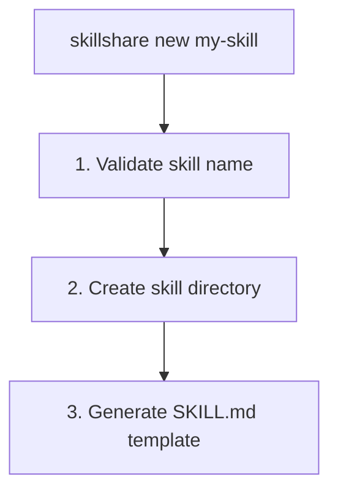

# new

SKILL.md のテンプレートを使って新しい Skill を作成します。

```bash
skillshare new <name>            # 新しい Skill を作成
skillshare new <name> -p         # project（.skillshare/skills/）に作成
skillshare new <name> --dry-run  # 作成せずにプレビュー
```

## 使うタイミング

- 推奨されるテンプレート構造でゼロから新しい Skill を作成する
- 正しい SKILL.md の形式（name、description、frontmatter）から始める

**実行内容:**


---

## オプション

| フラグ | 説明 |
|------|-------------|
| `--project`, `-p` | project（`.skillshare/skills/`）に作成 |
| `--global`, `-g` | global（`~/.config/skillshare/skills/`）に作成 |
| `--pattern`, `-P` | デザインパターンを使用（`tool-wrapper`、`generator`、`reviewer`、`inversion`、`pipeline`、`none`） |
| `--dry-run`, `-n` | ファイルを作成せずにプレビュー |
| `--help`, `-h` | ヘルプを表示 |

自動検出: カレントディレクトリに `.skillshare/config.yaml` が存在する場合、デフォルトで project mode になります。

---

## Skill 名のルール

- 小文字、数字、ハイフン、アンダースコア
- 文字またはアンダースコアで始まる必要がある
- 例: `my-skill`、`code_review`、`pdf-tools`

---

## テンプレート構造

生成される SKILL.md は [Anthropic の skill-building best practices](https://www.anthropic.com/engineering/building-skills-for-claude) に従います。

```markdown
---
name: my-skill
description: >-
  Describe what this skill does. Use when user asks to
  "trigger phrase 1", "trigger phrase 2", or needs help
  with a specific task.
# ── Optional fields ──────────────────────────────────
# license: MIT
# allowed-tools: "Bash(python:*) WebFetch"
# metadata:
#   author: Your Name
#   version: 1.0.0
---

# My Skill

Brief overview of what this skill does and its value.

## When to Use

Use this skill when the user:
- Asks to "specific trigger phrase"
- Mentions specific keywords or file types
- Needs help with a particular task

Do NOT use this skill for:
- Unrelated tasks (clarify scope boundaries)

## Instructions

### Step 1: Gather Context
### Step 2: Execute
### Step 3: Validate

## Examples

**Example:** Common scenario
User says: "Help me with <my-skill-related task>"

## Troubleshooting

**Error:** Common error message
**Cause:** Why it happens
**Solution:** How to fix it
```

### 主な設計上の選択

このテンプレートは Anthropic の [3 段階の progressive disclosure](https://www.anthropic.com/engineering/building-skills-for-claude) モデルに従っています。

| レベル | 内容 | 読み込まれるタイミング |
|-------|------|-------------|
| **1. Frontmatter** | `name` + `description` | 常に（システムプロンプト） |
| **2. SKILL.md 本文** | 完全な指示 | Skill が関連する場合 |
| **3. リンクされたファイル** | `references/`、`scripts/` | 必要に応じて |

**description には WHAT + WHEN を含める必要があります** — これは最も重要な単一のフィールドです。Claude はこれを使ってあなたの Skill を読み込むかどうかを判断します。悪い例: `"Helps with projects"`。良い例: `"Manages sprint planning. Use when user says 'plan sprint' or 'create tickets'."` さらに例を見るには [Anthropic のガイド](https://www.anthropic.com/engineering/building-skills-for-claude) を参照してください。

---

## 例

### シンプルな Skill を作成する

```bash
skillshare new code-review
```

出力:
```
New Skill Created
─────────────────────────────────────────────
✓ Created: ~/.config/skillshare/skills/code-review/SKILL.md

Next steps:
  1. Edit ~/.config/skillshare/skills/code-review/SKILL.md
  2. Run 'skillshare sync' to deploy
```

### project に作成する

```bash
skillshare new code-review -p
```

出力:
```
New Skill Created (project)
─────────────────────────────────────────────
✓ Created: .skillshare/skills/code-review/SKILL.md

Next steps:
  1. Edit .skillshare/skills/code-review/SKILL.md
  2. Run 'skillshare sync' to deploy
```

### 作成前にプレビューする

```bash
skillshare new my-skill --dry-run
```

出力:
```
New Skill (dry-run)
─────────────────────────────────────────────
→ Would create: ~/.config/skillshare/skills/my-skill
→ Would write: ~/.config/skillshare/skills/my-skill/SKILL.md

Template preview:
─────────────────────────────────────────────
---
name: my-skill
description: >-
  Describe what this skill does. Use when user asks to ...
---
...
```

---

## パターンテンプレート

`-P` を使うと、推奨されるディレクトリ構造を持つパターン固有のテンプレートを生成できます。

```bash
skillshare new my-reviewer -P reviewer     # Reviewer パターン
skillshare new my-pipeline -P pipeline     # references/, assets/, scripts/ を含む Pipeline
skillshare new my-skill                    # 選択用の対話式 TUI
```

利用可能なパターン:

| パターン | Scaffold されるディレクトリ |
|---------|---------------------|
| `tool-wrapper` | `references/` |
| `generator` | `assets/`、`references/` |
| `reviewer` | `references/` |
| `inversion` | `assets/` |
| `pipeline` | `references/`、`assets/`、`scripts/` |
| `none` | *(プレーンなテンプレート、ディレクトリなし)* |

各パターンの詳細は [Skill Design Patterns](/docs/understand/philosophy/skill-design-patterns) を参照してください。

---

## Web UI ウィザード

Web ダッシュボードから Skill を作成することもできます — ターミナルは不要です。

1. `skillshare ui` を実行する
2. **Skills** に移動し、**"+ New Skill"** をクリックする
3. ウィザードに従う:

| ステップ | 内容 |
|------|------|
| **Name** | リアルタイムバリデーション付きで Skill 名を入力 |
| **Pattern** | 6 つのデザインパターンから選択（カードグリッド） |
| **Category** | ドメインカテゴリを選択 — pattern が `none` の場合はスキップ |
| **Scaffold** | 推奨ディレクトリの作成を切り替え — pattern にディレクトリがない場合はスキップ |
| **Confirm** | 選択内容を確認して作成 |

ウィザードは現在のモードに従います — ダッシュボードが project mode（`-p`）で動作している場合、Skill は `.skillshare/skills/` に作成されます。

---

## 次のステップ

Skill を作成した後:

1. **SKILL.md を編集する** — まず `description` フィールド（WHAT + WHEN）に集中する
2. **指示を追加する** — 明確なアクションを持つステップ形式を使う
3. **targets に sync する** — `skillshare sync`
4. **トリガーをテストする** — AI CLI に関連する質問をして Skill が読み込まれるか確認する
5. **反復する** — 発火過多/過少に応じてトリガーフレーズを調整する

---

## 関連項目

- [install](/docs/reference/commands/install) — リポジトリから Skill をインストール
- [sync](/docs/reference/commands/sync) — Skill を targets に sync
- [Configuration](/docs/reference/targets/configuration) — 設定リファレンス
