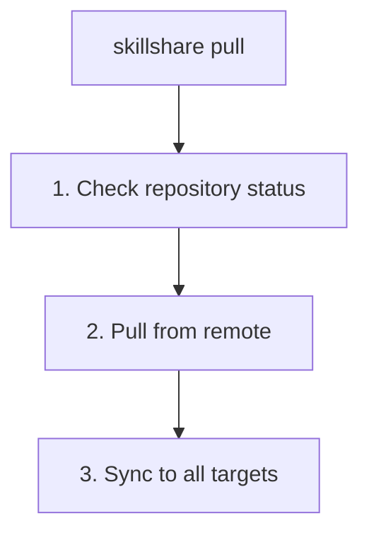

# pull

git remote から pull して、すべての Target に同期します。

```bash
skillshare pull              # pull して同期
skillshare pull --dry-run    # プレビュー
skillshare pull --force      # 初回 pull でローカルを remote で置き換える
```

## 使うタイミング

- 他のマシンから push された変更で Skill を同期する
- 他の人が更新を push した後、最新の Skill を取得する
- `init --remote` の後、新しいマシンで作業を開始する

## 実行される処理



## オプション

| フラグ | 説明 |
|------|-------------|
| `--dry-run, -n` | 変更を加えずにプレビュー |
| `--force, -f` | 初回 pull のコンフリクト時、ローカルの Skill を remote で置き換える |

## Git Root スコープ

`pull` は `git_root` 設定フィールド（デフォルト: `skills` source）で選択されたディレクトリに対して動作します。スコープの一覧は [commit — Git Root スコープ](./commit.md#git-root-scope) を参照してください。`git_root` が変更されたものの、git リポジトリが別のスコープのディレクトリにまだ存在している場合、`pull` は修正に必要な正確な `git init` / `mv` コマンドとともに「Git root mismatch」エラーを表示します。[init 後にスコープを変更する](/docs/reference/targets/configuration#git-root) も参照してください。

pull 後、`pull` はそのスコープが保持するものを同期します。`skills` は `sync` を実行し、`agents` は `sync agents` を実行し、`root` は両方を実行し、`extras` は `sync extras` を実行します。

## 前提条件

Source ディレクトリは remote を持つ git リポジトリである必要があります。

```bash
# 準備できているか確認:
skillshare status
# 表示: Git: initialized with remote
```

## ローカル変更の警告

コミットされていない変更がある場合、`pull` は失敗します。

```bash
$ skillshare pull
Local changes detected
  Run: skillshare push
  Or:  cd ~/.config/skillshare/skills && git stash
```

解決策:
```bash
# オプション 1: push せずにまずローカルでコミットする
skillshare commit -m "Local changes"
skillshare pull

# オプション 2: まず変更を push する
skillshare push
skillshare pull

# オプション 3: 変更を stash する
cd ~/.config/skillshare/skills
git stash
skillshare pull
git stash pop
```

## 既存の Skill がある状態での初回 pull

初回の pull 時（まだアップストリームがない場合）、ローカルと remote の両方に既に Skill ディレクトリが含まれている場合、
`pull` は両方を統合するために **merge** を試みます。merge が成功すると、ローカルと remote 両方の Skill が保持されます。

**merge コンフリクト** がある場合、`pull` はゼロ以外の終了コードで失敗します。

```bash
$ skillshare pull
Pull failed
  Resolve manually: cd ~/.config/skillshare/skills && git merge --allow-unrelated-histories <remote branch>
  Or force-pull: skillshare pull --force  (replaces local with remote)
```

解決方法:

```bash
# コンフリクトを手動で解決してから push する
cd ~/.config/skillshare/skills
git add . && git commit
skillshare push

# またはローカルを破棄して remote を採用する
skillshare pull --force
```

## 例

```bash
# 標準的な pull（最も一般的）
skillshare pull

# 何が起こるかをプレビュー
skillshare pull --dry-run

# 初回 pull のコンフリクト時にローカルを remote で置き換える
skillshare pull --force
```

## ワークフロー

2 台目のマシンでの典型的なワークフロー:

```bash
# 一日の始め: 最新の Skill を取得する
skillshare pull

# ... AI ツールで作業する ...

# 一日の終わり: 新しい Skill を共有する
skillshare collect claude    # 新しい Skill を作成した場合
skillshare push -m "Add new skill"
```

## 関連項目

- [commit](/docs/reference/commands/commit) — push せずにローカルでコミット
- [push](/docs/reference/commands/push) — remote へ push
- [sync](/docs/reference/commands/sync) — pull なしで手動同期
- [Cross-Machine Sync](/docs/how-to/sharing/cross-machine-sync) — 完全なセットアップ手順
