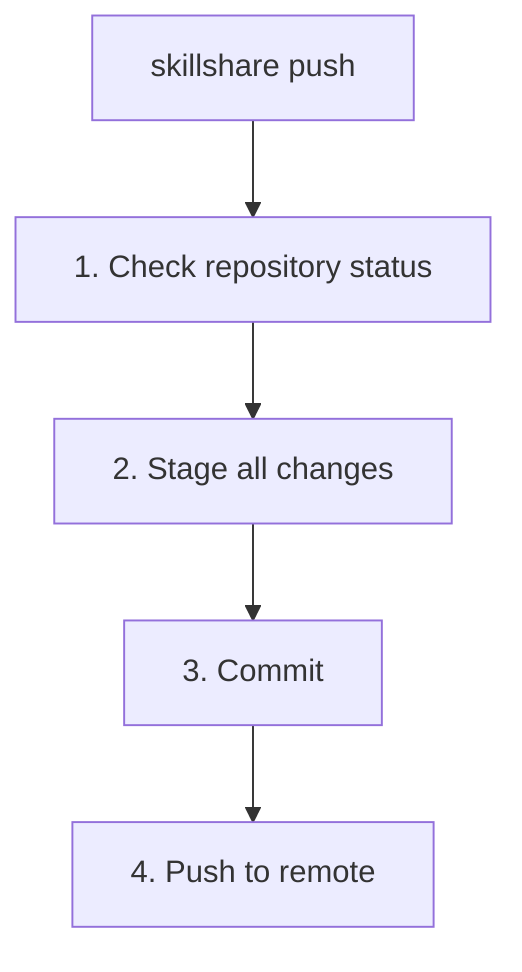

# push

Source を git remote にコミットしてプッシュします。

プッシュせずにローカルのチェックポイントだけを作りたい場合は、代わりに [`commit`](./commit.md) を使ってください。

```bash
skillshare push                  # 自動生成メッセージ
skillshare push -m "Add pdf"     # カスタムメッセージ
skillshare push --dry-run        # プレビュー
```

## 使うタイミング

- git 経由で Skill の変更を他のマシンと共有する
- Skill をリモートリポジトリにバックアップする
- Skill を編集した後、コミットとプッシュを 1 コマンドで行う

まだ共有せずにローカルのチェックポイントだけを保存したい場合は、[`skillshare commit`](./commit.md) を使ってください。

## 実行される処理



## オプション

| フラグ | 説明 |
|------|-------------|
| `-m, --message <msg>` | コミットメッセージ（デフォルト: "Update skills"） |
| `--dry-run, -n` | 変更を加えずにプレビュー |

## Git Root スコープ

`push` は `git_root` 設定フィールド（デフォルト: `skills` source）で選択されたディレクトリに対して動作します。スコープの一覧は [commit — Git Root スコープ](./commit.md#git-root-scope) を参照してください。`git_root` が変更されたものの、git リポジトリが別のスコープのディレクトリにまだ存在している場合、`push` は修正に必要な正確な `git init` / `mv` コマンドとともに「Git root mismatch」エラーを表示します。[init 後にスコープを変更する](/docs/reference/targets/configuration#git-root) も参照してください。

## 前提条件

Source ディレクトリは remote を持つ git リポジトリである必要があります。

```bash
# init 時に設定する（推奨）:
skillshare init --remote git@github.com:you/my-skills.git

# または既存のセットアップに remote を追加する:
skillshare init --remote git@github.com:you/my-skills.git
```

init は最初のコミットを自動的に作成するため、セットアップ直後から `push` が動作します。

## 初回プッシュのアップストリームマッピング

初回のプッシュ時（アップストリームの追跡がまだない場合）、`skillshare push` はアップストリームを自動設定します。

- remote に既定のブランチ（例えば `main` や `trunk`）が既に存在する場合、ローカルの変更はその remote の既定ブランチにプッシュされます。
- remote が空の場合、現在のローカルブランチにプッシュされます。

これにより、誤って間違った remote ブランチを作成してしまう（例えばリモートは `main` を使っているのにローカルは `master` を使っている、など）ことを防ぎます。

## 例

```bash
# 自動メッセージでのクイックプッシュ
skillshare push

# カスタムコミットメッセージ
skillshare push -m "Add commit-commands skill"

# プッシュされる内容をプレビュー
skillshare push --dry-run
```

## コンフリクトへの対応

remote により新しいコミットがある場合:

```bash
$ skillshare push
Push failed
  Remote may have newer changes
  Run: skillshare pull
  Then: skillshare push
```

解決方法:
```bash
skillshare pull    # remote の変更を取得
skillshare push    # 自分の変更をプッシュ
```

## ワークフロー

Skill を共有する際の典型的なワークフロー:

```bash
# 1. Skill を変更する
# 2. remote にプッシュする
skillshare push -m "Update my-skill"

# 別のマシンで:
skillshare pull    # 変更を取得して同期
```

## 関連項目

- [commit](/docs/reference/commands/commit) — プッシュせずにローカルでコミット
- [pull](/docs/reference/commands/pull) — remote からプル
- [sync](/docs/reference/commands/sync) — ローカルの Target へ同期
- [Cross-Machine Sync](/docs/how-to/sharing/cross-machine-sync) — 完全なセットアップ手順
