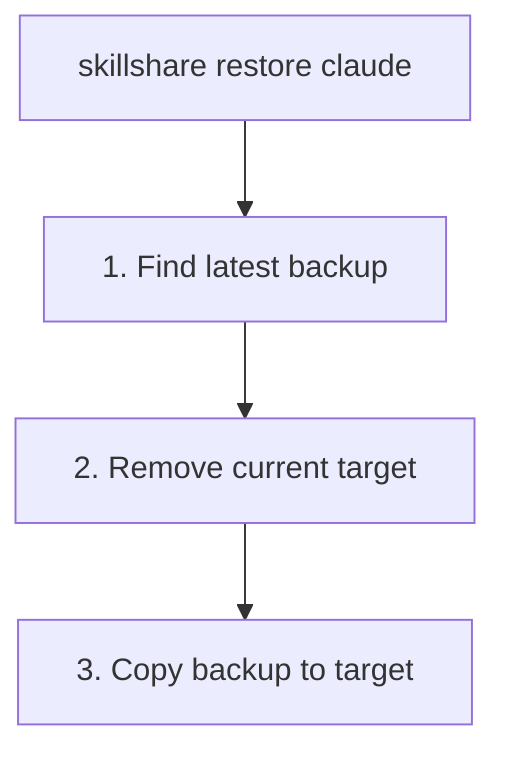

# restore

バックアップから target を復元します。

```bash
skillshare restore                                     # 対話式 TUI（参照 + 復元）
skillshare restore claude                              # 最新のバックアップ
skillshare restore claude --from 2026-01-19_10-00-00   # 特定のバックアップ
skillshare restore claude --dry-run                    # プレビュー
```

## 使うタイミング

- sync が失敗し、target を以前の状態に戻す必要がある
- 誤って target から Skill を削除してしまった
- バックアップバージョンを対話的に参照し、現在の状態と比較する

## 対話式 TUI

TTY 上で `skillshare restore`（引数なし）を実行すると、統合された restore TUI が起動します。

1. **Source picker** — "Backup Restore" と "Trash Restore" のどちらかを選択
2. **Backup Restore** — target を選択し、詳細パネル付きでバックアップバージョンを参照:
   - バックアップの日付、サイズ、Skill 数
   - 現在の target との差分（追加/削除された Skill）
   - 個別のファイル一覧
3. **Trash Restore** — trash TUI を開いて削除された Skill を復元

### キーバインド

| キー | 動作 |
|-----|--------|
| `↑`/`↓` | targets / versions を移動 |
| `Enter` | target を選択 / version を復元 |
| `/` | targets を絞り込み |
| `d` | バックアップバージョンを削除 |
| `Ctrl+d`/`Ctrl+u` | 詳細パネルをスクロール |
| `Esc` | 戻る |
| `q`/`Ctrl+C` | 終了 |

`--no-tui` を使うと TUI をスキップし、代わりにプレーンなバックアップ一覧を表示します。

## 実行内容



## オプション

| フラグ | 説明 |
|------|-------------|
| `--all` | skills と agents の両方を復元 |
| `--project, -p` | project mode を使用（`.skillshare/backups/`）；**agents のみ** |
| `--global, -g` | global mode を使用（skills のデフォルト） |
| `--from, -f <timestamp>` | 特定のバックアップから復元 |
| `--force` | 確認なしで上書き |
| `--dry-run, -n` | 変更を加えずにプレビュー |
| `--no-tui` | 対話式 TUI をスキップし、バックアップ一覧を表示 |

`restore` は位置引数として kind も受け付けます: `skillshare restore agents claude` は `claude` target の agent バックアップを復元します。

## バックアップを探す

利用可能なバックアップを一覧表示します。

```bash
skillshare backup --list
```

```
All backups (15.3 MB total)
  2026-01-20_15-30-00  claude, cursor     4.2 MB
  2026-01-19_10-00-00  claude             2.1 MB
  2026-01-18_09-00-00  claude, cursor     4.0 MB
```

## 例

```bash
# 最新のバックアップから復元
skillshare restore claude

# 特定のバックアップから復元
skillshare restore claude --from 2026-01-19_10-00-00

# 復元をプレビュー
skillshare restore claude --dry-run

# 強制復元（確認をスキップ）
skillshare restore claude --force
```

## 復元後

`restore` は target ディレクトリをスナップショットの内容で置き換えます。バックアップはローカルのコンテンツのみをキャプチャするため — シンボリックリンクされた Skill は除外されます。詳細は [What Gets Backed Up](/docs/reference/commands/backup#what-gets-backed-up) を参照してください — sync された Skill を戻すには、その後に `sync` を実行してください。

```bash
skillshare restore claude    # バックアップからローカルコンテンツを復元
skillshare sync              # sync された Skill のシンボリックリンクを再作成
```

復元されたコンテンツは通常のファイルであり、シンボリックリンクではありません。target がローカルの Skill しか保持していなかった場合は、restore だけで十分です。

## ユースケース

### 誤削除

Skill を誤って削除してしまった場合:

```bash
skillshare restore claude --from 2026-01-19_10-00-00
```

### 変更を元に戻す

sync が失敗した場合:

```bash
skillshare restore claude  # sync 前の状態に戻す
```

### テスト

古い Skill バージョンをテストするために復元します。

```bash
skillshare restore claude --from 2026-01-15_10-00-00
# 古い skills をテスト...
skillshare sync  # 現在の状態に戻す
```

### Agent の復元

Agent の restore は skill の restore と同様に動作しますが、`backup agents`（および `sync agents` の前に実行される自動バックアップ）によって作成された並行する `<target>-agents` バックアップエントリに対して操作します。

```bash
skillshare restore agents claude                       # claude の最新 agent バックアップ
skillshare restore agents claude --from 2026-01-19_10-00-00
skillshare restore agents -p                           # Project agents（許可されている唯一の project mode）
skillshare restore --all claude                        # skills + agents を一度に
```

project mode では、restore は backup と同様に agents のみを操作します。`agents` 引数がない場合はエラーになります。

```
restore is not supported in project mode (except for agents)
```

`skillshare backup --list` でバックアップを一覧表示する際、agent バックアップは `-agents` サフィックス（例: `claude-agents`）付きの別エントリとして表示されます。

## 関連項目

- [backup](/docs/reference/commands/backup) — バックアップの作成と管理
- [sync](/docs/reference/commands/sync) — 復元後に再 sync
- [Agents](/docs/understand/agents) — Agent リソースモデル
