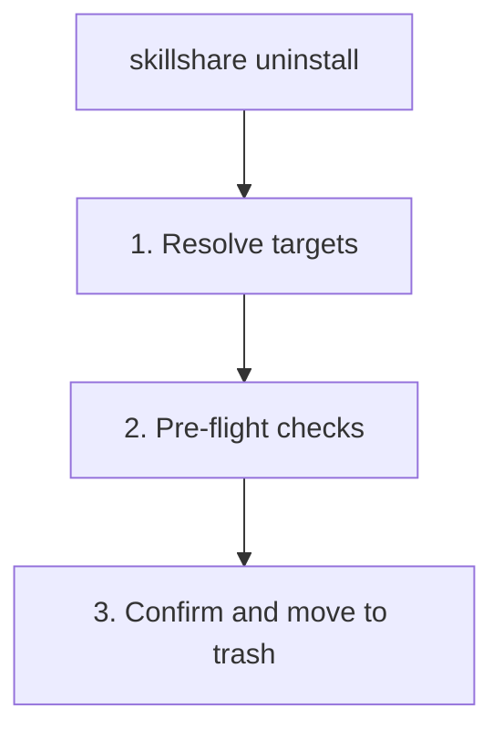

# uninstall

source ディレクトリから 1 つ以上の skill または tracked repository を削除します。Skill は trash に移動され、自動クリーンアップまで 7 日間保持されます。

```bash
skillshare uninstall my-skill              # 単一の skill を削除
skillshare uninstall a b c --force         # 複数の skill を一度に削除
skillshare uninstall --all                 # すべての skill を削除
skillshare uninstall --group frontend      # グループ内のすべての skill を削除
skillshare uninstall team-repo             # tracked repository を削除（_ prefix は省略可能）
```

## 使うタイミング

- 不要になった skill を削除する（7 日間 trash に移動される）
- 使わなくなった tracked repository を整理する
- skill のグループ全体を一度にバッチ削除する
- `--all` で**すべて**の skill を一度に削除する


## 実行内容



## オプション

| フラグ | 説明 |
|------|-------------|
| `--all` | source から**すべての** skill を削除（確認が必要） |
| `--group, -G <name>` | グループ内のすべての skill を削除（前方一致、繰り返し指定可） |
| `--force, -f` | 確認をスキップし、未コミットの変更を無視 |
| `--dry-run, -n` | 変更を加えずにプレビュー |
| `--project, -p` | カレントディレクトリの project レベルの config を使用 |
| `--global, -g` | global config を使用（`~/.config/skillshare`） |
| `--json` | global mode: JSON を出力し確認をスキップ；未コミットの変更がある tracked repositories には引き続き `--force` が必要 |
| `--help, -h` | ヘルプを表示 |

## JSON 出力

```bash
skillshare uninstall my-skill another-skill --json
```

```json
{
  "removed": ["my-skill", "another-skill"],
  "failed": [],
  "skipped": 0,
  "dry_run": false,
  "duration": "0.089s"
}
```

`--dry-run` と組み合わせてプレビューできます。

```bash
skillshare uninstall --all --json --dry-run
```

## 複数の Skill

複数の skill を 1 コマンドで削除します。

```bash
skillshare uninstall alpha beta gamma --force
```

一部の skill が見つからない場合、コマンドは**警告を出してそれらをスキップ**し、残りの削除を続行します。失敗するのは、指定したすべての skill が無効な場合のみです。

### Glob パターン

skill 名は、バッチ削除のために glob パターン（`*`、`?`、`[...]`）をサポートします。

```bash
skillshare uninstall "core-*"              # core-* に一致するすべての skill を削除
skillshare uninstall "test-?" --force      # 1 文字ワイルドカード
skillshare uninstall "core-*" "util-*"     # 複数のパターン
```

Glob マッチングは大文字・小文字を区別しません: `"Core-*"` は `core-auth`、`CORE-DB` などに一致します。

:::note トップレベルのマッチングのみ
Glob パターンは source フォルダ内の**トップレベルのディレクトリ名**に対してマッチします。ネストされた skill（例: `frontend/react-hooks`）は `"react-*"` にマッチしません — サブディレクトリ内の skill を対象にするには `--group frontend` を使ってください。
:::

## すべて削除

`--all` を使うと、source ディレクトリからすべての skill を一度に削除できます。

```bash
skillshare uninstall --all                 # 対話式の確認
skillshare uninstall --all --force         # 確認をスキップ
skillshare uninstall --all -n              # 削除対象をプレビュー
```

`--all` は skill 名や `--group` と組み合わせることはできません。

:::tip シェルの Glob 保護
`skillshare uninstall *` を引用符なしで実行すると、シェルがカレントディレクトリのファイル名に `*` を展開してしまいます。skillshare はこれを検知し、代わりに `--all` を使うことを提案します。ワイルドカードは常に引用符で囲む（`"*"`）か、`--all` を使ってください。
:::

## グループ削除

サブ skill を含むディレクトリを uninstall すると、skillshare はそれを自動的に**グループ**として検知し、確認を求める前に含まれる skill を一覧表示します。

```
Uninstalling group (5 skills)
─────────────────────────────────────────
  - feature-radar
  - feature-radar-archive
  - feature-radar-learn
  - feature-radar-ref
  - feature-radar-scan
→ Name: feature-radar
→ Path: ~/.config/skillshare/skills/feature-radar

Are you sure you want to uninstall this group? [y/N]:
```

`--group` フラグは、**前方一致**を使ってディレクトリ配下のすべての skill を削除します。

```bash
# frontend/ 配下のすべての skill を削除
skillshare uninstall --group frontend

# ネストされた skill も削除: frontend/react/hooks, frontend/vue/composables
skillshare uninstall --group frontend --force

# 削除対象をプレビュー
skillshare uninstall --group frontend --dry-run
```

グループ削除が適用される場合（自動検出されたディレクトリグループを含む）、削除された各メンバーは config（`~/.config/skillshare/config.yaml` または project mode の `.skillshare/config.yaml`）内の管理対象 `skills:` リストからも削除されます。

位置引数の名前と `--group` を組み合わせることができ、`-G` を複数回使うこともできます。

```bash
# 名前とグループを混在させる
skillshare uninstall standalone-skill -G frontend -G backend --force

# 重複は自動的に排除される
skillshare uninstall frontend/hooks -G frontend --force  # hooks は 1 回だけ削除される
```

## トラック対象リポジトリ

tracked repositories（`_` で始まるフォルダ）の場合:

- 未コミットの変更を確認します（上書きするには `--force` を使用）
- `.gitignore` からエントリを自動的に削除します
- uninstall 時に `_` prefix は省略可能です

```bash
skillshare uninstall _team-skills        # prefix 付き
skillshare uninstall team-skills         # prefix なし（自動検出）
skillshare uninstall _team-skills --force # 未コミットの変更があっても強制削除
```

## 例

```bash
# 単一の skill を削除
skillshare uninstall my-skill

# 複数の skill を削除
skillshare uninstall skill-a skill-b skill-c --force

# すべての skill を削除
skillshare uninstall --all
skillshare uninstall --all --force
skillshare uninstall --all -n              # プレビュー

# グループで削除
skillshare uninstall --group frontend --force

# 削除をプレビュー
skillshare uninstall my-skill --dry-run
skillshare uninstall --group frontend -n

# tracked repository を削除
skillshare uninstall team-repo

# 名前とグループを混在させる
skillshare uninstall my-skill -G frontend --force
```

## 安全性

uninstall された skill は完全に削除されるのではなく、**trash に移動**されます。

- **場所:** `~/.local/share/skillshare/trash/`（global）または `.skillshare/trash/`（project）
- **保持期間:** 7 日間、その後自動的にクリーンアップされる
- **再インストールのヒント:** skill がリモート source からインストールされたものである場合、再インストールコマンドが表示される
- **復元:** trash から復元するには `skillshare trash restore <name>` を使用

単一 skill（詳細表示）:

```
✓ Uninstalled skill: my-skill
ℹ Moved to trash (7 days): ~/.local/share/skillshare/trash/my-skill_2026-01-20_15-30-00
ℹ Reinstall: skillshare install github.com/user/repo/my-skill
```

複数 skill（バッチ）:

```
✓ Uninstalled 4 skill(s) (0.1s)

── Removed ─────────────────────────────
✓ pdf        skill
✓ tdd        skill
✓ security   group, 2 skills
✗ bad-skill  failed to move to trash: ...

── Next Steps ──────────────────────────
ℹ Moved to trash (7 days).
ℹ Run 'skillshare sync' to update all targets
```

大規模なバッチでは、簡略化されたフォーマットが使われます。

```
✓ Uninstalled 920, failed 2 (1.2s)

── Failed ──────────────────────────────
✗ bad-a  failed to move to trash: permission denied
✗ bad-b  failed to move to trash: permission denied

── Removed ─────────────────────────────
✓ 920 uninstalled

── Next Steps ──────────────────────────
ℹ Moved to trash (7 days).
ℹ Run 'skillshare sync' to update all targets
```

誤って uninstall した skill を復元するには:

```bash
skillshare trash list                  # trash の内容を確認
skillshare trash restore my-skill      # source に復元
skillshare sync                        # targets に sync し直す
```

## Uninstall 後

`skillshare sync` を実行して、すべての targets から skill を削除します。

```bash
skillshare uninstall old-skill
skillshare sync  # Claude、Cursor などから削除
```

## Project Mode

project の `.skillshare/skills/` から skill または tracked repos を uninstall します。

```bash
skillshare uninstall my-skill -p                  # skill を削除
skillshare uninstall a b c -p -f                  # 複数の skill を削除
skillshare uninstall --all -p -f                   # すべての project skill を削除
skillshare uninstall --group frontend -p -f        # グループを削除
skillshare uninstall team-skills -p                # tracked repo（_ prefix は省略可能）
```

project mode では、uninstall は以下を行います:
- skill ディレクトリを `.skillshare/trash/` に移動（7 日間保持）
- `.skillshare/config.yaml` の `skills:` リストから skill のエントリを削除（remote skill の場合）
- `.skillshare/.gitignore` からエントリを削除（remote/tracked skill の場合）
- `.skillshare/skills.lock.json` から skill の固定を削除（グループの場合は、その配下のすべての固定）
- tracked repos の場合: 未コミットの変更を確認（上書きするには `--force` を使用）
- `_` prefix は省略可能 — 自動検出される

```bash
skillshare uninstall pdf -p
skillshare sync
git add .skillshare/ && git commit -m "Remove pdf skill"
```

## Agent サポート

skill の代わりに agents を uninstall するには `--kind agent` を使用します。

```bash
skillshare uninstall --kind agent tutor              # agent を削除
skillshare uninstall --kind agent tutor reviewer -f   # 複数の agent を削除
skillshare uninstall --kind agent --all               # すべての agent を削除
```

Agent の uninstall は skill と同じ trash-and-retain の挙動に従います（trash に移動され、7 日間保持）。背景情報は [Agents](/docs/understand/agents) を参照してください。

## 関連項目

- [install](/docs/reference/commands/install) — Skill をインストール
- [list](/docs/reference/commands/list) — インストール済みの skill を一覧表示
- [trash](/docs/reference/commands/trash) — trash に入った skill を管理
- [Project Skills](/docs/understand/project-skills) — Project mode の概念
- [Agents](/docs/understand/agents) — Agent の概念
