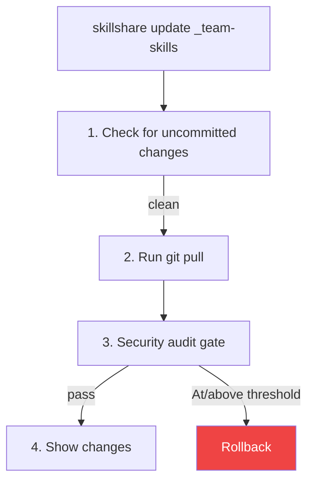
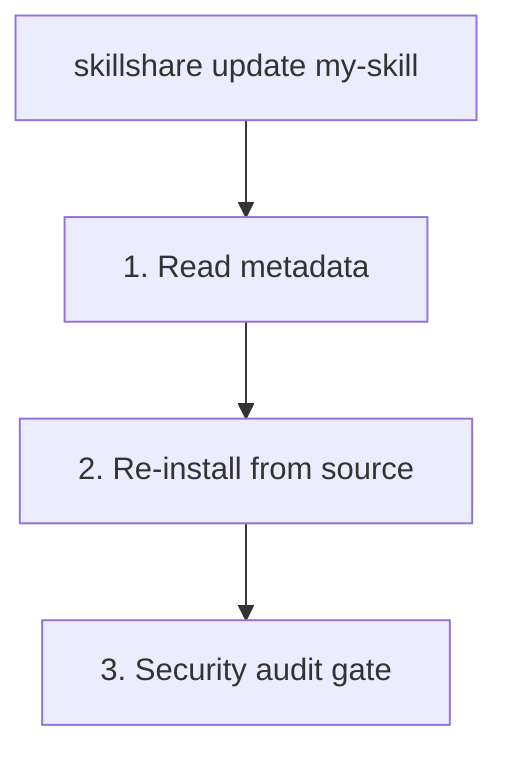

# update

1 つ以上の skill または tracked repositories を最新バージョンに更新します。

```bash
skillshare update my-skill           # 単一の skill を更新
skillshare update a b c              # 複数を一度に更新
skillshare update --group frontend   # グループ内のすべての skill を更新
skillshare update team-skills        # tracked repo を更新
skillshare update --all              # すべてを更新
skillshare update agents --all       # すべての tracked/updatable agent を更新
```

## 使うタイミング

- tracked repository に新しいコミットがある（`check` で発見）
- インストール済みの skill に新しいバージョンが利用可能
- 元の source から skill を再ダウンロードしたい


## 実行内容

### トラック対象リポジトリの場合



### 通常の Skill の場合



## オプション

| フラグ | 説明 |
|------|-------------|
| `--all, -a` | すべての tracked repos/skills を更新、または `update agents --all` として使う場合はすべての agents を更新 |
| `--group, -G <name>` | グループ内の更新可能なすべての skill、または agent サブディレクトリ内のすべての agent を更新 |
| `--force, -f` | ローカルの変更を破棄し、audit の検出結果があっても続行 |
| `--dry-run, -n` | 変更を加えずにプレビュー |
| `--skip-audit` | 更新後の security audit gate をスキップ |
| `--audit-threshold <t>`, `--threshold <t>`, `-T <t>` | update の audit ブロックしきい値を上書き（`critical|high|medium|low|info`；省略形: `c|h|m|l|i`、加えて `crit`、`med`） |
| `--diff` | skill/repo 更新後にファイルレベルの変更サマリーを表示 |
| `--audit-verbose` | batch mode で skill ごとの詳細な audit 検出結果を表示 |
| `--prune` | 古い skill（upstream で削除済み）を警告ではなく削除 |
| `--project, -p` | カレントディレクトリの project レベルの config を使用 |
| `--global, -g` | global config を使用（`~/.config/skillshare`） |
| `--json` | JSON として出力 |
| `--help, -h` | ヘルプを表示 |

`update agents` は以下をサポートします: `--all`、`--group`、`--force`、`--dry-run`、`--skip-audit`、`--audit-threshold` / `--threshold` / `-T`、`--json`、加えて `--project` / `--global`。`--diff`、`--audit-verbose`、`--prune` は**サポートされません**。

## JSON 出力

```bash
skillshare update --all --json
```

```json
{
  "updated": 3,
  "skipped": 1,
  "security_failed": 0,
  "pruned": 0,
  "dry_run": false,
  "duration": "4.567s",
  "items": [
    {"name": "_team-skills", "type": "repo", "status": "updated"},
    {"name": "my-skill", "type": "skill", "status": "updated"},
    {"name": "another-skill", "type": "skill", "status": "updated"},
    {"name": "local-only", "type": "skill", "status": "skipped"}
  ]
}
```

取りうる `status` の値: `updated`、`skipped`、`failed`、`security_blocked`。項目が失敗した場合、`error` フィールドが含まれます。

tracked repos が metadata に宣言されているがディスク上に存在しない場合、それぞれがスキップされた `repo` 項目として簡潔な `error`（`clone directory absent`）と共に報告され、集計された `missing_tracked_repos` サマリーに名前と再水和（rehydration）のヒントがまとめて含まれます。

```json
{
  "updated": 0,
  "skipped": 1,
  "items": [
    {"name": "_team-skills", "type": "repo", "status": "skipped", "error": "clone directory absent"}
  ],
  "missing_tracked_repos": {
    "names": ["_team-skills"],
    "hint": "Run 'skillshare install' to rehydrate tracked repositories"
  }
}
```

`missing_tracked_repos` フィールドは、欠落している tracked repos がない場合は省略されます。

### Agent の JSON 出力

```bash
skillshare update agents --all --json
```

```json
{
  "agents": [
    {"name": "reviewer", "status": "updated", "source": "github.com/user/agents/reviewer.md"},
    {"name": "team/tutor", "status": "up_to_date", "source": "github.com/user/agents/team/tutor.md"}
  ],
  "dry_run": false,
  "duration": "1.234s"
}
```

取りうる agent の `status` の値には `updated`、`failed`、`skipped`、`up_to_date`、`update_available`、`dirty`、`drifted`、`local` が含まれます。

## Agents の更新

スタンドアロンの `.md` agents のみを更新したい場合は `agents` kind セレクターを使います。

```bash
skillshare update agents reviewer
skillshare update agents --group team
skillshare update agents --all -T high
skillshare update agents --all --json
```

Agent の更新は skills と同じ audit gate に従います:

- tracked agent repos は `git pull` を実行し、その後更新されたリポジトリを audit する
- metadata で紐づけられた単一ファイルの agents は source から再インストールし、staged された `.md` を audit し、成功した場合のみローカルファイルを置き換える

## 複数更新

複数の skill を一度に更新します。

```bash
skillshare update skill-a skill-b skill-c
```

更新可能な skill（tracked repos または metadata を持つ skill）のみが処理されます。見つからない skill は警告されますが失敗にはなりません。ただし、いずれかの skill が **security audit gate によってブロック**された場合、バッチコマンドは非ゼロのコードで終了します。

### Glob パターン

skill 名は、バッチ操作のために glob パターン（`*`、`?`、`[...]`）をサポートします。

```bash
skillshare update "core-*"              # core-* に一致するすべての skill を更新
skillshare update "_team-?"             # 1 文字ワイルドカード
skillshare update "core-*" "util-*"     # 複数のパターン
```

Glob パターンは、各 skill または tracked repo の**basename**（パスの最後の要素）に対してマッチします。例えば、`"react-*"` は basename が `react-hooks` であるため `frontend/react-hooks` にマッチします。

Glob マッチングは大文字・小文字を区別しません: `"Core-*"` は `core-auth`、`CORE-DB` などに一致します。

:::tip シェルの Glob 保護
シェルがカレントディレクトリのファイル名に `*` を展開してしまうのを防ぐため、glob パターンは常に引用符で囲んでください（`"core-*"`）。
:::

## グループの更新

グループディレクトリ内の更新可能なすべての skill を更新します。

```bash
skillshare update --group frontend        # frontend/ 内のすべてを更新
skillshare update -G frontend -G backend  # 複数のグループ
skillshare update x -G backend            # 名前とグループを混在
```

グループ内の（metadata や `.git` を持たない）ローカル skill は黙ってスキップされます。

グループディレクトリに一致する位置引数（repo でも skill でもない）は自動的に展開されます。

```bash
skillshare update frontend   # --group frontend と同じ
# ℹ 'frontend' is a group — expanding to 3 updatable skill(s)
```

:::note
`--all` は skill 名や `--group` と組み合わせることはできません。
:::

## すべて更新

すべてを一度に更新します。

```bash
skillshare update --all
```

これにより以下が更新されます:
1. すべての tracked repositories（git pull）
2. source metadata を持つすべての skill（再インストール）

### 出力例

```
Updating 2 tracked repos + 3 skills

[1/5] ✓ _team-skills       Already up to date
[2/5] ✓ _personal-repo     3 commits, 2 files
[3/5] ✓ my-skill           Reinstalled from source
→ risk: LOW (12/100)
[4/5] ! other-skill        has uncommitted changes (use --force)
[5/5] ✓ another-skill      Reinstalled from source

── Summary ─────────────────────────────
  Total:    5
  Updated:  4
  Skipped:  1
```

### 欠落しているトラック対象リポジトリ

`.metadata.json` が tracked repo（`tracked: true`）を宣言しているが、そのクローンディレクトリがディスク上に存在しない場合 — クローンディレクトリは管理された `.gitignore` ブロック内にあるため、新しいマシンでよく発生します — `update --all` はもはや黙ってスキップしません。欠落している各リポジトリを報告し、再水和（rehydrate）の方法を案内します。

```
! 1 tracked repo(s) declared in metadata but missing on disk:
  ! _team-skills         clone directory absent
→ Run 'skillshare install' to rehydrate tracked repositories
```

これは global mode と project mode（`-p`）の両方に適用されます。metadata からクローンを再作成するには、引数なしの [install](/docs/reference/commands/install) を実行してください（[Rehydrating After a Fresh Clone](/docs/understand/tracked-repositories#rehydrating-after-a-fresh-clone) を参照）。

## 古い Skill のクリーンアップ（`--prune`）

upstream リポジトリが skill をリネームまたは削除すると、`update` はそれを**stale（古い）**として検知し、警告します。

```
⚠ 1 skill(s) no longer found in upstream repository:
  ⚠ frontend/old-skill — stale (deleted upstream)
ℹ Run with --prune to remove stale skills
```

`--prune` を追加すると、stale な skill を自動的に削除します（完全に削除されるのではなく trash に移動されます）。

```bash
skillshare update --all --prune
```

`check` も stale な skill を報告します。

```bash
skillshare check --all
# ⚠ 1 skill(s) stale (deleted upstream) — run 'skillshare update --all --prune' to remove
```

:::note
tracked repositories（`_repo`）は `--prune` の影響を受けません。tracked repo が内部で skill を削除した場合、`sync` は `PruneOrphanLinks` を通じて orphan なシンボリックリンクを自動的にクリーンアップします。
:::

## セキュリティ Audit ゲート {#security-audit-gate}

skill を更新した後、`update` は自動的に security audit を実行します。

- **Tracked repos（`git pull`）** は有効なしきい値（`audit.block_threshold`、デフォルト `CRITICAL`）での post-pull gate を使用します
- **通常の skill（再インストールパス）** は同じしきい値ポリシーを使用します
- どの更新タイプでも、確認用に risk のラベル/スコアが表示されます

```
→ risk: LOW (12/100)
```

### 対話モード（TTY、tracked repos）

有効なしきい値以上の検出結果がある場合、決定を求められます。

```
  [HIGH] Source repository link detected — may be used for supply-chain redirects (SKILL.md:5)

  Security findings at or above active threshold detected.
  Apply anyway? [y/N]:
```

- **`y`** — 検出結果があっても更新を受け入れる
- **`N`**（デフォルト） — pull 前の状態にロールバックする

### 非対話モード（CI/CD）

非対話環境では、更新は自動的にロールバックされ、コマンドは非ゼロのコードで終了します。これにより CI パイプラインでの fail-closed な挙動が保証されます。

```bash
# source を信頼している場合は audit gate をバイパスする
skillshare update --all --skip-audit
```

:::caution
`--skip-audit` は更新後の security scan を完全に無効化します。source を信頼している場合、または外部の audit プロセスがある場合にのみ使用してください。
:::

### 承認済みの検出結果 {#accepted-findings}

`--force`（またはプロンプトで `y` と回答）で gate を上書きすると、受け入れた検出結果は `.metadata.json` の `audit_accepted` に記録されます。同じ skill の以降の更新では、それらの正確な検出結果ではブロックされなくなるため、`update --all` のたびに `--force` を繰り返す必要はありません。

```
ℹ 1 previously accepted finding(s) skipped
```

検出結果は行番号ではなく、rule・ファイル・一致したテキストによって照合されます。そのため、無関係な内容が変わっても受け入れ状態が維持されます。新しい検出結果、または同じ rule が異なるテキストに一致した場合は、再びブロックされます。これは、攻撃文字列を例として正当に引用する skill（security scanner や red-team のドキュメントなど）に適しており、それでいて後のバージョンで新しいペイロードを検知できます。

コマンドごとにしきい値を `--audit-threshold`、`--threshold`、または `-T` で上書きできます。

```bash
skillshare update _team-skills --threshold high
skillshare update --all -T h
```

## ファイル変更サマリー（`--diff`）

`--diff` を使うと、各更新後にファイルレベルの変更サマリーを確認できます。

```bash
skillshare update team-skills --diff
skillshare update --all --diff
```

**tracked repositories** の場合、diff は `git diff` を使用し、行レベルの統計情報を含みます。

```
┌─ Files Changed ─────────────────────────────┐
│                                             │
│  ~ SKILL.md (+12 -3)                        │
│  + scripts/deploy.sh (+45 -0)               │
│  - old-helper.sh (+0 -22)                   │
│  ~ utils/format.md (+5 -2)                  │
│                                             │
└─────────────────────────────────────────────┘
```

**通常の skill**（リモート source からインストールされたもの）の場合、diff は再インストールの前後でファイルハッシュを比較します。

```
┌─ Files Changed ─────────────────────────────┐
│                                             │
│  ~ SKILL.md                                 │
│  + new-helper.sh                            │
│                                             │
└─────────────────────────────────────────────┘
```

マーカー: `+` 追加、`-` 削除、`~` 変更。最大 20 ファイルまで表示され、それ以上は "... and N more file(s)" とまとめられます。

## コンフリクトの処理

tracked repo に未コミットの変更がある場合:

```bash
# オプション 1: まず変更をコミットする
cd ~/.config/skillshare/skills/_team-skills
git add . && git commit -m "My changes"
skillshare update _team-skills

# オプション 2: 破棄して強制更新する
skillshare update _team-skills --force
```

## 更新後

`skillshare sync` を実行して、すべての targets に変更を反映します。

```bash
skillshare update --all --diff   # ファイルレベルの変更サマリー付きで更新
skillshare sync
```

## Project Mode

project 内の skill と tracked repos を更新します。

```bash
skillshare update pdf -p              # 単一の skill を更新（再インストール）
skillshare update a b c -p            # 複数の skill を更新
skillshare update --group frontend -p # グループ内のすべてを更新
skillshare update team-skills -p      # tracked repo を更新（git pull）
skillshare update --all -p            # すべてを更新
skillshare update --all -p --dry-run  # プレビュー
skillshare update --all -p --diff     # ファイル変更サマリー付きで更新
skillshare update --all -p --skip-audit  # security audit gate をスキップ
```

### 仕組み

| タイプ | 方法 | 検出方法 |
|------|--------|-------------|
| **Tracked repo**（`_repo`） | `git pull` | `.git/` ディレクトリを持つ |
| **Remote skill**（metadata 付き） | source から再インストール | `.metadata.json` に記載されている |
| **Local skill** | スキップ | `.metadata.json` に記載されていない |

`_` prefix は省略可能です — `skillshare update team-skills -p` は自動的に `_team-skills` を検出します。

### コンフリクトの処理

未コミットの変更がある tracked repos はデフォルトでブロックされます。

```bash
# オプション 1: まず変更をコミットする
cd .skillshare/skills/_team-skills
git add . && git commit -m "My changes"
skillshare update team-skills -p

# オプション 2: 破棄して強制更新する
skillshare update team-skills -p --force
```

### 典型的なワークフロー

```bash
skillshare update --all -p
skillshare sync
git add .skillshare/ && git commit -m "Update remote skills"
```

## 関連項目

- [install](/docs/reference/commands/install) — Skill をインストール
- [upgrade](/docs/reference/commands/upgrade) — CLI と built-in skill をアップグレード
- [sync](/docs/reference/commands/sync) — targets に sync
- [Project Skills](/docs/understand/project-skills) — Project mode の概念
