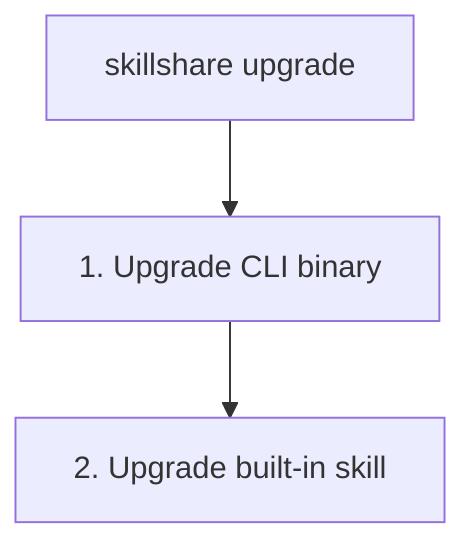

# upgrade

skillshare CLI バイナリおよび／または組み込みの skillshare Skill をアップグレードします。

```bash
skillshare upgrade              # CLI と Skill の両方をアップグレード
skillshare upgrade --cli        # CLI のみ
skillshare upgrade --skill      # Skill のみ
```

## 使うタイミング

- 新しいバージョンの skillshare CLI が利用可能なとき
- 組み込みの skillshare Skill を更新する必要があるとき
- `doctor` が利用可能な更新を報告した後


## 実行される処理



## オプション

| フラグ | 説明 |
|------|-------------|
| `--cli` | CLI のみアップグレード |
| `--skill` | Skill のみアップグレード（未インストールの場合はプロンプトを表示） |
| `--force, -f` | 確認プロンプトをスキップ |
| `--dry-run, -n` | 変更を加えずにプレビュー |
| `-h`, `--help` | ヘルプを表示 |

## Homebrew ユーザー

Homebrew でインストールした場合、`skillshare upgrade` は自動的に `brew upgrade` に処理を委譲します。

```bash
skillshare upgrade
# → brew update && brew upgrade skillshare
```

Homebrew を直接使うこともできます。

```bash
brew upgrade skillshare
```

## 例

```bash
# 標準的なアップグレード（CLI と Skill の両方）
skillshare upgrade

# アップグレードされる内容をプレビュー
skillshare upgrade --dry-run

# プロンプトなしで強制アップグレード
skillshare upgrade --force

# CLI バイナリのみアップグレード
skillshare upgrade --cli

# skillshare Skill のみアップグレード
skillshare upgrade --skill
```

## アップグレード後

Skill をアップグレードした場合、`skillshare sync` を実行して配布してください。

```bash
skillshare upgrade --skill
skillshare sync  # すべての Target に配布
```

## アップグレードされるもの

### CLI バイナリ

`skillshare` 実行ファイル自体です。GitHub releases からダウンロードされます。

ターミナルでは、ダウンロード済みの量が表示されるため、回線が遅くてもハングしたようには見えません。下記の Web UI アセットでも同じ表示になります。

```
Downloading v0.21.4...  3.2 MB / 9.1 MB
```

バイナリが保護されたディレクトリ（例: `/usr/local/bin`）にある場合、skillshare は `sudo` を使ってバイナリの置き換えだけを行います — 手動でのプレフィックス指定は不要です。組み込み skill、UI アセット、ログはあなたのユーザーとして書き込まれるため、アップグレード全体を `sudo` で実行しないでください。skill ソースに root 所有のファイルが残り、後の `git pull` が `Permission denied` で失敗します。

パスワードを尋ねるための端末がない場合（Dashboard の **今すぐ更新** ボタン、CI など）、アップグレードは入力を待たずに即座に停止し、代わりにターミナルで `skillshare upgrade` を実行するよう案内します。キャッシュされた `sudo` の認証情報や `NOPASSWD` 設定がある場合は、プロンプトなしでアップグレードが続行されます。

### Web UI アセット

アップグレード後、skillshare は新しいバージョンの Web UI フロントエンドアセットを事前にダウンロードします。これらは `~/.cache/skillshare/ui/<version>/` にキャッシュされ、`skillshare ui` を実行したときに提供されます。

事前ダウンロードが失敗した場合（ネットワークの問題など）、代わりに次回の `skillshare ui` 起動時にアセットがダウンロードされます。

### skillshare Skill

AI CLI に `/skillshare` コマンドを追加する組み込みの `skillshare` Skill です。以下に配置されています。
```
~/.config/skillshare/skills/skillshare/SKILL.md
```

## 関連項目

- [update](/docs/reference/commands/update) — 他の Skill やリポジトリを更新
- [status](/docs/reference/commands/status) — 現在のバージョンを確認
- [doctor](/docs/reference/commands/doctor) — 問題を診断
