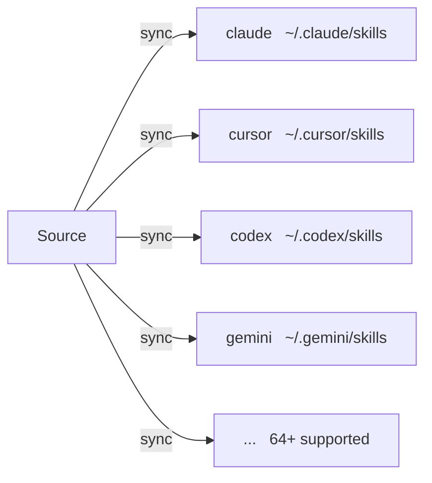

# Targets

Target は、skillshare が Sync する AI CLI の Skill ディレクトリです。

## 概要



## 何をしたいですか？

| やりたいこと | 読むもの |
|--------------|------|
| どの AI CLI が対応しているか見る | [対応する Target](./supported-targets.md) |
| 組み込みリストにない Target を追加する | [カスタム Target の追加](./adding-custom-targets.md) |
| Sync モード、フィルター、パスを設定する | [Configuration](./configuration.md) |

## クイックリンク

| トピック | 説明 |
|-------|-------------|
| [対応する Target](./supported-targets.md) | 64以上の対応 AI CLI の完全なリスト |
| [カスタム Target の追加](./adding-custom-targets.md) | Skill ディレクトリを持つ任意のツールを追加する |
| [Configuration](./configuration.md) | Config ファイルリファレンス |

---

## よくある操作

### Target を一覧表示する

```bash
skillshare target list
```

### Target の詳細を表示する

```bash
skillshare target claude
```

### Sync モードを変更する

```bash
skillshare target claude --mode symlink
skillshare sync
```

### カスタム Target を追加する

```bash
skillshare target add myapp ~/.myapp/skills
skillshare sync
```

### Target を削除する

```bash
skillshare target remove claude
```

---

## 自動検出

`skillshare init` を実行すると、インストールされている AI CLI が自動的に検出され Target として
追加されます。

存在するパスのみが追加されます。チェックされるパスの完全なリストは [対応する Target](./supported-targets.md)
を参照してください。

---

## 関連項目

- [Source と Targets](/docs/understand/source-and-targets) — コアコンセプト
- [Sync モード](/docs/understand/sync-modes) — merge、copy、symlink
- [Commands: target](/docs/reference/commands/target) — Target コマンドの詳細
