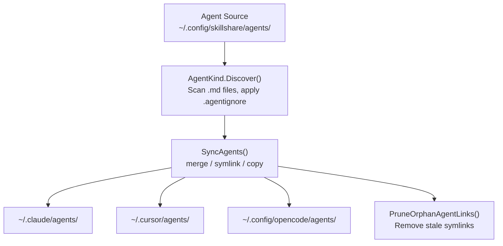

# Agents

Skill と並んで管理される単一ファイルの `.md` リソース — 同じ sync、audit、ライフサイクルを持ちますが、形は異なります。

:::tip これが重要になるのはどんなとき？
一部の AI CLI（Claude Code、Cursor、OpenCode、Augment、Copilot CLI、Droid）は **skills**（`SKILL.md` を含むディレクトリ）と **agents**（単一の `.md` ファイル）を区別しています。あなたの Target がこの agents をサポートしていれば、skillshare は単一の Source から両方を管理できます。
:::

## Skills と Agents

| | Skill | Agent |
|---|---|---|
| **形** | `SKILL.md` と任意のファイルを含むディレクトリ | 単一の `.md` ファイル |
| **名前解決** | `SKILL.md` frontmatter の `name` フィールド | ファイル名（例：`tutor.md` = "tutor"）、任意で frontmatter の `name` による上書き |
| **Source ディレクトリ** | `~/.config/skillshare/skills/` | `~/.config/skillshare/agents/`（`agents_source` でカスタマイズ可能） |
| **Project の Source** | `.skillshare/skills/` | `.skillshare/agents/` |
| **無視ファイル** | `.skillignore` | `.agentignore` |
| **Sync 単位** | ディレクトリの symlink（merge）、ディレクトリ全体の symlink（symlink）、ディレクトリのコピー（copy） | ファイルの symlink（merge）、ディレクトリ全体の symlink（symlink）、ファイルのコピー（copy） |
| **ネスト対応** | `path/to/skill` は `path__to__skill` にフラット化 | `dir/file.md` は `dir__file.md` にフラット化 |
| **Tracking** | 対応 | 対応 |
| **Audit** | 対応 | 対応 |
| **Collect** | 対応 | 対応 |

---

## ディレクトリ構造

### Global

```
~/.config/skillshare/
├── skills/              # Skill source (directories)
│   ├── my-skill/
│   │   └── SKILL.md
│   └── .skillignore
├── agents/              # Agent source (files)
│   ├── tutor.md
│   ├── reviewer.md
│   └── .agentignore
└── config.yaml
```

### Project

```
.skillshare/
├── skills/
│   └── api-conventions/
│       └── SKILL.md
├── agents/
│   ├── onboarding.md
│   └── .agentignore
└── config.yaml
```

### カスタム Source ディレクトリ

Global モードでは、agent の Source はデフォルトで `~/.config/skillshare/agents/` になります。カスタムの場所を使うには、`config.yaml` に `agents_source` を設定します。

```yaml
agents_source: ~/my-agents
```

Project モードでは常に `.skillshare/agents/` を使用し、`agents_source` はサポートされません。

詳細は [Configuration — agents_source](/docs/reference/targets/configuration#agents-source) を参照してください。

---

## Agent ファイルフォーマット {#agent-file-format}

Agent は通常の `.md` ファイルです。Frontmatter は任意です。

```markdown
---
name: math-tutor
description: Helps with math problems step by step
targets: [claude, cursor]   # optional — only sync to these targets
---

# Math Tutor

You are a patient math tutor. Walk through problems step by step.
```

**Agent ごとの targets：** 任意の `targets` リストを指定すると、その agent は列挙された Target のみに同期されます（`claude-code` のようなエイリアスも `claude` にマッチします）。省略するとすべての場所に同期されます。それ以外の frontmatter フィールドはそのまま渡されます — Target が [extension](#extensions) を使用しない限り、skillshare はツール間で変換を行わないため、あるハーネス向けに書かれた agent が別のハーネスでは理解されないことがあります。同じ agent のハーネスごとのバリアントを並存させるには `targets` を使ってください（例：`targets: [claude]` を指定した `reviewer.md` と `targets: [opencode]` を指定した `reviewer-opencode.md`）。

**命名ルール：**
- ファイル名が agent 名を決定します：`tutor.md` = "tutor"
- YAML frontmatter の任意の `name` フィールドはファイル名を上書きします
- ファイル名は文字または数字で始まる必要があり、使用できる文字は `a-z`、`A-Z`、`0-9`、`_`、`-`、`.` のみです
- 名前の最大長：128 文字

**慣例的な除外対象** — 以下のファイル名は discovery 時に常にスキップされます。
`README.md`、`CHANGELOG.md`、`LICENSE.md`、`HISTORY.md`、`SECURITY.md`、`SKILL.md`

---

## サポートされる Target {#supported-targets}

`agents` パス定義を持つ Target のみが agent の同期を受け取ります。現在は以下の通りです。

| Target | Global の agents パス | Project の agents パス |
|--------|-------------------|---------------------|
| `claude` | `~/.claude/agents` | `.claude/agents` |
| `cursor` | `~/.cursor/agents` | `.cursor/agents` |
| `opencode` | `~/.config/opencode/agents` | `.opencode/agents` |
| `augment` | `~/.augment/agents` | `.augment/agents` |
| `copilot` | `~/.copilot/agents` | `.github/agents` |
| `droid` | `~/.factory/droids` | `.factory/droids` |

`agents` のエントリを持たない Target（大多数）は skill のみを受け取ります。

---

## Sync の挙動

Agent の sync は、skill と同じく 3 つのモードすべてに対応しています。

| モード | 挙動 |
|------|------|
| **merge**（デフォルト） | ファイル単位の symlink。Target 内のローカルの agent ファイルは保持されます。 |
| **symlink** | agents ディレクトリ全体を symlink します。 |
| **copy** | Agent ファイルを実ファイルとしてコピーします。 |

```bash
# Sync everything (skills + agents)
skillshare sync

# Sync agents only
skillshare sync agents
```

孤立ファイルの掃除も同様に動作します — Source が存在しなくなった壊れた symlink やコピーされたファイルは自動的に削除されます。

### extension を使った Agent の変換 {#extensions}

ツールによって agent の frontmatter の扱いは異なり、なかには Markdown をまったく読み込まないものもあります。Target の `agents` ブロックに `extension` を設定すると、sync 時に各 agent が変換スクリプトを通されます。

```yaml
targets:
  opencode:
    agents:
      extension: opencode-agents   # implies mode: copy
  codex:
    skills:
      path: ~/.codex/skills
    agents:
      path: ~/.codex/agents
      extension: codex-agents      # tutor.md → tutor.toml
```

- `extension` は `copy` モードを暗黙的に指定します。`extension` と併せて `mode: merge` または `mode: symlink` を設定するとエラーになります。
- Extension は extras で使われるものと同じです。裸の名前は `~/.config/skillshare/extensions/`（Project モードでは `.skillshare/extensions/`）配下で解決され、パスはそのまま使われます。スクリプトの契約については [Extension transforms](/docs/reference/commands/extras#extension-transforms) を参照してください。
- extension がファイル拡張子を変更する場合、孤立ファイルの掃除は新しい名前に追従します。そのため、Target が `tutor.toml` を取得すると、残っていた `tutor.md` のコピーは削除されます。
- 失敗した agent は報告され、書き込まれません。他の agent は引き続き sync されます。

Web ダッシュボードでは、Target の **Agents** タブからこれを設定します。

**`opencode-agents`** は Claude 形式の Agent を [OpenCode](https://opencode.ai/docs/agents/) 向けに変換します。OpenCode のドキュメントに記載されたフィールド（`description`、`mode`、`model`、`temperature`、`top_p`、`steps`、`permission`、`hidden`、`color`、`prompt`）だけを残し、`mode` がなければ `mode: subagent` を追加します。`provider/model-id` 形式でない `model` は削除され、`description` がない場合は失敗します。Claude の `tools:`、`disallowedTools:`、`permissionMode:` のいずれかを設定した Agent は推測で変換せずに失敗します。`permission:` と `targets: [opencode]` を使った OpenCode 用のバリアントを別に用意してください。

---

## Collect の挙動

Agent の collect は skill の collect と同じ CLI 契約を使いますが、`.md` の agent ファイルを対象に動作します。

```bash
# Global
skillshare collect agents claude
skillshare collect agents --all
skillshare collect agents claude --dry-run
skillshare collect agents claude --json

# Project
skillshare collect -p agents claude
skillshare collect -p agents --all
skillshare collect -p agents --json
```

ルール：

- 既存の Source agent はデフォルトでスキップされます
- 既存の Source agent を上書きするには `--force` を使用します
- `--json` は `--force` を暗黙的に有効にし、確認プロンプトをスキップします
- agent [extension](#extensions) を持つ Target には変換済みのファイルが格納されているため、collect の対象には決してなりません。`--all` はそれらをスキップし、個別に指定するとエラーになります

---

## `.agentignore`

`.skillignore` と全く同じように動作します — gitignore 形式のパターンで sync から agent を除外します。

| スコープ | パス |
|-------|------|
| Global | `~/.config/skillshare/agents/.agentignore` |
| Project | `.skillshare/agents/.agentignore` |

例：

```gitignore
# Disable draft agents
draft-*
# Disable a specific agent
experimental-reviewer
```

エントリを管理するには `--kind agent` 付きで `enable`/`disable` を使用します。

```bash
skillshare disable --kind agent draft-reviewer
skillshare enable --kind agent draft-reviewer
```

---

## リポジトリからの Agent のインストール

リポジトリをインストールする際、skillshare は agent を自動検出します。

1. リポジトリ内の `agents/` という慣例ディレクトリを探します — その中の `.md` ファイル（慣例的な除外対象を除く）が agent の候補になります
2. リポジトリに `skills/` と `agents/` の両方がある場合、両方がインストールされます
3. リポジトリに `agents/` のみがある場合（`SKILL.md` のマーカーがない場合）、agent がインストールされます
4. リポジトリに `skills/` も `agents/` ディレクトリもなく、ルートに直接 `.md` ファイルがある場合 — agent として扱われます（純粋な agent リポジトリ）

### 明示的なフラグ

```bash
# Install only agents from a repo
skillshare install github.com/user/repo --kind agent

# Install specific agents by name (-a shorthand)
skillshare install github.com/user/repo -a tutor,reviewer

# Install specific skills by name (unchanged)
skillshare install github.com/user/repo -s my-skill
```

---

## CLI コマンド

ほとんどのコマンドは、agent に範囲を絞るための `agents` 位置引数または `--kind agent` フラグを受け付けます。

| コマンド | 例 | 動作内容 |
|---------|---------|--------------|
| `list agents` | `skillshare list agents` | Source 内の agent を一覧表示 |
| `check agents` | `skillshare check agents` | agent の整合性と更新状態をチェック |
| `audit agents` | `skillshare audit agents` | agent のセキュリティスキャン |
| `sync agents` | `skillshare sync agents` | agent のみを Target に同期 |
| `collect agents` | `skillshare collect agents claude` | ローカルの Target agent を Source に回収 |
| `update agents` | `skillshare update agents --all` | tracked な agent リポジトリとメタデータ管理下の agent を更新 |
| `enable --kind agent` | `skillshare enable --kind agent tutor` | 無効化された agent を再度有効化 |
| `disable --kind agent` | `skillshare disable --kind agent tutor` | `.agentignore` 経由で agent を無効化 |
| `install --kind agent` | `skillshare install repo --kind agent` | リポジトリから agent のみをインストール |
| `install -a` | `skillshare install repo -a tutor` | 名前で特定の agent をインストール |

kind フィルタを指定しない場合、コマンドは skill と agent の **両方** を対象に動作します。

---

## データフロー



---

## Project モード

Agent は skill と同じ方法で Project モードで動作します。

```bash
# Initialize project (creates .skillshare/agents/ alongside .skillshare/skills/)
skillshare init -p

# Install agents into project
skillshare install github.com/user/repo --kind agent -p

# Update project agents in place
skillshare update agents --all -p

# Sync project agents
skillshare sync -p
```

Project の agent Source：`.skillshare/agents/`
インストールされた agent（tracked）は `.metadata.json` に記録され、tracked な skill と同様に `.gitignore` のエントリが作成されます。
