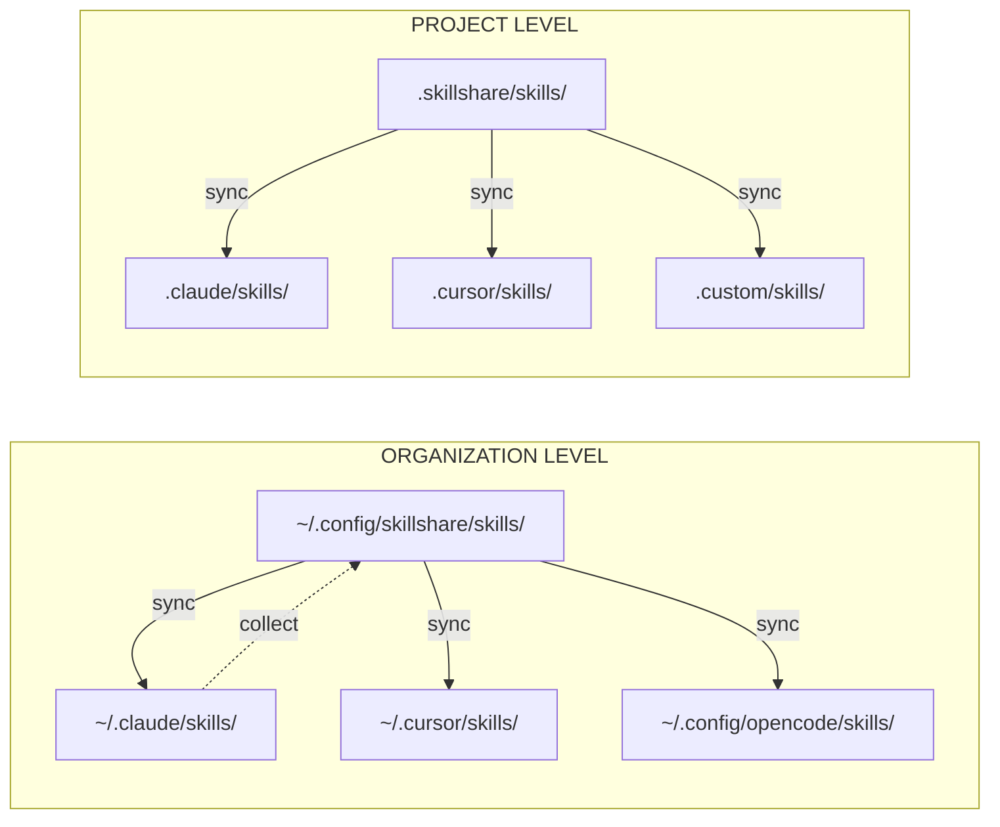

# 理解する

これらの概念を理解することで、skillshare を最大限に活用できます。

## 何を理解したいですか?

| 質問 | 参照先 |
|----------|------|
| skillshare はどのように Skill を移動させるのですか? | [Source & Targets](./source-and-targets.md) |
| merge と symlink の違いは何ですか? | [Sync Modes](./sync-modes.md) |
| 組織全体で Skill を共有するにはどうすればいいですか? | [Tracked Repositories](./tracked-repositories.md) |
| SKILL.md の中身は何ですか? | [Skill Format](./skill-format.md) |
| プロジェクトレベルの Skill はどのように機能しますか? | [Project Skills](./project-skills.md) |

## 概要

## 主要な概念

| 概念 | 内容 | 詳細 |
|---------|-----------|------------|
| **Source & Targets** | 単一の信頼できる情報源から複数の配布先へ | [→ Source & Targets](./source-and-targets.md) |
| **Sync Modes** | Merge、copy、symlink — ファイルのリンク方法 | [→ Sync Modes](./sync-modes.md) |
| **Tracked Repos** | `--track` でインストールされた Git リポジトリ | [→ Tracked Repositories](./tracked-repositories.md) |
| **Skill Format** | SKILL.md の構造とメタデータ | [→ Skill Format](./skill-format.md) |
| **Project Skills** | リポジトリに紐づくプロジェクトレベルの Skill | [→ Project Skills](./project-skills.md) |
| **Organization Skills** | tracked repositories による組織全体の Skill | [→ Organization-Wide Skills](/docs/how-to/sharing/organization-sharing) |

---

## クイックサマリー

### Source & Targets
- **Source**: `~/.config/skillshare/skills/` — Skill を編集する場所
- **Targets**: AI CLI の Skill ディレクトリ — symlink 経由で Skill が配置される場所

### Sync Modes
- **Merge**(デフォルト): 各 Skill が個別に symlink され、ローカル Skill は保持される
- **Copy**: 各 Skill が個別にコピーされ、ローカル Skill は保持される
- **Symlink**: ディレクトリ全体が 1 つの symlink になる

### Tracked Repos
- `--track` でインストールされた Git リポジトリ
- `_` プレフィックスが付く(例: `_team-skills/`)
- `skillshare update <name>` で更新される

### Skill Format
- YAML frontmatter を持つ `SKILL.md`
- 必須: `name` フィールド
- オプション: `description`、カスタムメタデータ

### Project Skills
- 単一リポジトリに紐づく Skill(`.skillshare/skills/`)
- git 経由でチームと共有 — `.skillshare/` が存在すると自動検出される
- ターゲットごとに sync mode を設定可能(デフォルトは merge、symlink も選択可能)

### Organization Skills
- tracked repositories(`--track`)経由ですべてのプロジェクトで共有
- 一度インストールすれば `skillshare update --all` で更新
- Project Skills を補完する — organization は標準化のため、project はリポジトリ固有のコンテキストのため

---

## 設計思想

skillshare の設計判断についての詳しい説明です。

| トピック | 概要 |
|-------|---------|
| [Why Local-First](./philosophy/why-local-first) | 単一バイナリ、依存関係ゼロ、デフォルトでオフライン動作 |
| [Security-First](./philosophy/security-first) | 15 以上の監査パターン、サプライチェーンの脅威モデル |
| [Sync Modes Deep Dive](./philosophy/sync-modes-explained) | Merge と symlink のトレードオフを詳しく解説 |
| [Comparison](./philosophy/comparison) | skillshare と他ツールの比較 |
| [Skill Design](./philosophy/skill-design) | 効果的な Skill を書くためのガイドライン |
