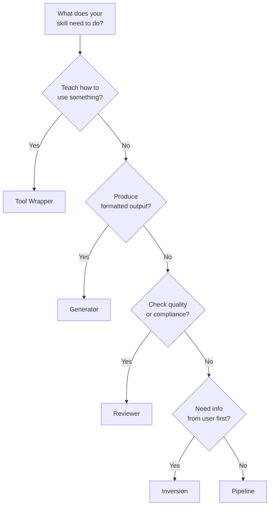

# Skill デザインパターン

Skill 作りをすぐ始められる5つの構造テンプレートです。パターンを1つ選び、`skillshare new` でテンプレートを生成し、そこからカスタマイズしていきます。

:::tip クイックスタート
`skillshare new my-skill -P <pattern>` を使うと、任意のパターンのテンプレートを生成できます。`skillshare new my-skill` を実行すると、対話形式のピッカーが起動します。
:::

---

## Part 1: クイックリファレンス

### パターン概要

| パターン | 何をするか | 使うべき場面 |
|---------|-------------|----------|
| Tool Wrapper | ライブラリ/API の使い方をエージェントに教える | エージェントがドメイン固有の規約を必要とする場合 |
| Generator | テンプレートから構造化された出力を生成する | ドキュメントやコードのフォーマットを一貫させたい場合 |
| Reviewer | チェックリストに基づいてスコア付け・監査する | コードレビュー、セキュリティ監査、品質チェック |
| Inversion | エージェントが行動前にユーザーにインタビューする | 要件定義、プロジェクト計画 |
| Pipeline | チェックポイント付きの複数ステップワークフロー | 検証ゲートを必要とする複雑なタスク |

### どのパターンを使うべきか?



### ユースケースのカテゴリ

Skill を作成する際、そのドメインを示す**カテゴリ**をタグ付けすることもできます。

| カテゴリ | 説明 | 例 |
|----------|-------------|----------|
| `library` | ライブラリ & API リファレンス | `billing-lib`、`internal-platform-cli` |
| `verification` | プロダクト検証 | `signup-flow-driver`、`checkout-verifier` |
| `data` | データ取得と分析 | `funnel-query`、`grafana` |
| `automation` | 業務プロセス & チーム自動化 | `standup-post`、`weekly-recap` |
| `scaffold` | コードスキャフォールディング & テンプレート | `new-migration`、`create-app` |
| `quality` | コード品質 & レビュー | `adversarial-review`、`testing-practices` |
| `cicd` | CI/CD & デプロイ | `babysit-pr`、`deploy-service` |
| `runbook` | ランブック & インシデント対応 | `oncall-runner`、`log-correlator` |
| `infra` | インフラ運用 | `orphan-cleanup`、`cost-investigation` |

カテゴリは SKILL.md の frontmatter に保存され、パターンとは独立しています。どのパターンもどのカテゴリとも組み合わせられます。

---

## Part 2: 詳細な例

### Tool Wrapper

規約と使用例を埋め込むことで、特定のライブラリ、フレームワーク、API の使い方をエージェントに教えます。

エージェントは規約を一度読み込み、そのライブラリに触れるコードを書いたりレビューしたりするたびにそれを適用します。これにより、ドメイン固有の知識を自分の頭の中だけに留めず、再利用可能な Skill として残せます。

**SKILL.md の例:**

```markdown
---
name: billing-lib
description: >-
  Conventions for the billing-lib SDK. Use when writing or reviewing
  code that imports billing-lib or handles payment flows.
pattern: tool-wrapper
category: library
---

# Billing Lib

## Core Conventions

Load and follow the rules in `references/conventions.md` before writing any code.

## When Reviewing Code

- Check that all API calls follow the conventions
- Verify error handling matches the library's patterns
- Ensure imports and initialization are correct

## When Writing Code

- Follow the conventions from `references/conventions.md`
- Use idiomatic patterns for this library/API
- Include error handling for common failure modes
```

**ディレクトリ構造:**

```
billing-lib/
├── SKILL.md
└── references/
    └── conventions.md      # API patterns, error codes, initialization
```

**バリエーション:** コピー&ペーストできるスニペットをまとめた `references/examples.md` を含める tool-wrapper Skill もあれば、バージョンアップグレード用の `references/migration.md` を含めるものもあります。

---

### Generator

スタイルガイドに従ってテンプレートを埋めることで、構造化された出力（ドキュメント、設定ファイル、コード）を生成します。エージェントはユーザーから変数を集め、毎回一貫した出力を生成します。

**SKILL.md の例:**

```markdown
---
name: rfc-writer
description: >-
  Generates RFC documents following the team template. Use when user
  says "write an RFC", "new proposal", or "design doc".
pattern: generator
category: scaffold
---

# RFC Writer

## Steps

### Step 1: Load Style Guide

Read `references/style-guide.md` for formatting and naming rules.

### Step 2: Load Template

Read `assets/template.md` as the base structure.

### Step 3: Gather Input

Ask the user what they need generated. Collect all required variables.

### Step 4: Generate

Fill in the template following the style guide. Ensure all placeholders are replaced.

### Step 5: Deliver

Present the generated output. Ask if adjustments are needed.
```

**ディレクトリ構造:**

```
rfc-writer/
├── SKILL.md
├── assets/
│   └── template.md         # RFC skeleton with placeholders
└── references/
    └── style-guide.md       # Formatting, section ordering, naming
```

**バリエーション:** スタイルガイドを省略し、すべてのルールをテンプレートに直接書き込む generator もあれば、`assets/` に文書の種類ごとに複数のテンプレートを含めるものもあります。

---

### Reviewer

定義されたチェックリストに基づいて成果物をスコア付け・監査します。エージェントは対象を読み込み、各基準を適用し、重大度レベルと合否スコアを含む構造化されたレポートを作成します。

**SKILL.md の例:**

```markdown
---
name: pr-review
description: >-
  Reviews pull requests against the team quality checklist. Use when
  user says "review this PR", "check this code", or "audit quality".
pattern: reviewer
category: quality
---

# PR Review

## Steps

### Step 1: Load Checklist

Read `references/review-checklist.md` for the complete list of review criteria.

### Step 2: Understand

Read the code/document under review. Identify its purpose and scope.

### Step 3: Apply Rules

Evaluate each checklist item. Classify findings by severity:
- **Critical**: Must fix before proceeding
- **Warning**: Should fix, may cause issues later
- **Info**: Suggestion for improvement

### Step 4: Report

Produce a review report with:
1. Summary (pass/fail + one-line verdict)
2. Findings (severity, location, description)
3. Score (percentage of checklist items passed)
4. Top 3 recommended fixes
```

**ディレクトリ構造:**

```
pr-review/
├── SKILL.md
└── references/
    └── review-checklist.md  # Criteria with severity weights
```

**バリエーション:** 各ルールについて良い例と悪い例を示す `references/examples.md` を含める reviewer Skill もあれば、重み付きスコアリングのための `references/scoring-rubric.md` を追加するものもあります。

---

### Inversion

通常のやり取りを逆転させます。ユーザーがエージェントに何をすべきか指示するのではなく、エージェントが行動を起こす前にユーザーにインタビューして要件を集めます。これにより「まず作ってから後で聞く」という問題を防げます。

**SKILL.md の例:**

```markdown
---
name: project-planner
description: >-
  Plans a new project by interviewing the user about goals, constraints,
  and success criteria. Use when user says "plan a project", "new feature
  spec", or "help me think through this".
pattern: inversion
category: automation
---

# Project Planner

**DO NOT start building until all phases are complete.**

## Phase 1: Discovery

Ask the user these questions before proceeding:
- What is the goal?
- Who is the audience?
- What does success look like?

## Phase 2: Constraints

Ask the user about constraints:
- What are the technical limitations?
- What is the timeline?
- Are there existing patterns to follow?

## Phase 3: Synthesis

Based on the answers, load `assets/template.md` and produce a plan.
Present the plan for approval before executing.
```

**ディレクトリ構造:**

```
project-planner/
├── SKILL.md
└── assets/
    └── template.md          # Plan document skeleton
```

**バリエーション:** インラインではなく `references/interview-questions.md` に固定の質問リストを持つ inversion Skill もあれば、質問をする前に既存のプロジェクトコンテキストを読み込む Phase 0 を追加するものもあります。

---

### Pipeline

各ステージに検証ゲートを持つ複数ステップのワークフローをオーケストレーションします。エージェントは次に進む前に各チェックポイントを通過する必要があり、これにより複雑な操作における連鎖的な失敗を防げます。

**SKILL.md の例:**

```markdown
---
name: deploy-staging
description: >-
  Deploys to staging with pre-flight checks and rollback plan. Use when
  user says "deploy to staging", "push to staging", or "staging release".
pattern: pipeline
category: cicd
---

# Deploy Staging

## Steps

### Step 1: Prepare

Gather inputs and validate prerequisites:
- Confirm branch is clean (`git status`)
- Run tests (`make test`)
- Check CI status

### Step 2: Gate Check

Present the plan to the user.

**Do NOT proceed until user confirms.**

### Step 3: Execute

Run the deployment pipeline. After each stage, verify output before continuing:
1. Build: `make build`
2. Push: `make push-staging`
3. Health check: `curl -sf https://staging.example.com/health`

### Step 4: Quality Check

Review results against `references/quality-checklist.md`.
Report pass/fail status for each criterion.
```

**ディレクトリ構造:**

```
deploy-staging/
├── SKILL.md
├── references/
│   └── quality-checklist.md  # Post-deploy verification criteria
├── assets/
│   └── rollback-plan.md      # Steps to undo if something fails
└── scripts/
    └── healthcheck.sh        # Automated health verification
```

**バリエーション:** エージェントが実行する自動化スクリプトを含む `scripts/` ディレクトリを持つ pipeline もあれば、ロールバック手順を SKILL.md 本文に直接埋め込むものもあります。

---

## パターンは組み合わせられる

これらのパターンは硬直した型ではなく、組み合わせ可能な部品です。実際のニーズに合わせて組み合わせてください。

- **Pipeline + Reviewer:** デプロイパイプラインの最後に品質レビューステップを置き、完了とマークする前にチェックリストに基づいてデプロイをスコア付けする。
- **Inversion + Generator:** まずユーザーに目標と制約についてインタビューし（Inversion）、集めた情報でテンプレートを埋める（Generator）RFC Skill。
- **Tool Wrapper + Reviewer:** 規約を教え（Tool Wrapper）、既存コードの準拠状況を監査もできる（Reviewer）ライブラリ Skill。

まず1つのパターンから始め、Skill のスコープが広がるにつれて追加のパターンを重ねていってください。

---

## 関連項目

- [Skill Design](./skill-design.md) — 設計原則（決定性、progressive disclosure、複雑さのマッチング）
- [Creating Skills](/docs/how-to/daily-tasks/creating-skills) — ステップバイステップの作成ガイド
- [Skill Format](/docs/understand/skill-format) — SKILL.md の構造とメタデータ
