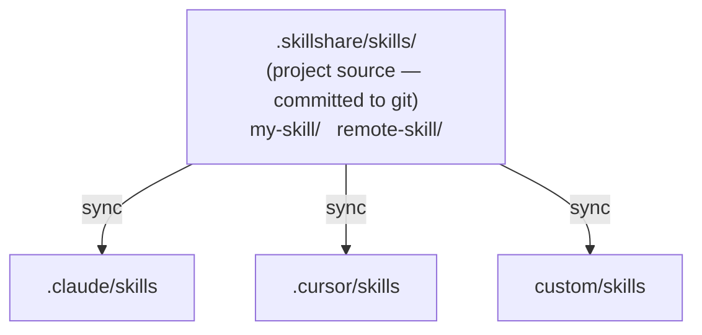

# Project Skills

skillshare をプロジェクトレベルで実行する — git 経由で共有される、単一リポジトリにスコープされた skill。

:::tip これが重要になるのはどんなとき？
チームがリポジトリ固有の AI 向け指示（コーディング規約、デプロイガイド、API 規約）を必要とし、それを個人用のグローバル skill コレクションに含めたくない場合に、project skill を使用してください。
:::

## 利用シナリオ

| シナリオ | 例 |
|----------|---------|
| **モノレポのオンボーディング** | 新しい開発者がリポジトリを clone し、`skillshare install -p && skillshare sync` を実行 — 即座にプロジェクトのコンテキストが手に入る |
| **API 規約** | API スタイルガイドを skill として埋め込み、すべての AI アシスタントがチームの規約に従うようにする |
| **ドメイン固有のコンテキスト** | 規制ルールを持つ金融アプリ、コンプライアンスガイドラインを持つヘルスケアアプリ |
| **プロジェクトツール** | この リポジトリ固有の CI/CD デプロイ知識、テストパターン、マイグレーションスクリプト |
| **オンボーディングの加速** | 「ここでの認証はどう動く？」— コミット済みの project skill から、AI がすでに知っている |
| **オープンソースプロジェクト** | メンテナーが `.skillshare/` をコミットし、コントリビューターが clone するとプロジェクト固有の AI コンテキストを得られる |
| **コミュニティによる skill のキュレーション** | リポジトリの `config.yaml` の `skills:` セクションがキュレーションされた skill リストとして機能する — 誰でも `install -p` で同じセットアップを得られる |

---

## 概要



---

## 自動検出

現在のディレクトリに `.skillshare/config.yaml` が存在すると、skillshare は自動的に project mode に入ります。

```bash
cd my-project/           # Has .skillshare/config.yaml
skillshare sync          # → Project mode (auto-detected)
skillshare status        # → Project mode (auto-detected)
```

:::tip 設定不要
`.skillshare/` があるプロジェクトに `cd` するだけで、skillshare が自動的に検出します。フラグも環境変数も設定も一切不要です。
:::

特定のモードを強制するには、次のようにします。

```bash
skillshare sync -p       # Force project mode
skillshare sync -g       # Force global mode
```

---

## Global と Project の比較

| | Global Mode | Project Mode |
|---|---|---|
| **Source** | `~/.config/skillshare/skills/` | `.skillshare/skills/`（プロジェクトルート） |
| **Config** | `~/.config/skillshare/config.yaml` | `.skillshare/config.yaml` |
| **Targets** | システム全体の AI CLI ディレクトリ | プロジェクトごとのディレクトリ |
| **Sync mode** | Merge、copy、または symlink（target ごと） | Merge、copy、または symlink（target ごと、デフォルトは merge） |
| **Tracked repos** | サポート（`--track`） | サポート（`--track -p`） |
| **Git integration** | 任意（`push`/`pull`） | Skill はプロジェクトのリポジトリに直接コミットされる |
| **Scope** | マシン上のすべてのプロジェクト | 単一リポジトリ |

自分だけのプロジェクトであれば、第三の選択肢もあります。グローバル config の [`projects`](/docs/reference/targets/configuration#projects) の下にフォルダーを列挙する方法です。各フォルダーは独自の skill、agent、MCP サーバーのセットを持ち、リポジトリには何も追加されず、`sync` を 1 回実行するだけですべてが更新されます。どちらを選ぶべきかは[多数の Project を 1 つの Config で](/docs/how-to/recipes/many-projects-one-config#scenario)を参照してください。

---

## `.skillshare/` ディレクトリ構成

```
<project-root>/
├── .skillshare/
│   ├── config.yaml              # Targets + settings (incl. extras)
│   ├── skills.lock.json         # 各リモート skill が固定されているコミット（自動管理、コミットしてください）
│   ├── skills/.metadata.json     # Runtime metadata (hashes, timestamps — auto-managed, gitignored)
│   ├── .gitignore               # Ignores logs/, trash/, backups/, and cloned remote/tracked skill dirs
│   ├── extras/                  # Extras source directories
│   │   └── rules/               # e.g. extras init rules --target .claude/rules -p
│   │       └── coding.md
│   └── skills/
│       ├── my-local-skill/      # Created manually or via `skillshare new`
│       │   └── SKILL.md
│       ├── remote-skill/        # Installed via `skillshare install -p`
│       │   └── SKILL.md
│       ├── tools/               # Category folder (via --into tools)
│       │   └── pdf/             # Installed via `skillshare install ... --into tools -p`
│       │       └── SKILL.md
│       └── _team-skills/        # Installed via `skillshare install --track -p`
│           ├── .git/            # Git history preserved
│           ├── frontend/ui/
│           └── backend/api/
├── .claude/
│   └── skills/
│       ├── my-local-skill → ../../.skillshare/skills/my-local-skill
│       ├── remote-skill → ../../.skillshare/skills/remote-skill
│       ├── tools__pdf → ../../.skillshare/skills/tools/pdf
│       ├── _team-skills__frontend__ui → ../../.skillshare/skills/_team-skills/frontend/ui
│       └── _team-skills__backend__api → ../../.skillshare/skills/_team-skills/backend/api
└── .cursor/
    └── skills/
        └── (same symlink structure as .claude/skills/)
```

Project mode の symlink は**相対パス**（例: `../../.skillshare/skills/...`）を使用します。これによりプロジェクトディレクトリはポータブルになります — リネームしても、移動しても、別のマシンで clone しても、すべての symlink は機能し続けます。Global mode では、source と target が別々のファイルシステム上の場所にあるため、絶対パスを使用します。

---

## 可視のプロジェクトディレクトリ {#visible-project-directory}

skill をツールの状態としてではなく、レビュー対象のコンテンツとして扱うリポジトリでは、隠しディレクトリの `.skillshare/` の代わりに、可視の `skillshare/` ディレクトリを使用できます。

```bash
skillshare init -p --visible
```

```
<project-root>/
├── skillshare/
│   ├── config.yaml
│   ├── skills/
│   └── agents/
└── src/
```

それ以外はすべて同一です — `config.yaml`、`skills/`、`agents/`、`extras/`、そして操作用の `trash/`、`backups/`、`logs/` ディレクトリは、いずれも使用中のプロジェクトディレクトリの中にあります。

検出は最初に `.skillshare/config.yaml` を、次に `skillshare/config.yaml` を確認するため、次のようになります。

- 既存のプロジェクトには影響しません。
- 両方のディレクトリが存在する場合、`.skillshare/` が優先されます。
- 既存のプロジェクトを移行するには、`mv .skillshare skillshare` を実行し、次に `skillshare sync -p` を実行して、まだ古いディレクトリを指している target の symlink を修復してください。`sources` の設定が `.skillshare/` を明示的に参照している場合は、sync する前に `config.yaml` 内のそれらのパスを更新してください。

`--visible` を付けない `init -p` は、これまでどおり `.skillshare/` を作成します。

:::note
グローバルの設定ディレクトリも `skillshare`（`~/.config/skillshare/`）と呼ばれます。プロジェクトとして扱われるのは、プロジェクトルート内の `skillshare/` ディレクトリだけです。
:::

### Config が見つからない場合

Project 系コマンドは、プロジェクトがまだ存在しない場合は自動的に初期化し、`--config local` を使用する[共有 skill リポジトリ](/docs/how-to/recipes/centralized-skills-repo)も同様に gitignore された `config.yaml` を再生成します。

ただし 1 つのケースだけは対応しません。プロジェクトディレクトリにすでに skill や agent が存在するのに `config.yaml` が見つからない場合、再初期化すると空の config が書き込まれ、設定済みの target がすべて失われてしまいます。この場合、これらのコマンドは処理を実行する代わりに問題を報告するので、バージョン管理から `config.yaml` を復元するか、意図的に `skillshare init -p` を実行してください。

---

## Config の形式

`.skillshare/config.yaml`:

```yaml
targets:
  - claude                    # Known target (uses default path)
  - cursor                         # Known target
  - name: custom-ide               # Custom target with explicit path
    path: ./tools/ide/skills
    mode: symlink                  # Optional: "merge" (default), "copy", or "symlink"
  - name: codex                    # Optional filters (merge mode)
    include: [codex-*]
    exclude: [codex-experimental-*]
```

**Targets** は 2 つの形式をサポートします。
- **短縮形**: target 名だけ（例: `claude`）。既知のデフォルトパスと merge mode を使用します。
- **完全形**: `name`、任意の `path`、任意の `mode`（`merge`、`copy`、`symlink`）、任意の `include`/`exclude` フィルターを持つオブジェクト。相対パス（プロジェクトルートから解決）と `~` の展開に対応しています。

リモート skill の依存関係は、`config.yaml` の `skills:` 配下で宣言します。

```yaml
targets:
  - claude
  - cursor

skills:
  - name: pdf
    source: anthropic/skills/pdf
  - name: _team-skills
    source: github.com/team/skills
    tracked: true
  - name: review
    source: github.com/team/skills/code-review
    group: frontend
```

**Skills** リストが宣言するのはリモートインストールのみです。ローカル skill にはここへのエントリは不要です。

- `tracked: true`: `--track` でインストールされた（`.git/` が保持された git リポジトリ）ことを示します。誰かが `skillshare install -p` を実行すると、tracked skill は完全な git 履歴とともに clone されるため、`skillshare update` が正しく機能します。
- `group`: サブディレクトリのパス（インストール時の `--into` に対応）。

ランタイムメタデータ（インストール時刻、ファイルハッシュ、コミット SHA）は `.skillshare/skills/.metadata.json` に別途保存されます — このファイルは自動管理され、gitignore されます。

:::tip ポータブルな Skill マニフェスト
`config.yaml` は宣言的な skill マニフェストです。プロジェクトでは、これを git にコミットすれば、誰でも `skillshare install -p && skillshare sync` を実行できます。Global mode では、`.metadata.json` がマニフェストとして機能します。グローバル config は git 経由で共有する必要がないためです。
:::

### ロックファイル {#lockfile}

`config.yaml` は skill が何に追従するか、たとえばリポジトリのデフォルトブランチを記述します。`.skillshare/skills.lock.json` は、誰かが最後にそれをインストールまたは更新した時点のコミットを記録します。両方をコミットしておけば、`skillshare install -p` を実行した全員が同じ内容を得られます。たとえ upstream リポジトリが先に進んでいても変わりません。

```json
{
  "version": 1,
  "skills": {
    "pdf": {
      "source": "github.com/anthropics/skills/skills/pdf",
      "commit": "8f14e45fceea167a5a36dedd4bea2543ce848564",
      "tree_hash": "f88c87101780018cfabdd229d5d92abedd6f640e"
    }
  }
}
```

このファイルはあなたの代わりに書き込まれます。自分で編集することはありません。

| コマンド | ロックファイルへの効果 |
|---------|------------------------|
| `skillshare install <source> -p` | 新しい skill を、インストール元のコミットに固定します |
| `skillshare install -p` | すべての skill をそれぞれの固定コミットでインストールします。別のコミットで既にインストール済みの skill は、固定されたコミットへ移動します |
| `skillshare update <name> -p` | skill を最新コミットへ移動し、固定を書き換えます。これによりコードレビューで変更が確認できます |
| `skillshare uninstall <name> -p` | 固定を解除します |

Tracked リポジトリも固定されます。固定されたコミットにリセットされますが、ブランチ上には留まるため、`skillshare update` は引き続き pull できます。`config.yaml` 内の skill の `source` が一致しなくなると、固定は無視されます。ローカルパスの source にはコミットがなく、固定されません。

固定が動くのは、`update` または強制再インストールで skill を動かしたときだけです。チームメイトの固定が手元のコピーより新しい場合、他のコマンドはその固定を変更せず、`skillshare install -p` を実行すると手元のコピーがそのコミットに揃います。コミットされていない変更がある Tracked リポジトリは `install -p` では移動されません。先にコミットするか破棄してください。

以前のバージョンの skillshare でインストールした skill にはコミットが記録されていません。次に更新または再インストールしたときに固定されます。

ロックファイルは `--branch <sha>` とは異なります。そのフラグは skill を恒久的に固定し、`update` は同じリビジョンを再インストールします。ロックファイルを使う場合、skill はブランチに追従し続け、明示的な `update` だけが移動させます。

---

## カスタム Source ディレクトリ {#custom-source-directories}

デフォルトでは、project mode は `.skillshare/skills/`、`.skillshare/agents/`、`.skillshare/extras/` から skill、agent、extras を読み込みます。skill コンテンツを他のプロジェクトドキュメントと同じ場所に置きたい場合は、任意の `sources` マップでこれらのパスを上書きできます。

```yaml
sources:
  skills: ./docs/skills
  agents: ./docs/agents
  extras: ./docs/extras
targets:
  - claude
```

各キーは任意で、省略するとデフォルトの `.skillshare/<type>/` パスにフォールバックします。パスはプロジェクトルートからの相対パスとして解決され、（`~` を含む）絶対パスも使用できます。

**よくある構成:**

```yaml
# Co-locate skill content with existing project docs
sources:
  skills: ./docs/skills

# Keep agents in an AI-focused subdirectory
sources:
  agents: ./ai/agents
```

**制約:**

- **target パスとのエイリアスは不可。** `skillshare sync -p` は、source が target と同じディレクトリに解決される（または一方がもう一方を含む）構成を拒否します。これは `sync --force` が設定済みの source を消去してしまうのを防ぐためです。例えば `sources.skills: .claude/skills` と `claude` target の組み合わせは `overlaps` エラーで拒否されます。
- **外部パスは gitignore の管理対象外。** source がプロジェクトルートの外（ディスク上の別の絶対パス）に解決される場合、skillshare はプロジェクトの `.gitignore` にエントリを追加しません。必要であれば、source ディレクトリ側で ignore ルールを自分で管理してください。
- **操作用ディレクトリはプロジェクトディレクトリにとどまる。** Trash、backups、操作ログは、`sources` の設定にかかわらず、常に有効なプロジェクトディレクトリ（`.skillshare/`、または後述の `skillshare/`）の配下に置かれます。
- **`init -p` は常にプロジェクトディレクトリに `{skills,agents}/` を作成します。** カスタム source は `config.yaml` を編集した後にのみ有効になります。

---

## Mode の制限

Project mode には意図的な制限がいくつかあります。

| 機能 | サポート状況 | 備考 |
|---------|-----------|-------|
| Merge sync mode | ✓ | デフォルト、skill ごとの symlink |
| Copy sync mode | ✓ | `skillshare target <name> --mode copy -p` で target ごとに設定 |
| Symlink sync mode | ✓ | `skillshare target <name> --mode symlink -p` で target ごとに設定 |
| `--track` リポジトリ | ✓ | `.skillshare/skills/_repo/` に clone され、`.gitignore` に追加される（`logs/`、`trash/`、`backups/` もデフォルトで無視される） |
| `--discover` | ✓ | 既存のプロジェクト config に新しい target を検出して追加 |
| `push` / `pull` | ✗ | プロジェクトのリポジトリに対して git を直接使用してください |
| `collect` | ✓ | プロジェクトの target からローカル skill を `.skillshare/skills/` に収集 |
| `extras` | ✓ | Extras の sync、init、list、remove、collect — すべて `-p` に対応 |
| `backup` / `restore` | ✗ | 不要（プロジェクトの target は再現可能なため） |

---

## いつ使うか: Project vs Organization

| ニーズ | 使うもの |
|------|-----|
| **1 つのリポジトリ**に固有の skill（API スタイル、デプロイ、ドメインルール） | **Project skills** — リポジトリにコミット |
| **すべてのプロジェクト**で共有する skill（コーディング規約、セキュリティ監査） | **Organization skills** — `--track` によるトラック済みリポジトリ |
| 特定のプロジェクトへの新メンバーの**オンボーディング** | **Project skills** — clone + install + sync |
| 組織への新メンバーの**オンボーディング** | **Organization skills** — 1 つのインストールコマンドで完結 |
| リポジトリのコンテキスト**と**組織の規約の両方 | **両方を使う** — 独立して共存できます |

---

## 関連項目

- [Project Setup](/docs/how-to/sharing/project-setup) — 手順ごとのセットアップガイド
- [Project Workflow](/docs/how-to/daily-tasks/project-workflow) — Project mode の日常的な使い方
- [Organization-Wide Skills](/docs/how-to/sharing/organization-sharing) — チーム全体での共有
