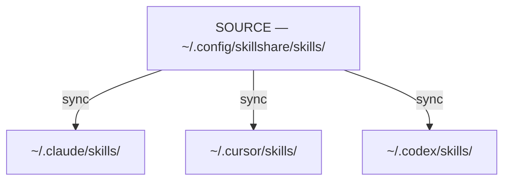
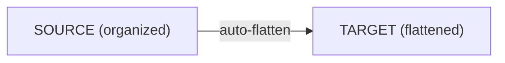

# Source & Targets

skillshare の核となるモデル: 1 つの source から多数の target へ。

:::tip これが重要になる場面
Source と target の違いを理解すると、Skill やエージェントをどこで編集すべきか(常に source で編集し、変更は symlink 経由で反映される)、なぜ `sync` が別ステップになっているのか、そして `collect` が逆方向にどう動くのかがわかります。
:::

## 問題

skillshare がない場合、AI CLI ごとに Skill を個別に管理することになります。

```
~/.claude/skills/         # ここで編集
  └── my-skill/

~/.cursor/skills/         # ここにコピー
  └── my-skill/           # もう同期が取れていない!

~/.codex/skills/          # そしてここにも
  └── my-skill/           # これも同期が取れていない!
```

**問題点:**
- ある場所での編集が他に伝播しない
- 時間が経つにつれて Skill が乖離していく
- 単一の信頼できる情報源が存在しない

---

## 解決策

skillshare は、すべての **target** に同期する **source ディレクトリ** を導入します。



**メリット:**
- source で編集 → すべての target が即座に更新される
- target で編集 → 変更は(symlink 経由で)source に反映される
- 単一の信頼できる情報源

---

## なぜ Sync は別ステップなのか {#why-sync-is-a-separate-step}

`install`、`update`、`uninstall` のような操作は **source** ディレクトリのみを変更します。別途 `sync` ステップを実行することで、すべての target に変更が伝播します。この 2 段階の設計は意図的なものです。

**伝播前にプレビューできる** — `sync --dry-run` を実行すると、すべての target に何が反映されるかを適用前に確認できます。特に `uninstall` や `--force` を使った操作の後に有用です。

**複数の変更をまとめて反映できる** — 5 つの Skill をインストールしてから、一度だけ sync を実行します。分離されていなければ、install のたびにすべての target で全スキャンと symlink 更新が発生してしまいます。

**デフォルトで安全** — source の変更はステージングされるだけで、即座に反映されるわけではありません。target がいつ更新されるかは自分でコントロールできます。さらに、`uninstall` は Skill を完全に削除するのではなく、trash ディレクトリ(7 日間保持)に移動するため、誤って削除しても復元できます。

:::tip 例外: pull
`pull` は `git pull` の後に自動的に sync を実行します。その意図が「リモートからすべてを最新の状態にする」ことである以上、自動 sync は期待される動作と一致します。
:::

:::info Sync が不要な場合
既存の Skill を編集する場合は sync は不要です。symlink により、変更はすべての target にすぐに反映されます。sync が必要になるのは、Skill の構成が変わったとき(追加、削除、リネーム)や、target・mode が変わったときだけです。
:::

---

## Source ディレクトリ

**デフォルトの場所:** `~/.config/skillshare/skills/`

ここは以下を行う場所です。

- Skill を作成・編集する
- Skill がインストールされる
- Git が変更を追跡する(マシン間の同期のため)

:::tip Symlink された source ディレクトリ
source ディレクトリは symlink にすることができます。dotfiles マネージャー(GNU Stow、chezmoi、yadm)を使う場合によく見られる構成です。たとえば `~/.config/skillshare/skills/ → ~/dotfiles/ss-skills/` のように設定します。skillshare はスキャン前に symlink を解決するため、すべてのコマンドが透過的に動作します。連鎖した symlink もサポートされています。
:::

**構造:**
```
~/.config/skillshare/skills/
├── my-skill/
│   └── SKILL.md
├── code-review/
│   └── SKILL.md
├── _team-skills/          # Tracked repo(アンダースコア接頭辞)
│   ├── frontend/
│   │   └── ui/
│   └── backend/
│       └── api/
└── ...
```

### フォルダで整理する(自動フラット化) {#organize-with-folders-auto-flattening}

フォルダを使って自分の Skill を整理できます。target に同期される際は自動的にフラット化されます。



**メリット:**
- プロジェクト、チーム、カテゴリ別に Skill を整理できる
- 手動でのフラット化は不要
- AI CLI 側は期待通りのフラットな構造を受け取る
- フォルダ名がトレーサビリティのための接頭辞になる

---

## Agents Source

Agent は Skill と並ぶリソースの種類です。`skills/` の隣にある独自の source ディレクトリに置かれ、同じ source-and-targets モデルに従います。

```
~/.config/skillshare/
├── skills/                    # Skill の source(ディレクトリ)
│   └── my-skill/
│       └── SKILL.md
└── agents/                    # エージェントの source(単一の .md ファイル)
    ├── reviewer.md
    └── auditor.md
```

同じ `skillshare init` の実行で両方のディレクトリが作成されます。エージェントは(ネストしたディレクトリのない)単一の `.md` ファイルであり、`skillshare sync`(またはエージェントのみを対象にする `skillshare sync agents`)によって同期されます。

**エージェントをサポートする target。** すべての AI CLI がエージェント用ディレクトリを提供しているわけではありません。対応している target は以下の通りです。

- `~/.claude/agents/` — Claude Code
- `~/.cursor/agents/` — Cursor
- `~/.augment/agents/` — Augment
- `~/.config/opencode/agents/` — OpenCode
- `~/.factory/droids/` — Droid

それ以外の target は、エージェント同期時に(`target(s) skipped for agents (no agents path)` という警告とともに)黙ってスキップされます。Skill に適用されるのと同じ merge / copy / symlink モードが、エージェントにも適用されます。

エージェントファイルの完全なフォーマット、`.agentignore` のルール、検出のセマンティクスについては [Agents](/docs/understand/agents) を参照してください。

---

## カスタム Source ディレクトリ

デフォルトでは、global mode は Skill を `~/.config/skillshare/skills/` から、エージェントを `~/.config/skillshare/agents/` から読み込み、extras の親ディレクトリは Skill の source から導出されます。v0.19.16 以降、任意のトップレベルの `sources` マップを使うことで、これらのいずれかを上書きできます。

```yaml
# ~/.config/skillshare/config.yaml
sources:
  skills: ~/work/skills
  agents: ~/work/agents
  extras: ~/work/extras
targets:
  claude:
    skills:
      path: ~/.claude/skills
```

各キーは任意です。キーを省略すると組み込みのデフォルトが使われます。パスは `~`(ホームディレクトリの展開)と絶対パスの両方をサポートします。

**よくある構成:**

```yaml
# 3 つすべてを共有の dotfiles ディレクトリに向ける
sources:
  skills: ~/dotfiles/skillshare/skills
  agents: ~/dotfiles/skillshare/agents
  extras: ~/dotfiles/skillshare/extras

# skills のみ上書きし、agents と extras はデフォルトのまま
sources:
  skills: ~/projects/team-skills
```

### 後方互換性

v0.19.16 より前のトップレベルフィールドも引き続き受け付けられ、変更なく動作し続けます。

```yaml
# レガシー形式 — 完全にサポートされ、保存時の自動移行はない
source: ~/.config/skillshare/skills
agents_source: ~/.config/skillshare/agents
extras_source: ~/.config/skillshare/extras
```

両方の形式が存在する場合、`sources.<key>` の値が対応するレガシーフィールドより優先されます。既存の設定が自動で書き換えられることはなく、新しく `skillshare init` を実行した場合にのみ新しい `sources:` 形式が出力されます。

### これが重要になる場面

同じ機能が project mode にも存在します(project mode での形式については [Project Skills](/docs/understand/project-skills#custom-source-directories) を参照してください。こちらはプロジェクトルートからの相対パスもサポートしています)。

---

## Targets

Target とは、skillshare が同期する先の AI CLI の Skill ディレクトリです。

**よく使われる target:**
- `~/.claude/skills/` — Claude Code
- `~/.cursor/skills/` — Cursor
- `~/.agents/skills/` — OpenAI Codex CLI（共有の `universal` ディレクトリ）
- `~/.gemini/config/skills/` — Antigravity（アプリ）
- `~/.gemini/antigravity-cli/skills/` — Antigravity CLI
- `~/.gemini/skills/` — Gemini CLI
- その他 [64 以上](/docs/reference/targets/supported-targets)

**自動検出:** `skillshare init` を実行すると、インストール済みの AI CLI を自動的に検出し、target として追加します。

**手動での追加:**
```bash
skillshare target add myapp ~/.myapp/skills
```

---

## Sync の仕組み

### Source → Targets(`sync`)

```bash
skillshare sync
```

各 target から source への symlink を作成します。

```
~/.claude/skills/my-skill → ~/.config/skillshare/skills/my-skill
```

### Target → Source(`collect`)

```bash
skillshare collect claude
```

target からローカルの Skill を source に回収します。

1. target 内で symlink になっていない Skill を見つける
2. それらを source にコピーする(`.git/` ディレクトリは自動的に除外される)
3. symlink に置き換える

---

## Skill の編集

target は source に symlink されているため、どこからでも編集できます。

**source で編集する:**
```bash
$EDITOR ~/.config/skillshare/skills/my-skill/SKILL.md
# 変更はすべての target に即座に反映される
```

**target で編集する:**
```bash
$EDITOR ~/.claude/skills/my-skill/SKILL.md
# 変更は(symlink 経由で同じファイルとして)source に反映される
```

---

## 関連ページ

- [sync](/docs/reference/commands/sync) — source から target へ変更を伝播する
- [collect](/docs/reference/commands/collect) — target から Skill を source に取り込む
- [Sync Modes](./sync-modes.md) — ファイルのリンク方法(merge、copy、symlink)
- [Agents](./agents.md) — エージェントのリソースモデルと検出
- [Configuration](/docs/reference/targets/configuration) — target 設定のリファレンス
