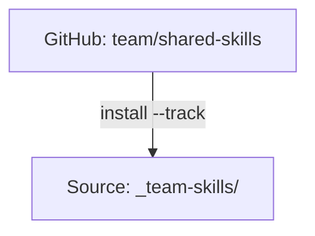

# 追跡リポジトリ

チーム共有と簡単な更新のために `--track` でインストールされた Git リポジトリです。

:::tip これはいつ重要ですか？
追跡リポジトリは、組織が共有 Skill を配布する方法です。`--track` で一度インストールすれば、あとは 1 つのコマンドで更新できます。変更はメンテナーのリポジトリからすべてのチームメンバーへと伝わります。
:::

## 概要

追跡リポジトリは、`.git` ディレクトリを保持したまま Source にクローンされる git リポジトリです。これにより次のことが可能になります。

- **チーム共有**: 全員が同じリポジトリをインストールします
- **簡単な更新**: `skillshare update <name>` が git pull を実行します
- **バージョン管理**: どのコミットにいるかを追跡できます



---

## 通常の Skill vs 追跡リポジトリ

| 項目 | 通常の Skill | 追跡リポジトリ |
|--------|---------------|--------------|
| Source | Source にコピーされる | `.git` 付きでクローンされる |
| 更新 | `install --update` | `update <name>`（git pull） |
| プレフィックス | なし | `_` プレフィックス |
| ネストされた Skill | フラット化される | `__` でフラット化される |

---

## 追跡リポジトリのインストール

```bash
skillshare install github.com/team/shared-skills --track
skillshare sync
```

**何が起こるか:**
1. リポジトリが `~/.config/skillshare/skills/_team-skills/` にクローンされます
2. `.git` ディレクトリが保持されます
3. クローンディレクトリは管理対象の `.gitignore` ブロックに追加され、マシンローカルにとどまり、ネストされた git リポジトリとしてコミットされないようになります
4. リポジトリ全体が、有効なインストールしきい値（`audit.block_threshold` または `--threshold`）を使ってセキュリティ監査されます
5. ネストされた Skill は AI CLI 向けにフラット化されます

検出結果がしきい値に達した場合、`--force` を使わない限りインストールはブロックされます。ブロックされた場合、skillshare はクローンされたリポジトリを自動的に削除します。クリーンアップに失敗した場合は、手動でクリーンアップするための正確なパスがコマンドから報告されます。

---

## アンダースコアのプレフィックス

追跡リポジトリは、通常の Skill と区別するために `_` がプレフィックスとして付けられます。

```
~/.config/skillshare/skills/
├── my-skill/           # Regular skill (no prefix)
├── code-review/        # Regular skill
└── _team-skills/       # Tracked repo (underscore prefix)
```

---

## ネストされた Skill と自動フラット化 {#nested-skills--auto-flattening}

Skill リポジトリでは、Skill をフォルダで整理することがよくあります。skillshare はそれらを AI CLI 向けに自動的にフラット化します。

```
SOURCE                              TARGET
(your organization)                 (what AI CLI sees)
────────────────────────────────────────────────────────────
_team-skills/
├── frontend/
│   ├── react/          ───►   _team-skills__frontend__react/
│   └── vue/            ───►   _team-skills__frontend__vue/
├── backend/
│   └── api/            ───►   _team-skills__backend__api/
└── devops/
    └── deploy/         ───►   _team-skills__devops__deploy/

• _ prefix = tracked repository
• __ (double underscore) = path separator
```

### なぜ自動フラット化するのか？

| メリット | 説明 |
|---------|------|
| **AI CLI との互換性** | ほとんどの AI CLI は、ネストされたフォルダではなくフラットなディレクトリに Skill があることを想定しています |
| **整理構造の維持** | CLI の要件を満たしながら、Source 内では論理的なフォルダ構造を保てます |
| **追跡可能性** | フラット化された名前から元のパスがわかります（例: `_team__frontend__react` → `_team/frontend/react/` 由来） |
| **手作業不要** | skillshare が Sync 時に変換を自動的に処理します |

**あなたが整理し、skillshare が適応します。** どんなフォルダ構造で Skill を書いても、どこでも動作します。

:::tip
自動フラット化は追跡リポジトリだけでなく、**すべての Skill** で機能します。個人の Skill もフォルダで整理できます。詳しくは [フォルダで整理する](/docs/understand/source-and-targets#organize-with-folders-auto-flattening) を参照してください。
:::

---

## 新規クローン後の復元 {#rehydrating-after-a-fresh-clone}

追跡リポジトリのクローンディレクトリは、独自の `.git` ディレクトリを含むため、意図的に git から無視されます。新しいマシンで skillshare の Source リポジトリをクローンまたは pull した場合、`.metadata.json` にはすでに追跡リポジトリが宣言されているのに、`_team-skills/` のクローンディレクトリがまだ存在しないという状態になることがあります。

引数なしで install を実行すると、メタデータから不足している追跡リポジトリのクローンを再作成できます。

```bash
skillshare install
skillshare sync
```

Project mode の場合は、次を実行します。

```bash
skillshare install -p
skillshare sync -p
```

`status`、`check`、`update --all`、`doctor` は、不足している追跡リポジトリのクローンを黙って無視するのではなく報告し、`skillshare install` の実行を提案します。

---

## 追跡リポジトリの更新

### 単一のリポジトリ

```bash
skillshare update _team-skills
skillshare sync
```

### すべての追跡リポジトリ

```bash
skillshare update --all
skillshare sync
```

**何が起こるか:**
```
cd ~/.config/skillshare/skills/_team-skills
git pull origin main
```

**更新時のセキュリティ動作:**
- 更新されたコンテンツは pull 後に監査されます。
- ブロックには有効なしきい値が使われます（デフォルトは `audit.block_threshold`、またはコマンドごとの `--threshold`/`-T` による上書き）。
- TTY モードでは、検出結果がしきい値に達すると `skillshare update` が確認を求めます。非 TTY モードでは（`--skip-audit` を使わない限り）自動的にロールバックします。
- 拒否された場合、追跡リポジトリはローカルの状態を保持するために直前のコミットへロールバックします。
- ロールバックのベースライン取得に失敗した場合、安全のため update は中止されます（フェイルクローズ）。

---

## アンインストール

```bash
skillshare uninstall _team-skills
```

**何が起こるか:**
1. 未コミットの変更がないか確認します（見つかった場合は警告します）
2. ディレクトリを削除します
3. 次の `sync` で Target からシンボリックリンクが削除されます

---

## Project mode

追跡リポジトリは Project mode でも動作します。リポジトリは `.skillshare/skills/` にクローンされ、`.skillshare/.gitignore` に追加されます（これにより、追跡リポジトリの git 履歴がプロジェクトの git と競合しなくなります）。プロジェクトのログ（`.skillshare/logs/`）、trash（`.skillshare/trash/`）、バックアップ（`.skillshare/backups/`）もデフォルトで無視されます。

追跡リポジトリをインストールすると、`.skillshare/.metadata.json` に `tracked: true` が自動的に記録されるため、新しいチームメンバーは `skillshare install -p` を通じて正しいクローン動作を得られます。

```json
{
  "skills": [
    {
      "name": "_team-shared-skills",
      "source": "github.com/team/shared-skills",
      "tracked": true
    }
  ]
}
```

```bash
# Install tracked repo into project
skillshare install github.com/team/shared-skills --track -p
skillshare sync

# Update via git pull
skillshare update team-skills -p
skillshare sync

# Force update (discard local changes)
skillshare update team-skills -p --force

# Uninstall
skillshare uninstall team-skills -p
```

**ディレクトリ構造:**

```
<project-root>/
└── .skillshare/
    ├── .gitignore           # Contains: logs/, trash/, and skills/_team-skills
    └── skills/
        └── _team-skills/    # Tracked repo with .git/ preserved
            ├── .git/
            ├── frontend/ui/
            └── backend/api/
```

プロジェクトのログを意図的にコミットしたい場合は、`.skillshare/.gitignore` の管理対象ブロックの後に `!logs/` と `!logs/*.log` を追加してください。

ネストされた Skill は、global mode と同じ方法で自動的にフラット化されます — `_team-skills/frontend/ui` は Target 上で `_team-skills__frontend__ui` になります。

---

## カスタム名

```bash
skillshare install github.com/team/skills --track --name acme-skills
# Installed as: _acme-skills/
```

`--track --name` の名前に関する制約:
- `_` で始まる追跡リポジトリのディレクトリ名に解決される必要があります。
- パス区切り文字（`/`、`\`）や親ディレクトリへのトラバーサル（`..`）を含んではいけません。
- 無効な名前はクローン前に拒否されます。

---

## ブランチのトラッキング

リポジトリの特定のブランチを追跡できます。

```bash
skillshare install github.com/team/skills --track --branch frontend
```

追跡リポジトリは指定されたブランチをクローンし、それに追従します。`skillshare update` による更新は、自動的にそのブランチから pull します。

同じリポジトリを複数のブランチにインストールするには、名前の衝突を避けるために `--name` を使用します。

```bash
skillshare install github.com/team/skills --track --branch frontend --name team-frontend
skillshare install github.com/team/skills --track --branch backend --name team-backend
```

ブランチは、通常の（追跡されない）インストールでも機能します。

```bash
skillshare install github.com/team/skills --branch develop --all
```

ブランチは Skill のメタデータに永続化されるため、`skillshare update` と `skillshare check` は自動的に正しいブランチを使用します。

---

## 衝突の検出

複数の Skill が同じ `name` フィールドを共有している場合、sync は `include`/`exclude` フィルターの適用後に、それらが実際に同じ Target に配置されるかどうかを確認します。

**フィルターによって衝突が分離される場合** — 情報提供のみ:

```
ℹ Duplicate skill names exist but are isolated by target filters:
  'ui' (2 definitions)
```

**衝突が同じ Target に達する場合** — 対応が必要な警告:

```
⚠ Target 'claude': skill name 'ui' is defined in multiple places:
  - _team-a/frontend/ui
  - _team-b/components/ui
Rename one in SKILL.md or adjust include/exclude filters
```

**ベストプラクティス** — Skill に名前空間を付けるか、フィルターを使用します:

```yaml
# Option 1: Namespace in SKILL.md
name: team-a-ui

# Option 2: Route with filters (global config)
targets:
  codex:
    path: ~/.codex/skills
    include: [_team-a__*]
  claude:
    path: ~/.claude/skills
    include: [_team-b__*]
```

```yaml
# Option 2: Route with filters (project config)
targets:
  - name: claude
    exclude: [codex-*]
  - name: codex
    include: [codex-*]
```

完全な構文と例については、[Target フィルター](/docs/reference/targets/configuration#include--exclude-target-filters) を参照してください。

---

## 関連項目

- [install](/docs/reference/commands/install) — `--track` でインストール
- [update](/docs/reference/commands/update) — 最新の変更を pull
- [check](/docs/reference/commands/check) — 利用可能な更新を確認
- [Organization-Wide Skills](/docs/how-to/sharing/organization-sharing) — チーム共有ガイド
