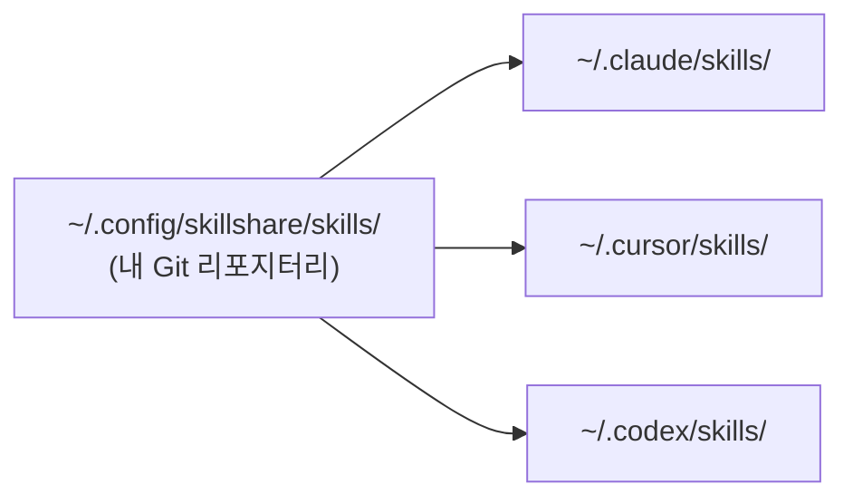

# 시작하기

skillshare는 하나의 Source 디렉터리를 머신에 설치된 모든 AI CLI의 Skill 디렉터리와 동기화된 상태로 유지합니다. Skill을 한 번만 작성하거나 설치하면, symlink(심볼릭 링크)를 통해 Claude, Cursor, Codex 등 설정된 모든 Target에 나타납니다.



Source는 여러분이 소유한 평범한 Git 리포지터리입니다. 한 머신에서 push하고 다른 머신에서 pull하고 동료와 공유하면, 그 아래의 symlink 계층은 skillshare가 알아서 처리합니다.

## Source에는 무엇이 있나요

Source 디렉터리에는 세 종류의 Skill이 함께 존재합니다. 차이는 Git이 어떻게 추적하는지와 어떻게 업데이트하는지뿐입니다.

**직접 작성한 Skill.** `skillshare new <name>`으로 만들거나 폴더를 그냥 넣어두면 됩니다. 리포지터리에 커밋되며, 편집으로 업데이트합니다.

**Vendored Skill.** `skillshare install <url>`로 설치합니다. 클론이 리포지터리 안에 직접 들어가서 여러분의 작업과 함께 커밋됩니다. `.metadata.json`이 upstream URL을 기록해 두므로 나중에 `skillshare update`로 새 버전을 받아올 수 있습니다. 직접 커스터마이즈하거나, 버전을 고정하거나, 오프라인에서도 재현 가능하게 유지하고 싶을 때 사용하세요.

**Tracked Skill.** `skillshare install <url> --track`으로 설치합니다. 클론이 `_` 접두어가 붙은 디렉터리에 놓이고 자동으로 `.gitignore`에 추가되므로 리포지터리에 들어가지 않습니다. `skillshare update`가 upstream에서 다시 pull해 옵니다. 수정할 생각이 없는 회사나 커뮤니티 리포지터리에 사용하세요.

몇 달 사용한 뒤의 전형적인 Source는 다음과 같습니다.

```
~/.config/skillshare/skills/
├── my-review/                 # authored
├── my-deploy-checklist/       # authored
├── agent-browser/             # vendored
├── skill-creator/             # vendored
├── _company-skills/           # tracked  (gitignored)
└── _team-rules/               # tracked  (gitignored)
```

## 시작 지점 고르기

| 이런 상황이라면… | 여기서 시작하세요 |
|---|---|
| skillshare를 처음 설정하는 경우 | [첫 Sync](./first-sync.md) |
| 이미 Claude / Cursor / Codex에 Skill이 있는 경우 | [기존 Skill에서 시작하기](./from-existing-skills.md) |
| 명령 문법을 빠르게 찾아야 하는 경우 | [빠른 참조](./quick-reference.md) |
| 설치 없이 둘러보고 싶은 경우 | [Docker Playground](/docs/how-to/advanced/docker-sandbox#playground) |

## 다음 단계

- [핵심 개념](/docs/understand) — Source, Target, Sync 모드 자세히 보기
- [일상 워크플로](/docs/how-to/daily-tasks/daily-workflow) — 평소 사용법
- [명령 레퍼런스](/docs/reference/commands) — 전체 명령 레퍼런스
