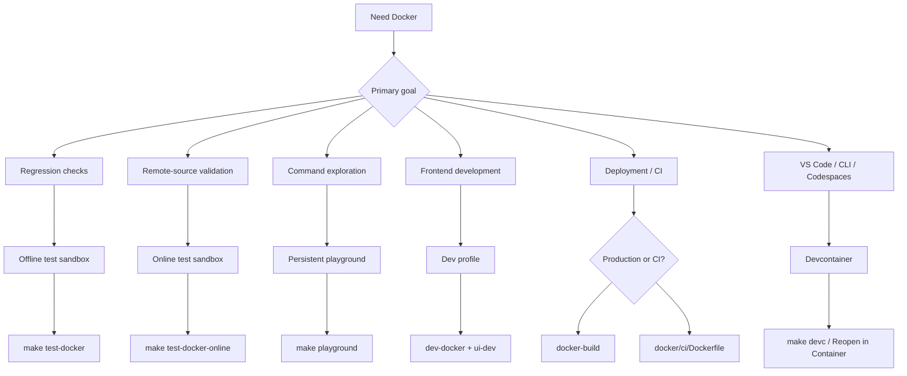

# Docker: 테스트, 개발, 배포

반복 가능한 테스트, Go 없이 진행하는 프런트엔드 개발, 프로덕션 배포, CI에서의 자동화된 skill 검증에 Docker를 사용하세요.

## 모드 선택 다이어그램



명령어 매핑:

| 명령 | `mise` | `make` |
|---|---|---|
| 테스트 (오프라인) | `mise run test:docker` | `make test-docker` |
| 테스트 (온라인) | `mise run test:docker:online` | `make test-docker-online` |
| **Playground** (시작 + 쉘) | **`mise run playground`** | **`make playground`** |
| Playground (중지) | `mise run playground:down` | `make playground-down` |
| Sandbox (고급) | — | `./scripts/sandbox.sh <up\|down\|shell\|reset\|status\|logs\|bare>` |
| **Devcontainer** (시작 + 쉘) | **`mise run devc`** | **`make devc`** |
| Devcontainer (시작만) | `mise run devc:up` | `make devc-up` |
| Devcontainer (중지) | `mise run devc:down` | `make devc-down` |
| Devcontainer (재시작) | `mise run devc:restart` | `make devc-restart` |
| Devcontainer (완전 초기화) | `mise run devc:reset` | `make devc-reset` |
| Devcontainer (상태) | `mise run devc:status` | `make devc-status` |
| Dev API 서버 | `mise run dev:docker` | `make dev-docker` |
| Dev 중지 | `mise run dev:docker:down` | `make dev-docker-down` |
| Docker 빌드 | `mise run docker:build` | `make docker-build` |
| Docker 멀티아치 | `mise run docker:build:multiarch` | `make docker-build-multiarch` |

## 무엇에 사용할 수 있나요

| 모드 | 적합한 용도 | 네트워크 | 라이프사이클 |
|------|----------|---------|-----------|
| 오프라인 테스트 샌드박스 | 안정적인 회귀 검사 (`build + unit + integration`) | 비활성화 | 일회성 |
| 온라인 테스트 샌드박스 | 선택적인 원격 install/update 검사 | 활성화 | 일회성 |
| 인터랙티브 playground | 수동 명령어 탐색 및 데모 | 활성화 | 지속형 |
| Dev profile | Docker 내 Go API 서버 + 호스트의 Vite HMR | 활성화 | 지속형 |
| Devcontainer | VS Code / Codespaces 원클릭 개발 환경 | 활성화 | 지속형 |
| Production 이미지 | 경량 배포 (`docker/production/`) | 활성화 | 지속형 |
| CI 이미지 | 파이프라인에서의 skill 검증 (`docker/ci/`) | 활성화 | 일회성 |

---

## 일반적인 시나리오

### 1. 로컬 install/update 로직을 결정적으로 검증하기

`install` / `update` 동작을 변경하면서 CI와 유사한 로컬 게이트를 원할 때 사용하세요.

```bash
mise run test:docker
make test-docker
```

이는 local-path 및 `file://` 워크플로를 격리된 환경에서 검증합니다.

### 2. 선택적인 원격 소스 검사 실행

네트워크 접근이 필요한 GitHub/원격 소스 검증에 사용하세요.

```bash
make test-docker-online
```

### 3. 전용 playground를 열고 모든 명령어 탐색하기 {#playground}

시작하고 진입하는 명령어 하나:

```bash
make playground
mise run playground
```

playground 내부에서는 `skillshare`와 `ss`를 바로 사용할 수 있습니다. Global mode와 Project mode 모두 사전 초기화되어 있습니다.

```bash
skillshare --help
ss status
skillshare list
```

### Playground의 Project Mode

playground는 샘플 skill과 `claude` target이 포함된 데모 프로젝트를 `~/demo-project`에 자동으로 설정합니다. 바로 project mode를 탐색할 수 있습니다.

```bash
cd ~/demo-project
skillshare status        # project mode를 자동 감지
skillshare list
skillshare sync --dry-run
```

웹 대시보드를 실행하려면 내장 alias를 사용하세요.

```bash
skillshare-ui            # global mode 대시보드 → http://localhost:19420
skillshare-ui-p          # project mode 대시보드 (~/demo-project) → http://localhost:19420
```

그런 다음 호스트 머신에서 `http://localhost:19420`을 여세요 (포트는 Docker Compose를 통해 매핑됩니다).

### GitHub Token (Search용)

playground는 `skillshare search`를 위해 호스트에서 GitHub token을 자동으로 가져옵니다. 순서대로 확인합니다: `$GITHUB_TOKEN` → `$GH_TOKEN` → `gh auth token`. 이미 호스트에서 인증되어 있다면 추가 설정이 필요 없습니다.

```bash
# 감지되지 않으면 playground를 시작하기 전에 설정하세요:
export GITHUB_TOKEN=ghp_your_token_here
make playground
```

완료되면:

```bash
make playground-down
```

---

## 역할별 사용 사례

### 개인 개발자

| 시나리오 | 사용할 것 | 대체하는 것 |
|----------|-------------|-----------------|
| Go/Node를 설치하지 않고 skillshare 사용해 보기 | `docker run ghcr.io/runkids/skillshare` | Go + Node + pnpm 설치 후 소스에서 빌드 |
| PR을 열기 전에 전체 테스트 스위트 실행 | `make test-docker` | 로컬 툴체인 의존 (Go 버전 불일치 = 결과 불안정) |
| Go를 설치하지 않고 프런트엔드 작업 | `make dev-docker` + `cd ui && pnpm run dev` | API 서버 실행을 위해 로컬에 Go 1.25+ 설치 필요 |
| 동료에게 skillshare 데모 보여주기 | `make playground` → `:19420`에서 Web UI | 전체 로컬 설치 과정을 안내 |
| Apple Silicon에서 Linux 동작 검증 | `make docker-build` | CI에 푸시하고 대기 |

### 팀과 오픈소스 기여자

| 시나리오 | 사용할 것 | 해결하는 것 |
|----------|-------------|---------------|
| 신규 기여자 온보딩 | `make playground` — 명령어 하나로 준비 완료 | "Go 설치, PATH 설정, clone, build" 안내서가 더 이상 필요 없음 |
| CI에서 자동화된 skill 품질 게이트 | `docker run ghcr.io/.../skillshare-ci audit /skills` | 이전에는 모든 워크플로에서 Go 설치 및 소스 빌드가 필요했음 |
| 기여자마다 "내 컴퓨터에서는 되는데" 문제 | Docker가 Go 1.25.5 + 모든 의존성을 고정 | 서로 다른 로컬 Go 버전으로 인한 테스트 불안정 |
| 이슈를 재현하는 PR 리뷰어 | `./scripts/test_docker.sh --cmd "go test -run TestXxx ..."` | 재현하려면 clone 및 전체 로컬 설정이 필요 |

### 엔터프라이즈 및 자체 호스팅 배포

| 시나리오 | 사용할 것 | 가치 |
|----------|-------------|-------|
| 내부 skill 관리 대시보드 | Production 이미지 + skill용 volume mount | 컨테이너 하나, 서버에 Go/Node 불필요 |
| Kubernetes 배포 | Production 이미지 (healthcheck + graceful shutdown + non-root) | readiness/liveness probe 준비 완료, PodSecurityPolicy 통과 |
| 자동화된 skill PR 리뷰 | GitHub Actions에서 CI 이미지 + `skillshare audit` | 안전하지 않은 skill의 병합 차단 — 워크플로에 한 줄만 추가 |
| 컨테이너 보안 준수 | `read_only` + `cap_drop: ALL` + `no-new-privileges` | CIS Docker Benchmark, Trivy, Aqua 스캔 통과 |
| 비용 절감을 위한 ARM 서버 (AWS Graviton) | `make docker-build-multiarch` | 에뮬레이션 오버헤드 없는 네이티브 arm64 이미지 |

### 빠른 예시

**skill을 영구 보존하는 자체 호스팅 대시보드:**

```bash
docker run -d \
  -p 19420:19420 \
  -v skillshare-data:/home/skillshare/.config/skillshare \
  ghcr.io/runkids/skillshare
```

**GitHub Actions에서의 CI skill 감사:**

```yaml
- name: Audit skills
  run: |
    docker run --rm \
      -v ${{ github.workspace }}/skills:/skills \
      ghcr.io/runkids/skillshare-ci audit /skills
```

**Kubernetes 배포 (최소):**

```yaml
apiVersion: apps/v1
kind: Deployment
metadata:
  name: skillshare
spec:
  replicas: 1
  template:
    spec:
      containers:
        - name: skillshare
          image: ghcr.io/runkids/skillshare:latest
          ports:
            - containerPort: 19420
          livenessProbe:
            httpGet:
              path: /api/health
              port: 19420
          readinessProbe:
            httpGet:
              path: /api/health
              port: 19420
          securityContext:
            runAsNonRoot: true
            readOnlyRootFilesystem: true
```

---

## Dev Profile {#dev-profile}

Vite HMR로 프런트엔드를 개발하는 두 가지 방법:

**Go가 로컬에 설치된 경우** (명령어 하나):

```bash
make ui-dev              # Go API 서버 + Vite dev 서버를 함께 시작
# http://localhost:5173 열기
```

**Go 없이** (Go API는 Docker에서 실행되며, Go 변경 시 자동으로 재빌드됨):

```bash
# 터미널 1
make dev-docker          # Docker의 Go API + Compose Watch (localhost:19420)

# 터미널 2
cd ui && pnpm run dev    # Vite dev 서버 (localhost:5173, /api를 :19420으로 프록시)

# 완료되면
make dev-docker-down
```

두 방법 모두 `ui/` 변경 사항에 대해 즉각적인 HMR을 제공합니다. Docker 방식은 Go 툴체인을 고정하므로 기여자 간에 백엔드 동작이 일관됩니다. Go 파일을 편집하면 Compose Watch가 변경을 감지해 컨테이너를 재빌드하고 API 서버를 자동으로 재시작합니다. Docker Compose v2.22+가 필요합니다.

**참고:** `make ui-dev`를 사용할 때 Go 코드 변경은 서버 재시작이 필요합니다 (`Ctrl+C` 후 재실행). `make dev-docker`는 Compose Watch를 통해 이를 자동으로 처리합니다.

---

## Devcontainer (VS Code / Codespaces / CLI)

로컬에 Go, Node, pnpm이 필요 없는, 바로 코딩 가능한 컨테이너에서 프로젝트를 여세요. VS Code가 **있어도 없어도** 작동합니다.

:::info Devcontainer vs Playground
둘 다 동일한 기본 이미지와 데모 콘텐츠를 사용합니다. **playground** (`make playground`)는 명령어를 탐색하기 위한 터미널 전용 환경입니다. **devcontainer**는 skillshare 코드베이스 자체를 개발하기 위한 개발 도구(Go, Node, pnpm, air)를 추가한 것으로, VS Code, Codespaces, 또는 일반 터미널에서 사용할 수 있습니다.
:::

### 사전 준비 사항

- [Docker Desktop](https://www.docker.com/products/docker-desktop/) 실행 중
- **옵션 A (터미널):** 추가 도구 불필요 — `make devc`가 모든 것을 처리
- **옵션 B (VS Code):** [Dev Containers](https://marketplace.visualstudio.com/items?itemName=ms-vscode-remote.remote-containers) 확장이 설치된 VS Code

:::tip GitHub Codespaces
GitHub에서 **Code → Codespaces → New codespace**를 클릭하세요. devcontainer 설정이 자동으로 적용됩니다 — 로컬 Docker나 확장이 필요 없습니다.
:::

### 시작하기

**터미널에서** (VS Code 불필요):

```bash
make devc            # 이미지 빌드 → 컨테이너 시작 → 설정 → 쉘 진입
```

첫 실행은 몇 분 걸립니다 (이미지 빌드, 의존성 설치). 이후 실행은 기존 설정을 감지해 바로 쉘로 이동합니다.

기타 라이프사이클 명령어:

```bash
make devc-up         # 시작만 (쉘 없음)
make devc-down       # 컨테이너 중지
make devc-restart    # 재시작 + start-dev.sh 재실행
make devc-reset      # 완전 초기화 (volume 제거), 이후 make devc로 재초기화
make devc-status     # 컨테이너 상태 표시
```

**VS Code에서:**

1. VS Code에서 프로젝트 폴더 열기
2. `Ctrl+Shift+P` (macOS에서는 `Cmd+Shift+P`)를 누르고 **Dev Containers: Reopen in Container** 선택
3. 컨테이너 빌드를 기다리세요 (처음에는 몇 분, 이후에는 빠름)
4. 준비되면 설정 스크립트가 바이너리를 빌드하고 데모 skill을 자동으로 생성합니다

### 포함된 것

devcontainer는 sandbox와 동일한 `docker/sandbox/Dockerfile`을 재사용하므로 다음을 제공합니다.

- Go 1.25 툴체인
- Node.js 24 + pnpm (Docker 이미지에 번들됨) — 컨테이너 내부에서 `make ui-dev`와 `cd website && pnpm start`를 사용할 수 있음
- VS Code 확장: Go, Tailwind CSS, ESLint, Prettier
- 포트 포워딩: `45173` (Vite HMR), `49420` (Go API), `48888` (Docusaurus) — 호스트의 다른 프로젝트와 충돌하지 않도록 의도적으로 흔치 않은 값을 사용
- `/workspace`에 마운트된 소스 코드
- **사전 구성된 데모 환경** — 인터랙티브 playground와 동일:
  - PATH에 등록된 단축 명령어 (`ss`, `ui`, `docs`)
  - 미리 설치된 프런트엔드 의존성 (`ui/`와 `website/`)
  - 전역 데모 skill (audit 예시, 배포 체크리스트)
  - 커스텀 audit 규칙 (global + project)
  - project-mode skill이 포함된 `~/demo-project` 데모 프로젝트

### 컨테이너가 열린 후 빠른 시작

```bash
ss status                 # global mode — 이미 초기화됨
ss list                   # 데모 skill 확인 (flat + nested)
ss audit                  # 커스텀 규칙으로 audit 실행

cd ~/demo-project
ss status                 # project mode를 자동 감지
ss audit                  # project 수준 audit
ui -p                     # API를 project mode로 전환 → http://localhost:45173
```

### 프런트엔드 개발

| 포트 | 서비스 | 명령어 |
|------|---------|---------|
| `45173` | Vite (React UI + HMR) | `ui` 또는 `ui -p` |
| `49420` | Go API 백엔드 | `ui` / `ui -p`로 시작됨 |
| `48888` | Docusaurus | `docs` |

```bash
ui                        # global mode: API + Vite → http://localhost:45173
ui -p                     # project mode: API + Vite → http://localhost:45173
ui stop                   # API + Vite 중지
docs                      # 문서 사이트 → http://localhost:48888
docs stop                 # Docusaurus 중지
```

`ui`는 Go API 백엔드(포트 49420, 백그라운드)와 Vite dev 서버(포트 45173, HMR)를 모두 시작합니다. `ui`와 `ui -p` 사이를 전환하면 새 모드로 API가 자동으로 재시작됩니다. VS Code는 포트를 호스트 브라우저로 자동 포워딩합니다.

### Token 구성

private repo 접근용 token (`GITHUB_TOKEN`, `GITLAB_TOKEN` 등)은 여러 소스에서 올 수 있습니다. 다음 순서로 확인됩니다.

| 우선순위 | 소스 | 설정 방법 |
|----------|--------|-------|
| 1 | `.devcontainer/.env` | `.env.example` → `.env`로 복사, 값 채우기 (gitignore 처리됨) |
| 2 | 호스트 환경 변수 | `~/.zshrc`에 설정 — `devcontainer.json`의 `remoteEnv`를 통해 전달됨 |
| 3 | `gh auth login` | 컨테이너 시작 시 `GITHUB_TOKEN` 자동 감지 (GitHub 전용) |

모든 소스는 선택 사항입니다. 컨테이너 내부에서 언제든 `export`를 수동으로 사용할 수도 있습니다.

현재 상태 확인:

```bash
credential-helper status
```

### Private repo 테스트

VS Code Dev Containers는 호스트의 git credential을 컨테이너로 자동으로 전달합니다. 즉, 명시적인 token 환경 변수가 없어도 private repo의 `git clone`이 성공할 수 있습니다 — 전달된 credential helper가 인증을 조용히 처리합니다.

테스트를 위해 **모든** 인증(credential helper + token 환경 변수)을 비활성화하려면:

```bash
eval "$(credential-helper --eval off)"    # 모두 비활성화
eval "$(credential-helper --eval on)"     # 모두 복원
credential-helper status                  # 현재 상태 확인
```

`--eval` 없이는 git credential helper만 토글됩니다 (token 환경 변수는 계속 활성 상태).

### 테스트 실행

```bash
make test          # unit + integration
make test-unit     # unit만
make lint          # go vet
```

---

## Production 및 CI 이미지

### 이미지 비교

세 가지 Dockerfile은 서로 다른 목적을 가집니다.

| | Production | CI | Sandbox |
|---|---|---|---|
| **이미지** | `ghcr.io/runkids/skillshare` | `ghcr.io/runkids/skillshare-ci` | 로컬 빌드 전용 |
| **Dockerfile** | `docker/production/Dockerfile` | `docker/ci/Dockerfile` | `docker/sandbox/Dockerfile` |
| **베이스** | `debian:bookworm-slim` | `debian:bookworm-slim` | `golang:1.25.5-bookworm` |
| **포함 내용** | git, curl, tini | git만 | Go 툴체인, gh, jq, air, delve, 미리 빌드된 UI |
| **Non-root** | 예 (UID 10001) | 아니오 | 아니오 |
| **PID 1** | tini | 기본값 | 기본값 |
| **Healthcheck** | 예 (`/api/health`) | 아니오 | 아니오 |
| **Entrypoint** | `skillshare ui` (Web 대시보드) | `skillshare` (직접 CLI) | `entrypoint.sh` (테스트 러너) |
| **사용 사례** | 자체 호스팅 대시보드, Kubernetes | CI/CD skill 검증 | 개발, 테스트, playground |
| **GHCR에 게시됨** | 예 | 예 | 아니오 |
| **멀티아키텍처** | amd64 + arm64 | amd64 + arm64 | 호스트 아키텍처만 |

**언제 무엇을 사용할지:**

- **Production** — 서버나 Kubernetes 클러스터에 Web UI 대시보드 배포
- **CI** — GitHub Actions / GitLab CI에서 `audit`, `install --dry-run` 등의 검증 명령어 실행
- **Sandbox** — 로컬 개발 (`make test-docker`, `make playground`, `make dev-docker`)

### Production 이미지

내장된 Web UI가 포함된 경량 production 이미지를 빌드합니다.

```bash
make docker-build                          # 현재 플랫폼만 (빠름, 로컬 테스트용)
make docker-build-multiarch                # linux/amd64 + linux/arm64 (느림, 레지스트리 푸시용)
```

`docker-build`는 사용 중인 머신 아키텍처의 이미지만 생성합니다 — Apple Silicon에서 만든 arm64 이미지는 x86 서버에서 실행되지 않습니다. 레지스트리에 푸시할 때는 모든 플랫폼이 올바른 이미지를 자동으로 받도록 `docker-build-multiarch`를 사용하세요.

production 이미지는 PID 1로 `tini`를 사용하고, non-root 사용자(UID 10001)로 실행되며, healthcheck를 포함하고, 첫 실행 시 config를 자동 초기화합니다. 기본 명령어: `skillshare ui -g --host 0.0.0.0 --no-open`.

게시된 이미지는 GHCR에서 확인할 수 있습니다 (태그 시 자동으로 푸시됨).

```bash
# Pull 및 실행 (amd64 또는 arm64 자동 선택)
docker run -d -p 19420:19420 ghcr.io/runkids/skillshare

# 영구 skill 데이터와 함께
docker run -d -p 19420:19420 \
  -v skillshare-data:/home/skillshare/.config/skillshare \
  ghcr.io/runkids/skillshare
```

### CI 이미지

CI 파이프라인에서 skill을 검증하기 위한 최소 이미지입니다.

```bash
docker build -f docker/ci/Dockerfile -t skillshare-ci .
docker run --rm -v ./my-skills:/skills skillshare-ci audit /skills
```

CI 이미지의 entrypoint는 `skillshare` 자체이므로, 하위 명령어를 직접 전달합니다.

```bash
# threshold를 지정한 audit
docker run --rm -v ./skills:/skills ghcr.io/runkids/skillshare-ci audit /skills --threshold HIGH

# repo 검증을 위한 dry-run install
docker run --rm ghcr.io/runkids/skillshare-ci install org/repo --dry-run
```

### Sandbox 이미지

sandbox 이미지는 로컬 개발 및 테스트 전용입니다 (GHCR에는 게시되지 않음). 전체 Go 툴체인, 개발 도구(air, delve), GitHub CLI, 미리 빌드된 프런트엔드 자산을 포함합니다.

사용처: `make test-docker`, `make test-docker-online`, `make playground`, `make dev-docker`.

사용법은 위의 [Playground](#playground) 및 [Dev Profile](#dev-profile) 섹션을 참고하세요.

### 이미지 태그와 버전 관리

태그 푸시(`v*`) 시, `docker-publish` GitHub Actions 워크플로가 production과 CI 이미지를 멀티아키텍처로 빌드해 GHCR에 푸시합니다.

각 이미지는 세 가지 패턴으로 태그됩니다.

| 태그 패턴 | 예시 | 설명 |
|---|---|---|
| `v<major>.<minor>.<patch>` | `v0.16.1` | 정확한 버전 (불변) |
| `<major>.<minor>` | `0.16` | 이 minor 버전의 최신 patch (rolling) |
| `sha-<short>` | `sha-153464a` | Git commit SHA (불변) |

:::tip
재현성을 위해 production에서는 정확한 버전 태그(`v0.16.1`)를 사용하세요. patch 업데이트를 자동으로 받으려면 minor 태그(`0.16`)를 사용하세요. 특정 커밋에 고정하려면 `sha-` 태그를 사용하세요.
:::

게시된 버전은 [GitHub Packages](https://github.com/runkids/skillshare/pkgs/container/skillshare)에서 확인할 수 있습니다.

---

## 제한 사항 및 유의점

- **Playground와 dev profile은 포트 19420을 공유합니다** — 한 번에 하나만 실행하세요. 다른 쪽을 먼저 중지하세요 (`make playground-down` 또는 `make dev-docker-down`).
- 오프라인 sandbox는 네트워크 의존 기능을 검증할 수 없습니다 (예: GitHub에서의 원격 `install`).
- Playground는 컨테이너 로컬 `HOME`을 사용하므로 실제 호스트의 home config를 직접 수정하지 않습니다.
- Go 코드 변경은 자동으로 반영됩니다 (마운트된 소스에서 컨테이너 내부의 `go build`가 실행됨). **프런트엔드(`ui/`) 변경**은 devcontainer 내부에서 `make ui-dev`(Vite HMR)를 실행할 때 즉시 반영됩니다. devcontainer와 playground 모두 Node.js와 pnpm을 포함합니다.
- 커스텀 실험이 필요하면 명령어를 직접 전달하세요.

```bash
./scripts/test_docker.sh --cmd "go test -v ./tests/integration/..."
./scripts/sandbox_playground_shell.sh "skillshare list"
```

---

## 참고

- [시작하기](/docs/getting-started) — 표준 설정
- [명령어 레퍼런스](/docs/reference/commands) — 전체 명령어
- [문제 해결](/docs/troubleshooting) — 일반적인 문제
