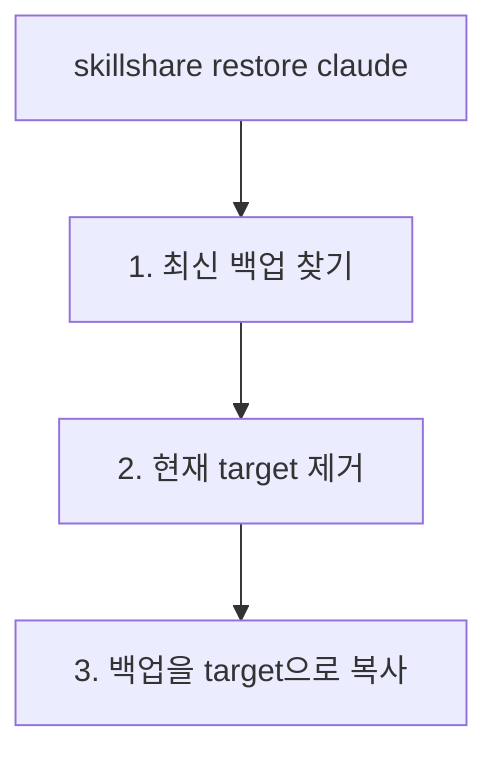

# 백업 및 복원

Skill을 보호하고 실수로부터 복구하세요.

## 개요

skillshare는 자동 백업을 유지하며 수동 backup/restore 명령어를 제공합니다.


---

## 자동 백업

다음 작업 전에 백업이 자동으로 생성됩니다.

- `skillshare sync` (skill target과 agent target)
- `skillshare sync agents` (agent target만)
- `skillshare target remove`

**위치:** `~/.local/share/skillshare/backups/<timestamp>/` (agent 백업은 일반 `<target>/` 디렉터리 옆에 `<target>-agents/`로 나타남).

**범위:** 로컬 target 콘텐츠만 캡처됩니다. Merge 모드 symlink는 source를 가리키고 있어 건너뜁니다 — `sync`가 이를 다시 생성합니다. 자세한 내용은 [백업 대상](/docs/reference/commands/backup#what-gets-backed-up)을 참고하세요.

---

## 수동 백업

### 모든 target

```bash
skillshare backup
```

### 특정 target

```bash
skillshare backup claude
```

### 미리보기

```bash
skillshare backup --dry-run
```

---

## 백업 목록

```bash
skillshare backup --list
```

**출력 예시:**
```
Backups
─────────────────────────────────────────
  2026-01-20_15-30-00/
    claude/    5 skills, 2.1 MB
    cursor/    5 skills, 2.1 MB
  2026-01-19_10-00-00/
    claude/    4 skills, 1.8 MB
```

---

## 복원

### 최신 백업에서

```bash
skillshare restore claude
```

### 특정 백업에서

```bash
skillshare restore claude --from 2026-01-19_10-00-00
```

### 미리보기

```bash
skillshare restore claude --dry-run
```

---

## Restore가 수행하는 작업



**참고:** 복원 후 target에는 (symlink가 아닌) 실제 파일이 포함됩니다. symlink를 다시 설정하려면 `skillshare sync`를 실행하세요.

---

## 오래된 백업 정리

```bash
skillshare backup --cleanup
```

설정된 보존 기간보다 오래된 백업을 제거합니다. 보존 정책은 이미 모든 `sync` 이후 자동으로 실행되므로, 이 명령은 필요할 때 정리하는 용도입니다.

스냅샷이 사용하는 공간을 확인하려면:

```bash
du -sh ~/.local/share/skillshare/backups
skillshare backup --cleanup --dry-run   # 제거될 항목 미리보기
```

백업 범위가 `.gitignore` 및 `ignore:`와 어떻게 다른지는 [백업과 디스크 공간](/docs/reference/commands/backup#backups--disk-space)을 참고하세요.

---

## 복구 시나리오

### symlink를 통해 실수로 skill을 삭제한 경우

```bash
# git이 초기화된 경우 (권장)
cd ~/.config/skillshare/skills
git checkout -- deleted-skill/

# 또는 백업에서 복원
skillshare restore claude
skillshare sync
```

### sync 모드가 엉망이 된 경우

```bash
skillshare restore claude
skillshare target claude --mode merge
skillshare sync
```

### 최근 변경 사항을 되돌리고 싶은 경우

```bash
skillshare backup --list
skillshare restore claude --from <earlier-timestamp>
```

### Agent 복구

Agent는 자체 백업 항목(`<target>-agents`)을 가지며 skill과 동일한 흐름을 따릅니다.

```bash
# 수동 agent 백업
skillshare backup agents claude

# 최신 항목에서 복원
skillshare restore agents claude

# 특정 timestamp에서 복원
skillshare restore agents claude --from 2026-01-19_10-00-00
```

Project mode에서는 agent만 백업하거나 복원할 수 있습니다 — `skillshare backup -p agents`는 작동하지만, 단순 `skillshare backup -p`는 오류가 발생합니다. project-mode 규칙은 [backup](/docs/reference/commands/backup#agent-backup)을 참고하세요.

---

## 모범 사례

### 위험한 작업 전

```bash
skillshare backup
```

### 주요 변경 후

```bash
skillshare push -m "Major update"  # Git 백업
```

### 주간 유지 관리

```bash
skillshare backup --cleanup
```

---

## 백업으로서의 Git

Git은 추가적인 백업 계층을 제공합니다.

```bash
# 삭제된 skill 복구
cd ~/.config/skillshare/skills
git checkout -- deleted-skill/

# 히스토리 보기
git log --oneline

# 이전 커밋으로 복원
git checkout <commit-hash> -- specific-skill/
```

---

## 참고

- [backup](/docs/reference/commands/backup) — backup 명령어 레퍼런스
- [restore](/docs/reference/commands/restore) — restore 명령어 레퍼런스
- [trash](/docs/reference/commands/trash) — 소프트 삭제 관리
- [문제 해결](/docs/troubleshooting) — 문제가 생겼을 때
