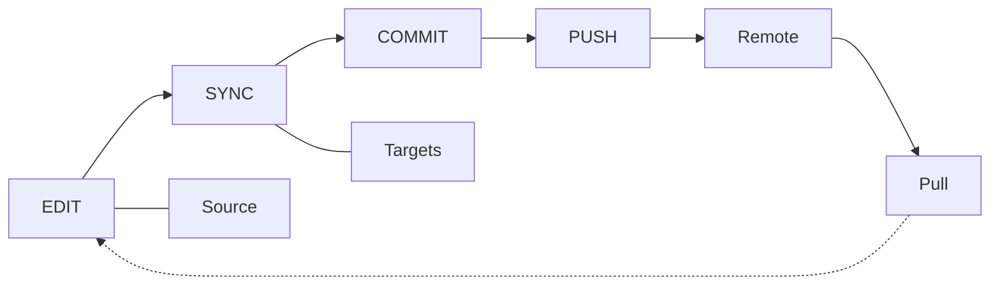

# 일상 워크플로

일상적인 skill 관리를 위한 edit → sync → commit/push/pull 사이클.

## 개요



---

## Skill 편집

### 옵션 1: source에서 편집 (권장)

```bash
$EDITOR ~/.config/skillshare/skills/my-skill/SKILL.md
```

변경 사항은 (symlink를 통해) 모든 target에서 즉시 확인됩니다.

### 옵션 2: target에서 편집

```bash
$EDITOR ~/.claude/skills/my-skill/SKILL.md
```

target이 symlink되어 있으므로 이것은 source 파일을 직접 편집하는 것과 같습니다.

---

## Sync하기

편집 후에는 symlink 덕분에 sync가 **보통 필요하지 않습니다**. 하지만 다음 경우에는 sync를 실행하세요.

- skill을 install하거나 제거한 경우
- sync 모드를 변경한 경우
- target을 추가하거나 제거한 경우
- status에서 "out of sync"가 표시되는 경우

```bash
skillshare sync
```

:::tip Sync가 별도 단계인 이유는?
Sync는 install/update/uninstall과 의도적으로 분리되어 있습니다. 이를 통해 여러 변경 사항을 일괄 처리하고(예: skill 3개 install → sync 한 번), 전파 전에 `--dry-run`으로 미리 보고, target이 언제 업데이트되는지 완전히 통제할 수 있습니다. 자세한 내용은 [Source & Targets: Sync가 별도 단계인 이유](/docs/understand/source-and-targets#why-sync-is-a-separate-step)를 참고하세요.
:::

### 먼저 미리보기

```bash
skillshare sync --dry-run
```

### Agent만 sync

agent만 변경했거나(또는 agent 지원 target에만 agent를 push하고 싶다면) sync 범위를 지정하세요.

```bash
skillshare sync agents
```

`skillshare sync`는 skill과 agent를 한 번에 모두 실행합니다. agent 파일 형식 및 지원 target은 [Agent](/docs/understand/agents)를 참고하세요.

---

## Git 체크포인트와 크로스 머신 Sync

### 로컬 커밋

remote로 push하지 않고 로컬 복원 지점을 원할 때 `commit`을 사용하세요.

```bash
skillshare commit -m "Update draft skill"
```

이것은 다음을 실행합니다.
1. `git add .`
2. `git commit -m "Update draft skill"`

`commit`은 source repo에 remote가 설정되어 있지 않아도 작동합니다.

### 변경 사항 Push (이 머신에서)

git remote를 사용한다면 `push`는 커밋과 공유를 한 명령으로 처리합니다.

```bash
skillshare push -m "Add new skill"
```

이것은 다음을 실행합니다.
1. `git add .`
2. `git commit -m "Add new skill"`
3. `git push`

### 변경 사항 Pull (이 머신으로)

```bash
skillshare pull
```

이것은 다음을 실행합니다.
1. `git pull`
2. `skillshare sync`

---

## 일반적인 일상 작업

### 새 skill 생성

```bash
skillshare new code-review
$EDITOR ~/.config/skillshare/skills/code-review/SKILL.md
skillshare sync
```

### Agent 편집 또는 추가

Agent는 `~/.config/skillshare/agents/`에 있는 단일 `.md` 파일입니다. 편집기로 직접 생성하거나 편집하세요.

```bash
$EDITOR ~/.config/skillshare/agents/reviewer.md
skillshare sync agents
```

`disable` / `enable`은 개별 agent를 삭제하지 않고 `.agentignore`를 통해 토글합니다.

```bash
skillshare disable reviewer --kind agent     # sync에서 제외
skillshare enable reviewer --kind agent      # 다시 활성화
```

### Tracked repo 업데이트

```bash
skillshare update _team-skills
skillshare sync
```

### 모든 tracked repo 업데이트

```bash
skillshare update --all
skillshare sync
```

### 상태 확인

```bash
skillshare status
```

다음을 보여줍니다.
- Source 디렉터리 상태
- Git 상태 (commit ahead/behind)
- Target sync 상태

---

## 팁

### 자동화하기

쉘 시작 스크립트에 추가하세요.
```bash
# ~/.bashrc 또는 ~/.zshrc
alias ss="skillshare"
alias sss="skillshare sync"
alias ssc="skillshare commit"
alias ssp="skillshare push"
alias ssl="skillshare pull"
```

### 중요한 작업 전 확인

```bash
# 하루 시작
skillshare pull
skillshare status

# 커밋 전
skillshare diff
```

### 깔끔하게 유지하기

```bash
# 주간 유지 관리
skillshare audit             # 보안 위협 스캔
skillshare backup --cleanup  # 오래된 백업 제거
skillshare doctor            # 문제 확인
```

---

## 참고

- [sync](/docs/reference/commands/sync) — 핵심 sync 명령어
- [status](/docs/reference/commands/status) — sync 상태 확인
- [commit](/docs/reference/commands/commit) — push 없는 로컬 git 체크포인트
- [push](/docs/reference/commands/push) / [pull](/docs/reference/commands/pull) — 크로스 머신 sync
- [Skill 발견](/docs/how-to/daily-tasks/skill-discovery) — 새 skill 찾기
