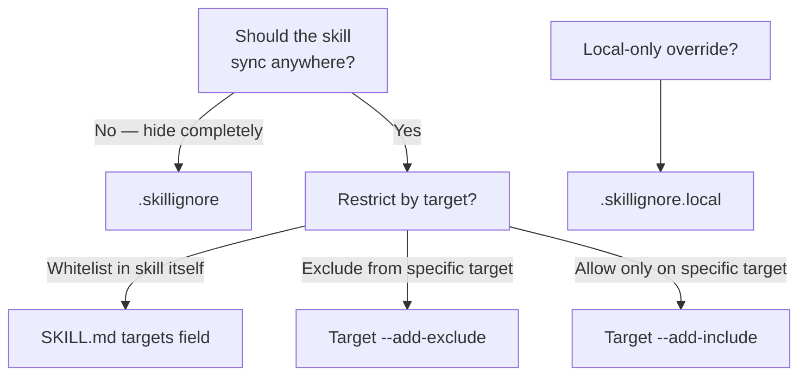

# Skill 필터링

Skillshare는 어떤 skill이 어떤 target에 도달하는지 제어하는 세 가지 필터링 계층을 제공합니다.
목표에 맞는 시나리오를 선택하세요.

## 특정 target에만 skill sync하기

skill의 SKILL.md frontmatter에 `metadata.targets`(권장)를 추가하세요.
해당 skill은 나열된 target에만 sync됩니다.

```yaml
---
name: my-cursor-only-skill
metadata:
  targets: [cursor]
---
```

Target alias가 지원됩니다 — `claude`는 `claude`와 `claude-code` 둘 다와 일치합니다.

📖 [SKILL.md targets 필드](/docs/understand/skill-format#targets) · [필터링 레퍼런스](/docs/reference/filtering#skillmd-targets-field)

## 특정 target에서 특정 skill 제외하기

glob 패턴과 일치하는 skill을 차단하려면 target에 `--add-exclude`를 사용하세요.

```bash
skillshare target cursor --add-exclude "legacy-*"
skillshare sync
```

📖 [Target 필터 플래그](/docs/reference/commands/target#target-filters-includeexclude) · [필터링 레퍼런스](/docs/reference/filtering#target-includeexclude-filters)

## 하나의 target에서 특정 skill만 허용하기

whitelist를 만들려면 `--add-include`를 사용하세요 — 일치하는 skill만 sync됩니다.

```bash
skillshare target claude --add-include "team-*"
skillshare sync
```

📖 [Target 필터 플래그](/docs/reference/commands/target#target-filters-includeexclude) · [필터링 레퍼런스](/docs/reference/filtering#target-includeexclude-filters)

## 모든 target에서 skill 숨기기

source 디렉터리에 `.skillignore` 파일을 두세요. 이 패턴과 일치하는 skill은 discovery 시점에 **모든** target에서 제외됩니다.

```text title="~/.config/skillshare/skills/.skillignore"
drafts/
experimental-*
```

패턴을 추가하거나 제거하는 가장 빠른 방법은 `enable` / `disable` 명령어입니다.

```bash
skillshare disable experimental-*   # .skillignore에 추가
skillshare enable experimental-*    # .skillignore에서 제거
```

`skillshare list` TUI에서 **E**를 눌러 skill을 켜고 끌 수도 있습니다.

📖 [enable / disable](/docs/reference/commands/enable) · [.skillignore 문법](/docs/reference/appendix/file-structure#skillignore-optional) · [필터링 레퍼런스](/docs/reference/filtering#skillignore)

## Tracked repo 내부 skill 제외하기

tracked repo 디렉터리 내부에 `.skillignore`를 두세요. 해당 repo 내의 skill에만 영향을 줍니다.

```text title="_team-repo/.skillignore"
internal-only/*
validation-scripts
```

📖 [Repo 수준 .skillignore](/docs/reference/appendix/file-structure#skillignore-optional)

## 로컬 전용 재정의

`.skillignore.local`은 `.skillignore` 뒤에 추가됩니다 — 마지막에 일치하는 규칙이 우선합니다. negation 패턴을 사용해 공유 파일을 편집하지 않고 로컬에서 skill의 ignore를 해제하세요.

```text title="_team-repo/.skillignore.local"
# The repo ignores private-*, but I need mine
!private-mine
```

이 파일은 커밋하지 마세요 — `.gitignore`에 추가하세요.

📖 [.skillignore.local](/docs/reference/appendix/file-structure#skillignorelocal-optional)

## 어떤 계층을 사용해야 할까요?



## 필터링되는 항목을 확인하는 방법

| 명령어 | 표시되는 내용 |
|---------|--------------|
| `skillshare sync` | 하단에 무시된 skill 수와 이름 |
| `skillshare status --json` | 전체 `.skillignore` 통계 (패턴, 무시된 skill, 활성 파일) |
| `skillshare doctor` | health check에 `.skillignore` 패턴 수와 무시된 수 포함 |
| `skillshare ui` → Sync 페이지 | 배지가 있는 접을 수 있는 "Ignored by .skillignore" 카드 |

## 참고

- [필터링 레퍼런스](/docs/reference/filtering) — 세 계층의 전체 명세
- [Sync 명령어](/docs/reference/commands/sync#per-target-includeexclude-filters) — 필터 동작 예시
- [Target 명령어](/docs/reference/commands/target#target-filters-includeexclude) — include/exclude용 CLI 플래그
