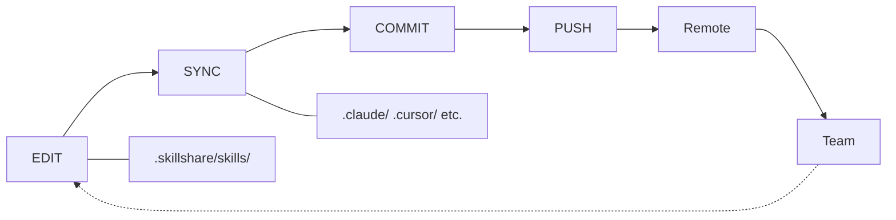

# Project Workflow

프로젝트 수준 Skill 관리를 위한 edit → sync → commit 주기입니다.

## 개요



---

## 팀 협업 시나리오

프로젝트 Skill이 동기화 상태를 유지하는 일반적인 팀 워크플로우입니다:

```
Alice (Skill을 추가함)                    Bob (업데이트를 받음)
──────────────────────                  ──────────────────────
skillshare new api-guide -p
$EDITOR .skillshare/skills/api-guide/
skillshare sync
git add . && git commit && git push
                                        git pull
                                        skillshare install -p
                                        skillshare sync
                                        → api-guide now in .claude/skills/
```

Bob은 어떤 Skill이 추가되었는지 알 필요가 없습니다 — `skillshare install -p`가 설정 파일을 읽어 목록에 있는 모든 것을 설치합니다.

---

## 일반적인 작업

### 새 Skill 추가

```bash
# Skill 생성
skillshare new my-skill -p
$EDITOR .skillshare/skills/my-skill/SKILL.md

# Target에 동기화
skillshare sync

# 커밋
git add .skillshare/
git commit -m "Add my-skill"
```

### 새 Agent 추가

Agent는 단일 `.md` 파일이며, `.skillshare/agents/` 바로 아래에 직접 생성합니다:

```bash
# Agent 파일 생성
$EDITOR .skillshare/agents/my-agent.md

# Agent를 지원하는 Target에 동기화(claude, cursor, augment, opencode)
skillshare sync agents

# 커밋
git add .skillshare/agents/
git commit -m "Add my-agent"
```

`skillshare sync`(`agents` 없이)는 Skill과 Agent를 한 번에 동기화합니다. 파일을 삭제하지 않고 `.skillshare/agents/.agentignore`에 항목을 추가하려면 `skillshare disable my-agent --kind agent -p`를 사용하세요.

### 원격 Skill 설치

```bash
# GitHub에서 설치
skillshare install anthropics/skills/skills/pdf -p

# Target에 동기화
skillshare sync

# 설정 변경 사항 커밋
git add .skillshare/
git commit -m "Add pdf skill from anthropic"
```

### 원격 Skill 업데이트

```bash
# 특정 Skill 업데이트
skillshare update pdf -p

# 또는 모든 원격 Skill 업데이트
skillshare update --all -p

# 업데이트된 Skill 동기화
skillshare sync

# 설정이 변경되었다면 커밋
git add .skillshare/
git commit -m "Update remote skills"
```

### Skill 제거

```bash
# 제거
skillshare uninstall my-skill -p

# 심볼릭 링크를 정리하기 위해 동기화
skillshare sync

# 커밋
git add .skillshare/
git commit -m "Remove my-skill"
```

### 프로젝트에 합류할 때

신규 팀원이든, 오픈소스 기여자든, 커뮤니티 템플릿을 사용해보려는 사람이든 — 설정 방법은 동일합니다:

```bash
# 프로젝트 클론
git clone github.com/team/project
cd project

# 설정 파일에 나열된 원격 Skill 설치
skillshare install -p

# Target에 동기화
skillshare sync
```

`config.yaml`은 이동 가능한 Skill 매니페스트 역할을 하므로 — 수동으로 Skill을 찾아다닐 필요가 없습니다.

---

## Target 관리

### Target 추가

```bash
# 알려진 Target 추가
skillshare target add windsurf -p

# 경로를 지정한 커스텀 Target 추가
skillshare target add custom-tool ./tools/ai/skills -p

# 새 Target에 동기화
skillshare sync
```

### Target 제거

```bash
skillshare target remove windsurf -p
```

### Target 목록 보기

```bash
skillshare target list -p
```

```
Project Targets
  claude    .claude/skills (merge)
  cursor         .cursor/skills (merge)
```

---

## 상태 확인

```bash
skillshare status
```

```
Project Skills (.skillshare/)

Source
  ✓ .skillshare/skills (3 skills)

Targets
  ✓ claude       [merge] .claude/skills (3 synced)
  ✓ cursor       [merge] .cursor/skills (3 synced)

Remote Skills
  ✓ pdf          anthropic/skills/pdf
  ✓ review       github.com/team/tools
```

---

## Skill 목록 보기

```bash
skillshare list
```

```
Installed skills (project)
─────────────────────────────────────────
  → my-skill            local
  → pdf                 anthropic/skills/pdf
  → review              github.com/team/tools

→ 3 skill(s): 2 remote, 1 local
```

---

## 웹 대시보드

시각적으로 프로젝트 Skill을 관리하려면 웹 UI를 사용하세요:

```bash
skillshare ui -p
```

또는 `.skillshare/config.yaml`이 존재한다면(자동 감지됨) 그냥 `skillshare ui`만 실행해도 됩니다. 대시보드는 Git Sync를 숨기고(프로젝트 자체 git을 사용하세요) `.skillshare/config.yaml`을 직접 수정합니다.

---

## 팁

### 자동 감지

`.skillshare/config.yaml`이 존재하면 대부분의 명령이 프로젝트 모드를 자동으로 감지합니다:

```bash
cd my-project/
skillshare sync          # 자동 프로젝트 모드
skillshare status        # 자동 프로젝트 모드
skillshare list          # 자동 프로젝트 모드
```

:::tip 설정 없이 바로 사용
프로젝트 디렉터리로 `cd`만 하면 됩니다 — skillshare가 `.skillshare/config.yaml`을 감지해 자동으로 프로젝트 모드로 전환합니다. 플래그가 필요 없습니다.
:::

### 편집하면 즉시 반영

Skill은 심볼릭 링크로 연결되어 있으므로 — `.skillshare/skills/`에서 편집하면 즉시 Target에 반영됩니다:

```bash
$EDITOR .skillshare/skills/my-skill/SKILL.md
# 변경 사항이 이미 .claude/skills/my-skill/(심볼릭 링크)에 반영됨
```

`sync`는 Skill이나 Target을 추가/제거할 때만 실행하면 됩니다.

### 동기화 전 미리보기

```bash
skillshare sync --dry-run
```

---

## 참고

- [Project Skills](/docs/understand/project-skills) — 개념 설명
- [Project Setup](/docs/how-to/sharing/project-setup) — 초기 설정 가이드
- [Daily Workflow](./daily-workflow.md) — Global mode에서의 일상적인 사용법
