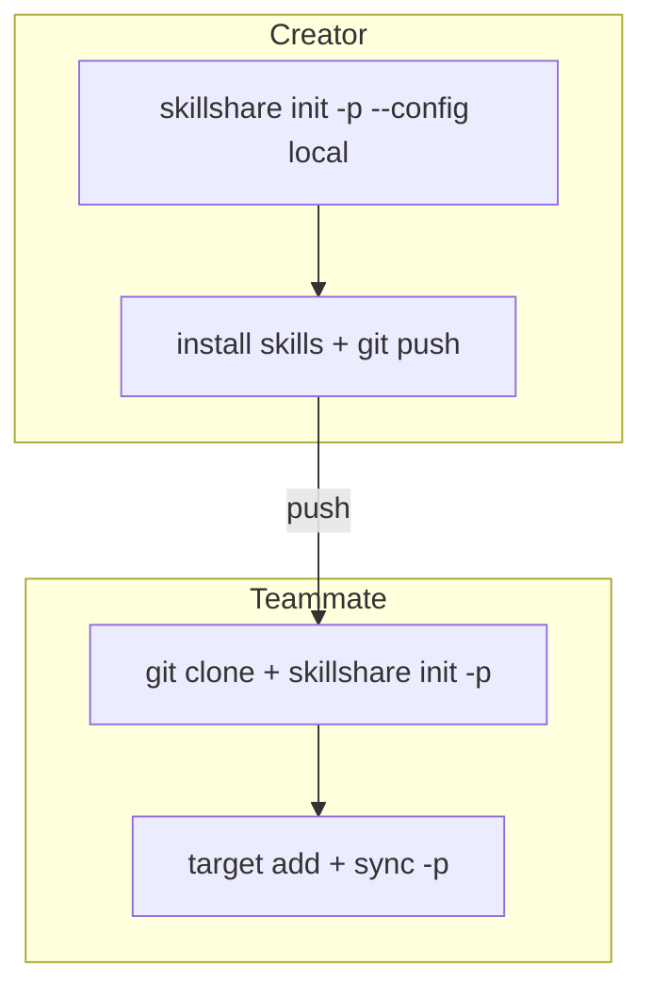

# Centralized Skills Repo

> 하나의 프로젝트를 공유 Skill 저장소로 사용하고, 다른 프로젝트는 깔끔하게 유지하세요.

## 시나리오

팀에 여러 프로젝트(B, C, D)가 있지만 AI Skill은 전용 저장소(A) 하나에서 관리하고
싶습니다. 각 개발자는 저장소 A를 클론하고 자신의 로컬 프로젝트로 Target을 지정합니다.

## 해결 방법

### 만드는 사람: 공유 저장소 설정

```bash
cd ~/DEV/skills-repo        # 프로젝트 A
skillshare init -p --config local --targets claude
```

이렇게 하면 `config.yaml`이 gitignore된 `.skillshare/`가 생성되어, 각 개발자가
자신의 Target을 독립적으로 관리할 수 있습니다.

```bash
# 공유 Skill 추가
skillshare install <skill-repo> -p

# 커밋(config.yaml은 .gitignore로 제외됨)
git add .skillshare/
git commit -m "add shared skills"
git push
```

### 팀원: 클론하고 설정하기

```bash
git clone <A-repo> && cd skills-repo
skillshare init -p
```

Skillshare는 공유 저장소를 자동으로 감지하고(`.gitignore`에 `config.yaml`이 포함됨)
빈 설정을 만듭니다. `--config local` 플래그는 필요 없습니다.

```bash
# 자신의 로컬 프로젝트를 가리키는 Target 추가
skillshare target add project-b ~/DEV/project-b/.cursor/skills -p
skillshare target add project-c ~/DEV/project-c/.claude/skills -p

# 공유 Skill을 모든 Target에 동기화
skillshare sync -p
```

## 작동 방식



`--config local` 플래그는 `.skillshare/.gitignore`에 `config.yaml`을 추가합니다.
이는 다음을 의미합니다:

- **Skill**(`.skillshare/skills/`)은 git을 통해 공유됩니다
- **설정**(`.skillshare/config.yaml`)은 각 개발자마다 로컬로 관리됩니다
- 각 개발자는 다른 사람에게 영향을 주지 않고 자신의 Target을 선택합니다

## 검증

만든 사람이 `init -p --config local`을 실행한 후:

```bash
cat .skillshare/.gitignore
# config.yaml이 포함되어 있어야 함
```

팀원이 클론하고 `init -p`를 실행한 후:

```bash
skillshare list -p     # 공유 Skill 표시
skillshare status -p   # 개인 Target 표시
```

## FAQ

**Q: 모든 팀원이 `--config local`을 사용해야 하나요?**
A: 아니요. 만든 사람만 `--config local`을 사용합니다. 팀원은 그냥
`skillshare init -p`만 실행하면 skillshare가 공유 저장소 패턴을 자동으로 감지합니다.

**Q: 팀원이 추가 Skill을 설치할 수 있나요?**
A: 네. `skillshare install <repo> -p`는 정상적으로 작동합니다. 설치된 Skill은
git으로 추적되는 `.skillshare/skills/`에 위치하므로, 다른 사람이 사용할 수 있도록
push할 수 있습니다.

**Q: 팀원이 다른 Skill을 원한다면 어떻게 하나요?**
A: `.skillshare/skills/`에 있는 Skill은 공유됩니다. 순수하게 개인적인 Skill을
원한다면 [global mode](/docs/understand/project-skills)를 사용하세요
(`-p` 없이 `skillshare install <repo>`).
