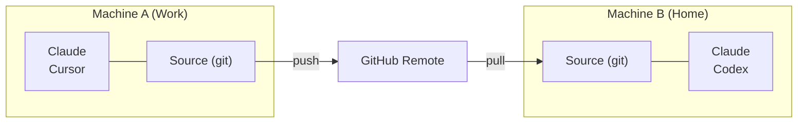

# Cross-Machine Sync

git을 사용해 여러 컴퓨터에서 Skill을 동기화합니다.

## 개요



---

## 첫 번째 머신 설정

### 대화형 (안내 프롬프트)

```bash
skillshare init --remote git@github.com:you/my-skills.git
```

### 비대화형 (프롬프트 없음)

```bash
# 원격에 이미 Skill이 있는 경우 (또는 새 Source로 시작)
skillshare init --remote git@github.com:you/my-skills.git --no-copy --all-targets --no-skill

# 기존 Claude Skill이 있는 첫 번째 머신: init 중에 가져오기
skillshare init --remote git@github.com:you/my-skills.git --copy-from claude --all-targets --no-skill
```

이 명령은:
1. Source 디렉터리를 생성합니다
2. 초기 커밋과 함께 git을 초기화합니다
3. Remote를 추가합니다
4. Target을 자동으로 감지하고 설정합니다

선택 사항 (설정 후 추가 AI CLI를 설치한 경우에만):

```bash
skillshare init --discover
```

그런 다음 Skill을 push하세요:
```bash
skillshare push
```

:::tip 이미 초기화했나요?
기존 설정에 Remote를 추가하세요:
```bash
skillshare init --remote git@github.com:you/my-skills.git
```
초기 설정 이후에도 동작합니다 — 단순히 Remote를 추가할 뿐입니다.
:::

---

## 두 번째 머신 설정

새 머신에서는 **동일한 명령이 그대로 동작합니다**:

```bash
skillshare init --remote git@github.com:you/my-skills.git
```

Init은 Remote에 기존 Skill이 있음을 자동으로 감지하고 이를 pull합니다. 수동으로 `git clone`할 필요가 없습니다.

:::info 내부적으로 일어나는 일
1. Source 디렉터리를 생성하고 git을 초기화합니다
2. Remote를 추가하고 `git fetch`를 실행합니다
3. Remote에 Skill이 있음을 감지 → 로컬을 Remote와 일치하도록 재설정합니다
4. 추적 브랜치를 설정합니다
5. 로컬 Target을 자동으로 감지하고 설정합니다
:::

수동 제어를 선호한다면:

```bash
# 직접 clone한 다음, 기존 Source로 init
git clone git@github.com:you/my-skills.git ~/.config/skillshare/skills
skillshare init --source ~/.config/skillshare/skills
skillshare sync
```

---

## 일상 워크플로

### Machine A: 변경 후 push

```bash
# Skill 편집 (심볼릭 링크를 통해 변경 사항이 즉시 반영됩니다)
$EDITOR ~/.config/skillshare/skills/my-skill/SKILL.md

# 선택 사항: push 없이 로컬 체크포인트 생성
skillshare commit -m "Update my-skill"

# 공유할 준비가 되면 Remote에 push
skillshare push -m "Update my-skill"
```

### Machine B: pull 후 sync

```bash
skillshare pull
```

이게 전부입니다. `pull`은 pull 이후 자동으로 `sync`를 실행합니다.

---

## 명령어

### Commit

push 없이 로컬 체크포인트를 생성합니다:

```bash
skillshare commit                  # 기본 메시지
skillshare commit -m "Add pdf"     # 사용자 지정 메시지
skillshare commit --dry-run        # 미리보기
```

**실제로 일어나는 일:**
```
git add -A
git commit -m "Add pdf"
```

`commit`은 Remote를 필요로 하지 않으며 절대 push하지 않습니다.

### Push

로컬 변경 사항을 커밋하고 push합니다:

```bash
skillshare push                  # 자동 생성된 메시지
skillshare push -m "Add pdf"     # 사용자 지정 메시지
```

**실제로 일어나는 일:**
```
git add -A
git commit -m "Add pdf"
git push          # 첫 push 시 upstream을 자동 설정합니다
```

### Pull

Remote 변경 사항을 pull하고 sync합니다:

```bash
skillshare pull
```

**실제로 일어나는 일:**
```
git pull           # 두 머신 모두 커밋했다면 병합; 첫 pull 시 fetch 후 병합 또는 reset
skillshare sync
```

---

## 충돌 처리

### Pull 실패 (로컬에 커밋되지 않은 변경 사항)

로컬 변경 사항을 유지하고 싶지만 아직 push할 준비가 안 됐다면, 먼저 로컬에 커밋하세요:

```bash
skillshare commit -m "Save local changes"
skillshare pull
```

### Push 실패 (Remote가 앞서 있음)

```
$ skillshare push
Push failed
  Remote may have newer changes
  Run: skillshare pull
  Then: skillshare push
```

**해결 방법:**
```bash
skillshare pull
skillshare push
```

### 로컬에 커밋되지 않은 변경 사항으로 Pull이 계속 실패하는 경우

```
$ skillshare pull
Local changes detected
  Run: skillshare push
  Or:  cd ~/.config/skillshare/skills && git stash
```

**해결 방법:**
```bash
# 옵션 1: 먼저 로컬에 커밋
skillshare commit -m "Local changes"
skillshare pull

# 옵션 2: 먼저 변경 사항을 push
skillshare push -m "Local changes"
skillshare pull

# 옵션 3: 변경 사항을 임시로 stash
cd ~/.config/skillshare/skills
git stash
skillshare pull
git stash pop
```

### 병합 충돌

두 머신 모두 커밋한 경우 `pull`이 이를 병합합니다. `.metadata.json`의 충돌은 자동으로 해결됩니다. 그 외의 파일에서 충돌이 발생하면 pull이 중단되고, 병합이 되돌려지며, 해당 파일이 표시됩니다:

```
$ skillshare pull
pull stopped: this machine and the remote both changed my-skill/SKILL.md; the merge was undone, resolve it with git in ~/.config/skillshare/skills
```

**해결 방법:**
```bash
cd ~/.config/skillshare/skills
git pull --no-rebase          # 병합을 다시 실행하고 충돌을 남겨 둠
# 충돌한 파일 편집
git add .
git commit --no-edit
skillshare push
skillshare sync
```

---

## 상태 확인

```bash
skillshare status
```

다음을 표시합니다:
- Git 상태 (clean, ahead, behind)
- Remote 설정
- Sync 상태

---

## 비공개 저장소

비공개 저장소에는 SSH URL을 사용하세요:

```bash
skillshare init --remote git@github.com:you/private-skills.git
```

---

## 팁

### SSH 키 사용

비밀번호 프롬프트를 피하려면 SSH 키를 설정하세요:
```bash
ssh-keygen -t ed25519 -C "your@email.com"
# 공개 키를 GitHub에 추가
```

### Dotfiles를 위한 이식 가능한 경로

dotfiles를 통해 `config.yaml`을 공유한다면, 경로를 `/home/alice/...` 대신 `~/...` 형태로 유지하도록 `preserve_tilde_on_save`를 활성화하세요:

```yaml
preserve_tilde_on_save: true
```

이렇게 하면 동일한 config가 서로 다른 사용자명이나 OS별 홈 접두사를 가진 머신에서 사용될 때 발생하는 지저분한 diff를 방지할 수 있습니다. [Configuration — preserve_tilde_on_save](/docs/reference/targets/configuration#preserve_tilde_on_save)를 참고하세요.

### 여러 Remote

백업용 Remote를 추가하세요:
```bash
cd ~/.config/skillshare/skills
git remote add backup git@gitlab.com:you/skills-backup.git
git push backup main
```

### 셸 시작 시 Sync

`~/.bashrc` 또는 `~/.zshrc`에 추가하세요:
```bash
# 터미널이 열릴 때 skillshare를 sync (Remote가 설정된 경우)
skillshare pull 2>/dev/null
```

---

## 대안: Config에서 설치하기 {#alternative-install-from-config}

git remote를 설정하고 싶지 않다면, `config.yaml`이 이식 가능한 Skill 매니페스트 역할을 합니다. `install` / `uninstall`을 실행할 때마다 `skills:` 섹션이 자동으로 갱신되며, `skillshare install` (인자 없음)을 실행하면 나열된 모든 항목을 다시 설치합니다:

```bash
# Machine A — config.yaml이 설치한 항목을 기록합니다
skillshare install anthropics/skills -s pdf
# config.yaml에 이제 다음이 포함됩니다: skills: [{name: pdf, source: "..."}]

# Machine B — config.yaml을 복사한 다음:
skillshare install      # 나열된 모든 Skill을 설치합니다
skillshare sync
```

### 어떤 방법을 사용해야 할까요

| | `push` / `pull` | `install` (인자 없음) |
|---|---|---|
| 동기화되는 것 | 실제 Skill 파일 (전체 내용) | Source URL만 — 설치 시 다시 다운로드 |
| 로컬/수동 작성 Skill | 포함됨 | 포함되지 않음 (Source URL 없음) |
| 필요한 설정 | Source 디렉터리의 git remote | `config.yaml`만 있으면 됨 |
| Project mode | Global만 가능 | `-p`(`.skillshare/config.yaml`)와 함께 동작 |
| 유지 관리 | 변경 후 수동 `push` | install/uninstall 시 자동 조정 |

**권장 사항**: 개인용 Cross-Machine Sync에는 `push`/`pull`을 사용하세요. 팀 온보딩과 Project 설정에는 config에서의 `install`을 사용하세요.

---

## 참고 자료

- [push](/docs/reference/commands/push) — Remote에 push
- [pull](/docs/reference/commands/pull) — Remote에서 pull
- [install](/docs/reference/commands/install#install-from-config-no-arguments) — Config에서 설치
- [Organization-Wide Skills](./organization-sharing.md) — 팀 공유
- [init](/docs/reference/commands/init) — `--remote`로 init
