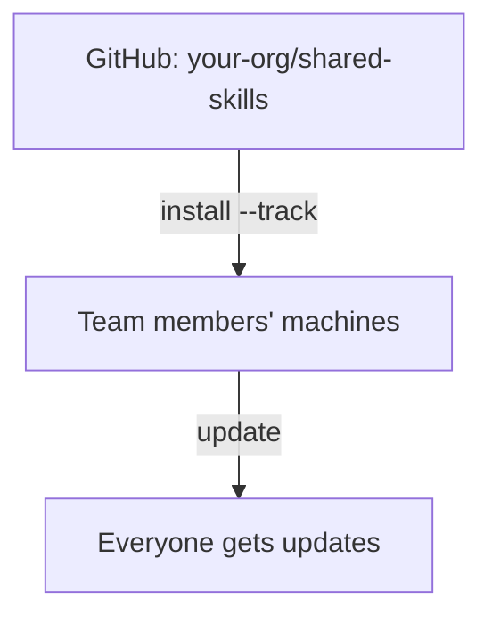

# Organization-Wide Skills

Tracked repository를 사용해 모든 프로젝트에서 Skill을 공유합니다.

## 개요



---

## 사용 시나리오

| 시나리오 | 예시 |
|----------|---------|
| **회사 코딩 표준** | 모든 저장소에서 일관된 네이밍, 오류 처리, 아키텍처를 강제합니다 |
| **보안 Audit Skill** | 모든 프로젝트에 적용되는 조직 전체 보안 리뷰 체크리스트 |
| **배포 지식** | 표준 CI/CD 패턴, 인프라 규칙, 릴리스 프로세스 |
| **코드 리뷰 가이드라인** | 모든 팀과 프로젝트에서 일관된 리뷰 기준 |
| **프로젝트 간 패턴** | 공유되는 API 설계 패턴, 로깅 표준, 테스팅 프레임워크 |

---

## 조직 공유를 사용하는 이유

| Organization Skill이 없을 때 | Organization Skill이 있을 때 |
|-----------------------------|--------------------------|
| "Slack에서 최신 배포 Skill 좀 가져와줘" | `skillshare update --all` |
| 머신 간에 Skill을 복사-붙여넣기 | 명령어 하나로 모든 것을 설치 |
| "너는 어떤 버전의 Skill을 갖고 있어?" | 모두가 같은 Source에서 동기화 |
| 문서/저장소 여기저기에 흩어진 Skill | 조직을 위한 하나의 큐레이션된 저장소 |

---

## 팀 리더를 위한 안내

### 1단계: Skill 저장소 생성

조직의 Skill을 위한 GitHub/GitLab/Bitbucket 저장소를 만드세요.

```bash
mkdir org-skills && cd org-skills
git init

# Skill 구조 생성
mkdir -p frontend/ui backend/api devops/deploy

# Skill 추가
echo "---
name: acme-ui
description: Frontend UI patterns
---
# UI Skill
..." > frontend/ui/SKILL.md

git add .
git commit -m "Initial skills"
git push -u origin main
```

### 2단계: .skillignore 추가 (선택 사항)

저장소에 Skill로 발견되어서는 안 되는 내부 도구나 CI 스크립트가 있다면, 저장소 루트에 `.skillignore`를 만드세요:

```text title=".skillignore"
# CI/CD 도우미 — 설치 대상 Skill이 아님
ci-scripts
_internal-*
```

`.skillignore`가 차단하는 Skill이 필요한 개인 팀원은 같은 디렉터리에 `.skillignore.local`(git에 커밋되지 않음)을 만들어 로컬에서만 재정의할 수 있습니다:

```text title=".skillignore.local"
!_internal-my-tool
```

### 3단계: 설치 명령 공유

팀에게 다음을 전달하세요:

```bash
skillshare install github.com/your-org/org-skills --track && skillshare sync
```

일부만 필요한 팀원은 `--exclude`를 사용할 수 있습니다:

```bash
skillshare install github.com/your-org/org-skills --all --exclude devops-deploy
```

---

## 팀원을 위한 안내

### 초기 설정

```bash
# 조직 Skill 저장소 설치
skillshare install github.com/org/skills --track

# AI CLI에 Sync
skillshare sync
```

### 일상적인 사용

```bash
# 업데이트 확인
skillshare update --all
skillshare sync
```

---

## 중첩 Skill과 자동 평탄화

폴더에 Skill을 정리하세요 — skillshare는 AI CLI 호환성을 위해 이를 자동으로 평탄화합니다:

```
SOURCE                              TARGET
(your organization)                 (what AI CLI sees)
────────────────────────────────────────────────────────────
_org-skills/
├── frontend/
│   ├── react/          ───►   _org-skills__frontend__react/
│   └── vue/            ───►   _org-skills__frontend__vue/
├── backend/
│   └── api/            ───►   _org-skills__backend__api/
└── devops/
    └── deploy/         ───►   _org-skills__devops__deploy/

• _ 접두사 = tracked repository
• __ (이중 밑줄) = 경로 구분자
```

**장점:**
- 저장소에서 논리적인 폴더 구성을 유지할 수 있습니다
- AI CLI는 원하는 평탄한 구조를 보게 됩니다
- 평탄화된 이름은 추적 가능성을 위해 원본 경로를 보존합니다

자세한 내용은 [Tracked Repositories](/docs/understand/tracked-repositories#nested-skills--auto-flattening)를 참고하세요.

---

## 충돌 감지

여러 Skill이 같은 `name` 필드를 공유하는 경우, sync는 `include`/`exclude` 필터가 적용된 후 실제로 동일한 Target에 도달하는지 확인합니다.

**필터가 충돌을 격리함** — 정보성 알림만 표시:

```
ℹ Duplicate skill names exist but are isolated by target filters:
  'ui' (2 definitions)
```

**충돌이 동일한 Target에 도달함** — 조치가 필요한 경고:

```
⚠ Target 'claude': skill name 'ui' is defined in multiple places:
  - _team-a/frontend/ui
  - _team-b/components/ui
Rename one in SKILL.md or adjust include/exclude filters
```

**해결 방법:** 네임스페이스가 적용된 이름을 사용하거나 필터로 라우팅하세요:

```yaml
# 옵션 1: SKILL.md에서 네임스페이스 지정
name: team-a-ui

# 옵션 2: 필터로 라우팅 (Global config)
targets:
  codex:
    path: ~/.codex/skills
    include: [_team-a__*]
  claude:
    path: ~/.claude/skills
    include: [_team-b__*]
```

```yaml
# 옵션 2: 필터로 라우팅 (Project config)
targets:
  - name: claude
    exclude: [codex-*]
  - name: codex
    include: [codex-*]
```

전체 문법과 예시는 [Target Filters](/docs/reference/targets/configuration#include--exclude-target-filters)를 참고하세요.

---

## 여러 조직 저장소

서로 다른 팀이나 관심사를 위해 여러 저장소를 설치하세요:

```bash
# 프론트엔드 팀
skillshare install github.com/org/frontend-skills --track --name frontend

# 백엔드 팀
skillshare install github.com/org/backend-skills --track --name backend

# DevOps 팀
skillshare install github.com/org/devops-skills --track --name devops

skillshare sync
```

모두 업데이트:
```bash
skillshare update --all
skillshare sync
```

---

## 비공개 저장소

**SSH** (개발자 머신에 권장):

```bash
skillshare install git@github.com:org/private-skills.git --track
```

**토큰을 사용한 HTTPS** (CI/CD에 권장):

```bash
export GITHUB_TOKEN=ghp_your_token
skillshare install https://github.com/org/private-skills.git --track
```

공식 토큰 문서:
- GitHub: [Managing your personal access tokens](https://docs.github.com/en/authentication/keeping-your-account-and-data-secure/managing-your-personal-access-tokens)
- GitLab: [Token overview](https://docs.gitlab.com/security/tokens/)
- Bitbucket: [Access tokens](https://support.atlassian.com/bitbucket-cloud/docs/access-tokens/)

### CI/CD 설정

**GitHub Actions:**

```yaml
- name: Install org skills
  env:
    GITHUB_TOKEN: ${{ secrets.GITHUB_TOKEN }}
  run: |
    skillshare install https://github.com/org/skills.git --track
    skillshare sync
```

**GitLab CI:**

```yaml
install-skills:
  script:
    - skillshare install https://gitlab.com/org/skills.git --track
    - skillshare sync
  variables:
    GITLAB_TOKEN: $CI_JOB_TOKEN
```

**Bitbucket Pipelines:**

```yaml
- step:
    name: Install org skills
    script:
      - skillshare install https://bitbucket.org/team/skills.git --track
      - skillshare sync
    env:
      BITBUCKET_USERNAME: $BITBUCKET_USERNAME   # app password용
      BITBUCKET_TOKEN: $BITBUCKET_TOKEN
```

지원되는 모든 토큰은 [Environment Variables](/docs/reference/appendix/environment-variables#git-authentication)를 참고하세요.

---

## 명령어 레퍼런스

| 명령어 | 설명 |
|---------|-------------|
| `install <url> --track` | 저장소를 tracked repository로 clone |
| `update <name>` | 특정 tracked repo를 git pull |
| `update --all` | 모든 tracked repo 업데이트 |
| `uninstall <name>...` | tracked repo 제거 |
| `list` | 모든 Skill과 tracked repo 나열 |
| `status` | Sync 상태 표시 |

---

## Organization Agent

Tracked organization repo는 Skill과 함께 **agent**를 배포할 수 있습니다. `skills/` 옆의 최상위 `agents/` 디렉터리에 배치하세요:

```
your-org/org-shared/
├── skills/                  # Skill로 발견됨
│   ├── api-design/
│   │   └── SKILL.md
│   └── security/
│       └── SKILL.md
└── agents/                  # Agent로 발견됨
    ├── reviewer.md
    └── auditor.md
```

팀원이 `skillshare install github.com/your-org/org-shared --track`을 실행하면 두 디렉터리 모두 자동으로 수집됩니다. `skillshare update --all`은 둘 다 동기화 상태로 유지하며, `skillshare sync`(또는 `skillshare sync agents`)는 agent를 지원하는 Target(Claude, Cursor, Augment, OpenCode)에 agent를 전파합니다.

Org repo 내부의 `.agentignore` 파일은 디스크에서 존중되지만, 각 머신이 업스트림 저장소를 편집하지 않고도 opt-out할 수 있도록 일반적으로 소비자의 Source 루트(또는 `.agentignore.local`)에 두는 것이 좋습니다. 전체 발견 규칙은 [Agents](/docs/understand/agents)를 참고하세요.

---

## Organization Skill vs Project Skill

| | Organization Skill | Project Skill |
|---|---|---|
| **범위** | 머신의 모든 프로젝트 | 단일 저장소 |
| **Source** | `~/.config/skillshare/skills/_repo/` | `.skillshare/skills/` |
| **설치** | `skillshare install <url> --track` | `skillshare install <url> -p` |
| **공유 방식** | 각 멤버가 tracked repo 설치 | 프로젝트 git 저장소에 커밋 |
| **적합한 용도** | 코딩 표준, 보안, 조직 패턴 | API 규칙, 도메인 컨텍스트, 프로젝트 도구 |
| **공존 여부** | Project Skill과 함께 동작 | Organization Skill과 함께 동작 |

:::tip 둘 다 사용하세요
Organization Skill은 회사 전체의 표준을 제공합니다. Project Skill은 저장소별 컨텍스트를 제공합니다. 서로를 보완하므로 — 최상의 개발자 경험을 위해 둘 다 사용하세요.
:::

---

## 모범 사례

### 팀 리더를 위한 안내

1. **명확한 구조 사용**: 기능별로 구성하세요 (frontend, backend, devops)
2. **Skill 네임스페이스 지정**: 충돌을 피하기 위해 `org-skill-name` 형태로
3. **요구 사항 문서화**: 설정 안내가 담긴 README
4. **버전 관리**: 안정적인 릴리스에 태그 사용

### 팀원을 위한 안내

1. **정기적으로 업데이트**: 매일 `skillshare update --all`
2. **문제 보고**: Skill이 작동하지 않으면 유지 관리자에게 알리세요
3. **개선 제안**: Skill 저장소에 PR을 열어 제안하세요

---

## 참고 자료

- [Tracked Repositories](/docs/understand/tracked-repositories) — 개념 상세 설명
- [install](/docs/reference/commands/install) — `--track`으로 설치
- [update](/docs/reference/commands/update) — tracked repo 업데이트
- [Project Setup](./project-setup.md) — Project 레벨 공유
- [Cross-Machine Sync](./cross-machine-sync.md) — 개인용 Sync
