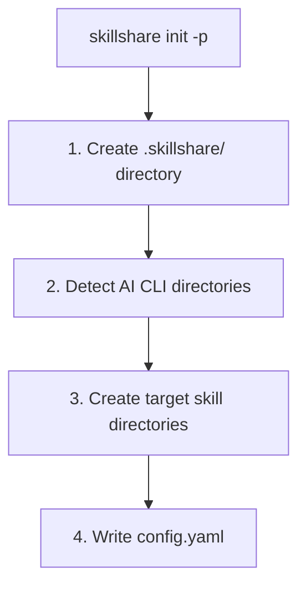

# Project Setup

Project 레벨 Skill을 처음부터 설정합니다 — 단일 저장소로 범위가 한정되고 git을 통해 팀과 공유되는 Skill입니다.

## Project mode를 사용해야 할 때

| 시나리오 | 예시 | 사용 |
|----------|---------|-----|
| Monorepo 온보딩 | 신규 입사자가 저장소를 클론하면 즉시 모든 프로젝트 컨텍스트를 얻습니다 | **Project mode** |
| API 규칙 | "모든 엔드포인트는 camelCase를 사용하고 표준 오류 형식을 반환해야 합니다" | **Project mode** |
| 도메인 특화 컨텍스트 | 금융 규제 규칙, 헬스케어 컴플라이언스 가이드라인 | **Project mode** |
| 배포 지식 | "`make deploy-staging`으로 staging에 배포, VPN 필요" | **Project mode** |
| 프로젝트 도구 | 커스텀 테스트 패턴, 마이그레이션 스크립트, 빌드 구성 | **Project mode** |
| 모든 프로젝트에서 공유되는 Skill | 회사 전체 코딩 표준, 보안 Audit | Organization mode |
| 여러 머신의 개인 Skill | 개인 포맷 설정, 워크플로 단축키 | Global mode |

---

## 단계별 설정

### 1단계: 초기화

프로젝트 루트에서 `skillshare init -p`를 실행하세요:

```bash
cd my-project
skillshare init -p
```



:::tip 자동 감지
초기화 이후, skillshare는 이 디렉터리로 `cd`할 때마다 Project mode를 자동으로 감지합니다. 이후 명령어에는 `-p` 플래그가 필요하지 않습니다.
:::

Target을 직접 지정할 수도 있습니다:

```bash
skillshare init -p --targets claude,cursor
```

### 2단계: 로컬 Skill 생성

수동으로 또는 `skillshare new`로 Skill을 생성하세요:

```bash
# skillshare new 사용
skillshare new my-skill -p

# 또는 수동으로
mkdir -p .skillshare/skills/my-skill
cat > .skillshare/skills/my-skill/SKILL.md << 'EOF'
---
name: my-skill
description: Project-specific coding guidelines
---
# My Skill

Your skill content here...
EOF
```

### 3단계: 원격 Skill 설치

GitHub에서 프로젝트로 Skill을 설치하세요:

```bash
skillshare install anthropics/skills/skills/pdf -p
skillshare install github.com/team/shared-skills/review -p

# --into로 하위 디렉터리에 정리
skillshare install anthropics/skills -s pdf --into tools -p
# → .skillshare/skills/tools/pdf/
```

원격 Skill은:
- `.skillshare/skills/<name>/` (또는 `--into` 사용 시 `.skillshare/skills/<into>/<name>/`)에 설치됩니다
- `.skillshare/config.yaml`의 `skills:` 아래에 기록됩니다
- `.skillshare/.gitignore`에 추가됩니다 (clone된 콘텐츠는 커밋되지 않으며, `logs/`, `trash/`, `backups/`는 기본적으로 무시됩니다)

### 4단계: Target에 Sync

```bash
skillshare sync
```

`.skillshare/skills/`에서 각 Target 디렉터리로 심볼릭 링크를 생성합니다. Project mode를 자동으로 감지합니다.

### 5단계: 버전 관리에 커밋

```bash
git add .skillshare/
git commit -m "Add project-level skills"
```

**커밋되는 것:**
- `.skillshare/config.yaml` — Target과 원격 Skill 목록
- `.skillshare/.gitignore` — 프로젝트 로그, trash, 백업, clone된 Skill에 대한 무시 패턴
- `.skillshare/skills/<local-skills>/` — 로컬 Skill 콘텐츠

**무시되는 것:**
- `.skillshare/logs/` (작업 및 audit 로그)
- `.skillshare/trash/` (소프트 삭제된 Skill, 7일 후 자동 정리됨)
- `.skillshare/backups/` (sync 및 backup 명령의 agent 백업)
- 원격 Skill 디렉터리 (config에서 다시 설치됨)

### 선택 사항: 로그 파일 커밋

프로젝트 로그를 버전 관리에 포함하고 싶다면, `.skillshare/.gitignore`에 재정의 규칙을 추가하세요:

```gitignore
# 사용자 재정의: 로그를 추적
!logs/
!logs/*.log
```

루트 `.gitignore`가 `.skillshare/`를 무시한다면, 거기에도 해당하는 unignore 규칙을 추가해야 합니다.

---

## 신규 팀원 온보딩

### skillshare 없이

1. 저장소를 클론합니다
2. README를 읽고 어떤 Skill을 설치해야 하는지 확인합니다
3. 각 Skill을 수동으로 복사하거나 설치합니다
4. 각 AI CLI 도구를 개별적으로 구성합니다
5. 놓친 게 없기를 바랍니다

### skillshare와 함께

```bash
git clone github.com/team/my-project
cd my-project
skillshare install -p && skillshare sync
```

완료입니다. 모든 Project Skill이 설치되고 동기화되었습니다. `skillshare install -p`(URL 없음)는 `.skillshare/config.yaml`을 읽고 나열된 모든 원격 Skill을 자동으로 설치합니다. Global mode에서도 동일한 패턴이 동작합니다 — `skillshare install`(인자 없음)은 `~/.config/skillshare/config.yaml`을 읽습니다.

---

## 커스텀 Target 경로

Target은 알려진 이름과 커스텀 경로를 모두 지원합니다:

```yaml
# .skillshare/config.yaml
targets:
  - claude                    # 알려진 이름 → .claude/skills/
  - cursor                         # 알려진 이름 → .cursor/skills/
  - name: custom-tool              # 커스텀 경로
    path: ./tools/ai/skills        # 프로젝트 루트 기준 상대 경로
  - name: another-tool
    path: ~/global/path/skills     # ~ 확장이 포함된 절대 경로
```

---

## 전체 Config 예시

```yaml
targets:
  - claude
  - cursor
  - name: windsurf
    path: .windsurf/skills

skills:
  - name: pdf
    source: anthropic/skills/pdf
  - name: code-review
    source: github.com/team/skills/code-review
```

---

## 웹 대시보드

웹 대시보드는 Project mode를 지원합니다 — Skill, Target, Sync, Config를 시각적으로 관리할 수 있습니다:

```bash
cd my-project
skillshare ui -p
```

또는 `.skillshare/config.yaml`이 존재한다면 (자동 감지) 그냥 `skillshare ui`를 실행하세요.

Project mode에서 대시보드는:
- 사이드바에 **"Project" 배지**를 표시합니다
- **Git Sync**를 숨깁니다 (프로젝트 자체의 git을 사용하세요)
- Config 페이지에서 **`.skillshare/config.yaml`**을 편집합니다
- 원격 Skill을 설치한 후 `skills:` 항목을 자동으로 **조정**합니다

---

## Global mode와의 공존

Project와 Global(organization) Skill은 독립적으로 동작합니다:

```
Organization level                  Project level
~/.config/skillshare/skills/        .skillshare/skills/
├── personal-skill/                 ├── project-skill/
└── _company-std/                   └── remote-skill/
         │                                   │
         ▼                                   ▼
   ~/.claude/skills/                .claude/skills/
   (system-wide targets)            (project-local targets)
```

- Project Target은 **프로젝트 로컬**입니다 (예: 프로젝트 내부의 `.claude/skills/`)
- Organization Target은 **시스템 전체**입니다 (예: `~/.claude/skills/`)
- 서로 충돌하지 않습니다 — 서로 다른 디렉터리, 서로 다른 범위

### 실전 예시: Alice의 두 프로젝트

Alice는 금융 앱과 마케팅 대시보드를 담당합니다. 그녀는 다음을 가지고 있습니다:

- **Organization Skill**: 회사 코딩 표준, 보안 Audit (어디서나 사용 가능)
- **Finance 프로젝트 Skill**: 규제 컴플라이언스, 금융 API 규칙
- **Marketing 프로젝트 Skill**: 분석 패턴, A/B 테스트 가이드라인

```bash
cd ~/finance-app
skillshare status     # 시스템 전체 Target에서 finance 프로젝트 Skill + org Skill을 표시

cd ~/marketing-dash
skillshare status     # marketing 프로젝트 Skill + 동일한 org Skill을 표시
```

각 프로젝트는 자체 컨텍스트를 가지며, organization 표준은 전역적으로 적용됩니다.

---

## 참고 자료

- [Project Skills](/docs/understand/project-skills) — 개념 설명
- [Project Workflow](/docs/how-to/daily-tasks/project-workflow) — 일상적인 사용법
- [Organization-Wide Skills](./organization-sharing.md) — 팀 공유
- [init](/docs/reference/commands/init) — `--project`로 init
