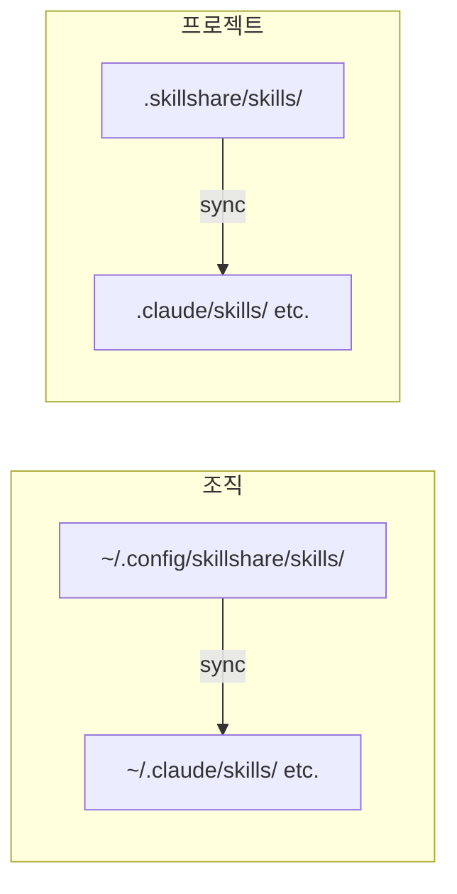

# 소개

**skillshare**는 하나의 Source에서 모든 AI 코딩 어시스턴트로 AI CLI Skill을 동기화하는 CLI 도구입니다.

## 왜 skillshare인가요?

설치 도구는 Skill을 에이전트에 넣어줍니다. **skillshare는 그 Skill들을 계속 동기화된 상태로 유지합니다.**

| | 한 번 설치하는 도구 | skillshare |
|---|-------------------|------------|
| 설치 후 | 업데이트 명령을 직접 실행 | **Merge sync** — Skill 단위 symlink, 로컬 Skill 유지 |
| Skill 업데이트 | 업데이트 명령 실행 / 설치 재실행 | **Source 편집**, 변경 사항이 즉시 반영 |
| 수정 사항 회수 | — | **양방향** — 어느 에이전트에서든 collect |
| 여러 머신 사용 | 머신마다 설치를 다시 실행 | **git push/pull** — 명령 하나로 동기화 |
| 로컬 + 설치된 Skill | 따로 관리 | **통합** — 하나의 Source 디렉터리에서 관리 |
| 조직 내 공유 | skills.json 커밋 또는 재설치 | **Tracked repo** — git pull로 업데이트 |
| 프로젝트 Skill | 리포지터리마다 복사, 시간이 지나며 갈라짐 | **Project mode** — 자동 감지, git으로 공유 |
| 보안 감사 | 없음 | **내장** — 설치 시 자동 스캔, `audit` 명령 |
| AI 연동 | 수동 CLI 전용 | **내장 Skill** — AI가 직접 조작 |

## 빠른 시작

```bash
# 설치
curl -fsSL https://raw.githubusercontent.com/runkids/skillshare/main/install.sh | sh

# 초기화 (CLI 자동 감지, git 설정)
skillshare init

# Skill 설치
skillshare install anthropics/skills/skills/pdf

# 모든 Target으로 동기화
skillshare sync
```

끝났습니다. 이제 Skill이 모든 AI CLI 도구에 걸쳐 동기화되었습니다.

:::tip[설치 없이 사용해 보기]
먼저 살펴보고 싶으신가요? [Docker Playground](/docs/how-to/advanced/docker-sandbox#playground)를 사용하면 명령 하나로 로컬 설치 없이 체험할 수 있습니다.

```bash
git clone https://github.com/runkids/skillshare.git && cd skillshare
make playground
```
:::

## 동작 방식



Source에서 편집하면 모든 Target이 갱신됩니다. Target에서 편집하면 (symlink를 통해) 변경 사항이 Source로 전달됩니다.

## 주요 기능

- **자동 감지** — `.skillshare/`가 있는 프로젝트로 `cd`하면 skillshare가 자동으로 Project mode로 전환됩니다
- **2단계 아키텍처** — 회사 표준을 위한 조직 Skill + 리포지터리 맥락을 위한 프로젝트 Skill
- **즉시 반영** — symlink 기반 Sync이므로 편집 내용이 모든 AI 도구에 곧바로 반영됩니다
- **팀 사용 준비 완료** — 조직 Skill은 Tracked repo로, 프로젝트 Skill은 git 커밋으로 공유
- **모든 Git 호스트 지원** — GitHub, GitLab, Bitbucket, Azure DevOps, AtomGit, Gitee 또는 자체 호스팅 Git에서 설치, 업데이트, 확인 가능
- **보안 감사** — Skill의 prompt injection, 데이터 유출, 각종 위협을 스캔합니다. 설치 시 자동 스캔됩니다

## 지원 플랫폼

| 플랫폼 | Source 경로 | 링크 방식 |
|----------|-------------|-----------|
| macOS/Linux | `~/.config/skillshare/skills/` | Symlink |
| Windows | `%AppData%\skillshare\skills\` | NTFS Junction |

## 다음 단계

### 개인 개발자

1. [첫 Sync](/docs/getting-started/first-sync) — 5분 만에 동기화하기
2. [Skill 만들기](/docs/how-to/daily-tasks/creating-skills) — 첫 Skill 작성하기
3. [머신 간 Sync](/docs/how-to/sharing/cross-machine-sync) — 여러 머신에서 Skill 동기화 유지

### 팀 리드 / 조직

1. [조직 전체 Skill](/docs/how-to/sharing/organization-sharing) — 팀 전체에 표준 공유
2. [프로젝트 설정](/docs/how-to/sharing/project-setup) — 프로젝트 범위 Skill 구성
3. [보안 감사](/docs/reference/commands/audit) — 배포 전 서드파티 Skill 스캔

### 이미 Skill이 있으신가요?

- [기존 Skill에서 시작하기](/docs/getting-started/from-existing-skills) — 마이그레이션 및 통합

### 더 살펴보기

- [핵심 개념](/docs/understand) — Source, Target, Sync 모드
- [명령 레퍼런스](/docs/reference/commands) — 사용 가능한 모든 명령
- [Docker Sandbox](/docs/how-to/advanced/docker-sandbox) — 격리된 환경에서 skillshare 체험
- [FAQ](/docs/troubleshooting/faq) — 자주 묻는 질문
