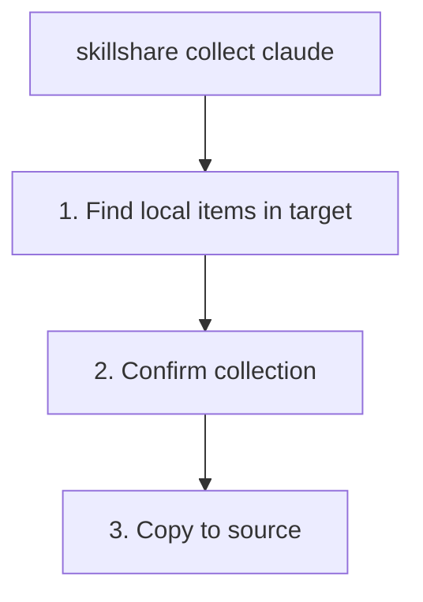

# collect

target에서 로컬 skill이나 agent를 source로 다시 수집합니다.

```bash
skillshare collect claude           # From specific target
skillshare collect --all            # From all targets
skillshare collect claude --dry-run # Preview
skillshare collect agents claude    # Collect agents instead of skills
```

## 언제 사용하나요

target 디렉터리에서 직접 리소스를 생성하거나 수정했고, 이를 source of truth로 다시 가져오고 싶을 때 `collect`를 사용합니다.

1. 공유를 위해 source에 추가
2. 다른 AI CLI로 동기화
3. git으로 백업

예시:

- Skill: `~/.claude/skills/my-skill/`
- Agent: `~/.claude/agents/tutor.md`

## 동작 방식



:::tip
`.git/` 디렉터리는 수집 과정에서 자동으로 제외됩니다. skill 저장소를 target 디렉터리에 직접 git clone한 경우, skill 내용만 복사되고 저장소 메타데이터는 그대로 남습니다.
:::

:::note
웹 대시보드의 **Collect** 페이지는 현재 skill 전용입니다. `collect agents`를 사용하려면 CLI를 이용하세요.
:::

## 옵션

| Flag | Description |
|------|-------------|
| `--all, -a` | 모든 target에서 수집 |
| `--force, -f` | source의 기존 항목을 덮어쓰고 확인 절차 건너뛰기 |
| `--dry-run, -n` | 변경 없이 미리보기 |
| `--json` | JSON 출력 및 확인 절차 건너뛰기; source의 기존 항목을 덮어쓰려면 여전히 `--force` 필요 |

## JSON 출력

```bash
skillshare collect claude --json
```

```json
{
  "pulled": ["new-skill", "another-skill"],
  "skipped": [],
  "failed": {},
  "dry_run": false,
  "duration": "0.123s"
}
```

변경 없이 미리보려면 `--dry-run`과 함께 사용하세요.

```bash
skillshare collect claude --json --dry-run
skillshare collect -p --json
skillshare collect -p agents --json
```

## 출력 예시

```bash
$ skillshare collect claude

Local skills found
  ℹ new-skill       [claude] ~/.claude/skills/new-skill
  ℹ another-skill   [claude] ~/.claude/skills/another-skill

Collect these skills to source? [y/N]: y

Collecting skills
  ✓ new-skill: copied to source
  ✓ another-skill: copied to source

Run 'skillshare sync' to distribute to all targets
```

## 충돌 처리

항목이 source에 이미 존재하는 경우, 수집은 기본적으로 이를 건너뜁니다.

```bash
$ skillshare collect claude

Collecting skills
  ⚠ my-skill: skipped (already exists in source, use --force to overwrite)

# To overwrite:
$ skillshare collect claude --force

$ skillshare collect agents claude

Collecting agents
  ⚠ tutor.md: skipped (already exists in source, use --force to overwrite)
```

## 워크플로우

target에서 skill을 생성한 후의 일반적인 워크플로우입니다.

```bash
# 1. Create skill in Claude
# (edit ~/.claude/skills/my-new-skill/SKILL.md)

# 2. Collect to source
skillshare collect claude

# 3. Sync to all other targets
skillshare sync

# 4. Commit to git (optional)
skillshare push -m "Add my-new-skill"
```

agent의 경우, agent 전용 collect/sync 쌍을 사용하세요.

```bash
skillshare collect agents claude
skillshare sync agents
```

## 참고 항목

- [sync](/docs/reference/commands/sync) — source에서 target으로 동기화
- [diff](/docs/reference/commands/diff) — 로컬 전용 skill 확인
- [push](/docs/reference/commands/push) — git remote로 push
