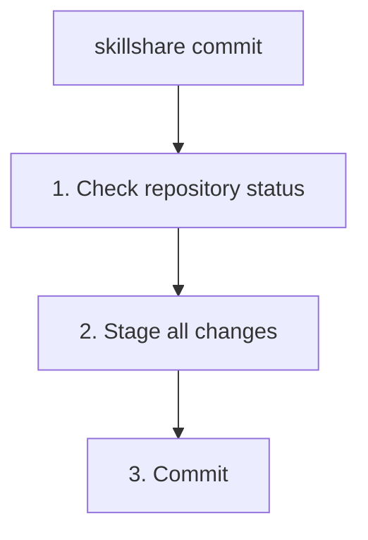

# commit

push하지 않고 source skills에 대한 로컬 git commit을 생성합니다.

```bash
skillshare commit                         # 기본 메시지로 커밋
skillshare commit -m "Update skill"       # 커스텀 메시지
skillshare commit --dry-run               # 미리보기
```

## 언제 사용하나요

- skill을 실험적으로 수정하기 전에 로컬 체크포인트를 저장할 때
- remote가 설정되지 않은 머신이나 source repo에서 변경 사항을 커밋할 때
- 로컬 히스토리를 머신 간 공유 변경 사항과 분리해서 유지할 때

commit**과 함께** git remote에 push까지 하고 싶다면 [`push`](./push.md)를 사용하세요.

## 동작 과정



`commit`은 skills source 디렉터리의 모든 변경 사항을 stage하고 git commit을 생성합니다. remote를 필요로 하지 않으며 절대 `git push`를 실행하지 않습니다.

## 옵션

| 플래그 | 설명 |
|------|------|
| `-m, --message <msg>` | 커밋 메시지 (기본값: "Update skills") |
| `--dry-run, -n` | 변경 사항을 적용하지 않고 미리보기 |

## Git Root Scope {#git-root-scope}

`commit`은 `git_root` 설정 필드로 선택된 디렉터리(기본값: `skills` source)에서 동작합니다. 버전 관리되는 디렉터리를 변경하려면 `skillshare init --git-root <scope>`를 사용하세요. 유효한 scope는 다음과 같습니다.

| Scope | 디렉터리 |
|-------|-------|
| `skills` (기본값) | Skills source (`~/.config/skillshare/skills/`) |
| `agents` | Agents source (`~/.config/skillshare/agents/`) |
| `extras` | Extras source (`~/.config/skillshare/extras/`) |
| `root` | Config root (`~/.config/skillshare/`) — skills + agents + extras를 하나의 repo에서 버전 관리 |

`git_root`가 변경되었지만 git repo가 여전히 다른 scope의 디렉터리에 있는 경우, `commit`은 이를 해결하기 위한 정확한 `git init` / `mv` 명령과 함께 "Git root mismatch" 오류를 출력합니다. [Changing the scope after init](/docs/reference/targets/configuration#git-root)를 참고하세요.

## 사전 준비 사항

skills source 디렉터리는 git repository여야 합니다.

```bash
skillshare init
```

source가 git repository가 아닌 경우, `commit`은 설정 안내를 출력하고 파일을 변경하지 않은 채 종료합니다.

## 예시

```bash
# 기본 메시지로 커밋
skillshare commit

# 커스텀 메시지로 커밋
skillshare commit -m "Update review skill"

# 커밋하지 않고 stage된 파일과 메시지를 미리보기
skillshare commit --dry-run
```

## 참고 항목

- [push](./push.md) — git remote에 커밋 및 push
- [pull](./pull.md) — remote에서 pull하여 target에 동기화
- [status](./status.md) — git 및 동기화 상태 확인
