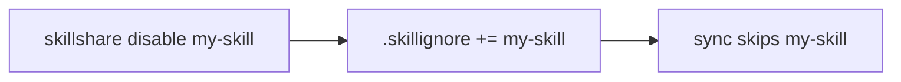
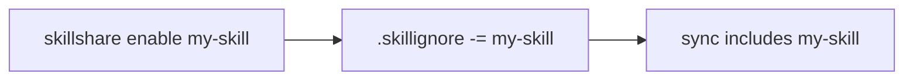

# enable / disable

skill을 제거하지 않고 일시적으로 활성화하거나 비활성화합니다.

```bash
skillshare disable draft-*          # Disable by pattern
skillshare enable draft-*           # Re-enable
skillshare disable "frontend/**"    # Disable every skill in a folder
skillshare disable my-skill -p      # Project mode
```

## 언제 사용하나요

- skill을 제거하지 않고 sync에서 일시적으로 숨길 때
- 초안이나 실험적인 skill을 모든 target에서 음소거할 때
- list TUI에서 `E` 키로 skill을 켜고 끌 때

## 동작 방식

`disable`은 `.skillignore`에 패턴을 추가하고, `enable`은 이를 제거합니다. 비활성화된 skill은 source 디렉터리에 그대로 남지만 `sync`와 `collect`에서는 제외됩니다.





:::tip
활성화하거나 비활성화한 후에는 `skillshare sync`를 실행해 변경 사항을 target에 적용하세요.
:::

## 옵션

| Flag | Description |
|------|-------------|
| `<name\|pattern>` | 하나 이상의 skill 이름 또는 glob 패턴(예: `draft-*`, `frontend/**`) |
| `--project, -p` | project `.skillignore` 사용(`.skillshare/skills/.skillignore`) |
| `--global, -g` | global `.skillignore` 사용(`~/.config/skillshare/.skillignore`) |
| `--dry-run, -n` | 작성하지 않고 미리보기 |
| `--help, -h` | 도움말 표시 |

`-p`와 `-g` 둘 다 지정하지 않으면 다른 명령과 마찬가지로 mode가 자동 감지됩니다.

## 예시

```bash
# Disable a single skill
$ skillshare disable my-draft
Disabled: my-draft (added to .skillignore)
Run 'skillshare sync' to apply changes.

# Disable by glob pattern
$ skillshare disable "experimental-*"
Disabled: experimental-* (added to .skillignore)
Run 'skillshare sync' to apply changes.

# Re-enable
$ skillshare enable my-draft
Enabled: my-draft (removed from .skillignore)
Run 'skillshare sync' to apply changes.

# Preview without writing
$ skillshare disable my-skill --dry-run
Would add 'my-skill' to ~/.config/skillshare/skills/.skillignore

# Already disabled
$ skillshare disable my-draft
warning: my-draft is already disabled
```

## 폴더 전체 비활성화

`disable`/`enable`은 `.skillignore`와 동일한 glob 문법을 사용하므로 별도의 "group" flag가 없습니다 — 패턴을 폴더로 지정하면 그 안의 모든 skill이 한 번에 토글됩니다.

```bash
# Disable every skill under frontend/ (any depth)
$ skillshare disable "frontend/**"
Disabled: frontend/** (added to .skillignore)
Run 'skillshare sync' to apply changes.

# Re-enable the whole folder
$ skillshare enable "frontend/**"
Enabled: frontend/** (removed from .skillignore)
Run 'skillshare sync' to apply changes.
```

:::tip Quote the pattern
쉘이 skillshare에 전달되기 전에 `*`를 확장하지 않도록, 폴더 패턴은 항상 따옴표로 감싸세요(`"frontend/**"`).
:::

`frontend/**`는 `.skillignore`에 한 줄을 작성하며, 이후 폴더에 추가하는 항목도 계속 커버합니다. **동일한** 패턴으로 `enable`을 실행하면 그 줄이 제거됩니다. 개별 skill을 비활성화하려면 이름으로 나열하세요(`skillshare disable a b c`). 전체 glob 참고 자료(`*`, `**`, `?`, `[abc]`, `!negation`, anchored `/`, directory-only `pattern/`)는 [.skillignore pattern syntax](/docs/reference/filtering#skillignore)를 참고하세요.

## TUI 토글

대화형 `skillshare list` TUI에서 **E**를 누르면 선택한 skill의 활성화/비활성화 상태가 토글됩니다. 변경 사항은 즉시 `.skillignore`에 기록되며, TUI를 먼저 종료할 필요가 없습니다.

비활성화된 skill은 상세 패널에 빨간색 **disabled** 배지로 표시됩니다.

## .skillignore는 어디에 있나요?

| Mode | Path |
|------|------|
| Global | `~/.config/skillshare/skills/.skillignore` |
| Project | `.skillshare/skills/.skillignore` |

이 파일은 첫 `disable` 실행 시 자동으로 생성됩니다.

## Agent 지원

agent를 활성화하거나 비활성화하려면 `--kind agent`를 사용하세요. 이 경우 `.skillignore` 대신 `.agentignore`에 기록됩니다.

```bash
skillshare disable --kind agent draft-reviewer     # Disable an agent
skillshare enable --kind agent draft-reviewer      # Re-enable an agent
skillshare disable --kind agent "experimental-*"   # Disable by pattern
```

| Mode | `.agentignore` path |
|------|---------------------|
| Global | `~/.config/skillshare/agents/.agentignore` |
| Project | `.skillshare/agents/.agentignore` |

agent 관리에 대한 배경 지식은 [Agents](/docs/understand/agents)를 참고하세요.

## 참고 항목

- [list](./list.md) — 비활성화된 skill 확인 및 `E` 키로 토글
- [Filtering Skills](/docs/how-to/daily-tasks/filtering-skills) — 모든 필터링 레이어
- [.skillignore](/docs/reference/filtering#skillignore) — 패턴 문법
- [sync](./sync.md) — enable/disable 후 변경 사항 적용
- [Agents](/docs/understand/agents) — agent 개념
