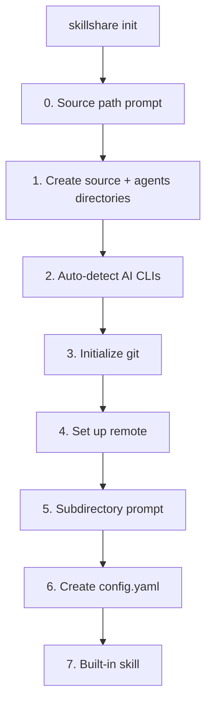
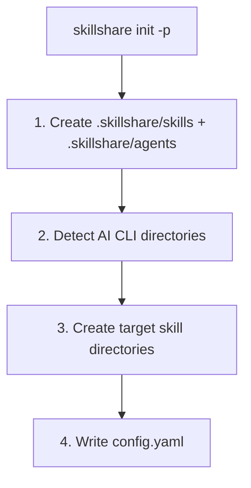

# init

최초 설정입니다. 설치된 AI CLI를 자동 감지하고 target을 구성합니다.

```bash
skillshare init              # Interactive setup
skillshare init --dry-run    # Preview without changes
```

## 사용 시점

- 컴퓨터에 skillshare를 처음 설정할 때
- 새 컴퓨터로 마이그레이션할 때 (기존 저장소에 연결하려면 `--remote` 사용)
- 프로젝트에 skillshare 추가할 때 (`--project` 사용)
- 새로 설치된 AI CLI를 발견할 때 (`--discover` 사용)

## 동작 과정



`init`은 skill source 디렉터리 **와** `agents/` 형제 디렉터리를 한 단계에서 생성하므로, 두 종류의 리소스 모두 즉시 사용할 준비가 됩니다. agents 디렉터리는 별도의 프롬프트나 플래그 없이 조용히 생성됩니다. agent 파일 형식은 [Agents](/docs/understand/agents)를 참고하세요.

:::info Universal target
AI CLI가 감지되면, `init`은 자동으로 **universal** target(`~/.agents/skills`)을 추천합니다. 이는 [vercel-labs/skills](https://github.com/vercel-labs/skills)(`npx skills list`)가 사용하는 공유 디렉터리로, 호환되는 모든 agent에 한 번에 skill을 제공합니다.
:::

:::tip Agents source path
agents source의 기본값은 `<source parent>/agents`입니다 (기본 설치의 경우 `~/.config/skillshare/agents/`). 위치를 변경하려면 `config.yaml`에서 `agents_source:`를 설정하세요. 프로젝트 모드는 항상 프로젝트 디렉터리 안의 `agents/`를 사용하며 `agents_source`를 따르지 않습니다. Agent를 지원하는 target(Claude, Cursor, Augment, OpenCode)은 `skillshare sync`를 실행하면 agent를 자동으로 인식합니다.
:::

## Project Mode

`-p`로 프로젝트 레벨 skill을 초기화합니다:

```bash
skillshare init -p                              # Interactive
skillshare init -p --targets claude,cursor  # Non-interactive
skillshare init -p --visible                    # Use a visible skillshare/ directory
```

### 동작 과정



init 이후, 프로젝트 디렉터리를 git에 commit하세요 (`skills/`와 `agents/` 모두). `.skillshare/` 대신 `skillshare/`를 생성하려면 `--visible`을 사용하세요. 전체 가이드는 [Project Setup](/docs/how-to/sharing/project-setup)을 참고하세요.

## Discover Mode

기존 설정에서 init을 다시 실행하여 새 AI CLI target을 감지하고 추가합니다:

### Global

```bash
skillshare init --discover              # Interactive selection
skillshare init --discover --select codex,opencode  # Non-interactive
```

config에 아직 없는 새로 설치된 AI CLI를 스캔하고 추가할지 묻습니다. `universal` target(`~/.agents/skills`)은 CLI가 감지될 때마다 자동으로 추천됩니다.

### Project

```bash
skillshare init -p --discover           # Interactive selection
skillshare init -p --discover --select antigravity  # Non-interactive
```

프로젝트 디렉터리에서 새 AI CLI 디렉터리(예: `.agents/`)를 스캔하여 target으로 추가합니다.

### Discover + Mode 동작

`--discover`와 `--mode`를 함께 사용하면, mode는 이번 discover 실행에서 추가된 target에만 **적용**됩니다.
config에 있는 기존 target은 변경되지 않습니다.

```bash
# Adds cursor with mode=copy, does not change existing targets
skillshare init --discover --select cursor --mode copy

# Project mode variant (same rule)
skillshare init -p --discover --select cursor --mode copy
```

:::tip
이미 초기화된 설정에서 `--discover` 없이 `skillshare init`을 실행하면, 오류 메시지가 이를 사용하라고 안내합니다.
:::

## Options

| Flag | 설명 |
|------|-------------|
| `--source, -s <path>` | 사용자 지정 source 디렉터리 (설정하지 않으면 interactive 모드에서 프롬프트 표시) |
| `--remote <url>` | git remote 설정 (`--git`을 암시; remote에 skill이 있으면 자동 pull; remote에 skill이 있으면 built-in skill 프롬프트 생략) |
| `--project, -p` | 현재 디렉터리에 프로젝트 레벨 skill 초기화 |
| `--copy-from, -c <name\|path>` | 특정 CLI 또는 경로에서 skill 복사 |
| `--no-copy` | 빈 source로 시작 (copy 프롬프트 생략) |
| `--targets, -t <list>` | 쉼표로 구분된 target 이름 |
| `--all-targets` | 감지된 모든 target 추가 |
| `--no-targets` | target 선택 생략 |
| `--mode, -m <mode>` | 새로 구성되는 target의 기본 mode 설정 (`merge`, `copy`, `symlink`). `--discover`와 함께 사용하면 새로 추가된 target에만 영향을 줌 |
| `--git` | 프롬프트 없이 git 초기화 |
| `--no-git` | git 초기화 생략 |
| `--skill` | 프롬프트 없이 built-in skillshare skill 설치 (AI CLI에 `/skillshare` 추가) |
| `--no-skill` | built-in skill 설치 생략 |
| `--discover, -d` | 기존 config에 새 AI CLI target 감지 및 추가 |
| `--select <list>` | 추가할 target의 쉼표 구분 목록 (`--discover` 필요) |
| `--config local` | 각 개발자가 자신의 target을 관리하도록 `config.yaml`을 gitignore 처리 (프로젝트 모드 전용). [Centralized Skills Repo](/docs/how-to/recipes/centralized-skills-repo) 레시피 참고 |
| `--visible` | `.skillshare/` 대신 눈에 보이는 `skillshare/` 프로젝트 디렉터리 생성 (프로젝트 모드 전용). [Project Skills](/docs/understand/project-skills#visible-project-directory) 참고 |
| `--git-root <scope>` | `commit`/`push`/`pull` 작업을 위한 디렉터리 (기본값 `skills`, `agents`, `extras`, `root`). `root`는 skill + agent + extras를 하나의 저장소로 함께 버전 관리하며 `config.yaml`이 자동으로 무시됨. 설정 중 대화형으로도 제공됨. `skillshare init --git-root <scope>`를 나중에 다시 실행하면 headless로 scope를 전환할 수 있음 — 새 scope에서 저장소를 초기화하고 설정을 유지하지만, 기존 히스토리는 이동하지 않음 |
| `--subdir <name>` | source 경로로 하위 디렉터리 사용 (예: `skills`) |
| `--dry-run, -n` | 변경 없이 미리보기 |

`init`은 시작 mode 정책을 설정합니다. 나중에 언제든 target별로 세부 조정할 수 있습니다:

```bash
skillshare target cursor --mode copy
skillshare sync
```

## Source Subdirectory

기본적으로 `init --remote`는 전체 git 저장소 루트를 skill source로 취급합니다. 저장소에 skill이 아닌 파일(README, CI 설정, dotfile 등)도 포함되어 있다면, skill을 하위 디렉터리에 저장할 수 있습니다:

```
# Without --subdir: repo root = source (all files are skills)
~/.config/skillshare/skills/          ← git repo root = source
  ├── my-skill/
  └── another-skill/

# With --subdir skills: source points to a subdirectory
~/.config/skillshare/skills/          ← git repo root
  ├── README.md
  ├── .github/
  └── skills/                         ← source points here
      ├── my-skill/
      └── another-skill/
```

일반적인 사용 사례: 전용 skill 전용 저장소 대신 기존 dotfiles나 monorepo 안에 skill을 포함시키는 경우입니다.

```bash
# Interactive: prompts during init
skillshare init --remote git@github.com:you/dotfiles.git

# Non-interactive: specify directly
skillshare init --remote git@github.com:you/dotfiles.git --subdir skills
```

## Common Scenarios

### Remote setup (하나 선택)

Interactive (안내형 프롬프트를 원하는 최초 설정에 권장):

```bash
skillshare init --remote git@github.com:you/my-skills.git
```

Non-interactive (프롬프트 없음, 설치된 target 자동 감지):

```bash
skillshare init --remote git@github.com:you/my-skills.git --no-copy --all-targets --no-skill
```

Non-interactive (프롬프트 없음, 기존 Claude skill을 즉시 가져오기):

```bash
skillshare init --remote git@github.com:you/my-skills.git --copy-from claude --all-targets --no-skill
```

### Centralized skills repo

```bash
# Creator: set up shared repo with local config
skillshare init -p --config local --targets claude

# Teammate: clone and auto-detect shared repo
git clone <repo> && cd <repo>
skillshare init -p
skillshare target add myproject ~/DEV/myproject/.claude/skills -p
```

### Other scenarios

```bash
# Standard setup (auto-detect everything)
skillshare init

# Use existing skills directory
skillshare init --source ~/.config/skillshare/skills

# Project-level setup
skillshare init -p
skillshare init -p --targets claude,cursor

# Fully non-interactive setup
skillshare init --no-copy --all-targets --git --skill

# Start with copy mode defaults for newly added targets
skillshare init --mode copy

# Add newly installed CLIs to existing config
skillshare init --discover
skillshare init -p --discover

# Add a newly discovered target and force copy mode only for that new target
skillshare init --discover --select cursor --mode copy
```
