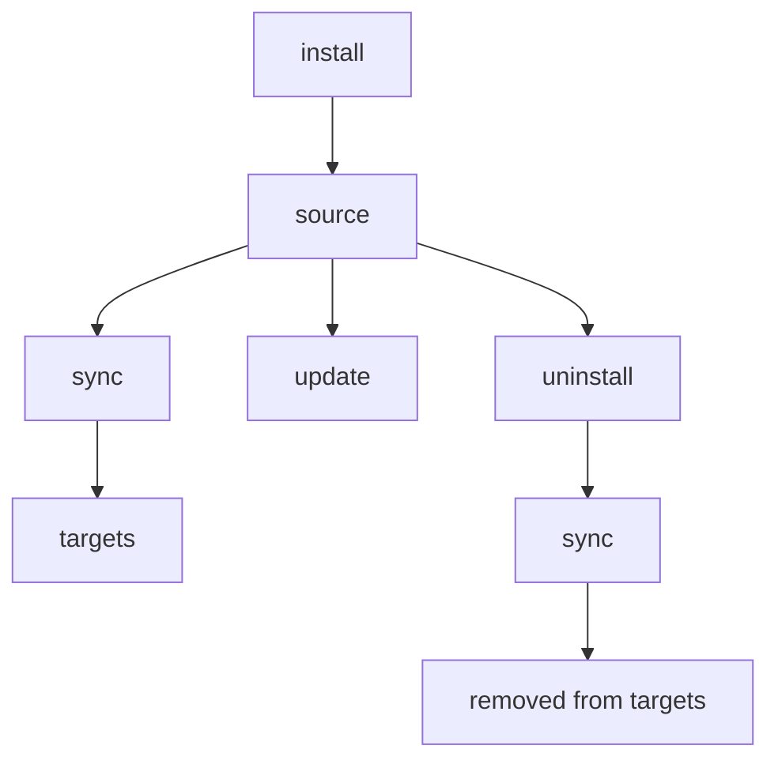

# install

GitHub repo, git URL, 또는 로컬 경로에서 skill을 추가합니다.

## 개요



## 언제 사용하나요

- GitHub, GitLab, Bitbucket, Azure DevOps, 또는 로컬 경로에서 새 skill을 추가할 때
- `--track`으로 조직의 공유 skill repository를 설치할 때
- 기존 skill을 다시 설치하거나 업데이트할 때(`--update` 또는 `--force` 사용)

---

## 빠른 예시

```bash
# GitHub에서 (shorthand)
skillshare install anthropics/skills/skills/pdf

# repo 내 사용 가능한 skill 둘러보기
skillshare install anthropics/skills

# 로컬 경로에서
skillshare install ~/Downloads/my-skill

# tracked repo로 설치 (팀 공유용)
skillshare install github.com/team/skills --track

# 하위 디렉터리로 설치 (카테고리별 정리)
skillshare install ~/my-skill --into frontend

# config에 있는 모든 skill 설치 (인자 없음)
skillshare install
```

## Source 형식

### GitHub Shorthand

`owner/repo` 형식을 사용하세요 — 자동으로 `github.com/owner/repo`로 확장됩니다.

```bash
skillshare install anthropics/skills                    # Browse 모드
skillshare install anthropics/skills/skills/pdf         # 직접 설치
skillshare install ComposioHQ/awesome-claude-skills     # 다른 repo
```

### GitLab / Bitbucket / 기타 호스트

GitHub이 아닌 호스트에는 `domain/owner/repo` 형식을 사용하세요.

```bash
skillshare install gitlab.com/user/repo                 # GitLab
skillshare install bitbucket.org/team/skills            # Bitbucket
skillshare install git.company.com/team/skills          # Self-hosted
```

전체 URL과 SSH도 사용할 수 있습니다.

```bash
skillshare install https://gitlab.com/user/repo.git
skillshare install git@gitlab.com:user/repo.git
```

:::tip 커스텀 도메인에서의 self-managed GitLab
호스트 이름에 `gitlab` 또는 `jihulab`이 포함되어 있으면 nested subgroup 지원과 함께 자동으로 감지됩니다. 커스텀 도메인의 다른 self-managed GitLab 인스턴스(예: `git.company.com`)의 경우, 설정의 [`gitlab_hosts`](/docs/reference/targets/configuration#gitlab_hosts)에 해당 호스트 이름을 추가하면 skillshare가 전체 URL 경로를 repository로 취급합니다. 설정 없이도 우회 방법으로 `.git`을 붙일 수 있습니다: `git.company.com/team/frontend/ui.git`.
:::

### Azure DevOps

`ado:` shorthand 또는 전체 Azure DevOps URL을 사용하세요.

```bash
# Shorthand (ado:org/project/repo)
skillshare install ado:myorg/myproject/myrepo
skillshare install ado:myorg/myproject/myrepo/skills/react    # 하위 디렉터리 포함

# 전체 HTTPS URL
skillshare install https://dev.azure.com/myorg/myproject/_git/myrepo

# 레거시 형식 (자동 정규화됨)
skillshare install https://myorg.visualstudio.com/myproject/_git/myrepo

# SSH
skillshare install git@ssh.dev.azure.com:v3/myorg/myproject/myrepo
```

## Discovery 모드 (Skill 둘러보기)

경로를 지정하지 않으면, skillshare는 repo를 clone하고 skill을 스캔한 후 인터랙티브 선택 화면을 표시합니다.

```bash
skillshare install anthropics/skills
```

<p>
  
</p>

Discovery는 `.git`만 건너뛰고 모든 디렉터리에서 `SKILL.md` 파일을 스캔합니다. 즉 `.curated/`나 `.system/`과 같은 숨김 디렉터리 안의 skill도 자동으로 발견됩니다. 여러 skill이 발견되면, 선택 화면은 더 쉽게 둘러볼 수 있도록 디렉터리별로 그룹화합니다.

repository 루트에 `.skillignore` 파일이 있으면, 일치하는 skill은 discovery에서 자동으로 제외됩니다. 아래 [.skillignore](#skillignore)를 참고하세요.

skill의 `SKILL.md`에 `license:` frontmatter 필드가 있으면, 선택 화면(예: `my-skill (MIT)`)과 단일 skill 설치의 확인 화면에 라이선스가 표시됩니다.

**팁**: 설치하지 않고 미리보려면 `--dry-run`을 사용하세요.
```bash
skillshare install anthropics/skills --dry-run
```

## 선택적 설치 (비인터랙티브)

프롬프트 없이 여러 skill이 있는 repo에서 특정 skill을 선택할 수 있습니다. `--skill` 플래그는 **fuzzy matching**과 **glob 패턴**을 지원합니다 — 정확한 이름을 찾지 못하면 glob 매칭(`*`, `?`, `[...]`)을 시도한 후, 가장 가까운 substring 매치로 폴백합니다.

```bash
# 이름으로 특정 skill 설치 (정확히 일치 또는 fuzzy)
skillshare install anthropics/skills -s pdf,commit

# glob 패턴에 일치하는 skill 설치
skillshare install anthropics/skills -s "core-*"

# 발견된 모든 skill 설치
skillshare install anthropics/skills --all

# 자동 승인 (multi-skill repo에서는 --all과 동일)
skillshare install anthropics/skills -y

# 다른 플래그와 조합
skillshare install anthropics/skills -s pdf --dry-run
skillshare install anthropics/skills --all -p
```

Glob 매칭은 대소문자를 구분하지 않습니다: `"Core-*"`는 `core-auth`, `CORE-DB` 등에 일치합니다.

:::tip Shell glob 보호
`*`가 현재 디렉터리의 파일 이름으로 확장되지 않도록 glob 패턴은 항상 따옴표로 감싸세요(`"core-*"`).
:::

CI/CD 파이프라인과 스크립트 워크플로우에 유용합니다.

## 직접 설치 (특정 경로)

전체 경로를 지정해 즉시 설치할 수 있습니다.

```bash
# 하위 디렉터리를 포함한 GitHub
skillshare install anthropics/skills/skills/pdf
skillshare install google-gemini/gemini-cli/packages/core/src/skills/builtin/skill-creator

# Fuzzy 하위 디렉터리 — 정확한 경로가 없으면 skill 이름으로 매칭
skillshare install runkids/my-skills/vue-best-practices

# 전체 URL
skillshare install github.com/user/repo/path/to/skill

# SSH URL
skillshare install git@github.com:user/repo.git

# 하위 디렉터리를 포함한 SSH URL (// 구분자 사용)
skillshare install git@github.com:user/repo.git//path/to/skill

# 로컬 경로
skillshare install ~/Downloads/my-skill
skillshare install /absolute/path/to/skill
```

:::tip Fuzzy 하위 디렉터리 해석
`owner/repo/skill-name`과 같은 하위 디렉터리 경로를 지정할 때, repo에 정확한 경로가 없으면 skillshare는 모든 `SKILL.md` 파일을 스캔하여 디렉터리 basename으로 매칭합니다. 같은 이름을 가진 skill이 여러 개면, 전체 경로와 함께 모호성 오류가 표시되어 정확한 것을 지정할 수 있습니다.
:::

## Config에서 설치 (인자 없음) {#install-from-config-no-arguments}

source 인자 없이 실행하면, `skillshare install`은 기록된 remote skill 메타데이터(global 모드) 또는 project `skills:` manifest(project 모드)를 읽어 로컬에 아직 없는 모든 remote skill을 설치합니다.

```bash
# Global — ~/.config/skillshare/config.yaml을 읽음
skillshare install

# Project — .skillshare/config.yaml을 읽음
skillshare install -p
```

이를 통해 기록된 메타데이터/manifest는 **이식 가능한 skill 설정**이 됩니다 — 어떤 머신에서도 동일한 skill 구성을 재현하려면 공유하면 됩니다.

```bash
# 새 머신 설정
skillshare install       # 메타데이터로부터 remote skill과 tracked repo를 복원
skillshare sync          # target에 동기화

# 새 팀원 온보딩
git clone github.com/team/project && cd project
skillshare install -p    # project config의 모든 remote skill 설치
skillshare sync
```

`tracked: true`인 skill은 전체 git 히스토리와 함께 clone되므로(--track과 동일), `skillshare update`가 정상적으로 동작합니다. 디스크에 이미 존재하는 skill은 건너뜁니다. 이는 tracked repo 디렉터리가 gitignore되어 로컬에 없는 fresh clone 이후 실행하는 복구 명령입니다.

:::tip push/pull vs config에서 설치
`push`/`pull`은 git을 통해 실제 skill **파일**을 동기화합니다. `install`은 config에서 실행 시 **source URL**로부터 다시 다운로드합니다. 이 둘은 상호 보완적입니다 — 어떤 상황에 어느 것을 써야 하는지는 [Cross-Machine Sync](/docs/how-to/sharing/cross-machine-sync#alternative-install-from-config)를 참고하세요.
:::

인자 없이 install을 사용할 때는 `--name`, `--into`, `--track`, `--skill`, `--exclude`, `--all`, `--yes`, `--update`는 지원되지 않습니다(source 인자가 필요하기 때문). `--dry-run`, `--force`, `--skip-audit`, threshold override(`--audit-threshold` / `--threshold` / `-T`)는 예상대로 동작합니다.

## Project 모드

프로젝트의 `.skillshare/skills/` 디렉터리에 skill을 설치합니다.

```bash
# 프로젝트에 skill 설치
skillshare install anthropics/skills/skills/pdf -p

# 프로젝트 내 하위 디렉터리에 설치
skillshare install anthropics/skills -s pdf --into tools -p
# → .skillshare/skills/tools/pdf/

# config에서 모든 remote skill 설치 (새 팀원용)
skillshare install -p
```

:::caution 프로젝트 루트를 자기 자신에게 설치하지 마세요
project 모드에서 프로젝트 루트로 해석되는 로컬 경로를 설치하는 것(예: `skillshare install ./ -p`)은 거부됩니다 — 루트를 그 자신의 `.skillshare/skills/` 하위 트리로 복사하면 destination으로 재귀하게 되기 때문입니다. 대신 특정 skill 하위 디렉터리를 지정하세요.

```bash
skillshare install ./my-skill -p
```

이 가드는 CLI와 Web UI([`skillshare ui`](./ui.md)) 모두에 적용됩니다.
:::

### 차이점

| | Global | Project (`-p`) |
|---|---|---|
| Destination | `~/.config/skillshare/skills/` | `.skillshare/skills/` |
| `--track` | 지원됨 | 지원됨 |
| Config 업데이트 | `config.yaml`의 `skills:`를 자동으로 재조정 | `.skillshare/config.yaml`의 `skills:`를 자동으로 재조정 |
| 인자 없는 install | config에 나열된 모든 skill 설치 | config에 나열된 모든 skill 설치 |

**project 모드의 tracked repo**는 global과 동일하게 동작합니다 — repo는 `.git`이 보존된 채 clone되고 `.skillshare/.gitignore`에 추가됩니다(기본적으로 `.skillshare/logs/`와 `.skillshare/trash/`도 함께 무시됩니다). `tracked: true` 플래그는 `.skillshare/config.yaml`에 자동으로 기록됩니다.

```bash
skillshare install github.com/team/skills --track -p
skillshare sync
```

전체 가이드는 [Project Setup](/docs/how-to/sharing/project-setup)을 참고하세요.

## 옵션

| 플래그 | 짧은 형식 | 설명 |
|------|-------|-------------|
| `--name <name>` | | 정확히 하나의 skill이 설치될 때 설치된 이름을 재정의 |
| `--into <dir>` | | 하위 디렉터리에 설치 (예: `--into frontend` 또는 `--into frontend/react`) |
| `--force` | `-f` | 기존 skill을 덮어쓰기; audit 차단 및 cross-path 중복 검사를 재정의 |
| `--update` | `-u` | 존재하면 업데이트 (git pull 또는 재설치) |
| `--branch <ref>` | `-b` | 설치할 git branch, tag 또는 commit SHA (기본값: remote 기본 브랜치) |
| `--track` | `-t` | tracked repo용으로 `.git`을 유지 |
| `--kind <skill\|agent>` | | 설치를 하나의 리소스 종류로 제한 |
| `--agent <names>` | `-a` | repo에서 특정 agent만 선택 (쉼표로 구분) |
| `--skill` | `-s` | multi-skill repo에서 특정 skill 선택 (쉼표로 구분; `core-*`와 같은 glob 패턴 지원) |
| `--exclude` | | 설치 중 특정 skill 건너뛰기 (쉼표로 구분; `test-*`와 같은 glob 패턴 지원) |
| `--all` | | 프롬프트 없이 발견된 모든 skill 설치 |
| `--yes` | `-y` | 모든 프롬프트 자동 승인 (CI/CD에 적합) |
| `--skip-audit` | | 이번 설치에 대한 보안 감사를 건너뜀 |
| `--audit-threshold <t>`, `--threshold <t>` | `-T` | 이 명령의 audit 차단 threshold를 재정의 (`critical\|high\|medium\|low\|info`; 축약형: `c\|h\|m\|l\|i`, 추가로 `crit`, `med`) |
| `--audit-verbose` | | skill별 전체 audit 결과 표시 (기본값: 요약) |
| `--project` | `-p` | 프로젝트 `.skillshare/skills/`에 설치 |
| `--global` | `-g` | global `~/.config/skillshare/skills/`에 설치 |
| `--dry-run` | `-n` | 미리보기만 |
| `--json` | | JSON으로 출력 (`--force`를 암시함; `--skill`/`--agent` 필터가 없을 때는 비인터랙티브 선택도 암시함) |

## JSON 출력

```bash
skillshare install anthropics/skills --json
```

```json
{
  "source": "anthropics/skills",
  "tracked": false,
  "dry_run": false,
  "skills": ["pdf", "commit", "review"],
  "failed": [],
  "duration": "2.345s"
}
```

`--into`를 사용하면 `into` 필드가 포함됩니다.

```bash
skillshare install anthropics/skills --json --into frontend
```

```json
{
  "source": "anthropics/skills",
  "tracked": false,
  "dry_run": false,
  "into": "frontend",
  "skills": ["pdf", "commit"],
  "failed": [],
  "duration": "1.890s"
}
```

agent 전용 설치의 경우에도, JSON 출력은 설치된 이름을 보고하기 위해 `skills` 배열을 그대로 사용합니다.

```bash
skillshare install github.com/user/agents --kind agent --json
```

```json
{
  "source": "github.com/user/agents",
  "tracked": false,
  "dry_run": false,
  "skills": ["reviewer", "tutor"],
  "failed": [],
  "duration": "1.234s"
}
```

## 중복 감지

skillshare는 이미 존재하는 것을 다시 설치하려는 시점을 자동으로 감지합니다.

### 동일 repo 재설치

skill이 이미 존재하고 **동일한 repo**에서 설치된 것이라면, skillshare는 실패 대신 경고와 함께 건너뜁니다.

```bash
skillshare install anthropics/skills/skills/pdf
# ✓ Installed pdf

skillshare install anthropics/skills/skills/pdf
# ⊘ pdf — already installed from same repo
```

새로고침하려면 `--update`를, 덮어쓰려면 `--force`를 사용하세요.

### Cross-path 중복

repo가 이미 한 위치에 설치되어 있는데 **다른** 위치에 설치하려고 하면, skillshare는 작업을 차단합니다.

```bash
# 첫 설치 (하위 디렉터리에)
skillshare install runkids/feature-radar --into feature-radar

# 나중에, 첫 설치를 잊어버리고
skillshare install runkids/feature-radar
# ✗ this repo is already installed at skills/feature-radar/scan (and 2 more)
#   Use 'skillshare update' to refresh, or reinstall with --force to allow duplicates
```

이는 서로 다른 경로에서의 우발적인 중복을 방지합니다. 의도적으로 허용하려면 `--force`를 사용하세요.

### 다른 Repo와의 충돌

destination 디렉터리가 존재하지만 **다른** repo에서 설치된 것이라면, 오류 메시지에 원래 source가 포함됩니다.

```bash
skillshare install owner/repo-b --name my-skill
# ✗ my-skill already exists (installed from https://github.com/owner/repo-a.git).
#   To overwrite: skillshare install owner/repo-b --name my-skill --force
```

`--force` 힌트에는 (해당하는 경우 `--into`를 포함해) 항상 올바른 플래그가 포함됩니다.

## 일반적인 시나리오

**커스텀 이름으로 설치:**
```bash
skillshare install google-gemini/gemini-cli/.../skill-creator --name my-creator
# Installed as: ~/.config/skillshare/skills/my-creator/
```

`--name`은 install이 단일 skill로 해석될 때만 동작합니다.
`--track` 모드에서는 커스텀 이름이 tracked repo 디렉터리로 저장되며(자동으로 `_`가 접두사로 붙음), path separator나 `..`를 포함할 수 없습니다.

```bash
# ✅ 단일 skill (동작함)
skillshare install comeonzhj/Auto-Redbook-Skills --name haha

# ❌ 여러 개가 발견된 skill (오류)
skillshare install anthropics/skills --name my-skill
```

**기존 skill을 강제로 덮어쓰기:**
```bash
skillshare install ~/my-skill --force
```

**기존 skill 업데이트:**
```bash
# skill 이름으로 (저장된 source 사용)
skillshare install pdf --update

# source URL로
skillshare install anthropics/skills/skills/pdf --update
```

**하위 디렉터리에 설치:**
```bash
# 카테고리별 정리
skillshare install ~/my-skill --into frontend
# → ~/.config/skillshare/skills/frontend/my-skill/

# 다단계 nesting
skillshare install anthropics/skills -s pdf --into frontend/react
# → ~/.config/skillshare/skills/frontend/react/pdf/

# sync 후, target에는 flat name으로 표시됨: frontend__my-skill, frontend__react__pdf
```

폴더 전략은 [Organizing Skills](/docs/how-to/daily-tasks/organizing-skills)를 참고하세요.

**특정 브랜치에서 설치:**
```bash
# 브랜치에서 일반 설치
skillshare install github.com/team/skills --branch develop --all

# 특정 브랜치를 tracking
skillshare install github.com/team/skills --track --branch frontend

# 동일한 repo, 다른 브랜치 (충돌을 피하기 위해 --name 사용)
skillshare install github.com/team/skills --track --branch frontend --name team-frontend
skillshare install github.com/team/skills --track --branch backend --name team-backend
```

**tag 또는 commit SHA로 고정 (재현 가능한 설치):**
```bash
# 릴리스 tag로 고정
skillshare install github.com/team/skills --branch v1.2.0 --all

# 특정 커밋으로 고정 (전체 또는 축약 SHA)
skillshare install github.com/team/skills --branch 8f14e45fceea167a5a36dedd4bea2543ce848564 --all
```

고정된 ref는 skill 메타데이터에 저장되므로, `skillshare update`는 동일한 리비전을 다시 설치하고 `skillshare check`는 SHA 고정을 remote에 접속하지 않고 최신 상태로 보고합니다. `--track`에는 브랜치가 필요합니다. tag나 commit SHA는 clone을 detached 상태로 두어 `skillshare update`가 pull할 대상이 없으므로 설치가 거부됩니다.

**팀 repo 설치 (tracked):**
```bash
skillshare install anthropics/skills --track
```

<p>
  
</p>

## Private Repository {#private-repositories}

### SSH (권장)

SSH가 가장 간단한 방법입니다 — SSH 키가 설정되어 있으면 바로 동작합니다.

```bash
skillshare install git@github.com:org/private-skills.git --track
skillshare install git@gitlab.com:org/skills.git --track
skillshare install git@bitbucket.org:team/skills.git --track
skillshare install git@ssh.dev.azure.com:v3/org/project/skills --track

# 하위 디렉터리 포함
skillshare install git@github.com:org/skills.git//frontend-react
```

### 토큰을 사용한 HTTPS

적절한 환경 변수를 설정하고 일반 HTTPS URL을 사용하세요. skillshare는 토큰을 자동으로 감지하여 clone 시 주입합니다.

```bash
export GITHUB_TOKEN=ghp_your_token
skillshare install https://github.com/org/private-skills.git --track
```

| 플랫폼 | 환경 변수 | 토큰 종류 |
|----------|---------|------------|
| GitHub | `GITHUB_TOKEN` | Personal access token (`repo` scope) |
| GitLab | `GITLAB_TOKEN` | Personal access 또는 CI job token |
| Bitbucket | `BITBUCKET_TOKEN` | Repository token, 또는 app password (`BITBUCKET_USERNAME`과 함께) |
| Azure DevOps | `AZURE_DEVOPS_TOKEN` | Personal Access Token (Code: Read scope) |
| 모든 호스트 | `SKILLSHARE_GIT_TOKEN` | 범용 폴백 |

플랫폼별 변수가 `SKILLSHARE_GIT_TOKEN`보다 우선합니다.

공식 토큰 문서:
- GitHub: [Managing your personal access tokens](https://docs.github.com/en/authentication/keeping-your-account-and-data-secure/managing-your-personal-access-tokens)
- GitLab: [Token overview](https://docs.gitlab.com/security/tokens/)
- Bitbucket: [Access tokens](https://support.atlassian.com/bitbucket-cloud/docs/access-tokens/)
- Azure DevOps: [Use Personal Access Tokens](https://learn.microsoft.com/en-us/azure/devops/organizations/accounts/use-personal-access-tokens-to-authenticate?view=azure-devops)

Bitbucket app password의 경우, username도 함께 설정하세요.

```bash
export BITBUCKET_USERNAME=your_bitbucket_username
export BITBUCKET_TOKEN=your_app_password
skillshare install https://bitbucket.org/team/skills.git --track
```

### CI/CD 예시

**GitHub Actions:**

```yaml
- name: Install shared skills
  env:
    GITHUB_TOKEN: ${{ secrets.GITHUB_TOKEN }}
  run: skillshare install https://github.com/org/skills.git --track
```

**GitLab CI:**

```yaml
install-skills:
  script:
    - skillshare install https://gitlab.com/org/skills.git --track
  variables:
    GITLAB_TOKEN: $CI_JOB_TOKEN
```

**Bitbucket Pipelines:**

```yaml
- step:
    name: Install shared skills
    script:
      - skillshare install https://bitbucket.org/team/skills.git --track
    env:
      BITBUCKET_USERNAME: $BITBUCKET_USERNAME   # app password용
      BITBUCKET_TOKEN: $BITBUCKET_TOKEN
```

**Azure Pipelines:**

```yaml
- script: skillshare install https://dev.azure.com/org/project/_git/skills --track
  env:
    AZURE_DEVOPS_TOKEN: $(System.AccessToken)
```

## 보안 스캐닝

모든 skill은 설치 중에 보안 위협에 대해 자동으로 스캔됩니다.

- `audit.block_threshold` 이상의 findings는 **설치를 차단합니다** (기본값: `CRITICAL`)
- 그보다 낮은 findings는 경고로 표시되며 위험 점수 컨텍스트를 포함합니다
- `audit.block_threshold`는 차단 레벨만 제어합니다; 스캔 자체를 비활성화하지는 **않습니다**
- audit을 항상 건너뛰는 config 스위치는 없습니다; 필요할 때는 명령별로 `--skip-audit`을 사용하세요
- `--audit-threshold`, `--threshold`, 또는 `-T`로 명령별로 threshold를 재정의할 수 있습니다

Threshold 설정 예시:

```yaml
audit:
  block_threshold: HIGH
```

```bash
# 차단됨 — critical 위협 감지
skillshare install evil-skill
# → Installation blocked at active threshold. Use --force to override.

# 경고에도 불구하고 강제 설치
skillshare install suspicious-skill --force

# 스캔 완전히 건너뛰기 (주의해서 사용)
skillshare install suspicious-skill --skip-audit

# 명령별 threshold override (같은 의미)
skillshare install suspicious-skill --audit-threshold high
skillshare install suspicious-skill --threshold high
skillshare install suspicious-skill -T h
```

차단 결정을 재정의하려면 `--force`를, 스캔 자체를 우회하려면 `--skip-audit`을 사용하세요. 스캐닝에 대한 자세한 내용은 [audit](/docs/reference/commands/audit)을 참고하세요.

install 결정은 **finding severity vs threshold**를 기준으로 합니다. Risk score/label은 컨텍스트로 보고될 뿐 그 자체로 설치를 차단하지 않습니다. 기본적으로 audit findings는 (severity와 메시지로 그룹화된) 요약으로 표시됩니다. 전체 목록을 보려면 `--audit-verbose`를 사용하세요.

### Tracked Repo Audit Gate (`--track`)

Tracked repo는 동일한 threshold 모델을 사용하지만, 스캔 범위와 실패 처리는 더 엄격합니다.

- 신규 `--track` 설치는 (skill 폴더 하나가 아니라) **clone된 repository 전체**를 스캔합니다
- threshold 이상의 findings는 `--force`가 사용되지 않는 한 설치를 차단합니다
- 신규 설치가 차단되면, skillshare는 source에서 clone된 repo를 자동으로 제거합니다
- 자동 정리가 실패하면, install은 명시적인 오류를 반환하고 경로를 수동으로 제거하라고 안내합니다

install을 통한 tracked repo 업데이트(`skillshare install <repo> --track --update`)는 `git pull` 이후 감사됩니다.

- skillshare는 먼저 pull 이전의 commit hash를 캡처합니다
- hash 캡처가 실패하면 업데이트는 즉시 중단됩니다 (fail-closed)
- threshold 이상의 findings가 감지되면, 업데이트는 pull 이전 commit으로 롤백됩니다
- 롤백이 실패하면, 명령은 악성 콘텐츠가 남아 있을 수 있다는 경고와 함께 종료됩니다

### `--force` vs `--skip-audit`

둘 다 설치 차단을 해제할 수 있지만, 동작 방식은 다릅니다.

| 플래그 | Audit 실행 여부 | 동작 |
|------|------------------|------|
| `--force` | Audit은 계속 실행됨 | Findings는 계속 생성/기록됨; threshold에 걸려도 install은 계속 진행됨 |
| `--skip-audit` | Audit이 건너뛰어짐 | 이번 install에는 스캔이 수행되지 않음 |

권장 사용법:

- findings에 대한 가시성을 계속 유지하고 싶다면 `--force`를 선호하세요.
- 스캔을 의도적으로 우회해야 할 때만 `--skip-audit`을 사용하세요.
- 둘 다 설정된 경우, 실제로는 `--skip-audit`이 우선합니다 (스캔이 건너뛰어짐).

## Skill 제외하기 {#excluding-skills}

### `--exclude` 플래그

multi-skill repo에서 설치할 때 특정 skill을 건너뜁니다. 정확한 이름과 **glob 패턴** 모두를 지원합니다.

```bash
# 특정 skill을 제외한 나머지 전체 설치
skillshare install anthropics/skills --all --exclude cli-sentry,delayed-command

# glob 패턴으로 제외
skillshare install anthropics/skills --all --exclude "test-*"

# -y와 함께도 동작
skillshare install org/skills -y --exclude internal-tool

# 세밀한 제어를 위해 --skill과 조합
skillshare install org/skills -s pdf,commit,docs --exclude docs
```

skill이 제외되면, 무엇이 건너뛰어졌는지 메시지로 표시됩니다: `Excluded 2 skill(s): cli-sentry, delayed-command`.

:::note Multi-skill discovery 필요
`--exclude`는 여러 skill을 포함하는 **git repo**에서 설치할 때만 동작합니다. `--all`, `--yes`, `--skill`, 그리고 인터랙티브 선택 모드와 함께 동작합니다. 직접 설치(로컬 경로 또는 단일 skill git URL)에는 `--exclude`가 적용되지 않으며, 지정하면 경고가 표시됩니다.
:::

### .skillignore {#skillignore}

Repository 관리자는 repo 루트에 `.skillignore` 파일을 만들어 discovery에서 skill을 숨길 수 있습니다. 해당 repo에서 설치하는 사용자는 선택 화면에서 이 skill들을 절대 보지 못합니다.

```text title=".skillignore"
# 내부 도구 — 공개용이 아님
validation-scripts
scaffold-template

# 모든 test/eval skill 제외
prompt-eval-*

# 그룹 디렉터리 전체 제외
internal-tools
```

**실제 예시** — [`runkids/my-skills`](https://github.com/runkids/my-skills)는 `.skillignore`를 사용해 skill이 아닌 디렉터리와 내부 도구를 제외합니다.

```text title=".skillignore"
skillshare
feature-radar
```

`--exclude`와 결합하면, 사용자는 선택 범위를 더 좁힐 수 있습니다.

```bash
skillshare install runkids/my-skills --exclude seo
```

**형식** — [gitignore 문법](https://git-scm.com/docs/gitignore)을 사용합니다.

| 패턴 | 예시 | 동작 |
|---------|---------|------|
| 정확한 이름 | `validation-scripts` | 해당 경로의 skill에 일치 |
| 그룹 매치 | `feature-radar` | `feature-radar/` 아래 **모든** skill에 일치 |
| 정확한 경로 | `feature-radar/feature-radar` | 해당 특정 skill만 |
| `*` 와일드카드 | `prompt-eval-*` | 한 세그먼트에 일치 (`/`를 넘지 않음) |
| `**` | `**/temp` | 임의의 디렉터리 깊이에 일치 |
| `?` | `?.md` | 문자 하나에 일치 |
| `[abc]` | `[Tt]est` | 문자 클래스 |
| `!pattern` | `!important` | 부정 — 이전에 매치된 skill을 un-ignore |
| `/pattern` | `/root-only` | `.skillignore` 위치에 anchor됨 |
| `pattern/` | `build/` | 디렉터리 전용 매치 |
| `\#`, `\!` | `\#file` | 이스케이프된 리터럴 문자 |

`#`으로 시작하는 줄은 주석입니다. 빈 줄은 무시됩니다.

**권장 시나리오:**
- 내부 도구나 작업 중인 skill을 숨기면서 multi-skill repository를 공개할 때
- 그룹화된 skill 디렉터리가 있는 monorepo에서 그룹 전체를 제외할 때 (예: `internal-tools`)
- 관리자 수준의 가시성 규칙을 강제해 특정 skill을 모든 설치자가 절대 발견하지 못하게 할 때

**적합하지 않은 경우:**
- 직접 로컬 경로 설치 (discovery를 건너뜀)
- 단일 skill 직접 설치 (`--exclude`와 유사하게, 직접 설치 경로에서는 무시됨)

`.skillignore`는 git repo discovery 동안 적용되므로, discovery 기반의 모든 설치 경로(`--all`, `--skill`, `--yes`, 인터랙티브 선택)에 영향을 줍니다. 직접 로컬 경로 설치(discovery를 완전히 건너뜀)에는 적용되지 **않습니다**.

:::tip .skillignore의 범위
**Repo 레벨** `.skillignore`(repository 루트에 위치)는 사용자가 해당 repo에서 설치할 때 어떤 skill이 발견 가능한지를 제어합니다. 설치 후, tracked repo는 자신의 `.skillignore`를 유지하며, 이는 `doctor`, `status`, `list`, `sync`, `audit`, `diff`, `check`에서도 존중됩니다.

**Source-root** `.skillignore`(`~/.config/skillshare/skills/.skillignore`)는 tracked/non-tracked 여부와 관계없이 모든 skill에 전역으로 적용됩니다. skill을 삭제하지 않고 일시적으로 음소거하거나 패턴(예: `draft-*`)을 제외할 때 사용하세요.
:::

### `.skillignore` vs `--exclude`

| | `.skillignore` | `--exclude` |
|---|---|---|
| **제어 주체** | Repo 관리자 | 설치하는 사용자 |
| **위치** | repo 루트의 `.skillignore` | CLI 플래그 |
| **적용 시점** | discovery 중 (선택 이전) | discovery 이후 (프롬프트 이전) |
| **범위** | 이 repo에서 설치하는 모든 사용자 | 이번 설치만 |
| **요구 사항** | 여러 skill을 가진 git repo | 여러 skill을 가진 git repo |

## Agent 지원

repository를 설치할 때, skillshare는 skill과 함께 agent(독립된 `.md` 파일)를 자동으로 감지합니다.

- repo에 `agents/` 디렉터리가 있으면, 그 안의 `.md` 파일이 agent 후보로 발견됩니다
- repo에 `skills/`와 `agents/`가 모두 있으면, 둘 다 설치됩니다
- repo 루트에 (`SKILL.md` 없이) 느슨한 `.md` 파일만 있으면, agent로 취급됩니다

### 명시적 Agent 플래그

```bash
# repo에서 agent만 설치
skillshare install github.com/user/repo --kind agent

# 이름으로 특정 agent 설치 (-a shorthand)
skillshare install github.com/user/repo -a tutor,reviewer

# project 모드와 조합
skillshare install github.com/user/repo --kind agent -p
```

`-a <name>` 플래그는 skill의 `-s <name>`에 해당하는 agent용 플래그입니다. Agent는 `~/.config/skillshare/agents/`(global) 또는 `.skillshare/agents/`(project)에 설치됩니다. 전체 개념은 [Agents](/docs/understand/agents)를 참고하세요.

### 혼합 Repo에서 Skill과 Agent 범위 지정

repo에 skill과 agent가 모두 있을 때, 필터는 정확히 무엇이 설치될지를 제어합니다.

| 플래그 | 설치되는 것 |
|-------|---------------------|
| _(없음)_ | 모든 skill과 모든 agent |
| `--all` / `--yes` | 모든 skill과 모든 agent |
| `-s <names>` | 지정한 skill만 — **agent는 제외** |
| `-s <names> -a <names>` | 지정한 skill과 지정한 agent |
| `-a <names>` | 지정한 agent만 |

```bash
# 혼합 repo에서 skill 하나만 설치 — agent는 딸려오지 않음
skillshare install github.com/user/repo -s pdf

# skill 하나와 agent 하나를 함께 설치
skillshare install github.com/user/repo -s pdf -a tutor
```

알 수 없는 `-a` 이름은 어떤 skill도 설치되기 전에 명령 전체를 즉시 실패시킵니다 — 따라서 자동화가 절반만 완료된 설치를 보는 일은 없습니다.

## 설치 이후

항상 sync를 실행해 target에 배포하세요.

```bash
skillshare install anthropics/skills/skills/pdf
skillshare sync  # ← 잊지 마세요!
```

## 참고 항목

- [list](/docs/reference/commands/list) — 설치된 skill 보기
- [update](/docs/reference/commands/update) — skill 또는 tracked repo 업데이트
- [upgrade](/docs/reference/commands/upgrade) — CLI 및 built-in skill 업그레이드
- [uninstall](/docs/reference/commands/uninstall) — skill 제거
- [sync](/docs/reference/commands/sync) — skill을 target에 동기화
- [Organization-Wide Skills](/docs/how-to/sharing/organization-sharing) — tracked repo를 이용한 조직 공유
