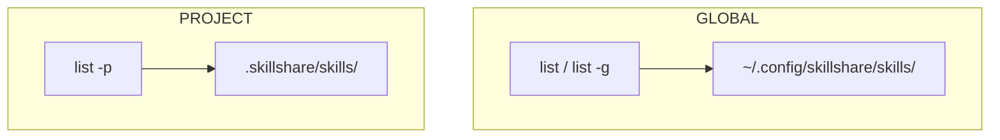
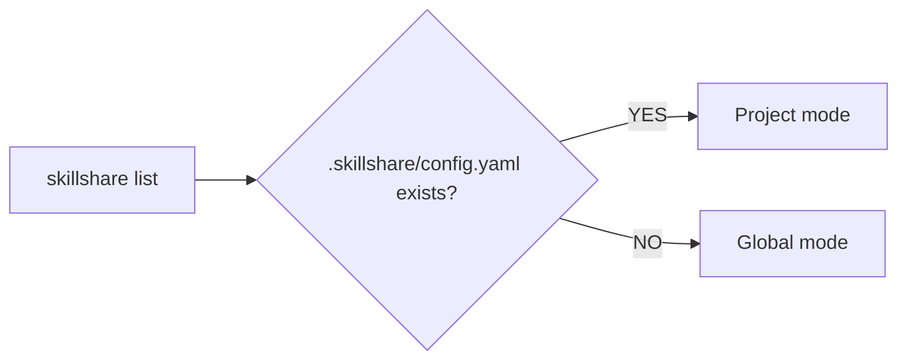

# list

source 디렉터리에 설치된 모든 skill을 나열합니다.

```bash
skillshare list              # Interactive TUI (default on TTY)
skillshare list --verbose    # Detailed plain text view
skillshare list --json       # JSON output for CI/scripts
```

## 언제 사용하나요

- 어떤 skill이 설치되어 있고 어디서 왔는지 확인할 때
- skill을 대화형으로 검색하고 필터링할 때
- 어떤 skill이 tracked repo인지 local인지 확인할 때
- 정리 전에 skill 컬렉션을 감사(audit)할 때


## Interactive TUI

TTY에서 `skillshare list`를 실행하면 다음 기능을 갖춘 대화형 터미널 UI가 실행됩니다.

- **스마트 필터링** — `/`를 눌러 이름, 경로, source로 필터링합니다. 정밀한 필터링을 위한 태그 문법을 지원합니다.

  | Tag | Short | Values | Example |
  |-----|-------|--------|---------|
  | `type:` | `t:` | `tracked`, `remote`, `local`, `github` | `t:tracked` |
  | `group:` | `g:` | any directory name | `g:security` |
  | `repo:` | `r:` | any repo name | `r:team` |
  | `kind:` | `k:` | `skill`, `agent` | `k:agent` |
  | `status:` | `s:` | `enabled`, `disabled` | `s:disabled` |

  태그는 자유 텍스트와 조합할 수 있습니다(AND 로직).
  ```
  t:tracked g:security audit
  ```
  이는 "security" 그룹에 속한 tracked skill 중 이름에 "audit"이 포함된 것만 표시합니다.

  :::tip
  enabled/disabled 필터링에는 보통 태그가 필요 없습니다 — 그냥 `s`를 누르세요
  (아래 **Status filter** 참조). `s:enabled` / `s:disabled` 태그는 status를
  다른 태그와 *조합*할 때 사용합니다. 예: `t:tracked s:disabled`.
  :::

- **Status filter** — `s`를 눌러 enabled/disabled 보기를 순환합니다: **All → Enabled → Disabled → All**. 현재 상태는 탭 바 옆에 `Status:` 칩으로 표시되므로, 목록이 클 때 `.skillignore`로 비활성화된 skill만 바로 좁혀볼 수 있습니다(또는 숨길 수 있습니다). 탭 필터 및 `/` 필터와 함께 조합됩니다.
- **키보드 탐색** — 화살표 키로 탐색, `q`로 종료
- **Detail panel** — 선택한 skill의 설명, 디스크 경로, 파일, 동기화된 target을 표시합니다
- **Enable/disable toggle** — `E`를 눌러 선택한 skill의 enabled/disabled 상태를 전환합니다. TUI를 나가지 않고 즉시 `.skillignore`에 기록됩니다. 비활성화된 skill은 detail panel에 빨간색 **disabled** 배지로 표시됩니다.
- **Manual only toggle** — `M`을 눌러 선택한 skill의 `SKILL.md`에서 `disable-model-invocation`을 전환합니다. skill은 설치된 상태로 남고 이름으로 여전히 호출할 수 있지만, 모델이 자동으로 로드하지는 않습니다. detail panel에는 **manual only** 배지가 표시됩니다. `E`와 달리 이는 skill 파일 자체를 수정합니다: tracked 또는 설치된 skill의 경우 TUI가 먼저 확인을 묻는데, `skillshare update`가 로컬 변경 사항이 있는 tracked repo를 건너뛰고 skill을 재설치하면 편집 내용이 사라지기 때문입니다. `M`을 다시 누르면 해당 줄이 제거되어 파일이 정확히 원래대로 복원됩니다. Agent는 영향을 받지 않습니다. [대시보드](/docs/reference/commands/ui)에도 동일한 **manual only** 태그가 표시되며 skill 편집기에 해당 스위치가 있습니다.
- **Content viewer** — `Enter`를 눌러 왼쪽에 파일 트리, 오른쪽에 Markdown 렌더링 콘텐츠가 있는 dual-pane 뷰어를 엽니다. `j`/`k`로 파일을 탐색(자동 미리보기), `l`/`Enter`로 디렉터리 확장, `h`로 축소합니다. `Ctrl+d`/`u`로 콘텐츠를 반 페이지씩 스크롤, `g`/`G`로 맨 위/맨 아래로 이동합니다. 마우스 휠과 클릭도 지원됩니다.

TUI를 건너뛰고 일반 텍스트를 출력하려면 `--no-tui`를 사용하세요.

```bash
skillshare list --no-tui          # Plain text output
skillshare list --no-tui | less   # Pipe to pager manually
```

## 검색 및 필터

TUI에 들어가지 않고 skill을 필터링합니다.

```bash
skillshare list react                     # Filter by name/path/source
skillshare list --type local              # Only local skills
skillshare list --type github             # Only GitHub-sourced skills
skillshare list --status disabled         # Only skills disabled via .skillignore
skillshare list --status enabled --json   # Enabled skills, as JSON
skillshare list react --sort newest       # Sort by install date
skillshare list --json | jq '.[].name'   # JSON for scripting
```

기본 보기(`--status all`)에는 비활성화로 표시된 항목도 포함됩니다. `--status`는
패턴 및 `--type`과 AND 의미론으로 조합되며, project mode와 `list agents` /
`list --all`에서도 동작하고, TUI의 `Status:` 칩을 미리 채웁니다
(여전히 `s`를 눌러 거기서부터 순환할 수 있습니다).

:::tip AI Usage
skill을 프로그래밍 방식으로 검사할 때는 `--json` 모드를 사용하세요.
```bash
skillshare list --json | jq '.[] | {name, source, type}'
```
:::

## 출력 예시

### Compact View

폴더로 정리된 skill은 디렉터리별로 자동 그룹화됩니다.

```
Installed skills
─────────────────────────────────────────

  frontend/
    → react-helper        github.com/user/skills
    → vue-helper          github.com/user/skills

  → my-skill              local
  → commit-commands       github.com/user/skills
  → old-draft             local  [disabled]

Tracked repositories
─────────────────────────────────────────
  ✓ _team-skills          3 skills, up-to-date
```

모든 skill이 최상위 레벨에 있으면(폴더 없음) 출력은 평면 목록이 됩니다 — 이전 버전과 동일합니다.

### Verbose View

```bash
skillshare list --verbose
```

```
Installed skills
─────────────────────────────────────────

  frontend/
    react-helper
      Source:      github.com/user/skills
      Type:        github
      Installed:   2026-01-15

    vue-helper
      Source:      github.com/user/skills
      Type:        github
      Installed:   2026-01-15

  my-skill
    Source:      (local - no metadata)

  commit-commands
    Source:      github.com/user/skills
    Type:        github
    Installed:   2026-01-15

Tracked repositories
─────────────────────────────────────────
  ✓ _team-skills          3 skills, up-to-date
  ! _other-repo           5 skills, has changes
```

## Global vs Project

skillshare는 두 레벨에서 동작합니다. `list` 명령은 활성 레벨의 skill을 표시합니다.



| | Global | Project |
|---|---|---|
| **Source** | `~/.config/skillshare/skills/` | `.skillshare/skills/` |
| **Flag** | `-g` or default | `-p` or auto-detected |
| **Scope** | 머신의 모든 project | 단일 저장소 |
| **Shared via** | `push` / `pull` | git commit |

### 자동 감지

플래그 없이 `skillshare list`를 실행하면 skillshare가 mode를 자동으로 감지합니다.



```bash
cd my-project/            # Has .skillshare/config.yaml
skillshare list           # → Installed skills (project)

cd ~
skillshare list           # → Installed skills (global)
```

자동 감지를 재정의하려면 `-p` 또는 `-g`를 사용하세요.

```bash
skillshare list -g        # Force global, even inside a project
skillshare list -p        # Force project, even without auto-detection
```

## Project Mode

```bash
skillshare list          # Auto-detected if .skillshare/ exists
skillshare list -p       # Explicit project mode
```

### 출력 예시

```
Installed skills (project)
─────────────────────────────────────────

  tools/
    → pdf               anthropic/skills/pdf
    → review            github.com/team/tools

  → my-skill            local

→ 3 skill(s): 2 remote, 1 local
```

Project list는 global list와 동일한 시각적 형식을 사용하며, 헤더에 `(project)` 레이블이 붙습니다. skill은 디렉터리별로 그룹화되며 `local`(메타데이터 없음) 또는 source URL(remote)로 분류됩니다.

## 옵션

| Flag | Description |
|------|-------------|
| `[pattern]` | 이름, 경로, source로 skill 필터링(대소문자 구분 없음) |
| `--verbose, -v` | 자세한 정보 표시(source, type, 설치 날짜) |
| `--json, -j` | JSON으로 출력(CI/스크립트에 유용) |
| `--no-tui` | 대화형 TUI 비활성화, 일반 텍스트 출력 사용 |
| `--type, -t <type>` | type으로 필터링: `tracked`, `local`, `github` |
| `--status <status>` | status로 필터링: `all`(기본값), `enabled`, `disabled` |
| `--sort, -s <order>` | 정렬 순서: `name`(기본값), `newest`, `oldest` |
| `--project, -p` | project skill 나열 |
| `--global, -g` | global skill 나열 |
| `--help, -h` | 도움말 표시 |

## Directory Grouping

skill이 폴더로 정리되어 있으면([`--into`](/docs/reference/commands/install)를 install 시 사용하거나 수동으로 `mv` + `sync`), `list`는 자동으로 디렉터리별로 그룹화합니다.

```
  frontend/
    → react-helper        github.com/user/skills
    → vue-helper          github.com/user/skills

  → my-skill              local
```

- 같은 폴더 아래의 skill은 그룹 헤더를 공유합니다(예: `frontend/`)
- 각 그룹 내에서는 전체 경로가 아닌 기본 이름만 표시됩니다
- 최상위 skill(상위 폴더 없음)은 그룹화되지 않고 맨 아래에 표시됩니다
- **모든** skill이 최상위에 있으면 출력은 평면 목록이 됩니다 — 그룹 헤더 없음

그룹화는 플래그가 아니라 source 디렉터리 내부의 디렉터리 구조를 기반으로 합니다. 사용을 시작하려면 `--into`로 skill을 정리하세요.

```bash
skillshare install owner/repo -s react-patterns --into frontend
skillshare install owner/repo -s vue-patterns --into frontend
```

자세한 내용은 [폴더로 Skill 정리하기](/docs/how-to/daily-tasks/organizing-skills)를 참조하세요.

## 출력 이해하기

### Skill Sources

| Label | Meaning |
|-------|---------|
| `local` | 로컬에서 생성됨, 메타데이터 없음 |
| `github.com/...` | GitHub에서 설치됨 |
| `tracked: <repo>` | tracked repository의 일부 |
| `[disabled]` | `.skillignore`로 제외된 skill([enable/disable](./enable.md) 참조) |

### Repository Status

| Icon | Meaning |
|------|---------|
| `✓` | 최신 상태, 로컬 변경 없음 |
| `!` | 커밋되지 않은 변경 사항 있음 |

## Agent Support

`skillshare list agents`는 agent만 필터링하여 agent source 디렉터리(`~/.config/skillshare/agents/` 또는 `.skillshare/agents/`)의 `.md` 파일을 표시합니다.

```bash
skillshare list agents              # List agents only
skillshare list agents --json       # JSON output for agents
skillshare list agents --verbose    # Detailed agent list
```

대화형 TUI에서는 agent가 skill과 구분되도록 **[A]** 배지가 표시됩니다. 모든 TUI 기능(필터링, detail panel, enable/disable toggle)이 동일하게 동작합니다.

`agents` 인수 없이 사용하면 `list`는 skill만 표시합니다(기본 동작). 배경 지식은 [Agents](/docs/understand/agents)를 참조하세요.

## 참고

- [enable / disable](/docs/reference/commands/enable) — 제거하지 않고 skill 전환
- [install](/docs/reference/commands/install) — skill 설치
- [uninstall](/docs/reference/commands/uninstall) — skill 제거
- [status](/docs/reference/commands/status) — 동기화 상태 표시
- [Agents](/docs/understand/agents) — Agent 개념
