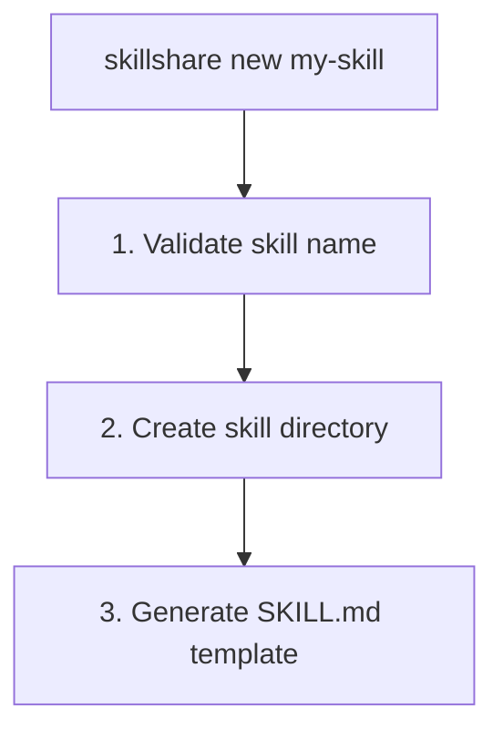

# new

SKILL.md template으로 새 skill을 생성합니다.

```bash
skillshare new <name>            # 새 skill 생성
skillshare new <name> -p         # project에 생성(.skillshare/skills/)
skillshare new <name> --dry-run  # 생성하지 않고 미리보기
```

## 사용 시점

- 권장 template 구조로 처음부터 새 skill 생성
- 올바른 SKILL.md 형식(name, description, frontmatter)으로 시작

**동작 방식:**


---

## 옵션

| Flag | 설명 |
|------|-------------|
| `--project`, `-p` | project(`.skillshare/skills/`)에 생성 |
| `--global`, `-g` | global(`~/.config/skillshare/skills/`)에 생성 |
| `--pattern`, `-P` | design pattern 사용(`tool-wrapper`, `generator`, `reviewer`, `inversion`, `pipeline`, `none`) |
| `--dry-run`, `-n` | file을 생성하지 않고 미리보기 |
| `--help`, `-h` | 도움말 표시 |

자동 감지: 현재 디렉터리에 `.skillshare/config.yaml`이 존재하면 기본적으로 project mode가 됩니다.

---

## Skill 이름 규칙

- 소문자, 숫자, 하이픈, 밑줄
- 문자나 밑줄로 시작해야 함
- 예시: `my-skill`, `code_review`, `pdf-tools`

---

## Template 구조

생성된 SKILL.md는 [Anthropic의 skill-building best practices](https://www.anthropic.com/engineering/building-skills-for-claude)를 따릅니다.

```markdown
---
name: my-skill
description: >-
  Describe what this skill does. Use when user asks to
  "trigger phrase 1", "trigger phrase 2", or needs help
  with a specific task.
# ── Optional fields ──────────────────────────────────
# license: MIT
# allowed-tools: "Bash(python:*) WebFetch"
# metadata:
#   author: Your Name
#   version: 1.0.0
---

# My Skill

Brief overview of what this skill does and its value.

## When to Use

Use this skill when the user:
- Asks to "specific trigger phrase"
- Mentions specific keywords or file types
- Needs help with a particular task

Do NOT use this skill for:
- Unrelated tasks (clarify scope boundaries)

## Instructions

### Step 1: Gather Context
### Step 2: Execute
### Step 3: Validate

## Examples

**Example:** Common scenario
User says: "Help me with <my-skill-related task>"

## Troubleshooting

**Error:** Common error message
**Cause:** Why it happens
**Solution:** How to fix it
```

### 주요 설계 선택

이 template은 Anthropic의 [three-level progressive disclosure](https://www.anthropic.com/engineering/building-skills-for-claude) 모델을 따릅니다.

| Level | 내용 | 로드 시점 |
|-------|------|-------------|
| **1. Frontmatter** | `name` + `description` | 항상(system prompt) |
| **2. SKILL.md body** | 전체 지침 | skill이 관련 있을 때 |
| **3. Linked files** | `references/`, `scripts/` | 필요할 때 |

**Description에는 WHAT + WHEN이 포함되어야 합니다** — 이것이 가장 중요한 단일 필드입니다. Claude는 이를 사용해 skill을 로드할지 여부를 결정합니다. 나쁜 예: `"Helps with projects"`. 좋은 예: `"Manages sprint planning. Use when user says 'plan sprint' or 'create tickets'."` 더 많은 예시는 [Anthropic's guide](https://www.anthropic.com/engineering/building-skills-for-claude)를 참고하세요.

---

## 예시

### 간단한 skill 생성

```bash
skillshare new code-review
```

출력:
```
New Skill Created
─────────────────────────────────────────────
✓ Created: ~/.config/skillshare/skills/code-review/SKILL.md

Next steps:
  1. Edit ~/.config/skillshare/skills/code-review/SKILL.md
  2. Run 'skillshare sync' to deploy
```

### project에 생성

```bash
skillshare new code-review -p
```

출력:
```
New Skill Created (project)
─────────────────────────────────────────────
✓ Created: .skillshare/skills/code-review/SKILL.md

Next steps:
  1. Edit .skillshare/skills/code-review/SKILL.md
  2. Run 'skillshare sync' to deploy
```

### 생성 전 미리보기

```bash
skillshare new my-skill --dry-run
```

출력:
```
New Skill (dry-run)
─────────────────────────────────────────────
→ Would create: ~/.config/skillshare/skills/my-skill
→ Would write: ~/.config/skillshare/skills/my-skill/SKILL.md

Template preview:
─────────────────────────────────────────────
---
name: my-skill
description: >-
  Describe what this skill does. Use when user asks to ...
---
...
```

---

## 패턴 템플릿

`-P`를 사용하면 권장 디렉터리 구조를 가진 pattern별 template을 생성합니다.

```bash
skillshare new my-reviewer -P reviewer     # Reviewer pattern
skillshare new my-pipeline -P pipeline     # references/, assets/, scripts/를 가진 Pipeline
skillshare new my-skill                    # 선택을 위한 interactive TUI
```

사용 가능한 pattern:

| Pattern | Scaffold 디렉터리 |
|---------|---------------------|
| `tool-wrapper` | `references/` |
| `generator` | `assets/`, `references/` |
| `reviewer` | `references/` |
| `inversion` | `assets/` |
| `pipeline` | `references/`, `assets/`, `scripts/` |
| `none` | *(디렉터리 없는 일반 template)* |

각 pattern에 대한 자세한 내용은 [Skill Design Patterns](/docs/understand/philosophy/skill-design-patterns)를 참고하세요.

---

## Web UI 마법사

터미널 없이도 web dashboard에서 skill을 생성할 수 있습니다.

1. `skillshare ui` 실행
2. **Skills**로 이동 → **"+ New Skill"** 클릭
3. wizard를 따라가기:

| Step | 내용 |
|------|------|
| **Name** | 실시간 유효성 검사와 함께 skill 이름 입력 |
| **Pattern** | 6개의 design pattern 중 선택(카드 grid) |
| **Category** | domain category 선택 — pattern이 `none`이면 생략됨 |
| **Scaffold** | 권장 디렉터리 토글 — pattern에 디렉터리가 없으면 생략됨 |
| **Confirm** | 선택 항목 검토 및 생성 |

wizard는 현재 mode를 따릅니다 — dashboard가 project mode(`-p`)로 실행 중이면 skill은 `.skillshare/skills/`에 생성됩니다.

---

## 다음 단계

skill을 생성한 후:

1. **SKILL.md 편집** — `description` 필드(WHAT + WHEN)에 먼저 집중
2. **지침 추가** — 명확한 동작이 있는 단계별 형식 사용
3. **target으로 sync** — `skillshare sync`
4. **트리거 테스트** — AI CLI에 관련 질문을 하고 skill이 로드되는지 확인
5. **반복** — 과도한/부족한 트리거링을 기준으로 트리거 문구를 개선

---

## 참고

- [install](/docs/reference/commands/install) — repo에서 skill 설치
- [sync](/docs/reference/commands/sync) — target으로 skill sync
- [Configuration](/docs/reference/targets/configuration) — config 참고 자료
