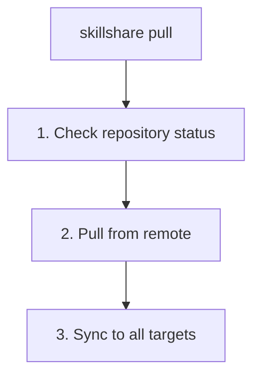

# pull

git remote에서 pull하여 모든 target에 동기화합니다.

```bash
skillshare pull              # pull 후 동기화
skillshare pull --dry-run    # 미리보기
skillshare pull --force      # 첫 pull 시 local을 remote로 교체
```

## 언제 사용하나요

- 변경 사항을 push한 다른 머신에서 skill을 동기화할 때
- 다른 사람이 업데이트를 push한 후 최신 skill을 받아올 때
- `init --remote` 이후 새 머신에서 작업을 시작할 때

## 동작 과정



## 옵션

| 플래그 | 설명 |
|------|------|
| `--dry-run, -n` | 변경 사항을 적용하지 않고 미리보기 |
| `--force, -f` | 첫 pull 충돌 시 local skill을 remote로 교체 |

## Git Root Scope

`pull`은 `git_root` 설정 필드로 선택된 디렉터리(기본값: `skills` source)에서 동작합니다. scope 표는 [commit — Git Root Scope](./commit.md#git-root-scope)를 참고하세요. `git_root`가 변경되었지만 git repo가 여전히 다른 scope의 디렉터리에 있는 경우, `pull`은 이를 해결하기 위한 정확한 `git init` / `mv` 명령과 함께 "Git root mismatch" 오류를 출력합니다. [Changing the scope after init](/docs/reference/targets/configuration#git-root)를 참고하세요.

pull 이후, `pull`은 해당 scope가 담고 있는 대상을 동기화합니다. `skills`는 `sync`를, `agents`는 `sync agents`를, `root`는 둘 다를, `extras`는 `sync extras`를 실행합니다.

## 사전 준비 사항

source 디렉터리는 remote가 설정된 git repository여야 합니다.

```bash
# 준비 상태 확인:
skillshare status
# 표시: Git: initialized with remote
```

## 로컬 변경 사항 경고

커밋되지 않은 변경 사항이 있으면 `pull`은 실패합니다.

```bash
$ skillshare pull
Local changes detected
  Run: skillshare push
  Or:  cd ~/.config/skillshare/skills && git stash
```

해결 방법:
```bash
# 옵션 1: push하지 않고 먼저 로컬에 커밋
skillshare commit -m "Local changes"
skillshare pull

# 옵션 2: 먼저 변경 사항 push
skillshare push
skillshare pull

# 옵션 3: 변경 사항을 stash
cd ~/.config/skillshare/skills
git stash
skillshare pull
git stash pop
```

## 두 머신 모두 커밋한 경우 {#when-both-machines-committed}

이 머신에 remote에 없는 커밋이 있고 remote에도 이 머신에 없는 커밋이 있으면, `pull`은 두 히스토리를 병합 커밋으로 합친 뒤 sync합니다. 병합 결과를 공유하려면 이후에 push하세요.

두 머신 모두 Skill을 설치하거나 업데이트할 때마다 `.metadata.json`을 다시 쓰기 때문에 이 파일에서 충돌이 자주 발생합니다. `pull`은 이런 충돌을 스스로 해결합니다. 각 Skill의 항목을 따로 병합하며, 두 머신이 같은 항목을 변경한 경우 `installed_at`이 더 늦은 쪽이 적용됩니다.

그 외의 파일에서 충돌이 발생하면 pull이 중단되고, 병합이 되돌려지며, 해당 파일이 표시됩니다:

```bash
$ skillshare pull
git pull failed
pull stopped: this machine and the remote both changed my-skill/SKILL.md; the merge was undone, resolve it with git in ~/.config/skillshare/skills
```

저장소는 pull 이전 상태 그대로 남습니다. 충돌을 직접 해결하려면:

```bash
cd ~/.config/skillshare/skills
git pull --no-rebase             # 병합을 다시 실행하고 충돌을 남겨 둠
# 충돌한 파일을 편집한 뒤
git add . && git commit --no-edit
skillshare push
skillshare sync
```

## 기존 Skill이 있는 상태에서의 첫 Pull

첫 pull 시(아직 upstream이 없는 경우), local과 remote 양쪽에 이미 skill 디렉터리가 있다면
`pull`은 양쪽을 결합하기 위해 **merge**를 시도합니다. merge가 성공하면 local과 remote의 skill이 모두 보존됩니다.

**merge 충돌**이 발생하면, `pull`은 0이 아닌 종료 코드와 함께 실패합니다.

```bash
$ skillshare pull
Pull failed
  Resolve manually: cd ~/.config/skillshare/skills && git merge --allow-unrelated-histories <remote branch>
  Or force-pull: skillshare pull --force  (replaces local with remote)
```

해결 옵션:

```bash
# 충돌을 수동으로 해결한 후 push
cd ~/.config/skillshare/skills
git add . && git commit
skillshare push

# 또는 local을 버리고 remote를 적용
skillshare pull --force
```

## 예시

```bash
# 표준 pull (가장 일반적)
skillshare pull

# 어떤 일이 일어날지 미리보기
skillshare pull --dry-run

# 첫 pull 충돌 시 local을 remote로 교체
skillshare pull --force
```

## 워크플로우

보조 머신에서의 일반적인 워크플로우:

```bash
# 하루 시작: 최신 skill 가져오기
skillshare pull

# ... AI 도구로 작업 ...

# 하루 마무리: 새 skill이 있다면 공유
skillshare collect claude    # 새 skill을 만들었다면
skillshare push -m "Add new skill"
```

## 참고 항목

- [commit](/docs/reference/commands/commit) — push 없이 로컬 커밋
- [push](/docs/reference/commands/push) — remote에 push
- [sync](/docs/reference/commands/sync) — pull 없이 수동 동기화
- [Cross-Machine Sync](/docs/how-to/sharing/cross-machine-sync) — 전체 설정 가이드
