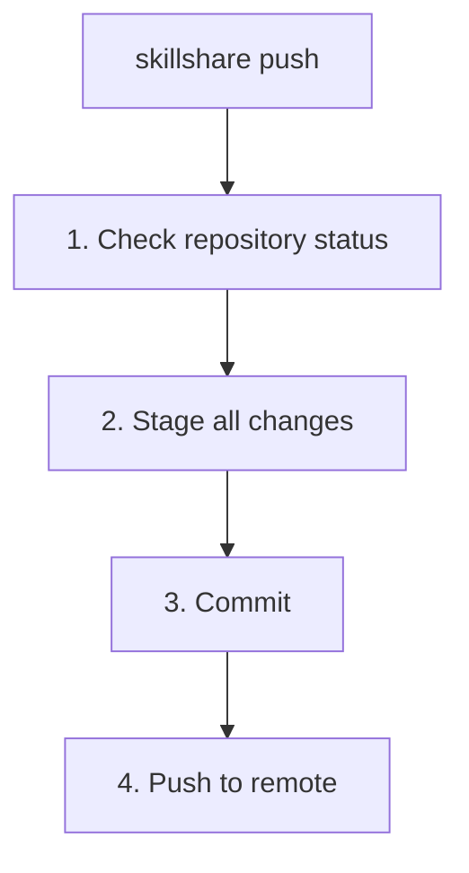

# push

source를 커밋하고 git remote로 push합니다.

push하지 않고 로컬 체크포인트만 원한다면 [`commit`](./commit.md)을 대신 사용하세요.

```bash
skillshare push                  # 자동 생성된 메시지
skillshare push -m "Add pdf"     # 커스텀 메시지
skillshare push --dry-run        # 미리보기
```

## 언제 사용하나요

- git을 통해 다른 머신들과 skill 변경 사항을 공유할 때
- skill을 remote repository에 백업할 때
- skill을 수정한 후 하나의 명령으로 커밋과 push를 함께 할 때

아직 공유하지 않고 로컬 체크포인트만 저장하고 싶다면 [`skillshare commit`](./commit.md)을 사용하세요.

## 동작 과정



## 옵션

| 플래그 | 설명 |
|------|------|
| `-m, --message <msg>` | 커밋 메시지 (기본값: "Update skills") |
| `--dry-run, -n` | 변경 사항을 적용하지 않고 미리보기 |

## Git Root Scope

`push`는 `git_root` 설정 필드로 선택된 디렉터리(기본값: `skills` source)에서 동작합니다. scope 표는 [commit — Git Root Scope](./commit.md#git-root-scope)를 참고하세요. `git_root`가 변경되었지만 git repo가 여전히 다른 scope의 디렉터리에 있는 경우, `push`는 이를 해결하기 위한 정확한 `git init` / `mv` 명령과 함께 "Git root mismatch" 오류를 출력합니다. [Changing the scope after init](/docs/reference/targets/configuration#git-root)를 참고하세요.

## 사전 준비 사항

source 디렉터리는 remote가 설정된 git repository여야 합니다.

```bash
# init 시점에 설정 (권장):
skillshare init --remote git@github.com:you/my-skills.git

# 또는 기존 설정에 remote 추가:
skillshare init --remote git@github.com:you/my-skills.git
```

Init은 초기 커밋을 자동으로 생성하므로, 설정 직후 바로 `push`가 동작합니다.

## 첫 Push 시 Upstream 매핑

첫 push 시(아직 upstream 트래킹이 없는 경우), `skillshare push`는 자동으로 upstream을 구성합니다.

- remote에 이미 기본 브랜치(예: `main` 또는 `trunk`)가 있는 경우, 로컬 변경 사항은 해당 remote 기본 브랜치로 push됩니다.
- remote가 비어 있는 경우, 현재 로컬 브랜치로 push됩니다.

이는 잘못된 remote 브랜치가 생성되는 것(예: remote는 `main`을 사용하는데 로컬은 `master`인 경우)을 방지합니다.

## 예시

```bash
# 자동 메시지로 빠르게 push
skillshare push

# 커스텀 커밋 메시지
skillshare push -m "Add commit-commands skill"

# push될 내용을 미리보기
skillshare push --dry-run
```

## 충돌 처리

remote에 더 새로운 커밋이 있는 경우:

```bash
$ skillshare push
Push failed
  Remote may have newer changes
  Run: skillshare pull
  Then: skillshare push
```

해결 방법:
```bash
skillshare pull    # remote 변경 사항을 내 변경 사항과 병합
skillshare push    # 내 변경 사항 push
```

`pull`은 remote 커밋을 아직 push하지 않은 내 커밋과 병합하므로, 두 번째 `push`는 성공합니다. 양쪽에서 같은 파일을 변경한 경우의 동작은 [두 머신 모두 커밋한 경우](/docs/reference/commands/pull#when-both-machines-committed)를 참고하세요.

## 워크플로우

skill을 공유하는 일반적인 워크플로우:

```bash
# 1. skill 변경
# 2. remote로 push
skillshare push -m "Update my-skill"

# 다른 머신에서:
skillshare pull    # 변경 사항을 가져오고 동기화
```

## 참고 항목

- [commit](/docs/reference/commands/commit) — push 없이 로컬 커밋
- [pull](/docs/reference/commands/pull) — remote에서 pull
- [sync](/docs/reference/commands/sync) — 로컬 target에 동기화
- [Cross-Machine Sync](/docs/how-to/sharing/cross-machine-sync) — 전체 설정 가이드
